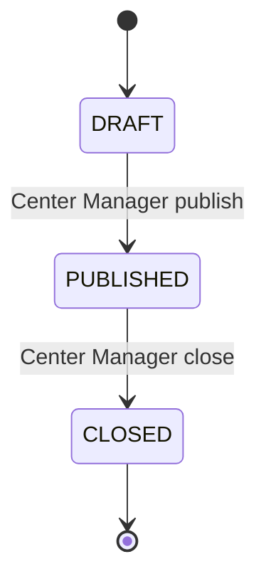

# Center Management System — Design v2 (Addendum trước khi code)

> Cập nhật 23/09/2026 theo Business Rules v1.6. Membership/Class/Booking/No-show/PT ở tài liệu này phải tuân theo mục "Override hiện hành" ngay dưới. Payment/Invoice/Adjustment/Refund và báo cáo doanh thu là **PENDING — chưa chốt nghiệp vụ**; schema, state, API và transaction Payment cũ chỉ còn giá trị lịch sử, không dùng để code.

Tài liệu này bổ sung/chỉnh sửa thiết kế v1 theo đúng các điểm review. Không lặp lại phần đã đúng ở v1 (Actors, Use Case, kiến trúc tổng thể) — chỉ tập trung vào phần thiếu, và **thay thế hoàn toàn** phần ERD/API ở v1.

## Override hiện hành ngày 23/09/2026

- Membership dùng `DurationInMonths` 1/3/6/12; `StartDate`/`EndDate` là calendar date, inclusive; `EndDate = StartDate.AddMonths(DurationInMonths).AddDays(-1)`. Sự kiện xác lập `StartDate` cho lần mua mới chờ nghiệp vụ Payment.
- Early renewal tạo Membership record mới bắt đầu ngay sau `EndDate`; PT carry-over theo cửa sổ 30 calendar days và có thể nối tiếp qua nhiều lần renewal nếu từng lần đều thỏa.
- Class chỉ gồm Yoga/Group X, 60 phút, Capacity tối đa 20, mỗi discipline tối đa Morning + Afternoon mỗi ngày, tổng tối đa 4; Manager chọn Slot; lifecycle `DRAFT → PUBLISHED → CLOSED`; chỉ `PUBLISHED` nhận booking; không Waitlist.
- Member tối đa 1 Yoga và 1 Group X mỗi calendar date. Hủy tại hoặc trước 30 phút; hủy thành công giải phóng slot. Không dùng Membership session credit cho class booking.
- Ba No-show trong rolling 30 calendar days kích hoạt booking restriction ngay trong 7 calendar days, ngày kết thúc exclusive.
- PT là add-on tùy chọn, 1 Coach : 1 Member, 90 phút/session; frequency 1/2/3 chỉ dùng tính tổng quota. PT không dùng `Class.Discipline`, Class recurrence hoặc weekly cap. Cancel/reschedule, đổi Coach và late/no-show theo BR-70 đến BR-77.
- Payment/Invoice/Adjustment/Refund, quy tắc kích hoạt Membership lần mua mới và báo cáo doanh thu: **PENDING**. Không triển khai từ nội dung Payment cũ trong tài liệu này.

---

## 0. Traceability — mapping Business Rules cũ → mới

Nguồn hiện hành: SSOT, rồi `SportManagement_BusinessRules.docx` v1.6. Bảng dưới đây là mapping lịch sử, không phải danh sách rule đang hiệu lực.

| Rule cũ (v1, không còn dùng) | Rule chính thức hiện tại | Ghi chú |
|---|---|---|
| Original BR-01 | **BR-16** | Enrollment yêu cầu package Active |
| Original BR-02 | **BR-17**, **BR-18**, **BR-50** | Booking theo ngày; deadline hủy cố định 30 phút; hủy giải phóng slot |
| Original BR-03 | **BR-20**, **BR-21** | No-show tracking |
| Original BR-04 | **BR-26** | AI cần đủ 3 tham số |
| Original BR-05 | Payment pending | Nội dung BR-30 cũ đã treo, không dùng để code |
| Original BR-06 | **BR-2**, **BR-32**, **BR-39** | Admin tạo Staff/Coach; Manager xem báo cáo và cấu hình |

**Ghi chú Payment:** các BR-30/31/32/40/41/42/43/55/58 cũ đang để treo vì chưa chốt nghiệp vụ.

**Đã bổ sung ở v1.2 (theo review lần này):**

| ID | Nhóm | Nội dung tóm tắt |
|---|---|---|
| BR-44 → BR-48 | K. Reporting & Export (mới) | Phạm vi field export, quyền xem report, retention 6 tháng, xóa report, SLA PDF ≤20 trang/15s + retry khi lỗi — lấp khoảng trống endpoint `/reports/export` đang tham chiếu `BR-48` mà trước đây chưa tồn tại |
| BR-49 | A | Unique email không phân biệt hoa/thường |
| BR-50 | D | Deadline hủy class cố định 30 phút; không cấu hình 12 giờ, không snapshot |
| BR-51 | C | Capacity class là số dương và tối đa 20; Manager có thể đặt thấp hơn 20 |
| BR-52 | H | Payment pending; công thức Refund cũ không còn hiệu lực |
| BR-53 | E | Phân biệt rõ `Absent` (Coach/Receptionist ghi tay) vs `No-show` (job tự động) |

Nội dung Payment cũ phía dưới được giữ để truy vết thiết kế, nhưng đã bị override bởi trạng thái PENDING.

---

## 1. ERD v2 (đầy đủ, thay thế ERD v1)

> ERD dưới đây phản ánh schema code cũ, chưa phải schema v1.6. Các block Membership/Class/Enrollment phải được thiết kế lại theo Override hiện hành; các block Invoice/Payment/PaymentAdjustment là **PENDING** và không được triển khai như thiết kế đã duyệt.

```mermaid
erDiagram
    ROLES ||--o{ USER_ACCOUNTS : "has"
    USER_ACCOUNTS ||--o| USER_CREDENTIALS : "has (1-1, local auth)"
    USER_ACCOUNTS ||--o| USER_PROFILES : "has (1-1, display info)"
    USER_ACCOUNTS ||--o{ USER_EXTERNAL_LOGINS : "links (Google..., 1-N)"
    USER_ACCOUNTS ||--o{ MEMBER_PACKAGES : "purchases"
    USER_ACCOUNTS ||--o| MEMBER_TRAINING_PROFILE : "has (Member only)"
    USER_ACCOUNTS ||--o{ COACH_MEMBER_RELATIONSHIP : "coach side"
    USER_ACCOUNTS ||--o{ COACH_MEMBER_RELATIONSHIP : "member side"
    USER_ACCOUNTS ||--o{ CLASSES : "coaches (default, nullable)"
    USER_ACCOUNTS ||--o{ ENROLLMENTS : "member enrolls"
    USER_ACCOUNTS ||--o{ WORKOUT_PLANS : "member has / coach creates"
    USER_ACCOUNTS ||--o{ WORKOUT_RESULTS : "recorded by coach"
    USER_ACCOUNTS ||--o{ INVOICES : "billed to"
    USER_ACCOUNTS ||--o{ INVOICES : "issued by (staff)"
    USER_ACCOUNTS ||--o{ PAYMENTS : "received by (staff)"
    USER_ACCOUNTS ||--o{ PAYMENT_ADJUSTMENTS : "requested by / approved by"
    USER_ACCOUNTS ||--o{ NOTIFICATIONS : "receives"
    USER_ACCOUNTS ||--o{ AI_LOGS : "initiates"
    USER_ACCOUNTS ||--o{ AUDIT_LOGS : "performs"
    USER_ACCOUNTS ||--o{ GYM_CHECKINS : "member checks in (18/09/2026)"
    USER_ACCOUNTS ||--o{ GYM_CHECKINS : "checked in by (receptionist)"

    MEMBERSHIP_PACKAGES ||--o{ MEMBER_PACKAGES : "defines"
    MEMBER_PACKAGES ||--o{ INVOICES : "billed by (nullable)"
    MEMBER_PACKAGES ||--o{ ENROLLMENTS : "consumed by"

    ROOMS ||--o{ CLASSES : "default room"
    ROOMS ||--o{ CLASS_SESSIONS : "actual room (may override)"
    CLASSES ||--o{ CLASS_RECURRENCE : "defines pattern"
    CLASS_RECURRENCE ||--o{ CLASS_SESSIONS : "generates"
    CLASSES ||--o{ CLASS_SESSIONS : "ad-hoc session (nullable recurrence)"
    CLASS_SESSIONS ||--o{ ENROLLMENTS : "booked in"
    ENROLLMENTS ||--o| ATTENDANCE : "results in (1-1, UNIQUE enrollment_id)"
    ENROLLMENTS ||--o{ WORKOUT_RESULTS : "recorded in (đảm bảo member có đăng ký session)"

    COACH_MEMBER_RELATIONSHIP ||--o{ WORKOUT_PLANS : "authorizes"
    WORKOUT_PLANS ||--o{ WORKOUT_PLAN_ITEMS : "contains"

    INVOICES ||--o{ INVOICE_ITEMS : "line items"
    INVOICES ||--o{ PAYMENTS : "receives"
    INVOICES ||--o{ PAYMENT_ADJUSTMENTS : "corrected/refunded by"
    PAYMENTS ||--o{ PAYMENT_ADJUSTMENTS : "may be reversed by"

    USER_ACCOUNTS {
        uuid user_id PK
        string email UK "case-insensitive, BR-1/BR-49"
        int role_id FK
        UserStatus status "enum, xem SSOT §3"
        datetime created_at
    }
    USER_CREDENTIALS {
        uuid user_id PK, FK "1-1 với USER_ACCOUNTS"
        string password_hash "nullable — account tạo thuần qua Google không có"
    }
    USER_PROFILES {
        uuid user_id PK, FK "1-1 với USER_ACCOUNTS"
        string full_name
        string phone UK "nullable, unique nếu có giá trị, BR-62"
    }
    USER_EXTERNAL_LOGINS {
        uuid external_login_id PK
        uuid user_id FK "N-1 với USER_ACCOUNTS"
        ExternalAuthProvider provider "enum, xem SSOT §3"
        string provider_user_id UK "composite unique (provider, provider_user_id)"
        string refresh_token "nullable, MVP chưa mã hoá — xem Open Questions"
        datetime created_at
    }
    ROLES {
        int role_id PK
        UserRole role_name UK "enum, xem SSOT §3; unique, BR-63"
    }
    MEMBER_TRAINING_PROFILE {
        uuid profile_id PK
        uuid member_id FK, UK "1-1 với UserAccount (Member)"
        string goal
        ExperienceLevel experience_level "enum, xem SSOT §3"
        string notes
        datetime updated_at
    }
    COACH_MEMBER_RELATIONSHIP {
        uuid relationship_id PK
        uuid coach_id FK
        uuid member_id FK
        RelationshipSourceType source_type "enum, xem SSOT §3"
        int class_id FK "nullable"
        RelationshipStatus status "enum, xem SSOT §3"
        datetime started_at
        datetime ended_at
    }
    MEMBERSHIP_PACKAGES {
        int package_id PK
        string name UK "unique trong catalog, BR-56"
        decimal price
        int duration_days
        int session_limit "nullable = unlimited"
        bool is_active
        string description "nullable"
    }
    MEMBER_PACKAGES {
        uuid member_package_id PK
        uuid member_id FK
        int package_id FK
        date start_date
        date end_date
        int remaining_sessions "nullable"
        MemberPackageStatus status "enum, xem SSOT §3"
        int version "optimistic concurrency"
        uuid stacking_approved_by_user_id FK "nullable"
        datetime stacking_approved_at_utc "nullable"
        string stacking_approval_reason "nullable"
    }
    ROOMS {
        int room_id PK
        string name UK "unique toàn trung tâm, BR-57"
        int capacity
    }
    CLASSES {
        int class_id PK
        string name
        string discipline
        int default_room_id FK
        uuid default_coach_id FK "nullable"
        int capacity
        ClassStatus status "enum, xem SSOT §3"
    }
    CLASS_RECURRENCE {
        int recurrence_id PK
        int class_id FK
        string days_of_week "e.g. MON,WED,FRI"
        time start_time_local
        time end_time_local
        string timezone "e.g. Asia/Ho_Chi_Minh"
        date effective_from
        date effective_to "nullable"
    }
    CLASS_SESSIONS {
        uuid session_id PK
        int class_id FK
        int recurrence_id FK "nullable, null = ad-hoc/rescheduled"
        int room_id FK
        uuid coach_id FK
        datetime start_at_utc
        datetime end_at_utc
        int capacity
        int baseline_capacity "immutable at creation"
        int confirmed_count "denormalized, atomic increment"
        ClassSessionStatus status "enum, xem SSOT §3"
        uuid rescheduled_from_session_id FK "nullable"
    }
    ENROLLMENTS {
        uuid enrollment_id PK
        uuid session_id FK
        uuid member_id FK
        uuid member_package_id FK
        EnrollmentStatus status "enum, xem SSOT §3"
        int cancellation_deadline_hours "snapshot"
        datetime registered_at
        datetime cancelled_at
        uuid cancelled_by_user_id FK "nullable, may differ from member_id (Receptionist)"
    }
    ATTENDANCE {
        uuid attendance_id PK
        uuid enrollment_id FK, UK "1-1 với Enrollment; session_id/member_id suy ra qua đây, không denormalize (10/09/2026 (3))"
        AttendanceStatus status "enum, xem SSOT §3"
        datetime check_in_time "nullable"
        uuid checked_in_by_user_id FK "nullable"
    }
    WORKOUT_PLANS {
        uuid plan_id PK
        uuid member_id FK
        uuid coach_id FK
        uuid relationship_id FK
        string goal
        string level
        datetime created_at
    }
    WORKOUT_PLAN_ITEMS {
        uuid item_id PK
        uuid plan_id FK
        string exercise
        int sets
        int reps
        string notes
    }
    WORKOUT_RESULTS {
        uuid result_id PK
        uuid enrollment_id FK "session_id/member_id suy ra qua Enrollment — đảm bảo Member thực sự có đăng ký session đó (10/09/2026 (3))"
        uuid coach_id FK
        string progress_note
        string coach_comment
        datetime recorded_at
    }
    INVOICES {
        uuid invoice_id PK
        string invoice_number UK "unique, human-readable, sinh từ DB sequence, BR-58"
        uuid member_id FK
        uuid issued_by_user_id FK
        uuid member_package_id FK "nullable"
        decimal total_amount
        InvoiceStatus status "enum, xem SSOT §3"
        datetime due_date_utc
        datetime first_deposit_at_utc "nullable"
        datetime issued_at
    }
    INVOICE_ITEMS {
        uuid item_id PK
        uuid invoice_id FK
        string description
        decimal amount
        InvoiceItemRelatedEntityType related_entity_type "enum, xem SSOT §3"
        uuid related_entity_id "nullable"
    }
    PAYMENTS {
        uuid payment_id PK
        uuid invoice_id FK
        decimal amount
        PaymentMethod method "enum, xem SSOT §3"
        string reference_code "external gateway ref, nullable"
        PaymentStatus status "enum, xem SSOT §3"
        uuid received_by_user_id FK
        datetime paid_at
    }
    PAYMENT_ADJUSTMENTS {
        uuid adjustment_id PK
        uuid invoice_id FK
        uuid payment_id FK "nullable"
        PaymentAdjustmentType type "enum, xem SSOT §3"
        decimal amount
        string reason
        PaymentAdjustmentStatus status "enum, xem SSOT §3"
        uuid requested_by_user_id FK
        uuid approved_by_user_id FK "nullable"
        datetime created_at
        datetime resolved_at "legacy resolution timestamp"
        datetime approved_at_utc "nullable"
        datetime completed_at_utc "nullable until executed"
        uuid completed_by_user_id FK "nullable until executed"
        PaymentMethod refund_method "nullable"
        string refund_reference_code "nullable"
    }
    NOTIFICATIONS {
        uuid notification_id PK
        uuid user_id FK
        NotificationChannel channel "enum, xem SSOT §3"
        NotificationSourceEventType source_event_type "enum, xem SSOT §3"
        uuid source_entity_id "nullable"
        string message
        NotificationStatus status "enum, xem SSOT §3"
        int retry_count
        datetime last_attempt_at
        datetime sent_at
    }
    AI_LOGS {
        uuid log_id PK
        uuid user_id FK
        string query_type
        jsonb input_payload
        jsonb response_payload
        int response_time_ms
        datetime created_at
    }
    AUDIT_LOGS {
        uuid audit_id PK
        uuid user_id FK
        string action
        string target_entity
        string target_id
        jsonb old_value "nullable"
        jsonb new_value "nullable"
        string ip_address
        datetime timestamp
    }
    SYSTEM_SETTINGS {
        string key PK
        string value
        string value_type
        datetime updated_at
        uuid updated_by_user_id FK "nullable for seed"
    }
    REPORT_EXPORTS {
        uuid report_export_id PK
        uuid requested_by_user_id FK
        string report_type
        jsonb parameters_json
        string format "Csv or Pdf"
        ReportExportStatus status
        int row_count
        bigint size_bytes
        string failure_reason "nullable"
        datetime created_at
        datetime completed_at "nullable"
        datetime expires_at "at least completion plus 6 months"
        bool is_deleted
        datetime deleted_at "nullable"
    }
    USER_ACCOUNTS ||--o{ REPORT_EXPORTS : "requests"
    USER_ACCOUNTS |o--o{ SYSTEM_SETTINGS : "updates"
    USER_ACCOUNTS |o--o{ MEMBER_PACKAGES : "approves stacking"
    USER_ACCOUNTS |o--o{ PAYMENT_ADJUSTMENTS : "confirms refund"
    GYM_CHECKINS {
        uuid check_in_id PK
        uuid member_id FK
        uuid checked_in_by_user_id FK "receptionist, not null"
        datetime check_in_time
    }
```

> **Naming (cập nhật 10/09/2026):** tên field/attribute trong mỗi entity block ở trên đã đổi từ `PascalCase` sang `snake_case` (vd `UserID` → `user_id`), khớp `00-Source-of-Truth.md` §5.4 (tại thời điểm đó). Tên bảng (`USER_ACCOUNTS`, `MEMBER_TRAINING_PROFILE`...) và tên kiểu enum (`UserStatus`, `ExperienceLevel`...) giữ nguyên `PascalCase`/UPPER_CASE, không đổi.
>
> **Cập nhật 11/09/2026 — tách 2 tầng naming:** `00-Source-of-Truth.md` §5.4 đã đảo ngược naming **property C#** (entity trong code) từ `snake_case` về `PascalCase` (vd `RoleId`, `UserId`) — xem SSOT §2/§3/§5.4. **ERD ở mục này mô tả tầng DB (Postgres), không đổi theo** — cột vẫn `snake_case` như trên (`user_id`, `role_id`...), vì package `EFCore.NamingConventions` (`.UseSnakeCaseNamingConvention()` ở `Program.cs`) tự map property `PascalCase` (code) ↔ cột `snake_case` (DB) — 2 tầng khác nhau, không cần đồng bộ 1-1 nữa. Bảng ràng buộc DB (§3) và raw SQL trong `SportHubDbContext.cs` tiếp tục dùng tên cột `snake_case` như ERD dưới đây, không đổi.
>
> **Unique constraints (cập nhật 10/09/2026):** đã đánh dấu `UK` cho mọi field unique (ngoài PK) trong ERD trên — `USER_ACCOUNTS.email` (BR-1/BR-49), `USER_PROFILES.phone` (BR-62, nullable — chỉ unique khi có giá trị), `ROLES.role_name` (BR-63), `MEMBERSHIP_PACKAGES.name` (BR-56), `ROOMS.name` (BR-57), `INVOICES.invoice_number` (BR-58, đã có sẵn ở constraint #5 mục 3), `MEMBER_TRAINING_PROFILE.member_id` (FK, UK — quan hệ 1–1 với UserAccount), `USER_EXTERNAL_LOGINS.provider_user_id` (composite UK cùng `provider` — 1 tài khoản Google không link được vào 2 `UserAccount`). Nguồn business rule đầy đủ: `SportManagement_BusinessRules.docx` §L (Unique Constraints Summary). Ràng buộc unique dạng composite/partial (`Enrollment`, `CoachMemberRelationship` khi ACTIVE/CONFIRMED; `USER_EXTERNAL_LOGINS` composite) không thể hiện bằng `UK` trên 1 field trong ERD — xem bảng ràng buộc DB ở mục 3 bên dưới (#1, #7, #15, #16).
>
> **Cập nhật 10/09/2026 (2) — Google Login:** tách `USERS` thành `USER_ACCOUNTS` (định danh + vòng đời), `USER_CREDENTIALS` (auth nội bộ, 1-1), `USER_PROFILES` (hiển thị, 1-1), `USER_EXTERNAL_LOGINS` (auth ngoài — Google, 1-N — mới, phục vụ đăng nhập Google nay là flow bắt buộc). Chi tiết lý do + business rule chống account pre-hijacking: `00-Source-of-Truth.md` §2 (cập nhật 10/09/2026 (2)) và §7 Open Questions. FK ở mọi entity khác không đổi tên cột (`member_id`, `coach_id`, `issued_by_user_id`...), chỉ đổi entity đích từ `USERS` sang `USER_ACCOUNTS`.
>
> **Cập nhật 10/09/2026 (3) — Chuẩn hoá Attendance/WorkoutResult:** `ATTENDANCE` bỏ `session_id`/`member_id`, chỉ giữ `enrollment_id` (thêm `UK` — enforce đúng quan hệ 1-1 với `ENROLLMENTS` mà ERD đã vẽ nhưng trước đó chưa có ràng buộc DB, xem constraint #17 mục 3). `WORKOUT_RESULTS` đổi `session_id` + `member_id` (2 FK độc lập, không có gì đảm bảo Member thực sự đăng ký session đó) thành 1 FK `enrollment_id` — DB tự chặn việc ghi kết quả tập cho cặp (session, member) không có `Enrollment` khớp; `coach_id` giữ nguyên. Chi tiết lý do: `00-Source-of-Truth.md` §2 (cập nhật 10/09/2026 (3)).

> **Cập nhật 09/09/2026:** mọi field trạng thái/loại (trước đây khai `string "GIÁ_TRỊ_1, GIÁ_TRỊ_2, ..."`) đã đổi sang tên enum tương ứng (`UserStatus`, `MemberPackageStatus`, `AttendanceStatus`, ...). Danh sách giá trị đầy đủ của từng enum **chỉ định nghĩa 1 lần** ở `00-Source-of-Truth.md` §3 — ERD ở đây không lặp lại để tránh 2 nơi lệch nhau (đã xảy ra với `Attendance`/`Absent`, xem §2.2 bên dưới và SSOT §4). `AI_LOGS.query_type` và `AUDIT_LOGS.action` vẫn giữ `string` vì là giá trị tự do, không phải enum kín.

### Thay đổi chính so với v1

- **Payment/Invoice/Adjustment:** PENDING — cấu trúc cũ trong ERD chưa được phê duyệt.
- **Class recurrence/session:** cấu trúc code cũ cần map lại với Class v1.6; không dùng recurrence engine cho PT và không được sinh lịch vượt giới hạn slot/ngày.
- **`confirmed_count` denormalized** trên `CLASS_SESSIONS` để chống overbooking bằng transaction, thay vì COUNT() mỗi lần (xem mục 3).
- **`MEMBER_TRAINING_PROFILE`** và **`COACH_MEMBER_RELATIONSHIP`** mới — cần thiết để AI suggestion (BR-26) và Workout Plan (BR-23) có dữ liệu goal/level/quan hệ thật, không phải tham số client tự gửi.
- **Notification & Audit Log** mở rộng theo đúng góp ý: trạng thái gửi, kênh, nguồn sự kiện, retry; audit có `old_value`/`new_value` dạng JSONB để truy vết thay đổi thực tế.

---

## 2. State Transition hiện hành

### 2.1 Membership

Membership `Active` có hiệu lực từ `StartDate` đến hết `EndDate`, cả hai inclusive; sau `EndDate` là `Expired`. Early renewal tạo record mới bắt đầu ngày kế tiếp, không sửa record cũ. Trạng thái trước Active và sự kiện xác lập StartDate cho lần mua mới chờ nghiệp vụ Payment.

### 2.2 Class và booking

Chỉ `PUBLISHED` nhận booking. Booking `Confirmed` chỉ chuyển `Cancelled` khi Member hủy tại hoặc trước 30 phút trước giờ bắt đầu; hủy thành công giải phóng slot. Booking đã cancel không tính No-show.

### 2.3 Attendance và restriction

Attendance có `Present`, `Absent` hoặc `NoShow`. Khi ghi nhận No-show, hệ thống kiểm tra rolling 30 calendar days; từ No-show thứ ba trở lên restriction có hiệu lực ngay trong 7 calendar days, ngày kết thúc exclusive.

### 2.4 Personal Training

PT session tuân theo BR-70 đến BR-77. Cancel/reschedule đúng hạn là ít nhất 24 giờ trước giờ bắt đầu; late cancel/No-show consume một session; late reschedule consume session cũ và booking mới dùng thêm một session. Coach change đã duyệt chỉ chuyển session tương lai khi Coach mới available; session conflict giữ Coach cũ chờ Manager xử lý.

### 2.5 Payment

**PENDING — chưa chốt nghiệp vụ hoặc state machine.** Không dùng diagram Invoice/PaymentAdjustment cũ để triển khai.

---

## 3. Ràng buộc & Transaction bắt buộc ở tầng DB

Không được để các ràng buộc này chỉ nằm ở API layer — phải có ở schema/transaction:

Các literal enum như `'CONFIRMED'`/`'ACTIVE'` trong SQL minh họa bên dưới là ký hiệu nghiệp vụ, **không phải script migration chạy trực tiếp**. Theo SSOT §3, DB giữ mapping/ordinal hiện có; kiểm tra configuration và migration thật trước khi viết predicate. API UPPER_SNAKE_CASE không đổi kiểu lưu DB.

| # | Ràng buộc | Cơ chế |
|---|---|---|
| 1 | Không đăng ký trùng vào cùng 1 session | `UNIQUE INDEX ux_enrollment_active ON enrollments(session_id, member_id) WHERE status = 'CONFIRMED'` (partial unique index — cho phép đăng ký lại sau khi hủy) |
| 2 | Không vượt sức chứa session (chống overbooking khi nhiều request đồng thời) | Trong 1 transaction: `UPDATE class_sessions SET confirmed_count = confirmed_count + 1 WHERE session_id = :id AND confirmed_count < capacity RETURNING confirmed_count;` — nếu 0 rows affected → 409 Conflict. Không dùng `SELECT COUNT(*)` rồi `INSERT` riêng lẻ (race condition). |
| 3 | Không trừ Membership credit khi booking Yoga/Group X | Constraint `remaining_sessions` cũ không còn thuộc class booking v1.6. PT quota được quản lý riêng theo BR-71/73. |
| 4 | Hủy booking class | Cập nhật booking thành Cancelled và giải phóng slot trong cùng transaction; chỉ cho phép tại hoặc trước 30 phút. |
| 5 | Invoice number | **PENDING — Payment; ràng buộc cũ chưa được phê duyệt lại.** |
| 6 | Payment balance | **PENDING — Payment; công thức/transaction cũ không còn hiệu lực.** |
| 7 | Không tạo trùng quan hệ Coach–Member đang hoạt động | `UNIQUE INDEX ux_relationship_active ON coach_member_relationship(coach_id, member_id) WHERE status = 'ACTIVE'` (partial unique, cùng mẫu #1) — tránh 2 relationship ACTIVE trùng lặp làm sai điều kiện BR-23/BR-24 |
| 8 | Concurrency Membership/PT | Cần thiết kế lại theo Membership calendar date và PT quota; không dùng lý do Enrollment trừ session. |
| 9 | Email không phân biệt hoa/thường (BR-49) | `UNIQUE INDEX ux_user_accounts_email_lower ON user_accounts(LOWER(email))`, hoặc dùng kiểu `citext` của Postgres cho cột `email` |
| 10 | Capacity class | `0 < capacity AND capacity <= 20`; booking không được vượt Capacity. |
| 11 | Số điện thoại không trùng, chỉ khi có giá trị (BR-62) | `UNIQUE INDEX ux_user_profiles_phone ON user_profiles(phone) WHERE phone IS NOT NULL` (partial unique — cho phép nhiều user cùng để trống `phone`) |
| 12 | Tên vai trò không trùng (BR-63) | `UNIQUE(role_name)` trên bảng `roles`; kết hợp seed data cố định **5 dòng** (bổ sung `SystemAdministrator`, cập nhật 11/09/2026 — xem `00-Source-of-Truth.md` §2/§8), không cho tạo thêm role qua API ở MVP |
| 13 | Tên gói thành viên không trùng trong catalog (BR-56) | `UNIQUE(name)` trên bảng `membership_packages`; Manager tạo/sửa tên trùng → 409 Conflict |
| 14 | Tên phòng tập không trùng (BR-57) | `UNIQUE(name)` trên bảng `rooms`; Manager tạo phòng trùng tên → 409 Conflict |
| 15 | 1 tài khoản provider ngoài (vd Google) không link được vào 2 `UserAccount` khác nhau | `UNIQUE(provider, provider_user_id)` trên bảng `user_external_logins` (mới, 10/09/2026 (2)) |
| 16 | 1 `UserAccount` không link trùng cùng 1 provider 2 lần | `UNIQUE(user_id, provider)` trên bảng `user_external_logins` (mới, 10/09/2026 (2)) |
| 17 | 1 Enrollment chỉ có tối đa 1 Attendance (1-1) | `UNIQUE(enrollment_id)` trên bảng `attendance` (mới, 10/09/2026 (3)) — trước đó ERD đã ghi quan hệ 1-1 nhưng chưa có ràng buộc DB thật |
| 18 | `GymCheckIn` yêu cầu Membership `Active` (BR-64) | Service layer kiểm tra Membership Active trong validity; không trừ quota/session. |

### 3.1 Ràng buộc nghiệp vụ bổ sung (không phải DB constraint thuần — cần chốt ở service layer)

| Ràng buộc | Nội dung | BR liên quan |
|---|---|---|
| Deadline class booking | Cố định 30 phút trước giờ bắt đầu; không cấu hình 12 giờ và không snapshot theo booking | BR-18/50 |
| Payment/Refund | **PENDING — chưa chốt nghiệp vụ; không áp dụng công thức Refund cũ** | — |
| Khi nào Attendance = Absent vs No-show | `Absent`: Coach/Receptionist **chủ động ghi tay** (vd. có lý do chính đáng); `No-show`: **job tự động** sinh ra sau `end_at_utc` khi Enrollment CONFIRMED không có check-in và không hủy đúng hạn | BR-53 |
| Google login — không tự tạo/tự link account trùng email | Nếu `/api/auth/google` nhận email đã tồn tại ở `UserAccounts` nhưng chưa có `UserExternalLogin` khớp (`Provider=Google`) → từ chối, **không** tự tạo account mới, **không** tự link — trả lỗi yêu cầu đăng nhập password trước rồi vào Cài đặt để link. Chỉ link khi request đến từ user đã có JWT hợp lệ (`POST /api/auth/google/link`). Chặn kiểu tấn công account pre-hijacking (OWASP) — xem `00-Source-of-Truth.md` §7 Open Questions | BR-59 |
| Đăng nhập password chỉ khi có credential nội bộ | `POST /api/auth/login` chỉ cho phép khi `UserCredential.PasswordHash IS NOT NULL` cho `UserId` đó (account tạo thuần qua Google chưa từng có password) | BR-60 |
| Register bằng email/mật khẩu bắt buộc xác thực OTP | `POST /api/auth/register` yêu cầu thêm field `otpCode`, chỉ tạo `UserAccount` sau khi mã 6 số gửi qua `POST /api/auth/register/otp` được xác thực đúng/còn hạn (10 phút)/còn lượt thử (tối đa 5). Không áp dụng cho `/api/auth/google` (email đã được Google xác thực). Chỉ mới là thiết kế — xem `00-Source-of-Truth.md` §5.8, chưa có code | BR-78 |
| WorkoutResult chỉ tạo được khi Enrollment còn hợp lệ | FK `EnrollmentId` (10/09/2026 (3)) chỉ đảm bảo Enrollment *tồn tại*, chưa đảm bảo còn hợp lệ — service phải chặn tạo `WorkoutResult` nếu `Enrollment.Status != Confirmed`. Không thêm điều kiện Present ngoài BR-61 | BR-61 |

---

## 4. API đầy đủ cho 3 flow bắt buộc

**Quy ước bắt buộc cho mọi endpoint có "self" action:** `memberId`/`coachId` KHÔNG được nhận từ request body/query khi hành động là cho chính người gọi — backend lấy từ `ClaimTypes.NameIdentifier` theo SSOT §5.6. Chỉ khi Manager/Receptionist thao tác **thay cho người khác** thì endpoint mới nhận `targetUserId` tường minh, kèm kiểm tra RBAC + ghi Audit Log bắt buộc.

### 4.1 Flow — Quản lý hội viên (Membership)

| Method | Endpoint | Actor | Nguồn định danh |
|---|---|---|---|
| POST | `/api/auth/register/otp` | Public | body: email — gửi mã OTP 6 số xác thực quyền sở hữu email trước khi Register (BR-78, thiết kế 23/09/2026, CHƯA code) |
| POST | `/api/auth/register` | Public | body: email, password, fullName, phone, **otpCode** (BR-78, thiết kế 23/09/2026, CHƯA code) — tạo `UserAccount` + `UserCredential` (local) |
| POST | `/api/auth/login` | Public | chỉ hợp lệ nếu `UserCredential.password_hash != null` (xem §3.1) |
| POST | `/api/auth/google` | Public | login hoặc tạo mới `UserAccount` (RoleID=Member) + `UserExternalLogin` qua Google; không tự tạo/tự link nếu email đã tồn tại (§3.1) |
| POST | `/api/auth/google/link` | Member/Coach/Receptionist/Manager | JWT bắt buộc — link `UserExternalLogin` vào `user_id` hiện tại, chỉ khi đã đăng nhập (§3.1) |
| GET | `/api/users/me` | Member/Coach/Receptionist/Manager | JWT |
| PUT | `/api/users/me` | Member/Coach/Receptionist | JWT — chỉ sửa hồ sơ của chính mình |
| POST | `/api/users/staff` | **System Administrator only** | body: role=SYSTEM_ADMINISTRATOR/CENTER_MANAGER/COACH/RECEPTIONIST — chuyển từ Manager sang System Administrator (BR-2, cập nhật 11/09/2026) |
| PUT | `/api/users/{userId}/status` | **System Administrator only** | ban/unban — chuyển từ Manager sang System Administrator (BR-6, cập nhật 11/09/2026) |
| GET | `/api/members` | Receptionist/Manager | tìm kiếm hội viên |
| POST | `/api/members` | Receptionist | đăng ký hội viên tại quầy |
| GET | `/api/members/me/profile` | Member | JWT |
| PUT | `/api/members/me/training-profile` | Member | Goal/Level tự khai |
| PUT | `/api/members/{memberId}/training-profile` | Coach (chỉ nếu có `COACH_MEMBER_RELATIONSHIP` ACTIVE) | kiểm tra quan hệ |
| GET | `/api/membership-packages` | Public/tất cả | catalog |
| POST | `/api/membership-packages` | **Manager only** | (BR-8) |
| PUT | `/api/membership-packages/{id}` | **Manager only** | |
| GET | `/api/members/me/packages` | Member | JWT |
| GET | `/api/members/{memberId}/packages` | Receptionist/Manager/Coach (own relationship) | |
| POST | `/api/member-packages` | Member (self) hoặc Receptionist (on-behalf) | Contract cần cập nhật theo Membership calendar date/early renewal. Không tự tạo Invoice hoặc chốt StartDate cho lần mua mới cho đến khi Payment được duyệt. |
| POST | `/api/gym-checkins` | **Receptionist** | body: `targetMemberId` — service kiểm tra Member có ≥1 `MemberPackage` Active trước khi tạo (mới, 18/09/2026, BR-64) |
| GET | `/api/members/me/gym-checkins` | Member | JWT — lịch sử ra vào Gym của chính mình |
| GET | `/api/members/{memberId}/gym-checkins` | Receptionist/Manager | xem lịch sử 1 Member |

### 4.2 Flow — Đặt lớp / Lịch (Booking)

| Method | Endpoint | Actor | Ghi chú |
|---|---|---|---|
| POST | `/api/classes` | **Manager only** | (BR-12) |
| PUT | `/api/classes/{classId}` | **Manager only** | |
| POST | `/api/classes/{classId}/recurrence` | **Manager only** | Endpoint cũ cần review; mọi lịch sinh ra phải tuân thủ Morning/Afternoon và giới hạn class/ngày; không dùng cho PT |
| PUT | `/api/classes/{classId}/coach` | **Manager only** | (BR-14) |
| GET | `/api/classes` | Tất cả | filter theo discipline/date |
| GET | `/api/classes/{classId}/sessions` | Tất cả | |
| PUT | `/api/sessions/{sessionId}` | **Manager only** | reschedule/cancel 1 buổi cụ thể, không ảnh hưởng recurrence |
| GET | `/api/members/me/schedule` | Member | JWT |
| GET | `/api/coaches/me/schedule` | Coach | JWT (BR — Actor Coach "xem lịch dạy") |
| POST | `/api/enrollments` | Member (self, `memberId` từ JWT) | Chỉ Yoga/Group X `PUBLISHED`; kiểm Membership Active/validity, daily booking rule, Capacity và No-show restriction; không trừ Membership credit |
| POST | `/api/enrollments/on-behalf` | Receptionist | body: `targetMemberId` tường minh + Audit Log bắt buộc |
| DELETE | `/api/enrollments/{enrollmentId}` | Member (chủ sở hữu) hoặc Receptionist | chỉ cho phép tại hoặc trước 30 phút trước giờ bắt đầu; giải phóng slot |
| GET | `/api/sessions/{sessionId}/roster` | Coach (lớp mình dạy)/Manager | |
| POST | `/api/sessions/{sessionId}/check-in` | Coach/Receptionist | body: `enrollmentId` (không phải tự nhận `memberId` tùy ý) |
| GET | `/api/sessions/{sessionId}/attendance` | Coach/Manager | |

### 4.3 Flow — Thanh toán / Hóa đơn / Báo cáo (Payment & Report)

> **PENDING — chưa chốt nghiệp vụ.** Các endpoint Payment/Invoice/Adjustment/Refund và revenue bên dưới là thiết kế cũ, không phải contract được phép triển khai. Chỉ các report không phụ thuộc Payment mới tiếp tục được xem xét.

| Method | Endpoint | Actor | Ghi chú |
|---|---|---|---|
| — | Payment/Invoice/Adjustment/Refund endpoints | — | Chưa chốt method, route, actor, state hoặc transaction |
| — | Revenue report | — | Chưa chốt công thức và nguồn dữ liệu Payment |
| GET | `/api/reports/membership-summary` | **Manager only** | số lượng hội viên theo trạng thái gói |
| GET | `/api/reports/class-utilization` | **Manager only** | tỷ lệ lấp đầy lớp |
| POST | `/api/reports/export` | **Manager only** | PDF ≤20 trang trong 15s (BR-48) |

### 4.4 (Phụ) AI & Notification — giữ ở sprint sau nhưng liệt kê để không lệch v1

> Flow 6 (AI assistant / `/api/ai/chat`) đã hạ xuống **stretch — chỉ làm nếu còn thời gian** (xem `00-Source-of-Truth.md` §1.4, cập nhật 09/09/2026). Endpoint dưới đây được giữ lại trong tài liệu để không mất traceability, nhưng **không nằm trong scope cam kết** — không sinh code cho endpoint này trừ khi Flow 1–5 đã xong và nhóm quyết định làm thêm.

| Method | Endpoint | Actor | Ghi chú |
|---|---|---|---|
| POST | `/api/ai/workout-suggestions` | Coach — chỉ khi có `COACH_MEMBER_RELATIONSHIP` ACTIVE với member | Flow 5 — optional, cam kết |
| POST | `/api/ai/chat` | Member (self) | **Flow 6 — stretch, chỉ làm nếu còn thời gian** |
| GET | `/api/notifications/me` | Tất cả | |
| PUT | `/api/notifications/{id}/read` | Chủ sở hữu | |

---

## 5. Bảng quyền theo endpoint (RBAC Matrix rút gọn)

> **Cập nhật 11/09/2026 — bổ sung role System Administrator (5 role):** theo Business Rules v1.2 (BR-2, BR-3) và SRS v1.1, `SystemAdministrator` là role riêng, tách khỏi `CenterManager` — xem `00-Source-of-Truth.md` §2/§3/§8. Quyền "Tạo tài khoản Staff/Coach" (BR-2) và "Ban/Unban user" (BR-6) **chuyển từ Manager sang System Administrator** so với bản trước. Phạm vi quyền System Administrator ở các dòng còn lại (report, Audit Log, duyệt Adjustment...) **chưa được Business Rules chốt rõ** — tạm để ❌, xem Open Question tương ứng ở `00-Source-of-Truth.md` §7.

| Nhóm chức năng | System Administrator | Manager | Coach | Member | Receptionist |
|---|:---:|:---:|:---:|:---:|:---:|
| Tạo tài khoản Staff/Coach/Admin | ✅ | ❌ | ❌ | ❌ | ❌ |
| Ban/Unban user | ✅ | ❌ | ❌ | ❌ | ❌ |
| CRUD Membership Package (catalog) | ❌ | ✅ | ❌ | 👁 Read | 👁 Read |
| Mua/gán MemberPackage | ❌ | 👁 | ❌ | ✅ (self) | ✅ (on-behalf) |
| CRUD Class / Recurrence | ❌ | ✅ | 👁 (lớp mình dạy) | 👁 | 👁 |
| Reschedule/Cancel session | ❌ | ✅ | ❌ | ❌ | ❌ |
| Đăng ký/Hủy lớp | ❌ | 👁 | ❌ | ✅ (self) | ✅ (on-behalf) |
| Check-in điểm danh | ❌ | 👁 | ✅ (lớp mình dạy) | ❌ | ✅ |
| Tạo Workout Plan / Result | ❌ | 👁 | ✅ (relationship ACTIVE) | 👁 (read-only) | ❌ |
| Tạo Invoice / ghi Payment — **PENDING** | Chưa chốt | Chưa chốt | Chưa chốt | Chưa chốt | Chưa chốt |
| Tạo Adjustment / Refund — **PENDING** | Chưa chốt | Chưa chốt | Chưa chốt | Chưa chốt | Chưa chốt |
| Duyệt Adjustment — **PENDING** | Chưa chốt | Chưa chốt | Chưa chốt | Chưa chốt | Chưa chốt |
| Xem báo cáo doanh thu — **PENDING** | Chưa chốt | Chưa chốt | Chưa chốt | Chưa chốt | Chưa chốt |
| Xem Audit Log | ❓ | ✅ | ❌ | ❌ | ❌ |
| Ghi nhận Gym Check-in (mới, 18/09/2026) | ❌ | 👁 | ❌ | ❌ | ✅ |
| Xem lịch sử Gym Check-in (mới, 18/09/2026) | ❌ | 👁 (tất cả) | ❌ | 👁 (chính mình) | ✅ (tra cứu) |

*(👁 = chỉ xem, không có quyền ghi; ✅ = có quyền hành động; ❓ = chưa chốt trong Business Rules, xem Open Question)*

---

## 6. Kiến trúc — điều chỉnh cho đúng scope MVP

Đồng ý với góp ý: hạ bớt hạ tầng ở giai đoạn đầu, chỉ giữ phần thực sự cần cho 3 flow bắt buộc.

| Thành phần | v1 đề xuất | v2 — MVP thực tế | Khi nào thêm lại |
|---|---|---|---|
| AI Module | Microservice Python/FastAPI riêng | **Module/adapter trong chính ASP.NET Core backend** (`IAiRecommendationService` gọi thẳng LLM API hoặc rule-based tạm thời) | Khi AI cần scale riêng, đổi ngôn ngữ xử lý ML, hoặc đội AI làm việc độc lập |
| Redis | Cache & session | **Bỏ ở MVP** — dùng session/token validation trực tiếp qua DB hoặc in-memory JWT blacklist | Khi có multi-instance backend cần cache dùng chung |
| RabbitMQ (Notification) | Queue bất đồng bộ | **Bỏ ở MVP** — dùng background job (Hangfire/Quartz.NET) + bảng outbox trong cùng transaction nghiệp vụ, đúng BR-34 v1.2 (không còn bắt buộc message queue ở MVP) | Khi khối lượng notification lớn hoặc cần retry phức tạp |
| Nginx / API Gateway | Reverse proxy riêng | **Bỏ ở MVP** — expose thẳng ASP.NET Core qua Kestrel + HTTPS, hoặc dùng gateway tối giản có sẵn của cloud provider khi deploy | Khi có nhiều service thật sự cần route/tách domain |
| PostgreSQL + Docker | Giữ nguyên | **Giữ nguyên** — đây là phần đã đúng | — |

Kết quả: MVP chỉ còn **1 backend (ASP.NET Core modular monolith) + 1 Postgres + 1 Next.js frontend**, chạy bằng `docker-compose` 3 service. Module AI, Notification queue, Redis, Gateway được thiết kế theo interface tách biệt (`IAiRecommendationService`, `INotificationSender`) để **thay thế implementation sau mà không đổi phần còn lại** — đúng nguyên tắc "thiết kế có thể bổ sung".

---

## 7. Thứ tự code MVP (xác nhận theo đề xuất của bạn)

1. **Identity/RBAC** — Roles, UserAccounts, UserCredentials, UserProfiles, UserExternalLogins, JWT + Google OAuth2, endpoint `/auth/*`, `/users/*`
2. **Membership** — MembershipPackages, MemberPackages, MemberTrainingProfile
3. **Lớp/Lịch/Booking/PT** — cập nhật model theo Business Rules v1.6 trước khi code; không dùng recurrence cho PT, không trừ Membership credit khi booking class.
4. **Payment/Invoice/Report doanh thu** — **TẠM DỪNG** cho đến khi nghiệp vụ Payment được chốt. Report không phụ thuộc Payment có thể tách riêng.
5. *(Sprint sau)* Training/Workout đầy đủ + AI suggestion (Flow 5) + Notification queue thật — **AI assistant/chat (Flow 6) không nằm trong bước này, chỉ làm nếu còn thời gian sau bước 5 (xem SSOT §1.4)**

---

## Việc cần chốt trước khi bắt tay code (checklist)

- [ ] Chốt toàn bộ nghiệp vụ Payment/Invoice/Adjustment/Refund và revenue; không triển khai từ BR-30/31/32/40/41/42/43/55/58 cũ
- [ ] Chốt mapping schema/API từ Class v1.6 sang `CLASSES`/`CLASS_SESSIONS`; không dùng PT trong Class
- [ ] Xác nhận cơ chế `confirmed_count` denormalized thay vì COUNT() mỗi lần
- [ ] Xác nhận endpoint `on-behalf` cho Receptionist có Audit Log bắt buộc, không opt-out
- [ ] Xác nhận PDF report dùng thư viện nào (ảnh hưởng BR-48: 20 trang / 15 giây)
- [ ] BR-78/OTP — xác nhận nguồn SMTP thật sẽ dùng khi deploy/demo, cùng thời hạn OTP/số lần thử/cooldown (xem `00-Source-of-Truth.md` §5.8, §7)
- [ ] Google Login gợi ý mật khẩu (§3.1, §4.1) — xác nhận thiết kế "chủ động qua `SetPassword`" đủ đáp ứng BR-60 (xem `00-Source-of-Truth.md` §5.8, §7)

## 8. Đối soát và nghiệm thu v1.6

Payment/Invoice/Adjustment/Refund và báo cáo doanh thu chưa có tiêu chí nghiệm thu vì nghiệp vụ đang để treo. Không dùng công thức v1.4 hoặc trạng thái code hiện tại làm mặc định.

Mọi đoạn SQL dùng status dạng chuỗi trong phần minh họa ở §3 là pseudocode nghiệp vụ: migrations phải dùng representation enum DB thực tế đang có, không tự đổi ordinal/index. Chống race bằng transaction/lock hoặc constraint thích hợp; CHECK không kiểm được dữ liệu ở bảng khác.

Class lifecycle hiện hành là `DRAFT → PUBLISHED → CLOSED`. Hủy/dời class chưa bắt đầu thực hiện theo BR-54: hủy booking cũ, giải phóng slot, Member tự booking lại; không tự chuyển chỗ.

Report không phụ thuộc Payment tiếp tục theo rule Reporting hiện hành. Revenue report chờ nghiệp vụ Payment. Google/AI, backup/HTTPS/uptime giữ theo scope tương ứng.
