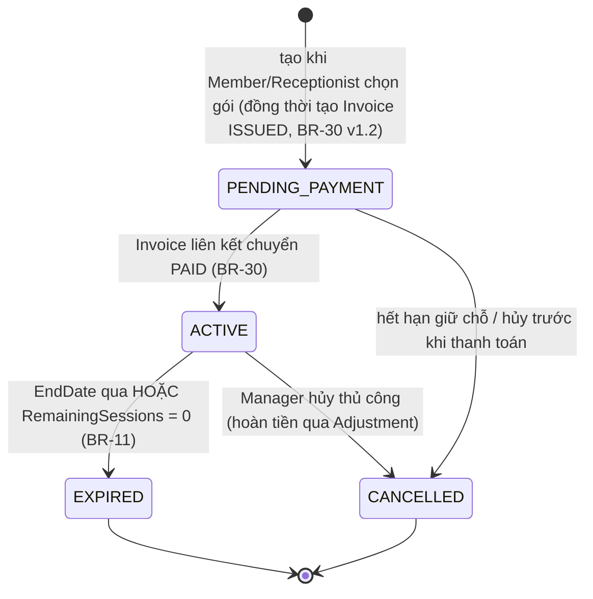
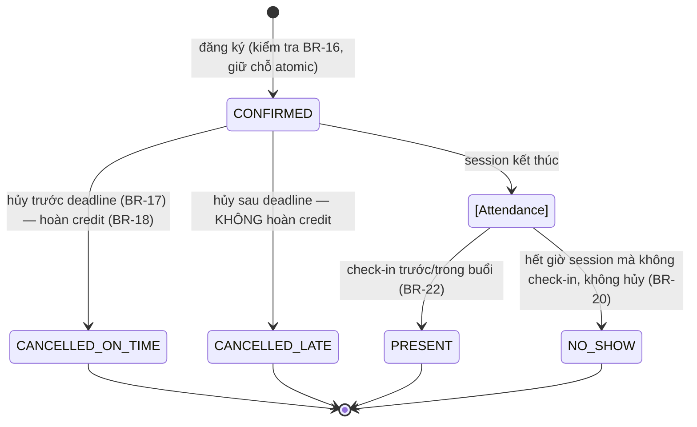
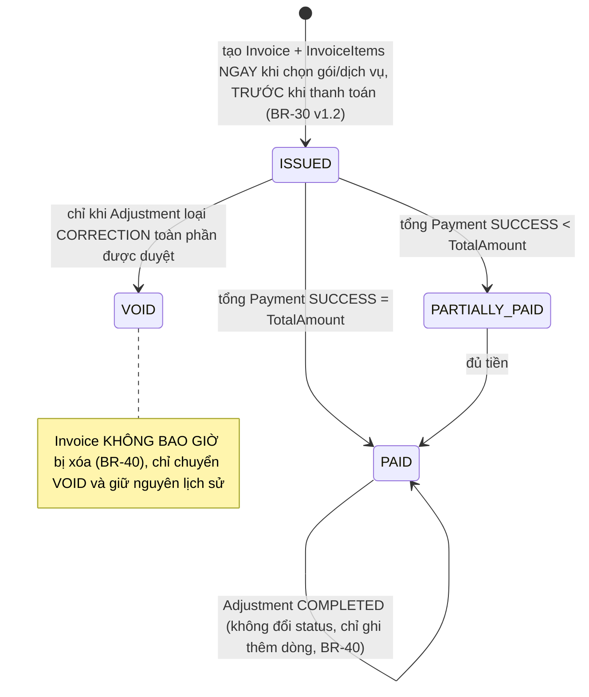
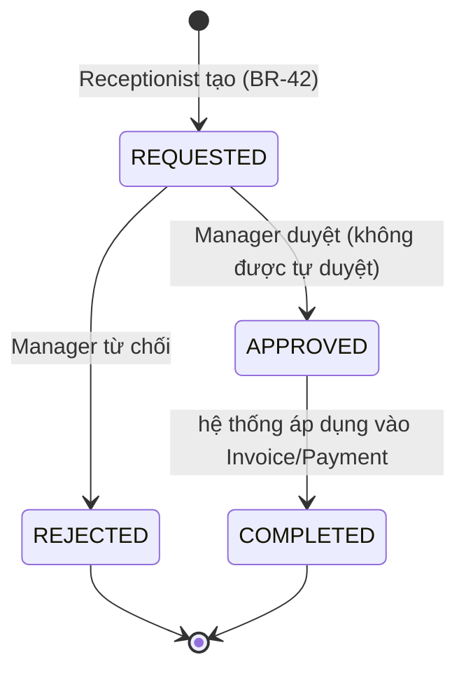

# Center Management System — Design v2 (Addendum trước khi code)

Tài liệu này bổ sung/chỉnh sửa thiết kế v1 theo đúng các điểm review. Không lặp lại phần đã đúng ở v1 (Actors, Use Case, kiến trúc tổng thể) — chỉ tập trung vào phần thiếu, và **thay thế hoàn toàn** phần ERD/API ở v1.

---

## 0. Traceability — mapping Business Rules cũ → mới

*(v1.2)* File `SportManagement_BusinessRules_v1.2.docx` hiện là **nguồn sự thật duy nhất** cho toàn bộ Business Rules — tài liệu Design này chỉ tham chiếu đến, không định nghĩa lại. Bảng dưới đây là mapping lịch sử (để hiểu vì sao số ID không liên tục), không phải danh sách việc cần làm.

| Rule cũ (v1, không còn dùng) | Rule chính thức hiện tại | Ghi chú |
|---|---|---|
| Original BR-01 | **BR-16** | Enrollment yêu cầu package Active |
| Original BR-02 | **BR-17**, **BR-18** | Deadline hủy lớp + hoàn credit |
| Original BR-03 | **BR-20**, **BR-21** | No-show tracking |
| Original BR-04 | **BR-26** | AI cần đủ 3 tham số |
| Original BR-05 | **BR-30** | Invoice tạo ngay khi chọn gói (trước khi thanh toán); Payment cập nhật trạng thái Invoice — xem Mục 2.3 |
| Original BR-06 | **BR-2**, **BR-32**, **BR-39** | Quyền Manager: tạo Staff/Coach, xem báo cáo, cấu hình hệ thống |

**Đã bổ sung ở v1.1 (nhóm H — Payment & Invoice):** BR-40 (Invoice bất biến), BR-41 (Payment gắn 1 Invoice, không vượt tổng), BR-42 (Adjustment cần Manager duyệt), BR-43 (báo cáo doanh thu trừ adjustment).

**Đã bổ sung ở v1.2 (theo review lần này):**

| ID | Nhóm | Nội dung tóm tắt |
|---|---|---|
| BR-44 → BR-48 | K. Reporting & Export (mới) | Phạm vi field export, quyền xem report, retention 6 tháng, xóa report, SLA PDF ≤20 trang/15s + retry khi lỗi — lấp khoảng trống endpoint `/reports/export` đang tham chiếu `BR-48` mà trước đây chưa tồn tại |
| BR-49 | A | Unique email không phân biệt hoa/thường |
| BR-50 | D | Deadline hủy lớp (X giờ ở BR-17) là **cấu hình được**, không hardcode |
| BR-51 | C | Capacity session = MIN(Room, Class) tại thời điểm sinh; Manager chỉ được hạ, không được nâng |
| BR-52 | H | Công thức mặc định cho `PaymentAdjustment` loại REFUND |
| BR-53 | E | Phân biệt rõ `Absent` (Coach/Receptionist ghi tay) vs `No-show` (job tự động) |

**BR-30 và BR-34 đã được viết lại** trong v1.2 để khớp với quyết định kiến trúc/luồng nghiệp vụ hiện tại (xem Mục 2.3 và Mục 6).

---

## 1. ERD v2 (đầy đủ, thay thế ERD v1)

```mermaid
erDiagram
    ROLES ||--o{ USERS : "has"
    USERS ||--o{ MEMBER_PACKAGES : "purchases"
    USERS ||--o| MEMBER_TRAINING_PROFILE : "has (Member only)"
    USERS ||--o{ COACH_MEMBER_RELATIONSHIP : "coach side"
    USERS ||--o{ COACH_MEMBER_RELATIONSHIP : "member side"
    USERS ||--o{ CLASSES : "coaches (default, nullable)"
    USERS ||--o{ ENROLLMENTS : "member enrolls"
    USERS ||--o{ WORKOUT_PLANS : "member has / coach creates"
    USERS ||--o{ WORKOUT_RESULTS : "member of / recorded by coach"
    USERS ||--o{ INVOICES : "billed to"
    USERS ||--o{ INVOICES : "issued by (staff)"
    USERS ||--o{ PAYMENTS : "received by (staff)"
    USERS ||--o{ PAYMENT_ADJUSTMENTS : "requested by / approved by"
    USERS ||--o{ NOTIFICATIONS : "receives"
    USERS ||--o{ AI_LOGS : "initiates"
    USERS ||--o{ AUDIT_LOGS : "performs"

    MEMBERSHIP_PACKAGES ||--o{ MEMBER_PACKAGES : "defines"
    MEMBER_PACKAGES ||--o{ INVOICES : "billed by (nullable)"
    MEMBER_PACKAGES ||--o{ ENROLLMENTS : "consumed by"

    ROOMS ||--o{ CLASSES : "default room"
    ROOMS ||--o{ CLASS_SESSIONS : "actual room (may override)"
    CLASSES ||--o{ CLASS_RECURRENCE : "defines pattern"
    CLASS_RECURRENCE ||--o{ CLASS_SESSIONS : "generates"
    CLASSES ||--o{ CLASS_SESSIONS : "ad-hoc session (nullable recurrence)"
    CLASS_SESSIONS ||--o{ ENROLLMENTS : "booked in"
    CLASS_SESSIONS ||--o{ ATTENDANCE : "produces"
    ENROLLMENTS ||--o| ATTENDANCE : "results in"
    CLASS_SESSIONS ||--o{ WORKOUT_RESULTS : "recorded in"

    COACH_MEMBER_RELATIONSHIP ||--o{ WORKOUT_PLANS : "authorizes"
    WORKOUT_PLANS ||--o{ WORKOUT_PLAN_ITEMS : "contains"

    INVOICES ||--o{ INVOICE_ITEMS : "line items"
    INVOICES ||--o{ PAYMENTS : "receives"
    INVOICES ||--o{ PAYMENT_ADJUSTMENTS : "corrected/refunded by"
    PAYMENTS ||--o{ PAYMENT_ADJUSTMENTS : "may be reversed by"

    USERS {
        uuid UserID PK
        string FullName
        string Email
        string PasswordHash
        string Phone
        int RoleID FK
        string Status "ACTIVE, BANNED, DEACTIVATED"
        datetime CreatedAt
    }
    ROLES {
        int RoleID PK
        string RoleName "MANAGER, COACH, MEMBER, RECEPTIONIST"
    }
    MEMBER_TRAINING_PROFILE {
        uuid ProfileID PK
        uuid MemberID FK "unique"
        string Goal
        string ExperienceLevel "BEGINNER, INTERMEDIATE, ADVANCED"
        string Notes
        datetime UpdatedAt
    }
    COACH_MEMBER_RELATIONSHIP {
        uuid RelationshipID PK
        uuid CoachID FK
        uuid MemberID FK
        string SourceType "CLASS_BASED, PERSONAL, ASSIGNED_BY_MANAGER"
        int ClassID FK "nullable"
        string Status "ACTIVE, ENDED"
        datetime StartedAt
        datetime EndedAt
    }
    MEMBERSHIP_PACKAGES {
        int PackageID PK
        string Name
        decimal Price
        int DurationDays
        int SessionLimit "nullable = unlimited"
    }
    MEMBER_PACKAGES {
        uuid MemberPackageID PK
        uuid MemberID FK
        int PackageID FK
        date StartDate
        date EndDate
        int RemainingSessions "nullable"
        string Status "PENDING_PAYMENT, ACTIVE, EXPIRED, CANCELLED"
        int Version "optimistic concurrency"
    }
    ROOMS {
        int RoomID PK
        string Name
        int Capacity
    }
    CLASSES {
        int ClassID PK
        string Name
        string Discipline
        int DefaultRoomID FK
        uuid DefaultCoachID FK "nullable"
        int Capacity
        string Status "ACTIVE, ARCHIVED"
    }
    CLASS_RECURRENCE {
        int RecurrenceID PK
        int ClassID FK
        string DaysOfWeek "e.g. MON,WED,FRI"
        time StartTimeLocal
        time EndTimeLocal
        string Timezone "e.g. Asia/Ho_Chi_Minh"
        date EffectiveFrom
        date EffectiveTo "nullable"
    }
    CLASS_SESSIONS {
        uuid SessionID PK
        int ClassID FK
        int RecurrenceID FK "nullable, null = ad-hoc/rescheduled"
        int RoomID FK
        uuid CoachID FK
        datetime StartAtUtc
        datetime EndAtUtc
        int Capacity
        int ConfirmedCount "denormalized, atomic increment"
        string Status "SCHEDULED, RESCHEDULED, CANCELLED, COMPLETED"
        uuid RescheduledFromSessionID FK "nullable"
    }
    ENROLLMENTS {
        uuid EnrollmentID PK
        uuid SessionID FK
        uuid MemberID FK
        uuid MemberPackageID FK
        string Status "CONFIRMED, CANCELLED_ON_TIME, CANCELLED_LATE"
        datetime RegisteredAt
        datetime CancelledAt
        uuid CancelledByUserID FK "nullable, may differ from MemberID (Receptionist)"
    }
    ATTENDANCE {
        uuid AttendanceID PK
        uuid EnrollmentID FK
        uuid SessionID FK
        uuid MemberID FK
        string Status "PRESENT, ABSENT, NO_SHOW"
        datetime CheckInTime "nullable"
        uuid CheckedInByUserID FK "nullable"
    }
    WORKOUT_PLANS {
        uuid PlanID PK
        uuid MemberID FK
        uuid CoachID FK
        uuid RelationshipID FK
        string Goal
        string Level
        datetime CreatedAt
    }
    WORKOUT_PLAN_ITEMS {
        uuid ItemID PK
        uuid PlanID FK
        string Exercise
        int Sets
        int Reps
        string Notes
    }
    WORKOUT_RESULTS {
        uuid ResultID PK
        uuid SessionID FK
        uuid MemberID FK
        uuid CoachID FK
        string ProgressNote
        string CoachComment
        datetime RecordedAt
    }
    INVOICES {
        uuid InvoiceID PK
        string InvoiceNumber "unique, human-readable"
        uuid MemberID FK
        uuid IssuedByUserID FK
        uuid MemberPackageID FK "nullable"
        decimal TotalAmount
        string Status "ISSUED, PARTIALLY_PAID, PAID, VOID"
        datetime IssuedAt
    }
    INVOICE_ITEMS {
        uuid ItemID PK
        uuid InvoiceID FK
        string Description
        decimal Amount
        string RelatedEntityType "PACKAGE, CLASS_FEE, PENALTY"
        uuid RelatedEntityID "nullable"
    }
    PAYMENTS {
        uuid PaymentID PK
        uuid InvoiceID FK
        decimal Amount
        string Method "CASH, CARD, TRANSFER, EWALLET"
        string ReferenceCode "external gateway ref, nullable"
        string Status "PENDING, SUCCESS, FAILED"
        uuid ReceivedByUserID FK
        datetime PaidAt
    }
    PAYMENT_ADJUSTMENTS {
        uuid AdjustmentID PK
        uuid InvoiceID FK
        uuid PaymentID FK "nullable"
        string Type "REFUND, CORRECTION, DISCOUNT"
        decimal Amount
        string Reason
        string Status "REQUESTED, APPROVED, REJECTED, COMPLETED"
        uuid RequestedByUserID FK
        uuid ApprovedByUserID FK "nullable"
        datetime CreatedAt
        datetime ResolvedAt "nullable"
    }
    NOTIFICATIONS {
        uuid NotificationID PK
        uuid UserID FK
        string Channel "IN_APP, EMAIL, SMS"
        string SourceEventType "CLASS_CANCELLED, SCHEDULE_CHANGED, PACKAGE_EXPIRING, PAYMENT_RECEIVED"
        uuid SourceEntityID "nullable"
        string Message
        string Status "PENDING, SENT, FAILED, READ"
        int RetryCount
        datetime LastAttemptAt
        datetime SentAt
    }
    AI_LOGS {
        uuid LogID PK
        uuid UserID FK
        string QueryType
        jsonb InputPayload
        jsonb ResponsePayload
        int ResponseTimeMs
        datetime CreatedAt
    }
    AUDIT_LOGS {
        uuid AuditID PK
        uuid UserID FK
        string Action
        string TargetEntity
        uuid TargetID
        jsonb OldValue "nullable"
        jsonb NewValue "nullable"
        string IPAddress
        datetime Timestamp
    }
```

### Thay đổi chính so với v1

- **Payment tách khỏi Invoice**: `INVOICES` (hóa đơn, bất biến) → `INVOICE_ITEMS` (dòng chi tiết) → `PAYMENTS` (từng giao dịch thu tiền, có thể trả góp/nhiều lần) → `PAYMENT_ADJUSTMENTS` (refund/correction, có workflow duyệt riêng, đúng BR-40/BR-42).
- **Lịch lặp tách khỏi session cụ thể**: `CLASS_RECURRENCE` định nghĩa pattern (ngày trong tuần, giờ, timezone, hiệu lực từ-đến); một job định kỳ sinh `CLASS_SESSIONS` trước N tuần. Mỗi `CLASS_SESSION` có thể bị **override** (đổi phòng/coach/giờ qua `RescheduledFromSessionID`) hoặc **CANCELLED** độc lập mà không ảnh hưởng pattern gốc.
- **`ConfirmedCount` denormalized** trên `CLASS_SESSIONS` để chống overbooking bằng transaction, thay vì COUNT() mỗi lần (xem mục 3).
- **`MEMBER_TRAINING_PROFILE`** và **`COACH_MEMBER_RELATIONSHIP`** mới — cần thiết để AI suggestion (BR-26) và Workout Plan (BR-23) có dữ liệu goal/level/quan hệ thật, không phải tham số client tự gửi.
- **Notification & Audit Log** mở rộng theo đúng góp ý: trạng thái gửi, kênh, nguồn sự kiện, retry; audit có `OldValue`/`NewValue` dạng JSONB để truy vết thay đổi thực tế.

---

## 2. State Transition — 4 vòng đời cốt lõi

### 2.1 MemberPackage

### 2.2 Enrollment → Attendance

*Job nền (`AttendanceFinalizerJob`) chạy sau `EndAtUtc` của mỗi session: mọi `Enrollment.Status = CONFIRMED` chưa có `Attendance` → tạo `Attendance.Status = NO_SHOW`.*

### 2.3 Invoice

### 2.4 PaymentAdjustment (Refund/Correction)

---

## 3. Ràng buộc & Transaction bắt buộc ở tầng DB

Không được để các ràng buộc này chỉ nằm ở API layer — phải có ở schema/transaction:

| # | Ràng buộc | Cơ chế |
|---|---|---|
| 1 | Không đăng ký trùng vào cùng 1 session | `UNIQUE INDEX ux_enrollment_active ON enrollments(session_id, member_id) WHERE status = 'CONFIRMED'` (partial unique index — cho phép đăng ký lại sau khi hủy) |
| 2 | Không vượt sức chứa session (chống overbooking khi nhiều request đồng thời) | Trong 1 transaction: `UPDATE class_sessions SET confirmed_count = confirmed_count + 1 WHERE session_id = :id AND confirmed_count < capacity RETURNING confirmed_count;` — nếu 0 rows affected → 409 Conflict. Không dùng `SELECT COUNT(*)` rồi `INSERT` riêng lẻ (race condition). |
| 3 | Trừ `RemainingSessions` nguyên tử | Cùng transaction với bước 2: `UPDATE member_packages SET remaining_sessions = remaining_sessions - 1 WHERE member_package_id = :id AND status = 'ACTIVE' AND (remaining_sessions IS NULL OR remaining_sessions > 0) RETURNING remaining_sessions;` — 0 rows affected → 409 (BR-16 vi phạm) |
| 4 | Rollback đồng bộ khi hủy đăng ký đúng hạn | 1 transaction: cập nhật `Enrollment.Status`, hoàn `RemainingSessions += 1`, giảm `ConfirmedCount -= 1` |
| 5 | Không trùng số hóa đơn | `UNIQUE(InvoiceNumber)`; `InvoiceNumber` sinh theo sequence DB (`nextval`), không phải random ở app layer, tránh trùng khi 2 request song song |
| 6 | Tổng Payment không vượt Invoice.TotalAmount (BR-41) | Constraint kiểm tra ở service layer trong transaction `SELECT ... FOR UPDATE` trên `Invoices` row trước khi `INSERT INTO payments`, tránh 2 payment cùng lúc vượt tổng |
| 7 | Không tạo trùng quan hệ Coach–Member đang hoạt động | `UNIQUE INDEX ux_relationship_active ON coach_member_relationship(coach_id, member_id) WHERE status = 'ACTIVE'` (partial unique, cùng mẫu #1) — tránh 2 relationship ACTIVE trùng lặp làm sai điều kiện BR-23/BR-24 |
| 8 | Optimistic concurrency cho `MemberPackage` | Cột `Version` (`xmin` của Postgres có thể tận dụng, hoặc cột version tường minh) để tránh lost update khi Manager sửa cùng lúc Enrollment trừ session |
| 9 | Email không phân biệt hoa/thường (BR-49) | `UNIQUE INDEX ux_users_email_lower ON users(LOWER(email))`, hoặc dùng kiểu `citext` của Postgres cho cột `Email` |
| 10 | Capacity session không vượt MIN(Room, Class) (BR-51) | `CHECK (capacity <= room_capacity_at_creation)` áp ở tầng service khi generate/reschedule session; Manager chỉ được set capacity ≤ giá trị này |

### 3.1 Ràng buộc nghiệp vụ bổ sung (không phải DB constraint thuần — cần chốt ở service layer)

| Ràng buộc | Nội dung | BR liên quan |
|---|---|---|
| Nơi cấu hình deadline hủy lớp | Lưu trong bảng cấu hình hệ thống (`SystemSettings` hoặc field `CancellationDeadlineHours` trên `MembershipPackages`/`Classes` nếu muốn cấu hình theo từng loại), do Center Manager chỉnh qua `PUT /api/settings`; đọc giá trị **tại thời điểm hủy**, không hardcode trong code | BR-50 |
| Công thức refund/adjustment mặc định | `REFUND.Amount = Invoice.TotalAmount × (MemberPackage.RemainingSessions / MembershipPackage.SessionLimit)` cho gói theo buổi; theo tỷ lệ ngày còn lại cho gói theo thời hạn. Manager có thể override khi duyệt | BR-52 |
| Khi nào Attendance = Absent vs No-show | `Absent`: Coach/Receptionist **chủ động ghi tay** (vd. có lý do chính đáng); `No-show`: **job tự động** sinh ra sau `EndAtUtc` khi Enrollment CONFIRMED không có check-in và không hủy đúng hạn | BR-53 |

---

## 4. API đầy đủ cho 3 flow bắt buộc

**Quy ước bắt buộc cho mọi endpoint có "self" action:** `memberId`/`coachId` KHÔNG được nhận từ request body/query khi hành động là cho chính người gọi — backend lấy từ `JWT.sub`. Chỉ khi Manager/Receptionist thao tác **thay cho người khác** thì endpoint mới nhận `targetUserId` tường minh, kèm kiểm tra RBAC + ghi Audit Log bắt buộc.

### 4.1 Flow — Quản lý hội viên (Membership)

| Method | Endpoint | Actor | Nguồn định danh |
|---|---|---|---|
| POST | `/api/auth/register` | Public | body: email, password |
| POST | `/api/auth/login` | Public | — |
| GET | `/api/users/me` | Member/Coach/Receptionist/Manager | JWT |
| PUT | `/api/users/me` | Member/Coach/Receptionist | JWT — chỉ sửa hồ sơ của chính mình |
| POST | `/api/users/staff` | **Manager only** | body: role=COACH/RECEPTIONIST (BR-2) |
| PUT | `/api/users/{userId}/status` | **Manager only** | ban/unban (BR-6) |
| GET | `/api/members` | Receptionist/Manager | tìm kiếm hội viên |
| POST | `/api/members` | Receptionist | đăng ký hội viên tại quầy |
| GET | `/api/members/me/profile` | Member | JWT |
| PUT | `/api/members/me/training-profile` | Member | Goal/Level tự khai |
| PUT | `/api/members/{memberId}/training-profile` | Coach (chỉ nếu có `COACH_MEMBER_RELATIONSHIP` ACTIVE) | kiểm tra quan hệ |
| GET | `/api/membership-packages` | Public/tất cả | catalog |
| POST | `/api/membership-packages` | **Manager only** | (BR-8) |
| PUT | `/api/membership-packages/{id}` | **Manager only** | |
| GET | `/api/members/me/packages` | Member | JWT |
| GET | `/api/members/{memberId}/packages` | Receptionist/Manager/Coach (own relationship) | |
| POST | `/api/member-packages` | Member (self) hoặc Receptionist (on-behalf) | Trong **cùng 1 transaction**: tạo `MemberPackage` (PENDING_PAYMENT) + `Invoice`+`InvoiceItems` (ISSUED) — đúng BR-30 v1.2, Invoice sinh ngay khi chọn gói, không chờ thanh toán |

### 4.2 Flow — Đặt lớp / Lịch (Booking)

| Method | Endpoint | Actor | Ghi chú |
|---|---|---|---|
| POST | `/api/classes` | **Manager only** | (BR-12) |
| PUT | `/api/classes/{classId}` | **Manager only** | |
| POST | `/api/classes/{classId}/recurrence` | **Manager only** | định nghĩa pattern (BR-15) |
| PUT | `/api/classes/{classId}/coach` | **Manager only** | (BR-14) |
| GET | `/api/classes` | Tất cả | filter theo discipline/date |
| GET | `/api/classes/{classId}/sessions` | Tất cả | |
| PUT | `/api/sessions/{sessionId}` | **Manager only** | reschedule/cancel 1 buổi cụ thể, không ảnh hưởng recurrence |
| GET | `/api/members/me/schedule` | Member | JWT |
| GET | `/api/coaches/me/schedule` | Coach | JWT (BR — Actor Coach "xem lịch dạy") |
| POST | `/api/enrollments` | Member (self, `memberId` từ JWT) | transaction #2+#3 ở mục 3 |
| POST | `/api/enrollments/on-behalf` | Receptionist | body: `targetMemberId` tường minh + Audit Log bắt buộc |
| DELETE | `/api/enrollments/{enrollmentId}` | Member (chủ sở hữu) hoặc Receptionist | kiểm tra ownership; áp deadline BR-17 |
| GET | `/api/sessions/{sessionId}/roster` | Coach (lớp mình dạy)/Manager | |
| POST | `/api/sessions/{sessionId}/check-in` | Coach/Receptionist | body: `enrollmentId` (không phải tự nhận `memberId` tùy ý) |
| GET | `/api/sessions/{sessionId}/attendance` | Coach/Manager | |

### 4.3 Flow — Thanh toán / Hóa đơn / Báo cáo (Payment & Report)

| Method | Endpoint | Actor | Ghi chú |
|---|---|---|---|
| POST | `/api/invoices` | Receptionist | Chỉ dùng cho hóa đơn **ad-hoc** không gắn với mua gói (vd: phí phạt, dịch vụ lẻ) — hóa đơn mua gói đã được tạo tự động trong `POST /api/member-packages` (BR-30 v1.2) |
| GET | `/api/invoices/{invoiceId}` | Chủ sở hữu / Receptionist / Manager | |
| GET | `/api/members/me/invoices` | Member | JWT |
| GET | `/api/members/{memberId}/invoices` | Receptionist/Manager | |
| POST | `/api/invoices/{invoiceId}/payments` | Receptionist | ghi nhận thu tiền, transaction #6 |
| GET | `/api/invoices/{invoiceId}/payments` | Chủ sở hữu/Receptionist/Manager | |
| POST | `/api/invoices/{invoiceId}/adjustments` | Receptionist | tạo yêu cầu refund/correction (BR-42) |
| PUT | `/api/adjustments/{adjustmentId}/approve` | **Manager only** | không được là người tạo yêu cầu |
| PUT | `/api/adjustments/{adjustmentId}/reject` | **Manager only** | |
| GET | `/api/reports/revenue?from=&to=&groupBy=day\|week\|month` | **Manager only** | (BR-32, BR-43) |
| GET | `/api/reports/membership-summary` | **Manager only** | số lượng hội viên theo trạng thái gói |
| GET | `/api/reports/class-utilization` | **Manager only** | tỷ lệ lấp đầy lớp |
| POST | `/api/reports/export` | **Manager only** | PDF ≤20 trang trong 15s (BR-48) |

### 4.4 (Phụ) AI & Notification — giữ ở sprint sau nhưng liệt kê để không lệch v1

> Flow 6 (AI assistant / `/api/ai/chat`) đã hạ xuống **stretch — chỉ làm nếu còn thời gian** (xem `00-Source-of-Truth.md` §1.4, cập nhật 09/09/2026). Endpoint dưới đây được giữ lại trong tài liệu để không mất traceability, nhưng **không nằm trong scope cam kết** — không sinh code cho endpoint này trừ khi Flow 1–5 đã xong và nhóm quyết định làm thêm.

| Method | Endpoint | Actor | Ghi chú |
|---|---|---|---|
| POST | `/api/ai/workout-suggestions` | Coach — chỉ khi có `COACH_MEMBER_RELATIONSHIP` ACTIVE với member | Flow 5 — optional, cam kết |
| POST | `/api/ai/chat` | Member (self) | **Flow 6 — stretch, chỉ làm nếu còn thời gian** |
| GET | `/api/notifications/me` | Tất cả | |
| PUT | `/api/notifications/{id}/read` | Chủ sở hữu | |

---

## 5. Bảng quyền theo endpoint (RBAC Matrix rút gọn)

| Nhóm chức năng | Manager | Coach | Member | Receptionist |
|---|:---:|:---:|:---:|:---:|
| Tạo tài khoản Staff/Coach | ✅ | ❌ | ❌ | ❌ |
| Ban/Unban user | ✅ | ❌ | ❌ | ❌ |
| CRUD Membership Package (catalog) | ✅ | ❌ | 👁 Read | 👁 Read |
| Mua/gán MemberPackage | 👁 | ❌ | ✅ (self) | ✅ (on-behalf) |
| CRUD Class / Recurrence | ✅ | 👁 (lớp mình dạy) | 👁 | 👁 |
| Reschedule/Cancel session | ✅ | ❌ | ❌ | ❌ |
| Đăng ký/Hủy lớp | 👁 | ❌ | ✅ (self) | ✅ (on-behalf) |
| Check-in điểm danh | 👁 | ✅ (lớp mình dạy) | ❌ | ✅ |
| Tạo Workout Plan / Result | 👁 | ✅ (relationship ACTIVE) | 👁 (read-only) | ❌ |
| Tạo Invoice / ghi Payment | 👁 | ❌ | ❌ | ✅ |
| Tạo Adjustment (refund) | 👁 | ❌ | ❌ | ✅ (request) |
| Duyệt Adjustment | ✅ | ❌ | ❌ | ❌ |
| Xem báo cáo doanh thu | ✅ | ❌ | ❌ | ❌ |
| Xem Audit Log | ✅ | ❌ | ❌ | ❌ |

*(👁 = chỉ xem, không có quyền ghi; ✅ = có quyền hành động)*

---

## 6. Kiến trúc — điều chỉnh cho đúng scope MVP

Đồng ý với góp ý: hạ bớt hạ tầng ở giai đoạn đầu, chỉ giữ phần thực sự cần cho 3 flow bắt buộc.

| Thành phần | v1 đề xuất | v2 — MVP thực tế | Khi nào thêm lại |
|---|---|---|---|
| AI Module | Microservice Python/FastAPI riêng | **Module/adapter trong chính ASP.NET Core backend** (`IAiRecommendationService` gọi thẳng LLM API hoặc rule-based tạm thời) | Khi AI cần scale riêng, đổi ngôn ngữ xử lý ML, hoặc đội AI làm việc độc lập |
| Redis | Cache & session | **Bỏ ở MVP** — dùng session/token validation trực tiếp qua DB hoặc in-memory JWT blacklist | Khi có multi-instance backend cần cache dùng chung |
| RabbitMQ (Notification) | Queue bất đồng bộ | **Bỏ ở MVP** — dùng background job (Hangfire/Quartz.NET) + bảng outbox trong cùng transaction nghiệp vụ, đúng BR-34 v1.2 (không còn bắt buộc message queue ở MVP) | Khi khối lượng notification lớn hoặc cần retry phức tạp |
| Nginx / API Gateway | Reverse proxy riêng | **Bỏ ở MVP** — expose thẳng ASP.NET Core qua Kestrel + HTTPS, hoặc dùng gateway tối giản có sẵn của cloud provider khi deploy | Khi có nhiều service thật sự cần route/tách domain |
| PostgreSQL + Docker | Giữ nguyên | **Giữ nguyên** — đây là phần đã đúng | — |

Kết quả: MVP chỉ còn **1 backend (ASP.NET Core modular monolith) + 1 Postgres + 1 Next.js frontend**, chạy bằng `docker-compose` 3 service. Module AI, Notification queue, Redis, Gateway được thiết kế theo interface tách biệt (`IAiRecommendationService`, `INotificationSender`) để **thay thế implementation sau mà không đổi phần còn lại** — đúng nguyên tắc "thiết kế có thể bổ sung".

---

## 7. Thứ tự code MVP (xác nhận theo đề xuất của bạn)

1. **Identity/RBAC** — Users, Roles, JWT/OAuth2, endpoint `/auth/*`, `/users/*`
2. **Membership** — MembershipPackages, MemberPackages, MemberTrainingProfile
3. **Lớp/Lịch/Booking** — Classes, ClassRecurrence, ClassSessions (+ job sinh session), Enrollments, Attendance, ràng buộc #1–#4 ở mục 3
4. **Payment/Invoice/Report** — Invoices, InvoiceItems, Payments, PaymentAdjustments, `/reports/*`
5. *(Sprint sau)* Training/Workout đầy đủ + AI suggestion (Flow 5) + Notification queue thật — **AI assistant/chat (Flow 6) không nằm trong bước này, chỉ làm nếu còn thời gian sau bước 5 (xem SSOT §1.4)**

---

## Việc cần chốt trước khi bắt tay code (checklist)

- [ ] Duyệt lại 4 rule mới (BR-40 → BR-43) và cập nhật vào file Business Rules chính thức
- [ ] Xác nhận `CLASS_SESSIONS` được **pre-generate** (không tính on-the-fly) — ảnh hưởng job scheduler
- [ ] Xác nhận cơ chế `ConfirmedCount` denormalized thay vì COUNT() mỗi lần
- [ ] Xác nhận endpoint `on-behalf` cho Receptionist có Audit Log bắt buộc, không opt-out
- [ ] Xác nhận PDF report dùng thư viện nào (ảnh hưởng BR-48: 20 trang / 15 giây)
