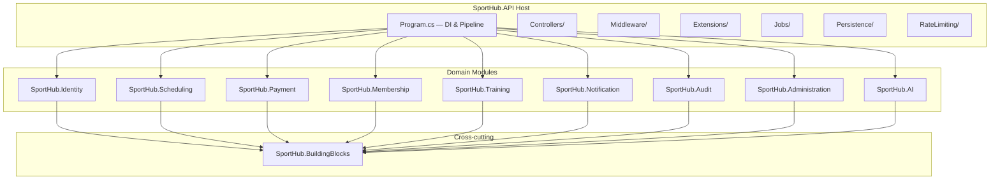

# SportHub — Thiết kế hệ thống quản lý trung tâm thể thao

SportHub là **hệ thống quản lý trung tâm thể thao với ba môn: Gym (bao gồm dịch vụ huấn luyện cá nhân PT), cầu lông và bóng rổ; có khả năng mở rộng thêm môn trong tương lai**. PT là dịch vụ thuộc Gym, không phải môn thứ tư.

Tài liệu này mô tả độc lập phạm vi, kiến trúc, dữ liệu, luồng nghiệp vụ và tiêu chí nghiệm thu. Tên file được giữ để bảo toàn liên kết; nội dung không phụ thuộc bản thiết kế đã xóa.

**Quy ước trạng thái:** “Có mã” là có implementation, không đồng nghĩa đã nghiệm thu. “Chưa triển khai” là thiếu mã/contract; “chưa kiểm chứng” là còn thiếu bằng chứng kiểm thử tích hợp hoặc vận hành. Xem danh sách cụ thể tại mục 13.

## 1. Phạm vi sản phẩm

### 1.1 Ba môn và hình thức dịch vụ

| Môn | Dịch vụ | Đơn vị mua | Quyền lợi |
|---|---|---|---|
| Gym | Tập tự do | Membership có thời hạn | Check-in/out tại quầy khi gói có hiệu lực |
| Gym | PT một Coach — một Member | Gói PT riêng, cần Membership Active | Quota buổi tập, lịch PT, kế hoạch, kết quả |
| Cầu lông | Khóa học; thuê sân | Gói cả khóa hoặc lượt thuê | Ghi danh nhiều buổi; Member được thuê sân khung trống |
| Bóng rổ | Khóa học; thuê sân | Gói cả khóa hoặc lượt thuê | Ghi danh nhiều buổi; Member được thuê sân khung trống |

Membership chỉ cấp quyền vào Gym và là điều kiện mua PT. Khóa cầu lông/bóng rổ mua độc lập Membership. PT dùng domain riêng, không lưu buổi tập vào Class/ClassSession/Enrollment.

### 1.2 Mở rộng môn

Môn, chuyên môn Coach, loại phòng/sân, giờ mở cửa và giá là dữ liệu cấu hình. Thêm môn dùng hình thức vận hành đã hỗ trợ phải tái sử dụng luồng lịch, mua dịch vụ, thanh toán và báo cáo; không rẽ nhánh nghiệp vụ theo tên môn hoặc ID seed cố định. Môn có quy tắc khác cần bổ sung validation, thiết kế và kiểm thử.

**Mô hình đã triển khai (CAT-01):** môn (`sports`, có `code` bất biến) tách khỏi dịch vụ (`sport_service_offerings`: `MEMBERSHIP_ACCESS`, `GROUP_COURSE`, `COURT_RENTAL`, `PERSONAL_TRAINING`). Ba môn seed là Gym (Membership và PT), Cầu lông và Bóng rổ (khóa học nhóm và thuê sân); PT không còn là môn riêng. Membership và PT chỉ bật được ở môn có mã `gym`, kiểm ở backend. Mặc định thời lượng và sĩ số lớp nằm trên dịch vụ `GROUP_COURSE`. Quyền PT của Coach đến từ `coach_service_qualifications` (không suy ra từ chuyên môn Gym) và phòng PT từ `service_room_types`. Tắt môn hoặc dịch vụ chỉ chặn giao dịch mới, không hủy hay sửa thứ đã bán; fulfillment của hóa đơn đã tạo vẫn chạy. Manager thêm môn có lớp hoặc thuê sân bằng cấu hình, không sửa code. Chi tiết API ở [api-contract](api-contract.md).

### 1.3 Ranh giới

Trong phạm vi: tài khoản, Membership Gym, PT, môn/sân, khóa học, lịch, điểm danh, thuê sân, payment/ví điểm, hoàn điểm, thông báo, báo cáo và AI hỗ trợ.

Ngoài phạm vi: đa chi nhánh, payroll/hợp đồng nhân sự, gym bên ngoài, chia doanh thu với người thuê sân, quản lý người đi cùng khi Member thuê sân, mobile native, hoàn tiền mặt/chuyển khoản, VNPay Refund API và cổng thanh toán production. Gói dịch vụ bổ sung và waitlist tự giữ chỗ chưa thuộc phạm vi. “Chờ đợt sau” là hoàn điểm và lưu nguyện vọng nhận thông báo, không phải giữ chỗ tương lai.

## 2. Vai trò và quyền hạn

| Vai trò | Trách nhiệm | Giới hạn |
|---|---|---|
| Guest | Xem thông tin trung tâm, môn, khóa/gói công khai; đăng ký | Không phải role tài khoản; không đọc roster, ví hoặc lịch cá nhân |
| Member | Mua dịch vụ; thuê/hủy sân còn trống; xem lịch, quyền lợi, hóa đơn, ví; yêu cầu hỗ trợ | Chỉ dữ liệu của mình; không tự xác nhận payment |
| Receptionist | Tiếp đón, Gym check-in/out, điểm danh lớp, checkout hộ | Dùng điểm hộ cần OTP Member; không tự cấp điểm hoặc duyệt refund |
| Coach | Xem lịch được giao; Coach PT lập plan, ghi result | Chỉ lớp/học viên được phân công; kiểm cả role và quan hệ |
| CenterManager | Môn/sân, Coach/chuyên môn, lớp/lịch, sự cố, hoàn điểm, báo cáo | Theo mức hệ thống tính; không tự duyệt yêu cầu của mình |
| SystemAdministrator | Tài khoản nhân sự, role, khóa/mở tài khoản | Không mặc nhiên có quyền tài chính hoặc hồ sơ tập luyện |

Backend kiểm policy, ownership, quan hệ và approval; ẩn nút frontend không thay thế authorization. Khoảng trống quyền đọc được ghi tại mục 13.

## 3. Kiến trúc và ranh giới module

Next.js phục vụ frontend; ASP.NET Core phục vụ API; PostgreSQL lưu dữ liệu. Backend là modular monolith: cùng tiến trình/database transaction, mỗi module sở hữu nghiệp vụ riêng. Không cần thêm message broker hoặc microservice cho phạm vi này.

| Module | Trách nhiệm |
|---|---|
| `SportHub.Identity` | Account, credential, profile, external login, OTP, chuyên môn |
| `SportHub.Membership` | Catalog Membership, gói đã mua, hiệu lực và gia hạn |
| `SportHub.Scheduling` | Môn/phòng/giá, lớp, ghi danh, giữ chỗ, occupancy, thuê sân, sự cố, Gym check-in |
| `SportHub.Training` | Quan hệ Coach–Member, PT entitlement/session/change request, plan/result |
| `SportHub.Payment` | Invoice, checkout, attempt, gateway, reconciliation, ví/ledger, OTP dùng điểm, refund |
| `SportHub.Notification` | Feed, email outbox, thông báo thủ công, retry delivery |
| `SportHub.AI` | Member assistant theo context, workout recommendation; Manager AI còn thiếu |
| `SportHub.Audit` | Dấu vết hành động |
| `SportHub.Administration` | Quản trị tài khoản, cấu hình và xuất báo cáo |
| `SportHub.BuildingBlocks` | Shared kernel, abstractions và hợp đồng liên module |
| `SportHub.API` | Composition root, middleware, persistence/migration, cấu hình, jobs |

Controller xác thực request; application service kiểm nghiệp vụ và transaction; domain chứa quy tắc; persistence thực thi FK/unique/check/exclusion constraints. Các lệnh liên module qua interface như `ICheckoutService`, `IOccupancyService`, `IPointWalletService`, `IPtPurchaseFulfillment`, không gọi HTTP vòng lại chính ứng dụng.

## 4. Mô hình dữ liệu

### 4.1 Bản đồ quan hệ

| Nhóm | Thực thể | Quy tắc |
|---|---|---|
| Danh tính | UserAccount, UserCredential, UserProfile, UserExternalLogin, EmailOtp | Tách account/auth/profile; FK nghiệp vụ trỏ account |
| Coach | CoachProfile, UserSportSpecialty | Nhiều chuyên môn |
| Catalog | Sport, RoomType, SportRoomType, Room, RoomOpeningHour, RoomBlock, CourtRate | Môn tương thích loại phòng; giờ/giá do trung tâm cấu hình |
| Membership | MembershipPackage, MemberPackage | Catalog khác quyền lợi đã mua; snapshot thời hạn |
| Khóa học | Class, ClassScheduleRule, ClassSession, Enrollment, Attendance | Lớp có nhiều buổi; ghi danh cả lớp; attendance unique theo enrollment/session |
| Giữ chỗ | SeatHold, RoomOccupancy, CoachOccupancy | Hold có TTL; một cơ chế chung chống trùng sân/Coach |
| Ngưỡng lớp | ThresholdResponse | Token hash, deadline, choice, resolution; bảng class_threshold_responses |
| PT | CoachMemberRelationship, PtEntitlement, PtSession, PtSessionChangeRequest, PtCoachChangeRequest | Quota/lịch thuộc Training; phòng PT có thể nullable |
| Tập luyện | WorkoutPlan, WorkoutPlanItem, WorkoutResult | Result gắn buổi PT; plan có lifecycle |
| Thuê sân | CourtRental, IncidentNotice | Môn, phòng, Member thuê, khoảng giờ, invoice/item |
| Thanh toán | Invoice, InvoiceItem, CheckoutSession, PaymentAttempt, Payment, VerifiedGatewayEvent | Tách nghĩa vụ mua, cycle, lần thử, tiền xác minh, inbox callback |
| Điểm/hoàn | PointWallet, PointLedgerEntry, PointConfirmation, PaymentAdjustment | Ledger phát sinh; OTP ủy quyền; refund theo item, không thêm bảng Refund song song |
| Hỗ trợ | Notification, AuditLog, AiLog, SystemSetting, ReportExport | Thông báo, truy vết, cấu hình và xuất báo cáo |

### 4.2 Ánh xạ vật lý và snapshot

Sơ đồ dưới biểu diễn các quan hệ nghiệp vụ chính, không thay thế toàn bộ schema vật lý:

```mermaid
erDiagram
    UserAccount ||--o{ MemberPackage : owns
    MembershipPackage ||--o{ MemberPackage : defines
    MemberPackage ||--o{ PtEntitlement : supports
    PtEntitlement ||--o{ PtSession : grants
    Sport ||--o{ Class : categorizes
    Class ||--o{ ClassSession : schedules
    Class ||--o{ SeatHold : reserves
    Class ||--o{ Enrollment : enrolls
    UserAccount ||--o{ Enrollment : owns
    Enrollment ||--o{ Attendance : records
    ClassSession ||--o{ Attendance : receives
    Room ||--o{ RoomOccupancy : occupies
    UserAccount ||--o{ CoachOccupancy : occupies
    UserAccount ||--o{ CourtRental : rents
    Room ||--o{ CourtRental : hosts
    UserAccount ||--o{ Invoice : benefits
    Invoice ||--|{ InvoiceItem : contains
    Invoice ||--o{ CheckoutSession : tracks
    Invoice ||--o{ PaymentAttempt : attempts
    PaymentAttempt o|--o| Payment : verifies
    InvoiceItem ||--o{ PaymentAdjustment : adjusts
    UserAccount ||--o| PointWallet : owns
    PointWallet ||--o{ PointLedgerEntry : records
```

- API `beneficiaryUserId` là Member; entity `Invoice.MemberId`/cột `member_id` giữ tương thích, không suy role từ tên field.
- InvoiceItem có typed FK `ClassId`, `CourtRentalId`, `PtEntitlementId`, `MemberPackageId`, `SportId`; `RelatedEntityId` giữ cho lịch sử có kiểm soát, không dùng để đoán FK.
- Giá, tên môn, tần suất PT và `MemberPackage.DurationDaysSnapshot` được snapshot tại checkout. Sửa catalog không đổi quyền lợi đã mua.
- `SourceInvoiceItemId`/`TransferDifferenceInvoiceItemId` giữ chuỗi giá trị chuyển lớp và cap refund.
- `Payment.PaymentAttemptId` truy vết attempt; `VerifiedGatewayEvent` giữ callback/query đã xác minh để dedup/replay.
- `PaymentAdjustment` lưu item, điểm hệ thống tính/điểm duyệt và ledger reference; field payout cũ chỉ đọc lịch sử.
- `fulfillmentOutcome` là DTO suy ra từ trạng thái/PaidVia/reconciliation, không thêm cột trạng thái trùng nguồn sự thật.

Chi tiết tại [Phụ lục A — Từ điển dữ liệu](#phụ-lục-a--từ-điển-dữ-liệu) và [API contract](api-contract.md). Khi tên logic và vật lý khác nhau, dùng mapping cùng entity/configuration thực tế.

## 5. Luồng nghiệp vụ

### 5.1 Tài khoản và Membership Gym

Đăng ký Member bằng email dùng OTP. Tài khoản nhân sự được tạo theo policy. Đổi/reset mật khẩu và khóa tài khoản phải vô hiệu phiên không còn hợp lệ.

**Quên mật khẩu (BR-103) — đã triển khai bằng link email, không dùng OTP:** `POST /api/auth/password/forgot` luôn trả 204 trung tính (không lộ email nào đã đăng ký; email không tồn tại, bị khóa hay đang chờ gửi lại đều như nhau). Với tài khoản Active, hệ thống tạo token ngẫu nhiên 256-bit, chỉ lưu SHA-256 trong `EmailOtp` (purpose `ResetPassword`), hạn 10 phút, dùng một lần, chỉ link mới nhất hợp lệ, gửi lại sau 60 giây; email mang nút tới `{Frontend:BaseUrl}/reset-password?email=&token=`. `POST /api/auth/password/reset` nhận `{email, token, newPassword, confirmNewPassword}`, tiêu token và đổi security stamp trong cùng transaction. Giao diện: `/forgot-password` (thông điệp trung tính, cooldown 60 giây gắn theo từng email, đổi email gửi được ngay) và `/reset-password` (ô mật khẩu có con mắt, ba trạng thái form/thành công/link hỏng). Đăng ký Member vẫn dùng OTP 6 số. *Chưa có:* email thông báo "mật khẩu đã thay đổi" mà BR-103/104 mô tả.

**Ngôn ngữ giao diện:** các trang xác thực (`/login`, `/register`, `/forgot-password`, `/reset-password`) luôn tiếng Anh, không đọc ngôn ngữ đã lưu và không có nút đổi ngôn ngữ; phần còn lại giữ EN/VI.

Chọn Membership → snapshot và checkout → payment xác minh → kích hoạt gói. Receptionist check-in/out dựa trên hiệu lực gói. Không dùng SessionLimit/RemainingSessions legacy để giới hạn vào Gym. Gia hạn giữ snapshot quyền lợi, xử lý gói nối tiếp và carry-over PT theo Business Rules.

### 5.2 PT thuộc Gym

Luồng Member hiện tại: Membership Gym Active → Training → chọn Coach có chuyên môn PT, ngày/giờ/phòng trống → báo giá **một buổi 90 phút** → checkout giữ lịch `PendingPayment` → thanh toán được xác minh → xác nhận buổi `Scheduled`. Services chỉ có nút dẫn đến Training, không bán gói PT theo tuần. Giá mỗi checkout bằng đơn giá PT đang cấu hình; client không gửi giá. Hủy/hết hạn checkout nhả phòng, Coach và quota của buổi chờ thanh toán. Quan hệ Personal Coach–Member được tạo sau khi thanh toán thành công nếu chưa có.

Gói PT đã bán trước đây giữ nguyên quota và quyền đặt lịch. `frequency` 1/2/3 chỉ còn phục vụ hợp đồng gói cũ và luồng tương thích; không tự tạo booking tuần. Xem [PT theo từng buổi](PT-Per-Session.md).

Coach ghi kết quả/plan cho học viên được giao. Đổi/hủy/đổi Coach qua change request. Member có API xem slot, giữ lịch qua checkout và đặt lịch bằng quota đã mua trước đây.

### 5.3 Khóa cầu lông và bóng rổ

**Seed lịch cố định (BR-141):** Bóng rổ 01 Thứ 2-4-6 07:00–09:00, Bóng rổ 02 Thứ 3-5-7 14:00–16:00; Cầu lông 01/02 cùng khung giờ trên sân cầu lông riêng. Khung còn lại mở cho Member thuê (mục 5.5); Manager có thể thêm lớp/sân vào khung khác sau.

Manager tạo lớp, nhiều buổi, phòng và Coach phù hợp → publish → Member mua cả khóa → giữ chỗ TTL → payment thành công tạo Enrollment → Receptionist điểm danh từng buổi.

Sĩ số thuộc Class. `ReservedCount` hiện bao gồm chỗ đang giữ và đã xác nhận: `ConfirmedCount <= ReservedCount <= Capacity`. Tăng/giảm trong transaction với row lock/conditional update, không read-then-write rời rạc. Lớp nhóm dùng Present/Absent; không áp dụng booking restriction do No-show hoặc hạn mức theo ngày của mô hình lớp theo buổi. PT xử lý No-show riêng.

### 5.4 Ngưỡng lớp và chuyển lớp

Đánh giá số ghi danh trước buổi đầu theo cấu hình. Lớp dưới ngưỡng gửi lựa chọn chuyển lớp/hoàn điểm cùng deadline; job xử lý quá hạn idempotent. Miễn ngưỡng cần Manager và lý do.

Chuyển lớp kiểm tra chỗ, điều kiện lớp đích và chuỗi giá trị đã trả. Chênh lệch dương qua checkout riêng, chỉ chuyển sau fulfillment. Không cấp quyền lợi lớp đích mà bỏ quên kết thúc lớp nguồn.

“Chờ đợt sau” chưa triển khai: hoàn 100% điểm ngay + lưu nguyện vọng nhận thông báo khóa phù hợp; không giữ tiền/chỗ hoặc tự ghi danh.

### 5.5 Thuê sân

Member chọn môn/sân/giờ trong khung trống (khung lớp cố định theo BR-141 không cho thuê) → kiểm giờ mở cửa, giá, occupancy → snapshot giá theo block giờ → giữ sân → checkout → xác nhận rental. Không khai báo số người, không giới hạn số người, không quan tâm mục đích sử dụng.

Hủy/hết hạn giải phóng occupancy đúng một lần. Hủy đủ hạn hoặc lỗi trung tâm hoàn điểm theo rule; không hoàn qua gateway. Không lưu roster hay số người đi cùng của Member thuê sân.

### 5.6 Sự cố

Preview tác động → Manager thực hiện phương án dời/bù/hủy lớp hoặc PT → preview lại → resolve. Resolve recheck lịch, hủy/hoàn rental phù hợp và tạo incident/block trong transaction cuối.

Toàn chuỗi tương tác không phải một transaction duy nhất. Incident history/detail, preview bồi hoàn/người nhận đầy đủ và cơ chế chặn booking trong lúc xử lý còn thiếu.

## 6. Payment, VNPay và ví điểm

### 6.1 Bất biến tài chính

`TotalAmount = PointsApplied × 1.000 + CashAmount`. VND dùng decimal; điểm là số nguyên không âm. Backend tính giá và kiểm số dư, không tin tổng tiền client gửi.

Một invoice có nhiều checkout cycle/attempt nhưng không ghi tiền/cấp quyền lợi trùng. Retry hoặc đổi điểm không ghi đè lịch sử attempt. Command dùng Idempotency-Key: retry cùng ý định giữ key; ý định mới dùng key mới.

### 6.2 Luồng thanh toán chuẩn

1. Tạo invoice/item, checkout, snapshot giá, ownership, revision và resource hold.
2. Người mua chọn điểm; dùng điểm hộ tại quầy cần OTP gắn đúng Member/checkout/revision/số điểm.
3. Giữ điểm atomically. Nếu CashAmount bằng 0, hoàn tất và fulfillment trong transaction, không tạo VNPay attempt.
4. Nếu còn tiền, tạo attempt snapshot, reference duy nhất, deadline và payment URL qua IPaymentGateway.
5. IPN hoặc QueryDR xác minh chữ ký, merchant, reference, amount, status và thời điểm; capture inbox bền vững để retry.
6. Transaction ghi Payment, Spend điểm giữ, invoice, quyền lợi Membership/PT/enrollment/rental, audit và outbox.
7. Return chỉ hiển thị; UI đọc backend, không đánh dấu đã mua từ query string hoặc ảnh chuyển tiền.

### 6.3 Expiry và đối soát

Expiry nhả seat/occupancy/điểm đúng một lần. Tiền đến muộn vẫn đối soát: recheck khả năng fulfillment; nếu không thể cấp quyền lợi thì bồi hoàn điểm hoặc đưa vào xử lý đối soát. Không bỏ callback, không bán vượt chỗ.

UI phân biệt PENDING, FULFILLED, COMPENSATED, RECONCILIATION_REQUIRED. Nhận tiền không đồng nghĩa cấp quyền lợi; không suy kết quả chỉ từ PAID_AFTER_RECONCILIATION.

### 6.4 Refund và báo cáo

Refund theo invoice item, quyền lợi đã dùng và chuỗi chuyển lớp. Server tính cap; Manager duyệt theo policy. Ledger credit, hủy quyền lợi, audit/outbox phải nguyên tử, chống replay. Không rút/chuyển điểm hoặc dùng VNPay Refund API.

Báo cáo tách tiền VNPay thực thu, điểm dùng, điểm phát hành do hoàn/bồi hoàn và dịch vụ được cấp. Không cộng điểm hoàn thành doanh thu tiền mới. Dùng snapshot môn; dữ liệu không xác định được không tự gán vào Gym.

### 6.5 Implementation và giới hạn

Đã có VnPayGateway tạo URL/ký request, verify callback, QueryDR; VnPaySigner, callback controller, reconciliation service/job, checkout, wallet, refund và frontend payment. **Payment/VNPay không phải module chưa có mã.**

MockPaymentGateway chỉ được chọn khi Development và `VnPay:UseMock=true`, không tự fallback vì thiếu secret. Ngoài Development, startup kiểm credential và HTTPS URL. Mock không chứng minh sandbox thật hoặc VNPay-QR đã chạy.

Cần nghiệm thu gateway sandbox, callback public, QR/payment-page journey, return và QueryDR thực theo mục 13. Không lưu secret vào tài liệu, source control, frontend hoặc log.

## 7. Trạng thái

| Đối tượng | Vòng đời |
|---|---|
| Class | Draft → Published → InProgress → Completed; Cancelled theo điều kiện |
| Enrollment | Confirmed; kết thúc TransferredOut, Refunded hoặc CancelledByCenter |
| PaymentAttempt | Pending, Expired, Succeeded, Failed, ReconciliationRequired; event muộn qua đối soát |
| Invoice | Issued, Paid, Void, PaidAfterReconciliation; expiry thuộc checkout/attempt |
| PaymentAdjustment | Requested, Approved, Rejected, Completed; refund hoàn tất cùng ledger/quyền lợi |
| PT/Membership/Rental | Dùng enum và transition của module sở hữu, không ép vào lifecycle lớp nhóm |

JSON enum UPPER_SNAKE_CASE; JWT role dùng tên nội bộ; DB giữ số enum đã có. Không đổi thứ tự enum để khớp cách trình bày tài liệu.

## 8. Database và đồng thời

- FK/Restrict giữ lịch sử tài chính; không cascade xóa invoice/ledger theo catalog/user. Ngừng hoạt động thay xóa đối tượng đã được tham chiếu.
- Unique bảo vệ reference/idempotency/attendance/dedup; check bảo vệ amount/points/capacity; row lock hoặc conditional update bảo vệ tài nguyên cạnh tranh.
- RoomOccupancy/CoachOccupancy dùng PostgreSQL exclusion constraints với btree_gist. Ghi lịch lớp/PT/rental/block phải dùng cùng cơ chế, cùng transaction nghiệp vụ.
- Khoảng giờ `[start, end)` cho phép lịch nối tiếp. Lưu UTC, hiển thị giờ Việt Nam; ngày inclusive/exclusive được định nghĩa theo từng rule.
- Mutation dùng revision/version khi contract hỗ trợ, trả conflict thay vì silently overwrite.
- Migration kiểm DB trắng và upgrade có lịch sử; tách schema/backfill, không sửa migration đã áp dụng hoặc reset DB chung.
- Backfill chỉ dữ liệu xác định được, giữ null/legacy reference khi thiếu bằng chứng. Migration Gym/PT cần mapping, kiểm FK/snapshot, đối soát và phương án phục hồi.

## 9. API và frontend

Route, DTO, error, actor tra tại [API contract](api-contract.md). API đề xuất chưa có ở [phân công API theo page/owner](../DESIGN-SKILLS-GUIDE.md#api-liên-vai-trò-và-điều-kiện-đóng-việc), không dùng làm endpoint hiện hữu.

Server validate input, range, paging, timezone và ownership. Public DTO không lộ roster/email/ví/lịch PT. Callback public chỉ miễn JWT đúng action, vẫn verify gateway; reconcile vẫn kiểm quyền nhân viên.

Frontend chia theo tác vụ/role, dùng chung checkout/wallet/invoice; đủ loading, empty, error, expired, conflict và phục hồi reload. Deadline từ backend, không tạo hold khi chỉ xem catalog. `CheckoutResponse.ServerNowUtc` đã có; UI dùng thời gian server cùng expiresAtUtc để tính countdown và khôi phục sau reload.

Landing, navigation, báo cáo và nội dung giới thiệu dùng ba môn Gym (PT), cầu lông, bóng rổ, có thể mở rộng. Không hard-code ba ID vào nghiệp vụ. Chi tiết giao diện tại [DESIGN-TOKENS](../DESIGN-TOKENS.md) và [DESIGN-SKILLS-GUIDE](../DESIGN-SKILLS-GUIDE.md).

## 10. Jobs, thông báo và vận hành

| Job hiện có | Trách nhiệm |
|---|---|
| CheckoutExpiryJob, SeatHoldExpiryJob, PointHoldExpiryJob | Hết hạn checkout/tài nguyên/điểm, chống release trùng |
| PaymentReconciliationJob | Query/replay kết quả gateway |
| ClassThresholdEvaluationJob, ClassThresholdResponseExpiryJob | Ngưỡng lớp và phản hồi quá hạn |
| ClassStatusJob, RentalStatusJob | Lifecycle lớp/rental theo thời gian |
| MemberPackageExpiryJob, AttendanceFinalizerJob | Hiệu lực Membership, xử lý PT theo rule |
| NotificationDispatchJob | Lease/retry và gửi email đã queue |

Jobs phải chạy lại an toàn, có dedup/lock và chịu crash. Outbox queue trong transaction; gửi sau commit theo at-least-once. Mỗi lần đổi lịch là event riêng; retry không tạo thêm điểm/quyền lợi. LoggingEmailSender phục vụ demo, không chứng minh delivery.

Vận hành cần correlation ID không lộ secret/OTP, theo dõi outbox backlog, payment cần đối soát, job failure, health và backup/restore. Xem [RUNBOOK](RUNBOOK.md). Build thành công không đồng nghĩa sẵn sàng production.

## 11. Bảo mật và AI

JWT/policy kết hợp ownership, account status, security stamp và relationship. OTP một lần có TTL, giới hạn thử/rate limit. Audit quản trị, lịch, refund và đối soát thủ công.

AI đã có Member assistant theo context và workout recommendation cho Coach. Context lấy từ danh tính xác thực; tối thiểu hóa dữ liệu gửi provider. Output là đề xuất, không tự xác nhận payment/cấp quota/đổi lịch hoặc bỏ authorization.

Manager AI xếp lịch/function calling/tạo draft sau xác nhận chưa triển khai. Luồng đích: đọc availability → đề xuất → Manager xem/sửa/xác nhận → command tạo draft thông thường → recheck occupancy → audit. Không coi output LLM là lệnh đáng tin.

## 12. Kiểm thử nghiệm thu

Có file test không đồng nghĩa test đã chạy; mock không thay thế tích hợp thật. Cần kiểm:

1. Ba môn sản phẩm, PT thuộc Gym; mở rộng catalog; ngừng môn không mất lịch sử.
2. Role/ownership/relationship/approval, negative tests cho Coach và Admin.
3. PostgreSQL concurrency: chỗ cuối/quota cuối, overlap, expiry/cancel/retry đồng thời.
4. Payment: 0/100%/một phần điểm, OTP quầy, idempotency, sai chữ ký/merchant/amount, replay, nhiều attempt, late payment, crash sau capture, lỗi fulfillment.
5. Refund/threshold/incident: không double credit, bảo toàn giá trị chuyển lớp, recheck sau preview, release pending và refund paid rental đúng.
6. Migration DB trắng/upgrade, FK/snapshot, lịch sử Gym/PT.
7. Frontend từng role, deep link/reload, expired/reconciliation/compensation, keyboard/mobile, không success giả từ return.
8. VNPay sandbox/IPN không JWT/QueryDR thực, SMTP và Gemini; bằng chứng theo môi trường không chứa secret.

Đợt chỉnh tài liệu này dựa trên đọc mã và đối chiếu contract, không chạy lại bộ test ứng dụng hoặc giao dịch thật.

## 13. Phần chưa triển khai và chưa nghiệm thu

### 13.1 Payment và tích hợp ngoài

| ID | Hạng mục | Trạng thái và việc cần làm | Tiêu chí hoàn thành |
|---|---|---|---|
| PAY-01 | Payment nghiệp vụ | **Có mã:** checkout, attempt, inbox, wallet, split payment, refund, reconciliation, UI. Cần chạy regression/E2E trên môi trường nghiệm thu | Membership/PT/lớp/rental, concurrency, retry, late payment/refund có evidence |
| PAY-02 | VNPay sandbox thật | **Có adapter, chưa kiểm chứng tích hợp thật trong đợt rà soát.** Cần merchant sandbox, HTTPS/IPN truy cập được và cấu hình payment/query/return | Giao dịch sandbox qua verifier, cấp quyền lợi đúng một lần |
| PAY-03 | Callback IPN/return public | **Đã sửa mã và thêm HTTP integration test, chưa chạy test với PostgreSQL.** IPN/return có AllowAnonymous; reconcile vẫn cần FrontDesk. Cần nghiệm thu sandbox thật | Không JWT tới verifier; giả mạo không fulfill; reconcile giữ quyền |
| PAY-04 | VNPay-QR/return journey | **Chưa nghiệm thu.** Adapter trả payment URL không chứng minh QR thật và return UI hoàn tất | Thanh toán sandbox, quay về UI đúng, đọc trạng thái server |
| PAY-05 | QueryDR/late payment thực | **Có mã, chưa nghiệm thu gateway thật.** Mock QueryAsync trả null | QueryDR verify, replay/late failure không thu/cấp trùng |
| PAY-06 | Production gateway/refund ngân hàng | **Ngoài phạm vi**, không phải backlog bắt buộc; hoàn bằng điểm | Chỉ mở khi có yêu cầu riêng |
| INT-01 | SMTP thật | **Có sender/outbox; chưa kiểm chứng delivery thật trong đợt rà soát** | OTP/mail đến người nhận, retry/dedup đúng, không lộ payload nhạy cảm |
| INT-02 | Gemini thật | **Có Member chat provider; chưa kiểm chứng cấu hình thật trong đợt rà soát** | Context đúng ownership; timeout/quota/lỗi có phản hồi phù hợp |

Bằng chứng: [VNPay adapter](../backend/SportHub.Payment/VnPay/VnPayGateway.cs), [mock](../backend/SportHub.Payment/VnPay/MockPaymentGateway.cs), [checkout](../backend/SportHub.Payment/Application/Services/CheckoutService.cs), [callback](../backend/SportHub.Payment/Api/PaymentsController.cs), [authorization](../backend/SportHub.API/Extensions/AuthorizationPolicyExtensions.cs), [host](../backend/SportHub.API/Program.cs).

### 13.2 Chức năng và contract còn thiếu

G01–G13 trỏ [phân công API theo page/owner](../DESIGN-SKILLS-GUIDE.md#api-liên-vai-trò-và-điều-kiện-đóng-việc), có evidence và acceptance chi tiết. Endpoint đề xuất chưa phải route có thể gọi ngay.

| ID | Khoảng trống | Việc cần hoàn thành |
|---|---|---|
| CAT-01 | Môn nhiều dịch vụ, PT là dịch vụ của Gym | Đã có schema, migration, API và UI. Gỡ qualification PT hoặc liên kết loại phòng bị chặn khi còn buổi PT tương lai (`qualification_in_use`, `service_in_use_by_future_schedule`). Còn thiếu: test callback muộn khi dịch vụ đã tắt; chưa chạy test tích hợp backend (cần Docker) |
| CAT-02 | Thuê sân là chức năng của Member; lịch lớp cố định BR-141 | Đã có code, migration và seed riêng (`dotnet run -- --seed-br141=true`). Còn thiếu: test tích hợp backend và nghiệm thu E2E với PostgreSQL thật |
| G01 | Public sân, availability/giá, Coach profile và PT pricing đầy đủ | DTO public an toàn, giá/availability tính server |
| G02 | Chờ đợt sau + subscription | Đã có mã: hoàn 100% điểm trong cùng transaction, subscription theo môn, hủy nhận tin, thông báo khi khóa cùng môn publish; UI dùng API thật. Có test tích hợp chưa chạy vì Docker; cần xác nhận PostgreSQL trước khi đóng |
| G03 | Manager AI xếp lịch/tool calling/tạo nháp | Endpoint/service, xác nhận người dùng, recheck quyền/occupancy, audit |
| G04 | Member code/QR backend | Đã có mã ngắn hạn 5 phút do backend phát, lookup chỉ quầy/Manager, UI quét mã opaque thay userId; có test tích hợp chưa chạy. QR không phải chứng cứ payment/check-in |
| G05 | Member self-booking PT/available slots | Đã kiểm Membership Active tại availability và booking; min lead/max advance lấy từ System Settings qua migration. Cần chạy test tích hợp trên PostgreSQL và nghiệm thu chính sách thực tế |
| G06 | Incident history/detail, preview bồi hoàn/người nhận, fence xử lý | Recovery bỏ dở, chống race và double refund; không giả toàn luồng atomic |
| G07 | History thông báo thủ công và preview người nhận | Scoped recipient, paging, send/retry dedup |
| G08 | Refund tổng hợp riêng Member nếu cần tab độc lập | Owner scope/paging; invoice detail đã có adjustments |
| G09 | Filter public catalog nâng cao | Đã chuyển `openOnly` và `keyword` sang server trước paging/count, giữ sport/date hiện có; test integration đã viết, chờ chạy với PostgreSQL. Level chưa có schema |
| G10 | Admin account detail đúng policy | Đã thêm route `/api/users/admin/{userId}` và nối UI; test integration đã viết, chờ chạy với PostgreSQL. Không nới StaffRead |
| G11 | Callback VNPay public | Đã sửa route theo PAY-03; còn test runtime và sandbox thật. Mock endpoint có đăng nhập không thay thế IPN public |
| G12 | Scoping Member search/detail cho Coach | Đã chặn Coach duyệt users/packages, đưa guard training profile/workout history và PT detail xuống service, giới hạn danh sách workout/PT entitlement/PT session theo quan hệ Active, ép relationship search Active. Cần chạy negative tests PostgreSQL và rà tiếp các thao tác Coach ghi kết quả/hoàn thành theo hợp đồng quyền cuối cùng |
| G13 | Đóng/mở tuyển sinh độc lập lifecycle lớp | Chốt hold/payment cũ, không dùng cancel thay close enrollment |
| UI-01 | Frontend redesign theo contract hiện có | Kế hoạch từng màn phải nối API thật, kiểm E2E trước khi ghi hoàn thành |
| OPS-01 | Nghiệm thu vận hành | Deploy/migration, backup-restore, giám sát job/outbox/reconciliation có evidence |

### 13.3 Thứ tự xử lý

Ưu tiên PAY-03/G12, sau đó nghiệm thu payment sandbox/QueryDR và bảo toàn dữ liệu. Triển khai G02 và contract cần cho frontend theo phụ thuộc; Manager AI và màn bổ sung theo kế hoạch. Chỉ đóng từng mục khi có mã, test và evidence phù hợp.

## 14. Nguồn và quy tắc duy trì

- [Business Rules](SportManagement_BusinessRules_v2.0_updated.docx): quy tắc và giới hạn nghiệp vụ, gồm luồng Google/mật khẩu (mục P).
- [SSOT](00-Source-of-Truth.md): phạm vi, thuật ngữ, giải quyết mâu thuẫn.
- [Requirements](Requirements.md): yêu cầu theo vai trò/luồng.
- [API contract](api-contract.md): route, DTO, lỗi. [RUNBOOK](RUNBOOK.md): chạy local và bàn giao triển khai. [GIT_WORKFLOW](GIT_WORKFLOW.md): quy trình nhánh/PR.
- Phụ lục A (từ điển dữ liệu), B (kiến trúc mã nguồn), C (điều hướng Member) nằm cuối file này.

Yêu cầu chủ sản phẩm về ba môn và PT thuộc Gym là phạm vi áp dụng. Khi code/tài liệu nguồn chưa khớp, ghi rõ khoảng cách và đồng bộ; không suy rằng code đã đổi. Dùng Git để truy vết thay đổi, không chèn ngày cập nhật, changelog hoặc bảng so sánh phiên bản vào nội dung tài liệu.

---

## Phụ lục A — Từ điển dữ liệu

Mục đích các entity và vai trò từng field.


### Ánh xạ backend

Phần này chốt tên field thực tế sau refactor; các bảng logic cũ bên dưới cần đọc theo BR v2.0/Design v3 và ánh xạ này. Quyết định tương thích và API ở [API contract](api-contract.md).

| Entity.field thực tế | Mục đích |
|---|---|
| Invoice.MemberId | Beneficiary UserAccount của hóa đơn, là Member (kể cả khi thuê sân). DB giữ `member_id`; API dùng `beneficiaryUserId` và alias tương thích `memberId`. |
| InvoiceItem.ClassId/CourtRentalId/PtEntitlementId/MemberPackageId | Typed FK nullable theo loại item, thay việc suy kiểu từ một Guid polymorphic. Nullable cho legacy chưa xác định được; các FK tài chính dùng Restrict. |
| InvoiceItem.RelatedEntityId | Legacy reference giữ để đọc/backfill/fallback; không xóa lịch sử hoặc đoán entity đích. |
| InvoiceItem.SportId/SportNameSnapshot/PtFrequencyPerWeek | Chiều môn/tên môn/tần suất PT tại lúc mua. Báo cáo ưu tiên snapshot; Membership sport null; PT chưa xác định duy nhất môn cũng null. |
| InvoiceItem.SourceInvoiceItemId | Item nguồn của phần chênh chuyển lớp; tính cap refund theo chuỗi giá trị đã trả. |
| MemberPackage.DurationDaysSnapshot | Thời hạn đã mua tại checkout; activation không bị thay đổi bởi catalog sửa sau đó. Dữ liệu legacy không có snapshot dùng fallback thời hạn catalog. |
| MembershipPackage.SessionLimit/MemberPackage.RemainingSessions | Cột lịch sử được giữ; không dùng làm quota/expiry cho Membership. Request catalog mới không nhận SessionLimit khác null. |
| CheckoutSession | Lịch sử cycle/retry, owner, loại mua, reservation và thời hạn; không ghi đè mất cycle cũ. |
| PaymentAttempt/Payment.PaymentAttemptId | Attempt snapshot VNPay amount/points; payment đã xác minh trỏ lại attempt để đối soát. Payment legacy có thể null. |
| VerifiedGatewayEvent | Inbox bền vững cho callback/query đã xác minh, dedup capture và replay. |
| PaymentAdjustment.InvoiceItemId/SystemCalculatedPoints/ApprovedPoints | Refund theo item, hệ thống tính điểm, approval thực hiện credit và cancel nguyên tử. Không dùng payout tiền mặt. |
| ThresholdResponse | Token hash/deadline/choice/resolution cho lớp dưới ngưỡng; tên bảng `class_threshold_responses`. |
| Enrollment.TransferDifferenceInvoiceItemId | Liên kết phần chênh đã trả khi chuyển lớp; giữ lịch sử hoàn điểm đúng cap. |
| CourtRental.SportId/InvoiceId/InvoiceItemId | Môn thuê và hóa đơn/item nguồn; cho price snapshot, fulfillment, report và refund. |
| Notification email fields | Payload được mã hóa, attempt/lease/retry và Sent state; không đưa email vào feed InApp. |

`fulfillmentOutcome` trong DTO là giá trị tính từ trạng thái/PaidVia/reconciliation, không phải cột DB độc lập. JSON enum dùng UPPER_SNAKE_CASE; enum DB giữ số cũ. Migration typed schema và backfill tách riêng; khi triển khai phải kiểm DB trắng và upgrade có lịch sử.

> Thứ tự ưu tiên: `SportManagement_BusinessRules_v2.0` → `Center-Management-System-Design-v3.md` → `00-Source-of-Truth.md` (phần chưa bị v3 thay thế) → tài liệu field này. Không duy trì bản Markdown mirror của Business Rules.
---

### Module: Identity

#### `USER_ACCOUNTS`
**Mục đích:** bảng định danh + vòng đời gốc — mọi vai trò (System Administrator, Center Manager, Coach, Member, Receptionist) đều là 1 row ở đây, phân biệt qua `role_id`. Không tách bảng riêng cho từng vai trò để tránh trùng lặp logic auth/login. Đây là bảng cha duy nhất mà gần như mọi entity khác (member, coach, staff...) trỏ FK vào — cố tình giữ tối giản (chỉ định danh + vòng đời) để hầu như không bao giờ cần đổi schema, tách khỏi phần auth (`USER_CREDENTIALS`/`USER_EXTERNAL_LOGINS`) và phần hiển thị (`USER_PROFILES`) vốn thay đổi thường xuyên hơn.

**Quy tắc:** quan hệ 1–1 **tùy chọn** với `COACH_PROFILES` — được tạo cho Coach; khi đổi role vẫn giữ record lịch sử, role hiện tại quyết định hiệu lực.

| Field | Vai trò |
|---|---|
| `UserId` (PK) | Định danh duy nhất, dùng làm khóa ngoại ở gần như mọi entity khác (member, coach, staff đều trỏ về đây) |
| `Email` | Định danh đăng nhập/liên hệ — **unique không phân biệt hoa/thường** (BR-1, BR-49, index `LOWER(email)`). Đặt ở đây (không phải `USER_CREDENTIALS`) vì email là định danh, không phải bí mật — nhiều module (Invoice, Notification) cần đọc mà không nên phải đụng tới bảng chứa `PasswordHash` |
| `RoleId` (FK → ROLES) | Quyết định phân quyền (RBAC) — 1 user chỉ có 1 role (5 role) |
| `Status` | `ACTIVE / BANNED / DEACTIVATED` — kiểm soát user có được login/thao tác hay không, không xóa cứng user (giữ lịch sử payment/attendance) |
| `CreatedAt` | Audit, hiển thị "thành viên từ ngày..." |
| `SecurityStamp` (uuid, ) | Đổi mỗi khi reset/đổi mật khẩu hoặc đổi vai trò (BR-103/104). JWT mang claim `sst`; middleware so với DB nên mọi phiên/token cũ bị vô hiệu ngay sau khi đổi mật khẩu — không cần blacklist token |

Quan hệ 1–N với `USER_SPORT_SPECIALTIES` (Coach); Member có thêm 1 `POINT_WALLETS` (tạo tự động khi tạo tài khoản).

#### `USER_CREDENTIALS`
**Mục đích:** lưu thông tin xác thực **nội bộ** (local password) — tách khỏi `USER_ACCOUNTS` vì đây là dữ liệu nhạy cảm, muốn cô lập khỏi các query hiển thị/business thông thường (tránh vô tình `SELECT`/trả về `password_hash` trong response). Quan hệ 1–1 với `USER_ACCOUNTS` (chung PK) vì 1 user chỉ có đúng 1 password tại 1 thời điểm — khác `USER_EXTERNAL_LOGINS` (1-N thật).

| Field | Vai trò |
|---|---|
| `UserId` (PK, FK → USER_ACCOUNTS) | Cùng giá trị PK với `UserAccount.UserId` — quan hệ 1–1 |
| `PasswordHash` | Lưu hash, không bao giờ lưu plaintext — dùng để xác thực khi login. **Nullable**: account đăng ký bằng Google được tạo ngay với `PasswordHash = NULL` (chưa có mật khẩu nội bộ); `POST /api/auth/login` chỉ cho phép khi field này khác null. Có mật khẩu sau khi dùng luồng đặt mật khẩu có OTP trong Cài đặt tài khoản hoặc luồng quên mật khẩu (xem [auth-account-rules.md](auth-account-rules.md)) |

#### `USER_PROFILES`
**Mục đích:** thông tin **hiển thị** của user — tách khỏi `USER_ACCOUNTS` vì đây là dữ liệu không liên quan đến cơ chế đăng nhập/phân quyền, thay đổi theo nhu cầu UX (đổi tên, thêm field liên hệ...) độc lập với logic auth. Quan hệ 1–1 với `USER_ACCOUNTS` (chung PK).

| Field | Vai trò |
|---|---|
| `UserId` (PK, FK → USER_ACCOUNTS) | Cùng giá trị PK với `UserAccount.UserId` — quan hệ 1–1 |
| `FullName` | Hiển thị UI, in hóa đơn, thông báo |
| `Phone` | Liên hệ, có thể dùng cho notification kênh SMS sau này — **unique nếu có giá trị** (nullable, cho phép nhiều user cùng để trống; BR-62) |

#### `USER_EXTERNAL_LOGINS`
**Mục đích:** đăng nhập qua provider ngoài (Google, sau này có thể thêm Facebook...) — quan hệ **1-N thật** với `USER_ACCOUNTS` (khác `USER_CREDENTIALS`/`USER_PROFILES` là 1-1), vì 1 user có thể gắn nhiều provider theo thời gian. Đây là lý do entity này cần tách bảng riêng thay vì nhét thêm cột `google_id`/`google_refresh_token`... trực tiếp vào `USER_ACCOUNTS`.

| Field | Vai trò |
|---|---|
| `ExternalLoginId` (PK) | Định danh dòng link |
| `UserId` (FK → USER_ACCOUNTS) | Provider này thuộc về user nào |
| `Provider` | `GOOGLE` (enum `ExternalAuthProvider`, xem [SSOT](00-Source-of-Truth.md)) — hiện chỉ Google, mở rộng provider khác không cần đổi entity |
| `ProviderUserId` | ID phía provider trả về (Google `sub`) — cùng `Provider` tạo **unique composite**, chặn 1 tài khoản Google bị link vào 2 `USER_ACCOUNTS` khác nhau |
| `RefreshToken` | Nullable; scope Google login hiện không lưu refresh token. Nếu bổ sung lưu trữ phải thiết kế bảo vệ riêng, không lưu thô |
| `CreatedAt` | Mốc link provider — cũng là mốc dùng để kiểm tra `(UserId, Provider)` unique (1 user không link trùng 1 provider 2 lần) |

**Business rule đăng nhập Google (BR-59/60, xem mục P của Business Rules):** `POST /api/auth/google` đăng nhập thẳng nếu danh tính Google đã link; nếu email Google (đã xác minh) trùng một tài khoản đang hoạt động thì **tự link** danh tính Google vào tài khoản đó; nếu email chưa tồn tại thì **tạo ngay** tài khoản Member với `PasswordHash = NULL`. Không có bước onboarding. Chi tiết: mục P của [Business Rules](SportManagement_BusinessRules_v2.0_updated.docx).

#### `ROLES`
**Mục đích:** danh mục cố định 5 vai trò trong hệ thống, tách riêng để RBAC dễ mở rộng (thêm role mới không cần đổi schema `USER_ACCOUNTS`).

| Field | Vai trò |
|---|---|
| `RoleId` (PK) | Khóa để `UserAccount.RoleId` trỏ vào |
| `RoleName` | **5 giá trị cố định** theo thiết kế hệ thống `UserRole`: `SystemAdministrator`, `CenterManager`, `Coach`, `Member`, `Receptionist`; API UPPER_SNAKE_CASE, JWT PascalCase. Seed unique (BR-63) |

#### `COACH_PROFILES`
**Mục đích:** chỉ lưu thông tin **nghiệp vụ bổ sung** của tài khoản role `Coach` (huấn luyện viên của trung tâm) — không lưu profile chung (tên/SĐT ở `USER_PROFILES`, mật khẩu ở `USER_CREDENTIALS`) và **không lưu dữ liệu lương/hoa hồng/hợp đồng**. Từ v3 bảng này **không còn phân loại Coach**: năng lực giảng dạy nằm ở `USER_SPORT_SPECIALTIES` (Coach dạy được môn nào), nên 1 Coach có thể dạy nhiều môn.

| Field | Vai trò |
|---|---|
| `UserId` (PK, FK → USER_ACCOUNTS) | Cùng giá trị PK với `UserAccount.UserId` — quan hệ 1–1, chỉ tồn tại khi `UserAccount.RoleId` là `Coach` |
| `Bio` (nullable, ) | Giới thiệu ngắn hiển thị ở trang lớp/khóa học cho Member |

**Quy tắc:** khi tài khoản đổi khỏi role `Coach`, giữ record `COACH_PROFILES` làm lịch sử — không cascade delete, không thêm field trạng thái. `UserAccount.RoleId` hiện tại quyết định hiệu lực. **Sửa v3:** khi đổi lại role `Coach`, không cần chọn category; Manager gán lại specialty nếu cần.

#### `USER_SPORT_SPECIALTIES`
**Mục đích:** bảng nối Coach ↔ Sport — cho biết ai dạy được môn nào. **Thay thế `CoachCategory`.** Hàm `CoachCanTeach(userId, sportId)` là điều kiện để phân công Coach vào lớp (`CLASSES.CoachId`). Quyền PT không suy ra từ bảng này mà từ `COACH_SERVICE_QUALIFICATIONS`.

| Field | Vai trò |
|---|---|
| `UserId` (FK → USER_ACCOUNTS) | Coach |
| `SportId` (FK → SPORTS) | Môn được khai báo/gán. PK ghép `(UserId, SportId)` — không gán trùng |

#### `EMAIL_OTPS`
**Mục đích:** lưu OTP email dùng chung cho nhiều mục đích. Field gốc (`Email`, `CodeHash`, `ExpiresAt`, `Attempts`, `ConsumedAt`) giữ nguyên như bảng ở cuối tài liệu; v3 chỉ thêm 1 field:

| Field | Vai trò |
|---|---|
| `Purpose` () | Enum `EmailOtpPurpose`: `Register`, `ResetPassword` (quên mật khẩu, không hỏi mật khẩu cũ — BR-103), `SetPassword` (mã 6 số xác nhận chủ email khi tài khoản Google tạo mật khẩu lần đầu — BR-60 luồng A). Cho phép mỗi mục đích có OTP còn hiệu lực riêng cho cùng 1 email; đăng ký dùng OTP 6 số; **reset dùng token link ngẫu nhiên 256-bit (base64url)** — `CodeHash` luôn là SHA-256 của mã/token, không lưu bản rõ |

> OTP xác nhận dùng điểm tại quầy **không** dùng bảng này mà dùng `POINT_CONFIRMATIONS` (hiệu lực 5 phút, tối đa 5 lần sai, BR-139).

---

### Module: Training (hồ sơ & quan hệ — nền tảng cho AI/Workout)

#### `MEMBER_TRAINING_PROFILE`
**Mục đích:** hồ sơ tập luyện của Member — **bắt buộc phải có dữ liệu thật** để AI gợi ý bài tập (BR-26 yêu cầu đủ 3 tham số: goal, level, lịch sử) thay vì để client tự gửi tham số (dễ bị giả mạo/không chính xác).

| Field | Vai trò |
|---|---|
| `ProfileId` (PK) | Định danh hồ sơ |
| `MemberId` (FK, unique) | 1 Member chỉ có 1 hồ sơ — ràng buộc 1–1 |
| `Goal` | Mục tiêu tập (giảm cân, tăng cơ...) — input cho AI suggestion & để Coach tạo Workout Plan |
| `ExperienceLevel` | `BEGINNER/INTERMEDIATE/ADVANCED` — input cho AI + Coach điều chỉnh độ khó bài tập |
| `Notes` | Ghi chú tự do (chấn thương, hạn chế...) — Coach tham khảo khi lên plan |
| `UpdatedAt` | Biết hồ sơ có đang cũ/stale không (AI dựa vào profile cũ có thể gợi ý sai) |

#### `COACH_MEMBER_RELATIONSHIP`
**Mục đích:** ghi nhận **ai là HLV phụ trách ai**, và **vì sao** (qua lớp học, cá nhân, hay Manager gán tay) — cần thiết vì 1 Coach chỉ được tạo Workout Plan / xem thông tin của Member mà mình thực sự phụ trách (BR-23/BR-24), không phải mọi Member.

**Quy tắc:** chỉ tạo cho Coach **có qualification PT** (`COACH_SERVICE_QUALIFICATIONS` trỏ tới dịch vụ PT của Gym). Không tự tạo relationship kiểu này từ việc Member ghi danh (`ENROLLMENTS`) khóa Cầu lông/Bóng rổ — ghi danh khóa học và quan hệ huấn luyện cá nhân là 2 khái niệm khác nhau.

| Field | Vai trò |
|---|---|
| `RelationshipId` (PK) | Định danh quan hệ |
| `CoachId` (FK) | HLV phụ trách |
| `MemberId` (FK) | Học viên được phụ trách |
| `SourceType` | `CLASS_BASED / PERSONAL / ASSIGNED_BY_MANAGER` — nguồn gốc quan hệ, dùng để audit/giải trình sao có quyền truy cập |
| `ClassId` (FK, nullable) | Nếu quan hệ phát sinh từ 1 lớp cụ thể (`CLASS_BASED`) thì trỏ tới lớp đó |
| `Status` | `ACTIVE/ENDED` — chỉ quan hệ ACTIVE mới cho phép Coach thao tác trên Member đó (constraint #7: không được có 2 quan hệ ACTIVE trùng) |
| `StartedAt` / `EndedAt` | Mốc thời gian bắt đầu/kết thúc phụ trách — phục vụ lịch sử, không xóa cứng khi kết thúc |

---

### Module: Membership

> **Scope v3:** Membership chỉ áp dụng cho **Gym** (+ là điều kiện để mua PT). Membership **không** liên quan lớp nhóm: ghi danh Cầu lông/Bóng rổ không kiểm tra Membership và không trừ quota. Các bảng dưới đây **giữ nguyên**.

#### `MEMBERSHIP_PACKAGES`
**Mục đích:** **danh mục** Membership trung tâm bán ra (template) — KHÔNG phải Membership record của 1 Member cụ thể (đó là `MEMBER_PACKAGES` bên dưới).

| Field | Vai trò |
|---|---|
| `PackageId` (PK) | Định danh gói |
| `Name` | Hiển thị cho Member chọn mua — **unique trong catalog** (BR-56) |
| `Price` | Giá niêm yết hiện tại; khi checkout phải snapshot vào `INVOICE_ITEMS`, thay đổi giá sau đó không sửa Invoice cũ |
| `DurationInMonths` | Chỉ nhận 1, 3, 6 hoặc 12 tháng; dùng công thức calendar date của BR-9 |
| `IsActive` / `Description` | Ngừng bán không làm mất quyền lợi Membership đã tạo; Description tùy chọn |

#### `MEMBER_PACKAGES`
**Mục đích:** Membership record của một Member. Tên entity code hiện tại vẫn là `MEMBER_PACKAGES`; tài liệu không tự đổi tên entity khi chưa có quyết định schema.

| Field | Vai trò |
|---|---|
| `MemberPackageId` (PK) | Định danh |
| `MemberId` (FK) | Ai sở hữu gói này |
| `PackageId` (FK) | Mua theo template gói nào |
| `StartDate` / `EndDate` | Calendar date, đều inclusive; lần mua mới lấy StartDate theo ngày Việt Nam của `vnp_PayDate` đã xác minh; early renewal bắt đầu sau EndDate hiện tại |
| `Status` | `ACTIVE`, `EXPIRED`, `CANCELLED`; chỉ tạo/kích hoạt sau Payment thành công trong cùng transaction; Refund Completed hủy quyền lợi tương ứng |
| PT plan / frequency / quota | PT là dịch vụ trả phí riêng; chỉ checkout khi Membership `ACTIVE`. Frequency 1/2/3 chỉ tính tổng quota theo BR-71; PT không được vượt EndDate Membership liên kết |
| Liên kết renewal/carry-over | Early renewal tạo record mới; PT sessions chưa dùng carry over theo BR-65/66. Tên field kỹ thuật cần chốt trong thiết kế trước khi code |

---

### Module: Scheduling

> Môn thể thao là **dữ liệu cấu hình** (`SPORTS`) do Manager CRUD, không còn enum `Yoga/GroupX`. Lớp Cầu lông/Bóng rổ là **khóa học cố định** (ví dụ "Cầu lông 01"): Member mua gói của đúng lớp đó và ghi danh cả khóa (`ENROLLMENTS.ClassId`, không còn đăng ký từng buổi). Sĩ số thuộc `CLASSES`, không thuộc session. Chống trùng phòng/Coach do DB đảm bảo bằng `ROOM_OCCUPANCIES`/`COACH_OCCUPANCIES` (exclusion constraint).
> Catalog (Sport, RoomType, Room, giờ hoạt động, block, CourtRate) nằm trong module Scheduling (`Catalog/`), không tách project.

#### `SPORTS`
**Mục đích:** danh mục môn thể thao của trung tâm. Thay cho chuỗi `Class.Discipline`; thêm/sửa môn không cần đổi code. Seed: Gym (bao gồm PT), Cầu lông, Bóng rổ.

| Field | Vai trò |
|---|---|
| `SportId` (PK) | Định danh môn |
| `Code` | Mã ổn định, duy nhất (`^[a-z0-9_]{2,32}`), **không đổi sau khi tạo**; chỉ để định danh catalog và seed, không dùng để rẽ nhánh nghiệp vụ. Mã `gym` là môn tham chiếu duy nhất được bật Membership/PT |
| `Name` | Tên hiển thị — **unique không phân biệt hoa/thường** (`LOWER(name)`) |
| `Description` / `ImageUrl` (nullable) | Hiển thị landing page |
| `SortOrder` | Backend-managed consecutive order `1..N`: active sports first, inactive sports last. Create/reactivate appends to the active group; deactivate appends to the inactive group and compacts the order. Managers cannot edit it. `SportId` and `Code` remain unchanged. |
| `IsActive` | Ngừng hoạt động thay cho xóa cứng (giữ lịch sử lớp/hóa đơn) |

#### `SPORT_SERVICE_OFFERINGS`
**Mục đích:** các dịch vụ một môn cung cấp. `UNIQUE(SportId, ServiceType)`.

| Field | Vai trò |
|---|---|
| `OfferingId` (PK) | Định danh dịch vụ của môn |
| `SportId` (FK) | Môn |
| `ServiceType` | `MEMBERSHIP_ACCESS` (0), `GROUP_COURSE` (1), `COURT_RENTAL` (2), `PERSONAL_TRAINING` (3); chỉ được append |
| `IsEnabled` | Tắt chỉ chặn giao dịch mới (quote, checkout, publish lớp, mua), không hủy thứ đã bán |
| `DefaultSessionMinutes` / `DefaultMaxCapacity` (nullable) | Chỉ có với `GROUP_COURSE` (bắt buộc, > 0); phải NULL với dịch vụ khác. `CLASS_SESSIONS.EndAtUtc` suy ra từ thời lượng; `Class.Capacity` không được vượt sĩ số (BR-51). Đổi mặc định chỉ ảnh hưởng lớp tạo sau |

Seed: Gym (`MEMBERSHIP_ACCESS`, `PERSONAL_TRAINING`), Cầu lông và Bóng rổ (`GROUP_COURSE`, `COURT_RENTAL`; mặc định lớp 120 phút theo BR-141).

#### `SERVICE_ROOM_TYPES`
**Mục đích:** thu hẹp loại phòng cho dịch vụ PT để phòng Gym không tự thành phòng PT. PK ghép `(OfferingId, RoomTypeId)`. Tập rỗng nghĩa là PT không gắn phòng; nếu chọn phòng thì loại phòng phải thuộc tập này.

#### `COACH_SERVICE_QUALIFICATIONS`
**Mục đích:** Coach đủ điều kiện dạy một dịch vụ cụ thể (hiện chỉ PT của Gym). PK ghép `(UserId, OfferingId)`. Coach chỉ có chuyên môn Gym không tự nhận quyền PT; cần có chuyên môn môn Gym trước khi được cấp.

#### `ROOM_TYPES`
**Mục đích:** loại sân/phòng (Phòng Gym, Phòng PT, Sân cầu lông, Sân bóng rổ) — đơn vị gắn giá thuê sân (`COURT_RATES`) và ràng buộc môn nào chơi được ở đâu.

| Field | Vai trò |
|---|---|
| `RoomTypeId` (PK) | Định danh |
| `Name` | Tên loại — unique |

#### `SPORT_ROOM_TYPES`
**Mục đích:** bảng nối cho biết môn nào chơi/tập được ở loại sân/phòng nào; dùng kiểm tra khi Manager gán `Class.DefaultRoomId`/`ClassSession.RoomId` hoặc gán phòng cho PT.

| Field | Vai trò |
|---|---|
| `SportId` (FK) / `RoomTypeId` (FK) | PK ghép — cặp môn–loại sân hợp lệ |

#### `ROOMS`
**Mục đích:** danh mục phòng/sân vật lý của trung tâm (không chỉ phòng tập).

| Field | Vai trò |
|---|---|
| `RoomId` (PK) | Định danh phòng/sân |
| `Name` | Hiển thị lịch/booking — **unique toàn trung tâm** (BR-57) |
| `RoomTypeId` (FK, ) | Loại sân/phòng; quyết định môn nào dùng được và bảng giá thuê |
| `IsActive` () | Ngừng dùng thay cho xóa; sân ngừng hoạt động không nhận lịch mới |

#### `ROOM_OPENING_HOURS`
**Mục đích:** giờ mở/đóng cửa của từng sân theo thứ trong tuần; lịch lớp, PT trong phòng và lượt thuê sân phải nằm trong khung này. Múi giờ cố định `Asia/Ho_Chi_Minh`.

| Field | Vai trò |
|---|---|
| `RoomId` (FK) / `DayOfWeek` (0–6) | PK ghép — mỗi sân tối đa 1 khung/ngày |
| `OpenTimeLocal` / `CloseTimeLocal` | Giờ mở/đóng theo giờ địa phương |

#### `ROOM_BLOCKS`
**Mục đích:** khung giờ **khóa sân** vì bảo trì, sự kiện hoặc sự cố. Mỗi block sinh 1 dòng `ROOM_OCCUPANCIES` (`SourceType = RoomBlock`) nên tự động chặn đặt lịch/thuê sân chồng lên.

| Field | Vai trò |
|---|---|
| `BlockId` (PK) | Định danh |
| `RoomId` (FK) | Sân bị khóa |
| `StartAtUtc` / `EndAtUtc` | Khoảng thời gian khóa |
| `Reason` | Lý do khóa |
| `IncidentId` (FK, nullable) | Trỏ tới `INCIDENT_NOTICES` nếu block do sự cố |
| `CreatedByUserId` (FK) | Manager tạo — audit |

#### `INCIDENT_NOTICES`
**Mục đích:** thông báo sự cố/đóng cửa (một sân hoặc toàn trung tâm) — căn cứ để hủy lượt thuê sân, dời buổi học và gửi thông báo `IncidentNotice`.

| Field | Vai trò |
|---|---|
| `IncidentId` (PK) | Định danh |
| `ScopeType` | `Room` hoặc `Center` |
| `RoomId` (FK, nullable) | Bắt buộc khi `ScopeType = Room` |
| `StartAtUtc` / `EndAtUtc` | Thời gian ảnh hưởng |
| `Reason` | Nội dung sự cố |
| `CreatedByUserId` / `CreatedAt` | Ai tạo, khi nào |

#### `COURT_RATES`
**Mục đích:** bảng giá thuê sân theo loại sân và khung giờ; giá được **snapshot** vào `COURT_RENTALS` khi đặt.

| Field | Vai trò |
|---|---|
| `RateId` (PK) | Định danh |
| `RoomTypeId` (FK) | Loại sân áp dụng |
| `DaysOfWeek` | Chuỗi thứ áp dụng (vd `MON,TUE`) |
| `StartTimeLocal` / `EndTimeLocal` | Khung giờ áp dụng; **không chồng nhau** trong cùng loại sân + ngày (kiểm tra ở service) |
| `PricePerHour` | Đơn giá/giờ, **bội số 1.000 VND** (BR-113) |
| `IsActive` | Ngừng áp dụng mà không sửa lịch sử |

#### `CLASSES`

| Field | Vai trò |
|---|---|
| `ClassId` (PK) | Định danh lớp |
| `Code` | Mã lớp **unique** (vd `CAULONG-01`) |
| `Name` | Tên hiển thị ("Cầu lông 01") |
| `CoachId` (FK, nullable) | Coach phụ trách; **bắt buộc trước khi publish** và phải có specialty khớp môn (`CoachCanTeach`) |
| `DefaultRoomId` (FK) | Phòng/sân mặc định; phải thuộc loại sân hợp lệ với môn (`SPORT_ROOM_TYPES`) |
| `StartDate` | Ngày của buổi đầu tiên |
| `NumSessions` | Tổng số buổi của khóa |
| `Price` | Giá gói lớp, **bội số 1.000 VND** (BR-113); snapshot vào `INVOICE_ITEMS` (`ItemType = ClassPackage`) |
| `CostAmount` | Chi phí vận hành do Manager nhập tay (BR-118) — cơ sở tính ngưỡng hoàn vốn |
| `BreakEvenThreshold` (nullable) | `ceil(CostAmount / Price)`, snapshot khi publish — số học viên tối thiểu để lớp mở |
| `ThresholdStatus` | `NotEvaluated`, `Met`, `AtRisk`, `WaivedByManager` (Manager miễn ngưỡng) |
| `ThresholdDeadlineUtc` | Hạn chốt ngưỡng = giờ bắt đầu buổi đầu − N ngày (`class.threshold_days_before_start`, mặc định 3) |
| `ThresholdResponseDeadlineUtc` (nullable) | Hạn Member phản hồi khi lớp chuyển `AtRisk` (mặc định 48 giờ) |
| `ConfirmedCount` | Số ghi danh `Confirmed` (chuyển từ `ClassSession.ConfirmedCount` lên lớp) |
| `ReservedCount` | `ConfirmedCount` + số `SEAT_HOLDS` đang `Active`; tăng/giảm nguyên tử bằng 1 UPDATE có điều kiện — **chốt chặn chống bán vượt sĩ số** (`ReservedCount ≤ Capacity`) |
| `CreatedByAi` | Lớp `Draft` do chatbot đề xuất xếp lịch (BR-123) — Manager phải xác nhận |
| `Version` | Optimistic concurrency token |

#### `CLASS_THRESHOLD_RESPONSES` (implementation P1.09)
Một quyết định riêng cho từng ghi danh được thông báo AtRisk. Token ngẫu nhiên gửi qua outbox; DB chỉ lưu SHA-256 hash. Unique `(ClassId, EnrollmentId)` tránh gửi nhiều link cho cùng ghi danh; lựa chọn đã gửi là cuối cùng. `TargetClassId` chỉ có khi chọn Transfer; `AdditionalInvoiceId` dành cho checkout phần chênh. Migration P1.09 chưa được áp DB.

| Field | Vai trò |
|---|---|
| `ThresholdResponseId` (PK) | ID ổn định dùng làm event/idempotency key |
| `ClassId`, `EnrollmentId`, `MemberId` (FK) | Lớp/ghi danh/người sở hữu lựa chọn |
| `TokenHash` (unique) | SHA-256 của secure token, không lưu token gốc |
| `DeadlineUtc` | Hạn riêng của phản hồi, snapshot lúc tạo |
| `Choice`, `TargetClassId` | Refund hoặc Transfer và lớp đích tùy chọn |
| `ResolutionStatus`, `AdditionalInvoiceId` | Pending/Completed/AwaitingPayment/Expired/Failed và invoice phần chênh |
| `CreatedAtUtc`, `RespondedAtUtc`, `ResolvedAtUtc` | Dấu thời gian vòng đời |

**`CLASS_SCHEDULE_RULES`** — mục đích: lịch lặp theo tuần của khóa (thứ + giờ bắt đầu); khi publish, hệ thống sinh `NumSessions` dòng `CLASS_SESSIONS` từ `StartDate` theo các rule này. Thời lượng buổi lấy từ `Sport.DefaultSessionMinutes`, múi giờ cố định `Asia/Ho_Chi_Minh`.

| Field | Vai trò |
|---|---|
| `RuleId` (PK) | Định danh |
| `ClassId` (FK) | Rule thuộc lớp nào |
| `DayOfWeek` | Thứ trong tuần |
| `StartTimeLocal` | Giờ bắt đầu (giờ địa phương) |

#### `CLASS_SESSIONS`
**Mục đích:** một buổi học cụ thể của khóa, sinh khi publish. Là đơn vị ghi phòng/Coach vào `ROOM_OCCUPANCIES`/`COACH_OCCUPANCIES` và là đơn vị điểm danh. Không còn là đơn vị đăng ký (Member ghi danh cả lớp).

| Field | Vai trò |
|---|---|
| `SessionId` (PK) | Định danh buổi |
| `ClassId` (FK) / `SessionNo` | Thuộc lớp nào, buổi thứ mấy — **unique `(ClassId, SessionNo)`** |
| `RoomId` (FK) | Phòng thực tế (có thể khác `DefaultRoomId` khi Manager dời/đổi phòng, BR-54) |
| `CoachId` (FK) | Coach thực tế (có thể khác Coach lớp khi đổi/dạy thay) |
| `StartAtUtc` / `EndAtUtc` | Mốc tuyệt đối UTC — dùng check trùng lịch, tính hạn sửa điểm danh |
| `RescheduledFromSessionId` (self-FK, nullable) | Buổi gốc khi đây là buổi dời lịch — giữ vết |
| `IsMakeup` () | Buổi bù thêm ở cuối lịch của khóa |

#### `ENROLLMENTS`

| Field | Vai trò |
|---|---|
| `EnrollmentId` (PK) | Định danh |
| `MemberId` (FK) | Ai ghi danh |
| `SourceEnrollmentId` (self-FK, nullable) | Ghi danh này là kết quả chuyển lớp từ ghi danh nào (BR-120) |
| `TransferDifferenceInvoiceItemId` (nullable FK) | Dòng invoice chênh lệch đã thanh toán cho chuyển sang khóa đắt hơn |

Ràng buộc: unique một phần `(ClassId, MemberId) WHERE Status = 'Confirmed'` — không ghi danh trùng cùng lớp.

#### `SEAT_HOLDS`
**Mục đích:** giữ chỗ tạm trong lúc Member checkout để không bán vượt sĩ số. Tạo cùng Invoice `PendingPayment` (tăng `Class.ReservedCount`); hết hạn hoặc hủy thì trả chỗ; thanh toán xong thì chuyển thành `Enrollment` `Confirmed`.

| Field | Vai trò |
|---|---|
| `HoldId` (PK) | Định danh |
| `ClassId` (FK) / `MemberId` (FK) / `InvoiceId` (FK) | Giữ chỗ cho ai, ở lớp nào, thuộc checkout nào |
| `ExpiresAt` | Bằng hạn `PAYMENT_ATTEMPTS`, tối đa `hold.minutes` (mặc định 15) — job nền hết hạn giữ chỗ |
| `Status` | `SeatHoldStatus`: `Active`, `Converted`, `Expired`, `Released` |

Ràng buộc: unique một phần `(ClassId, MemberId) WHERE Status = 'Active'`.

#### `CLASS_THRESHOLD_RESPONSES`
**Mục đích:** khi lớp dưới ngưỡng hoàn vốn (`ThresholdStatus = AtRisk`), mỗi học viên nhận email và chọn **chuyển lớp** hoặc **hoàn điểm**; bảng này lưu lựa chọn và hạn phản hồi. Quá hạn không phản hồi → tự hoàn điểm.

| Field | Vai trò |
|---|---|
| `ResponseId` (PK) | Định danh |
| `ClassId` (FK) / `MemberId` (FK) | Lớp AtRisk và học viên |
| `EnrollmentId` (FK, **unique**) | Mỗi ghi danh chỉ có 1 phản hồi |
| `TokenHash` | Băm token trong liên kết email phản hồi — bảo mật, không lưu plaintext |
| `DeadlineUtc` | Hạn phản hồi (mặc định 48 giờ, `class.threshold_response_hours`) |
| `Choice` | `ThresholdChoice`: `Pending`, `Transfer`, `RefundPoints`, `AutoRefund` |
| `TargetClassId` (FK, nullable) / `TransferInvoiceId` (FK, nullable) | Lớp đích và Invoice chênh lệch giá khi chuyển lớp |
| `ResolvedAt` (nullable) | Khi đã xử lý xong |

#### `ATTENDANCE`
**Mục đích:** kết quả điểm danh của một học viên ở **một buổi của lớp**. Do **Receptionist** điểm danh lớp nhóm (Coach chỉ xem); PT có bảng/trạng thái riêng (`PT_SESSIONS` giữ `NoShow`).

| Field | Vai trò |
|---|---|
| `AttendanceId` (PK) | Định danh |
| `EnrollmentId` (FK) | Ghi danh nào |
| `LastModifiedAt` | Mốc sửa gần nhất — cho phép sửa sau buổi **≤ 24 giờ**, có Audit (BR-98) |

> Lượt thuê sân **không có** bảng điểm danh và không lưu số người đi cùng: trung tâm chỉ tính tiền thuê của Member (BR-128, BR-131, BR-132).

#### `ROOM_OCCUPANCIES`
**Mục đích:** nơi **duy nhất** database kiểm tra trùng phòng/sân (PostgreSQL không cho exclusion constraint chạy chéo nhiều bảng). Mỗi buổi lớp, buổi PT có phòng, lượt thuê sân và block đều ghi 1 dòng ở đây.

| Field | Vai trò |
|---|---|
| `OccupancyId` (PK) | Định danh |
| `RoomId` (FK) | Phòng/sân bị chiếm |
| `Period` (`tstzrange`) | Khoảng thời gian chiếm |
| `SourceType` / `SourceId` | `OccupancySourceType`: `ClassSession`, `PtSession`, `CourtRental`, `RoomBlock`; `SourceId` (text) trỏ về bản ghi nguồn |
| `IsActive` | `false` khi hủy/dời/hết hạn thay vì xóa dòng |

Ràng buộc: `EXCLUDE USING gist (RoomId WITH =, Period WITH &&) WHERE (IsActive)` (cần extension `btree_gist`). Vi phạm trả `23P01` → service trả `409 conflict` kèm mô tả xung đột. Dòng occupancy phải được ghi/vô hiệu cùng transaction với thao tác nguồn.

#### `COACH_OCCUPANCIES`
**Mục đích:** chống trùng lịch **Coach**: một người không thể ở hai nơi cùng lúc giữa buổi lớp và buổi PT.

| Field | Vai trò |
|---|---|
| `OccupancyId` (PK) | Định danh |
| `CoachId` (FK → USER_ACCOUNTS) | Coach |
| `Period` (`tstzrange`) | Khoảng thời gian bận |
| `SourceType` / `SourceId` | `ClassSession`, `PtSession` (không có `CourtRental` và `RoomBlock`: Member thuê sân không phải Coach; chống trùng sân dùng `ROOM_OCCUPANCIES`) |
| `IsActive` | `false` khi hủy/dời |

Ràng buộc: `EXCLUDE USING gist (CoachId WITH =, Period WITH &&) WHERE (IsActive)`.

#### `COURT_RENTALS`
**Mục đích:** lượt **thuê sân theo giờ** của Member (trung tâm không quan tâm mục đích sử dụng, kể cả dạy học). Thanh toán qua Invoice item `CourtRental` (điểm và/hoặc VNPay). Giữ chỗ khi `PendingPayment`.

| Field | Vai trò |
|---|---|
| `RentalId` (PK) | Định danh |
| `MemberId` (FK → USER_ACCOUNTS) / `RoomId` (FK) | Ai thuê, sân nào |
| `StartAtUtc` / `EndAtUtc` | **Bội số 60 phút** (`rental.slot_minutes`), tối đa `rental.max_hours` (4), đặt trước tối đa `rental.advance_days` (30), phải nằm trong giờ hoạt động |
| `HourlyRateSnapshot` / `TotalAmount` | Đơn giá snapshot từ `COURT_RATES` và tổng tiền — đổi giá sau không ảnh hưởng lượt đã đặt |
| `Status` | `CourtRentalStatus`: `PendingPayment`, `Confirmed`, `Expired`, `CancelledByMember`, `CancelledByCenter`, `Completed` |
| `HoldExpiresAt` (nullable) | Hạn giữ sân khi `PendingPayment` |
| `InvoiceId` (FK) | Hóa đơn item `CourtRental` |
| `CancelledAt` / `CancelReason` (nullable) | Hủy: miễn phí nếu trước `rental.cancel_free_hours` (24) |

`PendingPayment` và `Confirmed` giữ dòng `ROOM_OCCUPANCIES`; `Expired`/hủy vô hiệu hóa chúng.

#### `GYM_CHECKINS`
**Mục đích:** ghi nhận Member ra vào tập Gym/Fitness **tự do, không qua đặt lịch** — tách khỏi ghi danh lớp. Chỉ Receptionist ghi nhận — xem BR-64. **Giữ nguyên ở v3** (Gym là môn `WalkIn` trong `SPORTS`; đảm bảo có `CheckOutTime`).

| Field | Vai trò |
|---|---|
| `CheckInId` (PK) | Định danh |
| `MemberId` (FK) | Ai check-in |
| `CheckedInByUserId` (FK, not null) | Lễ tân nào thực hiện — luôn có giá trị, không phải self-service |
| `CheckInTime` | Mốc check-in (UTC) |
| `CheckOutTime` | Mốc check-out theo BR-64 |

Điều kiện tạo (BR-64): Member phải có Membership `Active`; Gym không giới hạn trong Membership validity và không trừ quota/session.

---

### Module: Training (Workout)

#### `WORKOUT_PLANS`
**Mục đích:** kế hoạch tập do Coach lập cho 1 Member — chỉ được tạo nếu Coach có `COACH_MEMBER_RELATIONSHIP` ACTIVE với Member đó (đảm bảo đúng quyền phụ trách).

**Quy tắc:** thêm `Status`/`UpdatedAt`/`Version` để có lifecycle archive thay vì hard delete — plan đã giao cho Member không được xóa cứng.

| Field | Vai trò |
|---|---|
| `PlanId` (PK) | Định danh kế hoạch |
| `MemberId` (FK) | Kế hoạch dành cho ai |
| `CoachId` (FK) | Ai lập |
| `RelationshipId` (FK) | Trỏ về đúng quan hệ Coach–Member cho phép hành động này — dùng để authorize + audit |
| `Goal` / `Level` | Copy/snapshot mục tiêu & trình độ tại thời điểm lập plan (có thể khác `MEMBER_TRAINING_PROFILE` hiện tại nếu profile đã update sau đó) |
| `CreatedAt` | Mốc tạo plan |
| `Status` (mới BE-4) | `Draft/Active/Archived` — archive thay hard delete |
| `UpdatedAt` (mới BE-4) | Mốc sửa gần nhất |
| `Version` (mới BE-4) | Optimistic concurrency token cho update items theo transaction |

#### `WORKOUT_PLAN_ITEMS`
**Mục đích:** từng bài tập cụ thể trong 1 kế hoạch — tách bảng con vì 1 plan có nhiều bài tập (1–N).

| Field | Vai trò |
|---|---|
| `ItemId` (PK) | Định danh dòng bài tập |
| `PlanId` (FK) | Thuộc plan nào |
| `Exercise` | Tên bài tập |
| `Sets` / `Reps` | Số hiệp / số lần — thông số tập luyện cụ thể |
| `Notes` | Ghi chú thêm (tempo, nghỉ giữa hiệp...) |

#### `WORKOUT_RESULTS`
**Mục đích:** ghi nhận **kết quả tập thực tế** sau 1 buổi PT — khác `WORKOUT_PLANS` (kế hoạch, việc *sẽ* làm) ở chỗ đây là log việc *đã* xảy ra.

**Quy tắc:** `EnrollmentId` → `PtSessionId` (unique, 1–1). Lớp nhóm (Cầu lông/Bóng rổ) không dùng `WORKOUT_RESULTS` — mô hình PT session cũ ép qua `Enrollment` đã bị loại bỏ hoàn toàn .

| Field | Vai trò |
|---|---|
| `ResultId` (PK) | Định danh |
| `PtSessionId` (FK, unique) | Kết quả của buổi PT nào — 1–1 với `PT_SESSIONS`. DB tự chặn ghi 2 result cho cùng 1 session |
| `CoachId` (FK) | Ai ghi nhận — phải bằng `PT_SESSIONS.CoachId` thực tế của session đó tại thời điểm ghi |
| `ProgressNote` | Ghi chú tiến độ (khách quan — vd "nâng được thêm 5kg") |
| `CoachComment` | Nhận xét của Coach (định tính) |
| `RecordedAt` | Mốc ghi nhận |

**Progress timeline** không cần entity riêng: là projection từ `PT_SESSIONS + WORKOUT_RESULTS`, sắp theo `StartAtUtc`, lọc theo ngày/member và pagination.

#### `PT_ENTITLEMENTS`
**Mục đích:** quyền lợi/quota PT mà Member đã mua — do Payment tạo ở `PendingPayment` và kích hoạt sau thanh toán qua contract nội bộ `IPtEntitlementLifecycle` (không phải HTTP endpoint).

| Field | Vai trò |
|---|---|
| `EntitlementId` (PK) | Định danh; `INVOICE_ITEMS.RelatedEntityId` của Payment sẽ trỏ tới ID này |
| `ActivationReference` | UUID opaque, nullable khi `PendingPayment`, unique khi có giá trị — Payment dùng để activate idempotent (vd theo `InvoiceItemId`) |
| `MemberId` (FK) | Member hưởng quyền lợi |
| `OriginMemberPackageId` / `CurrentMemberPackageId` (FK `MEMBER_PACKAGES`) | Membership Active lúc checkout PT / Membership đang cấp validity hiện hành (đổi khi carry-over) |
| `CoachId` (FK) | Coach có qualification PT mà Member đã chọn |
| `FrequencyPerWeek` | Chỉ 1, 2 hoặc 3 — chỉ dùng tính `TotalQuota`, không giới hạn số buổi/tuần thực tế |
| `TotalQuota` | Tổng số buổi PT theo BR-71 (4/8/12 × số tháng Membership) |
| `ReservedSessions` / `ConsumedSessions` | Đang giữ quota chưa dùng / đã dùng (Completed, late cancel, no-show, old leg của late reschedule) |
| `ValidityStartDate` / `ValidityEndDate` | Snapshot period của Membership hiện hành, inclusive |
| `CarryOverUntilDate` | `ValidityEndDate + 30 ngày` theo BR-66 |
| `Status` | `PendingPayment/Active/AwaitingCarryOver/Exhausted/Expired/Cancelled` |
| `ActivatedAt` / `CancelledAt` | Audit thời gian |
| `Version` | Optimistic concurrency token — bắt buộc dùng thật (khác `MEMBER_PACKAGES.Version` hiện tại chưa từng được tăng) |

Ràng buộc: `RemainingQuota = TotalQuota - ReservedSessions - ConsumedSessions`; `0 <= ReservedSessions`, `0 <= ConsumedSessions`, `ReservedSessions + ConsumedSessions <= TotalQuota`. Không dùng `MEMBER_PACKAGES.RemainingSessions` cho PT.

#### `PT_SESSIONS`
**Mục đích:** từng buổi PT 90 phút, 1 Coach : 1 Member — thay thế hoàn toàn việc dùng `CLASSES`/`CLASS_SESSIONS`/`ENROLLMENTS` cho PT.

| Field | Vai trò |
|---|---|
| `SessionId` (PK) | Định danh |
| `EntitlementId` (FK) | Buổi thuộc quyền lợi PT nào |
| `MemberId` (FK) | Snapshot/FK để query và ràng buộc overlap — phải khớp `EntitlementId.MemberId` |
| `CoachId` (FK) | Coach thực tế của buổi — giữ nguyên khi đã diễn ra, chỉ đổi cho session tương lai khi coach-change được duyệt |
| `StartAtUtc` / `EndAtUtc` | UTC; `EndAtUtc = StartAtUtc + 90 phút`, server tự tính, API chỉ nhận `StartAtUtc` |
| `RoomId` (FK, nullable, ) | Phòng PT (loại Phòng PT/Gym hợp lệ với môn PT); nếu có thì phát sinh dòng `ROOM_OCCUPANCIES`; luôn phát sinh `COACH_OCCUPANCIES` cho Coach |
| `Status` | `Scheduled/Completed/CancelledOnTime/CancelledLate/NoShow/RescheduledOnTime/RescheduledLate` |
| `QuotaState` | `Reserved/Consumed/Released` — theo dõi quota gắn với session để transition không double-consume/release |
| `RescheduledFromSessionId` (self-FK, nullable) | Trỏ về session cũ khi đây là session thay thế |
| `CreatedByUserId` | Manager tạo lịch |
| `CompletedAt` / `CancelledAt` / `CancellationReason` | Audit thời gian và lý do |
| `Version` | Optimistic concurrency token |

Chỉ `Scheduled` chặn slot thời gian; không cho cùng Coach hoặc cùng Member có 2 session `Scheduled` giao nhau (`[StartAtUtc, EndAtUtc)`). phần chống trùng Coach còn được đảm bảo ở DB bằng `COACH_OCCUPANCIES` (gồm cả buổi lớp và thuê sân); PT vẫn có `NoShow` (là nơi duy nhất còn No-show).

#### `PT_SESSION_CHANGE_REQUESTS`
**Mục đích:** Member xin `Cancel`/`Reschedule` một `PT_SESSIONS`; Manager duyệt/từ chối.

| Field | Vai trò |
|---|---|
| `RequestId` (PK) | Định danh |
| `SessionId` (FK) | Session bị/được yêu cầu đổi |
| `RequestedByUserId` | Member gửi yêu cầu |
| `RequestType` | `Cancel/Reschedule` |
| `RequestedStartAtUtc` (nullable) | Giờ mong muốn khi `Reschedule` |
| `RequestedAt` / `Reason` | Thời điểm gửi và lý do |
| `TimingClassification` | `OnTime/Late` — tính tại `RequestedAt` (đối chiếu deadline 24 giờ), không tính tại lúc Manager duyệt |
| `RequestsException` | Member xin ngoại lệ rule trễ hạn |
| `Status` | `Pending/Approved/Rejected/Withdrawn` |
| `ReviewedByUserId` / `ReviewedAt` / `ReviewNote` | Manager xử lý |

Mỗi session tối đa 1 request `Pending`; request `Approved` phải áp dụng thay đổi session + quota trong cùng transaction.

#### `PT_COACH_CHANGE_REQUESTS`
**Mục đích:** Member xin đổi Coach PT đang phụ trách entitlement của mình.

| Field | Vai trò |
|---|---|
| `RequestId` (PK) | Định danh |
| `EntitlementId` (FK) | Entitlement muốn đổi Coach |
| `MemberId` | Người yêu cầu |
| `CurrentCoachId` / `RequestedCoachId` | Coach hiện tại / Coach mong muốn (phải là Coach active có specialty PT) |
| `Reason` / `RequestedAt` | Lý do và thời điểm |
| `Status` | `Pending/Approved/Rejected` |
| `ReviewedByUserId` / `ReviewedAt` / `ReviewNote` | Manager xử lý |

Khi `Approved`: đổi `PT_ENTITLEMENTS.CoachId`, kết thúc `COACH_MEMBER_RELATIONSHIP` cũ và tạo/đảm bảo quan hệ mới, chuyển từng `PT_SESSIONS` tương lai `Scheduled` sang Coach mới nếu không conflict (session conflict giữ Coach cũ, trả `unmovedSessionIds` cho Manager xử lý thủ công) — không tự hủy session conflict.

---

### Module: Payment

> Invoice được tạo tại checkout và trả **đủ một lần** trong một checkout, nhưng có thể **chia**: một phần bằng **điểm** (`PointsApplied`) và phần còn lại bằng **VNPay-QR** (`CashAmount`). Tối đa một Payment thành công cho phần tiền. PaymentAttempt có thể tạo lại. **Hoàn trả chỉ bằng điểm** — không hoàn tiền mặt/chuyển khoản, **không gọi VNPay Refund API** (BR-135). Quy đổi **1 điểm = 1.000 VND, không hết hạn, không rút tiền mặt** (BR-134).
> **Implementation:** checkout, wallet, VNPay adapter/IPN/QueryDR và refund điểm đã có mã. Sandbox thật chưa được nghiệm thu trong đợt rà soát; xem mục 13 của thiết kế hệ thống.
> Người thụ hưởng Invoice là **Member** (kể cả khi thuê sân).

#### `INVOICES`
**Mục đích:** chứng từ checkout bất biến sau khi Paid, giữ người thụ hưởng, người khởi tạo, tổng tiền snapshot và cách chia điểm/tiền.

| Field | Vai trò |
|---|---|
| `InvoiceId` (PK) | Định danh nội bộ |
| `InvoiceNumber` | Mã hóa đơn dễ đọc, **unique**, sinh từ DB sequence (không random ở app) để tránh trùng khi 2 request song song (constraint #5, BR-58) |
| `MemberId` (FK), API `beneficiaryUserId` | Member (Membership/PT/gói lớp/thuê sân) hưởng dịch vụ; tách khỏi người checkout |
| `IssuedByUserId` (FK) | Member tự checkout hoặc Receptionist thao tác hộ |
| `TotalAmount` | Tổng snapshot các InvoiceItem; VND, trả đủ trong một checkout, không cọc/trả góp/thiếu/thừa |
| `PointsApplied` (int, mặc định 0, ) | Số điểm dùng thanh toán (BR-136). Điểm được **giữ** (`Hold`) lúc checkout và **trừ** (`Spend`) khi Invoice Paid |
| `CashAmount` () | Phần phải thu tiền = `TotalAmount − PointsApplied × 1000`. Khi `= 0` **không tạo `PAYMENT_ATTEMPTS`** và Invoice chuyển `Paid` ngay trong transaction fulfillment (BR-85) |
| `PaidVia` (nullable, ) | Chuỗi persistence; wire `POINTS`, `VN_PAY`, `VN_PAY_AND_POINTS` và các giá trị đối soát theo API contract; null khi chưa Paid |
| `HoldExpiresAtUtc` | Hạn giữ chỗ/giữ điểm của checkout (`hold.minutes`, mặc định 15) |
| `Status` | `ISSUED`, `PAID`, `VOID`, `PAID_AFTER_RECONCILIATION`; expiry thuộc checkout/attempt; Paid không sửa/xóa/void |
| `IssuedAt` | Mốc tạo Invoice tại checkout; gửi email qua outbox |

#### `INVOICE_ITEMS`
**Mục đích:** snapshot từng dòng hàng và là đơn vị tính eligibility/số điểm hoàn.

| Field | Vai trò |
|---|---|
| `ItemId` (PK) | Định danh dòng |
| `InvoiceId` (FK) | Thuộc hóa đơn nào |
| `ItemType` / `RelatedEntityId` | `InvoiceItemType` = `Membership`, `PT`, `ClassPackage`, `CourtRental`, `ClassTransferDifference`. `RelatedEntityId` trỏ catalog/plan hoặc `ThresholdResponseId` với chênh chuyển lớp |
| `SourceInvoiceItemId` (nullable self-FK) | Item gốc của lớp được chuyển; gom invoice chênh đã trả vào refund cap theo item gốc |
| `Description` / `UnitPrice` / `Quantity` / `LineAmount` | Snapshot tên, đơn giá, số lượng, thành tiền; tổng LineAmount phải bằng `Invoice.TotalAmount`; giá lớp/giá sân là bội số 1.000 VND |

#### `PAYMENT_ATTEMPTS`
**Mục đích:** mỗi lần mở thanh toán **VNPay-QR** cho phần tiền của một Invoice, cho phép retry mà không tạo Payment thành công trùng. **Chỉ tạo khi `Invoice.CashAmount > 0`.** Đã có CheckoutService và gateway/reconciliation sử dụng attempt; thanh toán sandbox thật cần nghiệm thu riêng.

| Field | Vai trò |
|---|---|
| `PaymentAttemptId` (PK) / `InvoiceId` (FK) | Định danh attempt và Invoice được thanh toán |
| `VnpTxnRef` | Unique toàn hệ thống; ký request và đối chiếu IPN/QueryDR |
| `Amount` | khớp chính xác `Invoice.CashAmount` (không phải TotalAmount) |
| `ExpiresAt` | Lấy theo `vnp_ExpireDate` Sandbox/merchant hỗ trợ; đồng thời là hạn `SEAT_HOLDS`/giữ sân/giữ điểm, tối đa `hold.minutes` |
| `Status` | `PENDING`, `EXPIRED`, `SUCCEEDED`, `FAILED`, `RECONCILIATION_REQUIRED` |
| Gateway payload/timestamps | Lưu dữ liệu cần đối soát, không lưu secret |

#### `PAYMENTS`
**Mục đích:** bản ghi thu tiền đã được backend xác minh qua IPN hoặc QueryDR; mỗi Invoice tối đa một Payment `SUCCESS`. **Chỉ ghi phần tiền thu**, không ghi phần thanh toán bằng điểm (điểm nằm ở `POINT_LEDGER`).

| Field | Vai trò |
|---|---|
| `PaymentId` (PK) / `InvoiceId` (FK) / `PaymentAttemptId` (FK) | Giao dịch, hóa đơn và attempt đã xác minh |
| `Amount` | bằng `Invoice.CashAmount` (phần tiền), không phải TotalAmount |
| `Method` | `PaymentMethod.VnPay` cho gateway; Cash/Card/Transfer/EWallet giữ để đọc lịch sử. Điểm được ghi ở ledger, không tạo payment tiền cho phần điểm. |
| `VnpTransactionNo` | Unique khi có giá trị; mã giao dịch VNPay dùng đối soát |
| `Status` | `SUCCESS`; không cho Receptionist cập nhật thủ công |
| `PaidAt` / `VnpPayDate` | Mốc thu tiền; dùng ngày Việt Nam để ghi nhận doanh thu và StartDate lần mua mới |

#### `PAYMENT_ADJUSTMENTS` — hoàn điểm theo invoice item

| Field | Vai trò |
|---|---|
| `RequestedByUserId` / `OnBehalfOfMemberId` | Member tự yêu cầu hoặc Receptionist tạo hộ; trường hợp tạo hộ bắt buộc lý do |
| `Reason` / `CenterFault` | Lý do audit; lỗi trung tâm mở ngoại lệ theo phần quyền lợi chưa dùng |
| `SystemCalculatedPoints` / `ApprovedPoints` | Số điểm (làm tròn xuống): 50% Membership đủ điều kiện, PT chưa dùng, gói lớp trước khai giảng 100% (`RefundCalculator`); Manager không được duyệt vượt mức hệ thống tính |
| `ApprovedByUserId` / `ApprovedAt` | Chỉ Center Manager approve/reject |
| `PointLedgerEntryId` (FK, nullable, ) | Dòng ghi điểm `Earn` sinh ra khi `Completed` |
| `RequestedAt` / `CompletedAt` | Mốc yêu cầu và hoàn tất; ghi nhận điểm phát hành (`PointsIssued`) khi `Completed` |

> Hoàn do **hệ thống** (hủy lớp, lớp dưới ngưỡng và Member chọn/tự hoàn, hủy sân do trung tâm/sự cố) **không tạo `REFUNDS`**: ghi thẳng `POINT_LEDGER` với `ReferenceType = SystemEvent`.
> Refund dùng PaymentAdjustment hiện có; không tạo bảng REFUNDS riêng. Luồng ghi Discount/Correction và payout tiền mặt legacy bị chặn; giữ lịch sử đọc.

**Persistence:** `PaymentAdjustment` là persistence chung: Refund mới yêu cầu `InvoiceItemId`, ghi `CenterFault`, `SystemCalculatedPoints`, `ApprovedPoints`, `PointLedgerEntryId`; `Amount`/`RequestedAmount` để 0. `RefundMethod`, `RefundReferenceCode`, `LegacyPayoutUnverified`, `CompletedByUserId` được giữ để đọc dữ liệu legacy, nhưng endpoint payout đã gỡ. Legacy Refund không tự backfill item khi invoice có nhiều item; migration chỉ gắn item nếu chính xác một item. Manager hoàn điểm và module entitlement hủy quyền lợi trong cùng transaction.

#### `POINT_WALLETS`
**Mục đích:** ví điểm của Member; điểm là công cụ hoàn trả và thanh toán nội bộ, không rút được thành tiền, **không hết hạn**. Module Payment (`Wallet/`). Tạo tự động khi tạo tài khoản Member.

| Field | Vai trò |
|---|---|
| `WalletId` (PK) | Định danh |
| `OwnerUserId` (FK, **unique**) | Chủ ví — mỗi tài khoản đúng 1 ví |
| `AvailablePoints` (≥ 0) | Điểm còn dùng được |
| `HeldPoints` (≥ 0) | Điểm đang giữ cho checkout `PendingPayment` |
| `Version` | Optimistic concurrency token — chống dùng điểm đồng thời |

#### `POINT_LEDGER` (`PointLedgerEntry` — BR-94, 137)
**Mục đích:** sổ cái giao dịch điểm, **chỉ ghi thêm** (không UPDATE/DELETE — chặn bằng trigger hoặc quyền DB); là nguồn để đối soát số dư và báo cáo `PointsIssued`/`PointsRedeemed`/`OutstandingPoints`. Không có cột hết hạn.

| Field | Vai trò |
|---|---|
| `EntryId` (PK) / `WalletId` (FK) | Định danh dòng và ví |
| `EntryType` | `PointEntryType`: `Earn` (cộng — hoàn trả), `Hold` (giữ khi checkout), `Release` (nhả giữ khi hết hạn/hủy), `Spend` (trừ khi Paid), `Adjustment` (Manager điều chỉnh, có lý do) |
| `Points` | Số dương; chiều tăng/giảm suy ra từ `EntryType` |
| `AvailableAfter` / `HeldAfter` | Số dư sau giao dịch — đối soát và hiển thị lịch sử |
| `ReferenceType` / `ReferenceId` | `RefundRequest`, `SystemEvent`, `Invoice`, `ManagerAdjustment` và id tương ứng |
| `InvoiceItemId` (FK, nullable; quyết định kỹ thuật P1.08) | Item tạo ra điểm refund; dùng giới hạn hoàn lũy kế qua user-request/SystemEvent, không suy luận từ free-form note |
| `InvoiceId` (FK, nullable) | Invoice liên quan (Hold/Spend/Release) |
| `CreatedByUserId` / `Reason` | Ai/lý do — bắt buộc lý do với `Adjustment` |

Ràng buộc: **unique `(ReferenceId, EntryType)`** để idempotent (không cộng/trừ hai lần cùng một sự kiện).

Cột **Tham chiếu** của lịch sử điểm trình bày cặp `ReferenceType · ReferenceId` để truy về nguồn tạo giao dịch. Với `ManagerAdjustment`, ID là `IdempotencyKey` của yêu cầu điều chỉnh (giữ nguyên khi retry), khác `LedgerEntryId` của dòng sổ cái và `OwnerUserId` của chủ ví. Backend cũng có nguồn `CheckoutSession` theo chu kỳ chọn điểm; không phải mọi tham chiếu đều là ID hóa đơn. Từ 07/10/2026 Manager xem ví không sinh audit; chỉ điều chỉnh thành công sinh `ADJUST_POINTS`, retry cùng yêu cầu không ghi thêm. Ledger giao dịch và các audit cũ giữ nguyên.

#### `POINT_CONFIRMATIONS`
**Mục đích:** xác nhận của Member khi **Receptionist dùng điểm thanh toán thay** tại quầy. **OTP bắt buộc** — 6 chữ số gửi email Member, hiệu lực 5 phút, tối đa 5 lần nhập sai; không có cách xác nhận khác tại quầy. Member tự checkout khi đã đăng nhập chỉ bấm xác nhận số điểm (`ConfirmedVia = MemberSession`), không cần OTP.

| Field | Vai trò |
|---|---|
| `ConfirmationId` (PK) | Định danh |
| `InvoiceId` (FK) / `MemberId` (FK) | Hóa đơn và Member phải xác nhận |
| `RequestedByUserId` (FK) | Receptionist đề nghị dùng điểm |
| `Points` | Số điểm xin dùng |
| `OtpHash` | Băm OTP, không lưu/log plaintext |
| `ExpiresAt` | Hết hạn sau 5 phút (`points.confirm_otp_minutes`) |
| `FailedAttempts` | Số lần sai; tối đa 5 thì `Failed` |
| `Status` | `PointConfirmationStatus`: `Pending`, `Confirmed`, `Expired`, `Failed`, `Cancelled` |
| `ConfirmedAt` (nullable) / `ConfirmedVia` (nullable) | `Otp` (quầy) hoặc `MemberSession` (Member tự checkout) |

---

### Module: hỗ trợ hệ thống (Notification, AI, Audit)

#### `NOTIFICATIONS`
**Mục đích:** hàng đợi thông báo gửi cho user (đổi lịch, sắp hết hạn gói, nhận thanh toán...) — MVP có thể chỉ lưu trong DB (chưa gửi SMS/email thật), nhưng schema đã tính sẵn kênh + retry.

| Field | Vai trò |
|---|---|
| `NotificationId` (PK) | Định danh |
| `UserId` (FK) | Gửi cho ai |
| `Channel` | `IN_APP/EMAIL/SMS` — kênh gửi |
| `SourceEventType` | `CLASS_CANCELLED/SCHEDULE_CHANGED/PACKAGE_EXPIRING/PAYMENT_RECEIVED` (giữ) — loại sự kiện sinh ra thông báo này. **Thêm v3** (thiết kế hệ thống): `ClassThresholdAtRisk`, `ClassTransferResult`, `ClassCancelledByCenter`, `PointsCredited`, `RentalConfirmed`, `RentalCancelled`, `IncidentNotice`, `PasswordChanged`, `PointConfirmationOtp`, `PasswordResetOtp` (email OTP/thông báo đi qua outbox) |
| `SourceEntityId` (nullable) | Trỏ tới entity gây ra sự kiện (vd `SessionId` nếu là `CLASS_CANCELLED`) |
| `Message` | Nội dung hiển thị |
| `Status` | `PENDING/SENT/FAILED/READ` — vòng đời gửi + đã đọc chưa |
| `RetryCount` | Số lần đã thử gửi lại (khi `FAILED`) |
| `LastAttemptAt` / `SentAt` | Mốc lần thử gần nhất / mốc gửi thành công |

#### `AI_LOGS`
**Mục đích:** log mọi lượt gọi tính năng AI (gợi ý bài tập — Flow 5; **chatbot function calling — Flow 6, nhóm làm ở v3**, BR-123/124) — phục vụ debug, đo hiệu năng, và audit việc AI trả lời/gọi hàm gì cho ai. Từ v3 chatbot có tool registry (Member xem lịch hôm nay; Manager gợi ý xếp lịch tạo lớp `Draft` chờ xác nhận) nên mỗi lượt ghi thêm tool call.

| Field | Vai trò |
|---|---|
| `LogId` (PK) | Định danh |
| `UserId` (FK) | Ai gọi AI |
| `QueryType` | Loại truy vấn (vd `WORKOUT_SUGGESTION`, `CHAT`) — `CHAT` nay được triển khai (Flow 6, nhóm làm) |
| `InputPayload` (jsonb) | Input thực tế gửi cho AI — debug khi kết quả sai |
| `ResponsePayload` (jsonb) | Kết quả AI trả về |
| `ResponseTimeMs` | Đo hiệu năng, phát hiện AI chậm/timeout |
| `CreatedAt` | Mốc gọi |
| `ToolCalls` (jsonb, nullable, ) | Danh sách hàm chatbot đã gọi (tên, tham số, kết quả) — tối đa 2 vòng/lượt; ghi để audit vì hàm ghi chỉ tạo **đề xuất** chờ Manager xác nhận |
| `ConversationId` () | Gom các lượt chat cùng một cuộc hội thoại |

#### `AUDIT_LOGS`
**Mục đích:** nhật ký thao tác quan trọng trên hệ thống (yêu cầu của Center Manager: "xem lịch sử thao tác quan trọng") — ai đổi gì, từ giá trị nào sang giá trị nào.

| Field | Vai trò |
|---|---|
| `AuditId` (PK) | Định danh |
| `UserId` (FK) | Ai thực hiện thao tác |
| `Action` | Loại hành động (vd `UPDATE_PACKAGE_STATUS`) |
| `TargetEntity` / `TargetId` | Thao tác tác động lên entity/record nào |
| `OldValue` / `NewValue` (jsonb, nullable) | Giá trị trước/sau — truy vết thay đổi thực tế, không chỉ ghi "đã sửa" chung chung |
| `IpAddress` | Nguồn thực hiện — phục vụ điều tra bảo mật nếu cần |
| `Timestamp` | Mốc thời gian |

#### `SYSTEM_SETTINGS`
**Mục đích:** cấu hình vận hành dạng key/value do Manager chỉnh qua UI (có audit). Cấu trúc field giữ nguyên; v3 chỉ **thêm các khóa** để các ngưỡng/thời hạn mới không bị hard-code:

| Key | Mặc định | BR | Vai trò |
|---|---|---|---|
| `class.threshold_days_before_start` | 3 | 119 | Chốt ngưỡng hoàn vốn trước giờ buổi đầu N ngày |
| `class.threshold_response_hours` | 48 | 120 | Hạn Member phản hồi chuyển lớp/hoàn điểm khi lớp AtRisk |
| `hold.minutes` | 15 | 115 | Thời gian giữ chỗ/giữ điểm/giữ sân lúc checkout |
| `points.vnd_per_point` | 1000 | 134 | Quy đổi 1 điểm = 1.000 VND |
| `points.confirm_otp_minutes` | 5 | 139 | Hiệu lực OTP xác nhận dùng điểm tại quầy |
| `rental.slot_minutes` | 60 | 126 | Đơn vị thuê sân |
| `rental.max_hours` | 4 | 128 | Số giờ tối đa mỗi lượt thuê |
| `rental.advance_days` | 30 | 128 | Đặt trước tối đa |
| `rental.cancel_free_hours` | 24 | 129 | Hủy miễn phí nếu trước giờ thuê tối thiểu |
| `membership.expiry_notice_days` | 7 | 33 | Báo sắp hết hạn Membership |

---

### Field Identity

Các field này mô tả yêu cầu BR-59/BR-60/BR-78; trạng thái code/migration được đánh giá riêng khi triển khai.

| Entity.Field | Mục đích và ràng buộc |
|---|---|
| EmailOtp (entity mới, module Identity) | Theo email và purpose; chỉ mã hiện hành có hiệu lực. Phục vụ BR-78 — xác thực OTP khi Register bằng email/mật khẩu. thêm `Purpose` (`Register`/`ResetPassword`/`SetPassword`) — mỗi mục đích một OTP còn hiệu lực cho cùng email (xem `EMAIL_OTPS`) |
| EmailOtp.Purpose () | Enum `EmailOtpPurpose`; dùng cho đăng ký, quên mật khẩu (BR-103, bằng link email) và tạo mật khẩu lần đầu của tài khoản Google (BR-60, mã 6 số) |
| EmailOtp.Email | Email chuẩn hóa; chỉ OTP mới nhất còn hiệu lực; rate limit theo email và IP |
| EmailOtp.CodeHash | Hash của mã OTP 6 số; không lưu hoặc log plaintext |
| EmailOtp.ExpiresAt | Mã hết hạn sau 10 phút kể từ lần yêu cầu gần nhất |
| EmailOtp.Attempts | Số lần verify sai liên tiếp cho mã hiện tại; vượt 5 lần → phải yêu cầu mã mới |
| EmailOtp.ConsumedAt | null = còn dùng được; set khi verify đúng, mã không dùng lại được lần 2 |
| Google account state | Email mới qua Google tạo account Active ngay, `PasswordHash = NULL`; người dùng tự tạo mật khẩu sau (OTP trong Cài đặt tài khoản hoặc Quên mật khẩu). Không còn bảng/phiếu onboarding (`GOOGLE_ONBOARDING_TICKETS` đã bị gỡ) |
| AuthResponse.SuggestedPassword | **Không sử dụng.** Hệ thống không sinh hoặc gửi mật khẩu gợi ý (BR-60) |

### Field chuyên môn Coach

| Entity.Field | Mục đích và ràng buộc |
|---|---|
| CoachProfile (entity, module Identity) | 1–1 `UserAccount`, được tạo cho Coach, giữ record lịch sử khi đổi role. Không nhân bản email/họ tên/số điện thoại/mật khẩu. chỉ còn `UserId` + `Bio` |
| CoachProfile.Salary/HourlyRate/CommissionRate/EmploymentContract | **Không dùng (giữ).** Payroll/hợp đồng nhân sự ngoài phạm vi (BR-101, kể cả chia doanh thu với người thuê sân) |
| Vòng đời CoachProfile khi đổi role | **Quy tắc:** giữ làm lịch sử, không cascade delete, không soft-disable; role hiện tại trên `UserAccount` quyết định hiệu lực |

---


---

## Phụ lục B — Kiến trúc mã nguồn

Ảnh chụp cấu trúc mã hiện có, dùng để tra cứu; không thay thế yêu cầu nghiệp vụ.


### Tổng Quan

SportHub là hệ thống quản lý trung tâm thể thao gồm 3 thành phần chính:

| Thành phần | Công nghệ | Cổng | Mô tả |
|---|---|---|---|
| **Backend** | ASP.NET Core (.NET) + EF Core | `:5000` | REST API, modular monolith |
| **Frontend** | Next.js (React + TypeScript) | `:3000` | SPA client-side rendering |
| **Database** | PostgreSQL 16 | `:5432` | Single shared database |

Triển khai qua **Docker Compose** với 3 containers: `postgres`, `backend`, `frontend`.

---

### PHẦN 1: BACKEND — Kiến Trúc Modular Monolith

Backend theo mô hình **Modular Monolith** — một ứng dụng duy nhất chia thành 9 module nghiệp vụ, mỗi module tuân theo **Clean Architecture** 4 lớp.



Cấu trúc chuẩn cho mỗi module:

```
SportHub.<Module>/
├── Api/                    # Controllers — nhận HTTP request, trả response
├── Application/
│   ├── Commands/           # Command DTOs (input cho thao tác ghi)
│   ├── Queries/            # Query DTOs (input cho thao tác đọc)
│   ├── DTOs/               # Output DTOs (response models)
│   ├── Interfaces/         # Service contracts (interface)
│   └── Services/           # Service implementations
├── Domain/
│   ├── Entities/           # Entity classes (map DB table)
│   ├── Enums/              # Enum types
│   ├── Exceptions/         # Domain-specific exceptions
│   ├── Rules/              # Business rules (validation)
│   └── ValueObjects/       # Value objects
├── Infrastructure/
│   ├── Persistence/
│   │   └── Configurations/ # EF Core Fluent API configurations
│   ├── Repositories/       # Repository implementations
│   └── ...                 # Email, Security, etc.
├── GlobalUsings.cs
├── <Module>ModuleMarker.cs # Marker class để host scan assembly
└── SportHub.<Module>.csproj
```

---

### 1. SportHub.API/ — Host Project (Điểm khởi chạy)

Project chạy được duy nhất, chịu trách nhiệm **lắp ráp tất cả module** và cấu hình HTTP pipeline.

#### Program.cs (~370 dòng)

Entry point — đăng ký DI cho toàn bộ hệ thống:

- Cấu hình **DbContext** (PostgreSQL + snake_case naming)
- Cấu hình **CORS**, **JWT Bearer Authentication**, **Authorization Policies**
- Đăng ký **Rate Limiting** (5 policies: auth-register, auth-register-otp, auth-password-reset, point-confirmation, login)
- Đăng ký **tất cả services** của 9 module (Identity, Scheduling, Payment, Membership, Training, Notification, Audit, Administration, AI)
- Cấu hình **Email** (SMTP / Logging / Unavailable fallback)
- Cấu hình **Gemini AI** (HttpClient + options)
- Đăng ký **6 Background Jobs** (HostedService)
- Load controllers từ tất cả module assemblies via `AddApplicationPart`
- Pipeline: ExceptionHandling → Swagger → HTTPS → Routing → CORS → RateLimiter → Authentication → Authorization → Controllers

#### Controllers/

| File | Chức năng |
|---|---|
| `HealthController.cs` (338B) | Endpoint `/health` — kiểm tra API sống |

#### Middleware/

| File | Chức năng |
|---|---|
| `ExceptionHandlingMiddleware.cs` (6.7KB) | Bắt tất cả exception → trả JSON `{error, message}` với status code phù hợp. Map domain exception → 400/404/409, unhandled → 500 |

#### Extensions/

| File | Chức năng |
|---|---|
| `AccountStatusJwtExtensions.cs` (5.2KB) | Chặn token của tài khoản bị khoá/xoá ngay tại bước xác thực (BR-6). PostConfigure thêm `OnTokenValidated` event |
| `AuthorizationPolicyExtensions.cs` (5.6KB) | Định nghĩa authorization policies: RequireAdmin, RequireManager, RequireCoach, RequireMember, RequireReceptionist, RequireStaff |
| `CorsExtensions.cs` (1.5KB) | Cấu hình CORS cho frontend origin |
| `SwaggerExtensions.cs` (1.3KB) | Cấu hình Swagger/OpenAPI với JWT bearer scheme |

#### RateLimiting/

| File | Chức năng |
|---|---|
| `LoginRateLimitPolicy.cs` (3.6KB) | Rate limit riêng cho login: 10 req/phút theo IP, response 429 độc lập |

#### Jobs/ (Background Services)

| File | Size | Chức năng | Nghiệp vụ |
|---|---|---|---|
| `MemberPackageExpiryJob.cs` | 4.2KB | Quét gói thành viên hết hạn → đánh dấu Expired | BR-11, BR-33 |
| `ClassStatusJob.cs` | 2.6KB | Cập nhật trạng thái lớp học (mở/đóng tự động) | Lifecycle lớp học |
| `AttendanceFinalizerJob.cs` | 1.7KB | Chốt điểm danh buổi học đã kết thúc → đánh dấu No-show | BR-20, BR-53 |
| `SeatHoldExpiryJob.cs` | 1.1KB | Giải phóng giữ chỗ (SeatHold) quá hạn | Tránh block capacity |
| `PointHoldExpiryJob.cs` | 1.0KB | Giải phóng điểm bị hold quá hạn | Wallet system |
| `NotificationDispatchJob.cs` | 2.0KB | Gửi batch thông báo chưa dispatch | BR-34 |
| `PeriodicJob.cs` | 2.2KB | Base class cho periodic background job | Shared infra |

#### Persistence/

| File | Size | Chức năng |
|---|---|---|
| `SportHubDbContext.cs` | 6.5KB | **DbContext duy nhất** — khai báo ~40 DbSet từ tất cả module. `OnModelCreating` gọi `ApplyConfigurationsFromAssembly` cho 9 module, tạo extension `citext` + `btree_gist`, sequence cho invoice number |
| `CrossModuleRelationships.cs` | 3.7KB | **Nơi duy nhất** khai báo FK xuyên module (ví dụ: Invoice.MemberId → UserAccount, Enrollment.MemberPackageId → MemberPackage) |
| `DemoDataSeeder.cs` | 24.9KB | Seed dữ liệu demo khi Development: tạo roles, users (admin/manager/coach/receptionist/member), rooms, classes, packages, invoices, enrollments… |
| `Migrations/` | (folder) | EF Core auto-generated migrations |

#### Modules/

6 subfolder placeholder (AI, Identity, Membership, Payment, Scheduling, Training) — hiện chỉ chứa `.gitkeep`.

---

### 2. SportHub.BuildingBlocks/ — Shared Kernel & Abstractions

Thư viện dùng chung — **KHÔNG chứa logic nghiệp vụ**, chỉ interface, base class, utility. Mọi module đều reference project này.

#### Abstractions/ — Interface cắt vòng phụ thuộc giữa modules

| Folder | File | Size | Chức năng |
|---|---|---|---|
| `Audit/` | `IAuditWriter.cs` | 1.8KB | Interface ghi audit log — module khác gọi mà không cần reference SportHub.Audit |
| `Notifications/` | `INotificationWriter.cs` | 1.8KB | Interface ghi notification — module khác tạo thông báo mà không cần reference SportHub.Notification |
| `Persistence/` | `ISportHubDbContext.cs` | 1.2KB | Interface DbContext — module không phụ thuộc implementation cụ thể |
| `Identity/` | `IUserAccessReader.cs` | 763B | Đọc thông tin user (tên, email, role, status) xuyên module |
| `Identity/` | `ICoachSpecialtyReader.cs` | 1.3KB | Đọc chuyên môn thể thao của coach |
| `Scheduling/` | `IOccupancyService.cs` | 1.9KB | Kiểm tra + đặt lịch trống phòng/coach (exclusion constraint) |
| `Scheduling/` | `IClassEnrollmentFulfillment.cs` | 2.4KB | Fulfill đăng ký lớp học (tạo enrollment khi thanh toán xong) |
| `Scheduling/` | `ICourtRentalFulfillment.cs` | 1.7KB | Fulfill thuê sân |
| `Scheduling/` | `ISportCatalogReader.cs` | 1.3KB | Đọc danh mục thể thao |
| `Scheduling/` | `OccupancyConflictException.cs` | 698B | Exception khi đặt lịch trùng |
| `Training/` | `ICoachRelationshipRegistrar.cs` | 840B | Tạo quan hệ coach-member từ module khác |
| `Training/` | `IPtPurchaseFulfillment.cs` | 1.4KB | Fulfill mua gói PT |
| `Payment/` | `ICheckoutService.cs` | 2.0KB | Thanh toán/checkout |
| `Payment/` | `IInvoiceDraftWriter.cs` | 1.3KB | Tạo hoá đơn nháp |
| `Payment/` | `IRefundCreditService.cs` | 1.1KB | Hoàn tiền/credit |
| `Wallet/` | `IPointWalletService.cs` | 3.0KB | Quản lý ví điểm: hold, confirm, release, debit |
| `Configuration/` | (folder) | — | `ISystemSettingProvider` — đọc cấu hình hệ thống |
| `Email/` | (folder) | — | `IEmailSender` — gửi email |
| `Membership/` | (folder) | — | Interface đọc thông tin membership xuyên module |

#### Api/ — Shared API Helpers

| File | Size | Chức năng |
|---|---|---|
| `ClaimsPrincipalExtensions.cs` | 1.4KB | Extension methods đọc `userId`, `email`, `role` từ JWT ClaimsPrincipal |
| `SportHubPolicies.cs` | 3.7KB | Hằng số tên policy: `RequireAdmin`, `RequireManager`, `RequireCoach`, `RequireMember`, `RequireReceptionist`, `RequireStaff` |
| `SportHubRoleNames.cs` | 1.0KB | Hằng số tên role: `"SystemAdministrator"`, `"CenterManager"`, `"Coach"`, `"Member"`, `"Receptionist"` |

#### SharedKernel/

| Folder | Chức năng |
|---|---|
| `Errors/` | Error code constants (snake_case) |
| `Exceptions/` | Base exception classes cho domain errors |
| `Pagination/` | `PagedResult<T>` — generic paged response model |
| `Time/` | `IClock` interface + `SystemClock` implementation — abstraction thời gian, dùng trong test |

#### Infrastructure/

| Folder | Chức năng |
|---|---|
| `Authentication/` | Cấu hình JWT Bearer authentication scheme |

---

### 3. SportHub.Identity/ — Xác thực & Quản lý tài khoản

#### Api/ (5 Controllers)

| File | Size | Chức năng |
|---|---|---|
| `AuthController.cs` | 2.7KB | `POST /api/auth/login` — đăng nhập, `POST /api/auth/register` — đăng ký, `POST /api/auth/register/otp` — gửi OTP |
| `GoogleAuthController.cs` | 1.9KB | `POST /api/auth/google` — đăng nhập Google: tự tạo tài khoản hoặc tự liên kết theo email đã xác minh |
| `AccountController.cs` | 1.3KB | `GET /api/users/me` — lấy profile, `PUT /api/users/me` — cập nhật profile, `PUT /api/users/me/password` — đổi mật khẩu |
| `CoachesController.cs` | 1.6KB | `GET /api/coaches` — danh sách coach, `GET/PUT /api/coaches/{id}/specialties` — chuyên môn thể thao |

#### Application/Commands/ (11 files — input DTOs cho thao tác ghi)

| File | Size | Chức năng |
|---|---|---|
| `LoginRequest.cs` | 315B | DTO đăng nhập: email + password |
| `RegisterRequest.cs` | 2.9KB | DTO đăng ký: email, otpCode, password, fullName, phone + validation |
| `RequestRegisterOtpRequest.cs` | 232B | DTO yêu cầu gửi OTP: email |
| `GoogleTokenRequest.cs` | 220B | DTO login Google: idToken |
| `ChangePasswordRequest.cs` | 767B | DTO đổi mật khẩu: currentPassword, newPassword |
| `ForgotPasswordRequest.cs` | 235B | DTO quên mật khẩu: email |
| `ResetPasswordRequest.cs` | 718B | DTO đặt lại mật khẩu: token + newPassword |
| `SaveCoachRequest.cs` | 1.2KB | DTO lưu thông tin coach |

#### Application/DTOs/ (5 files — output response)

| File | Size | Chức năng |
|---|---|---|
| `AuthResponse.cs` | 379B | Response đăng nhập/đăng ký: `{accessToken, user}` |
| `UserSummaryResponse.cs` | 679B | Thông tin user: userId, email, fullName, role, coachCategory |
| `GoogleLoginResult.cs` | — | (đã gỡ cùng onboarding) |

#### Application/Interfaces/ (8 files)

| File | Size | Chức năng |
|---|---|---|
| `IAuthService.cs` | 578B | Login, Register, RequestOtp |
| `IAccountService.cs` | 796B | GetProfile, UpdateProfile, ChangePassword |
| `IPasswordResetService.cs` | 459B | ForgotPassword, ResetPassword |
| `IGoogleAuthService.cs` | 576B | LoginAsync, LinkAsync, UnlinkAsync |
| `IGoogleTokenVerifier.cs` | 916B | Verify Google ID token |
| `IPasswordHasher.cs` | 988B | Hash, Verify password |
| `IUserAccountRepository.cs` | 1.2KB | CRUD UserAccount + lookup |

#### Application/Services/ (12 files)

| File | Size | Chức năng |
|---|---|---|
| `AuthService.cs` | 11.1KB | **Core auth logic**: login (validate credentials, generate JWT), register (verify OTP, create account, assign role), request OTP |
| `AccountService.cs` | 6.7KB | Get/update profile, change password |
| `PasswordResetService.cs` | 4.0KB | Forgot password (generate token, send email), reset password (validate token, update) |
| `GoogleAuthService.cs` | 14.1KB | Google OAuth flow: verify token → đã link thì đăng nhập; trùng email thì tự link; chưa có thì tạo tài khoản mật khẩu NULL |
| `EmailOtpFlow.cs` | 5.0KB | Generate OTP, send via email, verify OTP code |
| `OtpCodes.cs` | 943B | Generate random 6-digit OTP |
| `PasswordPolicyGuard.cs` | 965B | Validate password strength |
| `CoachSpecialtyService.cs` | 3.1KB | Quản lý chuyên môn thể thao cho coach |
| `CoachAdminService.cs` | 7.5KB | Admin quản lý coach: tạo, cập nhật, gán sport specialties |
| `IdentityPortReaders.cs` | 4.9KB | Implement `IUserAccessReader`, `ICoachSpecialtyReader` cho BuildingBlocks |
| `UserSummaryFactory.cs` | 1.8KB | Factory tạo UserSummary response |

#### Domain/Entities/ (10 files)

| File | Size | Chức năng |
|---|---|---|
| `UserAccount.cs` | 1.2KB | Tài khoản: Id (Guid), Email, RoleId, Status, CreatedAt |
| `UserCredential.cs` | 337B | Mật khẩu hash: UserId, PasswordHash |
| `UserProfile.cs` | 360B | Hồ sơ: UserId, FullName, Phone |
| `UserExternalLogin.cs` | 611B | Liên kết OAuth: UserId, Provider, ProviderKey |
| `Role.cs` | 304B | Role: Id, Name |
| `EmailOtp.cs` | 1.2KB | OTP email: Email, Code, Purpose, ExpiresAt, Verified |
| `CoachProfile.cs` | 596B | Profile coach: UserId, Category (PersonalTrainer/ClassInstructor) |
| `UserSportSpecialty.cs` | 507B | Chuyên môn thể thao: UserId, SportId |

#### Domain/Enums/ (5 files)

| File | Chức năng |
|---|---|
| `UserRole.cs` | SystemAdministrator, CenterManager, Coach, Member, Receptionist |
| `UserStatus.cs` | Active, Locked, Deleted |
| `EmailOtpPurpose.cs` | Registration, PasswordReset |
| `ExternalAuthProvider.cs` | Google |

#### Domain/Exceptions/ (4 files)

| File | Chức năng |
|---|---|
| `AccountBlockedException.cs` | Tài khoản bị khoá |
| `EmailAlreadyExistsException.cs` | Email đã tồn tại |
| `InvalidCredentialsException.cs` | Sai email/password |
| `PhoneAlreadyExistsException.cs` | SĐT đã tồn tại |

#### Domain/Rules/

| File | Chức năng |
|---|---|
| `PasswordPolicy.cs` (3.0KB) | Quy tắc mật khẩu: độ dài tối thiểu, chữ hoa, chữ thường, số, ký tự đặc biệt |

#### Infrastructure/Email/ (4 files)

| File | Size | Chức năng |
|---|---|---|
| `EmailOptions.cs` | 711B | Options class: Host, Port, Username, Password, FromEmail |
| `SmtpEmailSender.cs` | 1.4KB | Gửi email thật qua SMTP |
| `LoggingEmailSender.cs` | 988B | Chỉ log email ra console (Development) |
| `UnavailableEmailSender.cs` | 481B | Throw exception khi email chưa cấu hình |

#### Infrastructure/Security/ (2 files)

| File | Size | Chức năng |
|---|---|---|
| `PasswordHasher.cs` | 1.9KB | Hash + verify password dùng BCrypt |

#### Infrastructure/Repositories/

| File | Chức năng |
|---|---|
| `UserAccountRepository.cs` (3.6KB) | Implement `IUserAccountRepository` — CRUD UserAccount via EF Core |

#### Infrastructure/Persistence/Configurations/ (10 files)

Mỗi file 1 `IEntityTypeConfiguration<T>` — cấu hình Fluent API cho 1 entity:
`UserAccountConfiguration`, `UserCredentialConfiguration`, `UserProfileConfiguration`, `UserExternalLoginConfiguration`, `RoleConfiguration`, `EmailOtpConfiguration`, `CoachProfileConfiguration`, `UserSportSpecialtyConfiguration`, `CoachServiceQualificationConfiguration`

---

### 4. SportHub.Scheduling/ — Lịch & Lớp học

Module **lớn nhất**, chia thành core + 3 sub-module (Catalog, Occupancy, Threshold).

#### Api/ (9 Controllers)

| File | Size | Chức năng |
|---|---|---|
| `ClassesController.cs` | 4.0KB | CRUD lớp học: tạo, sửa, xoá, danh sách, chi tiết |
| `ClassSessionsController.cs` | 2.6KB | Tạo/quản lý buổi học: generate sessions, reschedule, cancel |
| `EnrollmentsController.cs` | 1.8KB | Đăng ký/hủy tham gia lớp |
| `GymCheckInsController.cs` | 1.4KB | Receptionist check-in member vào gym |
| `MemberGymCheckInsController.cs` | 1.8KB | Member xem lịch sử check-in |
| `RoomsController.cs` | 1.7KB | CRUD phòng tập |
| `ClassEnrollmentReportsController.cs` | 2.1KB | Báo cáo đăng ký/điểm danh lớp |
| `ClaimsPrincipalExtensions.cs` | 801B | Extension đọc claims cho Scheduling |
| `GymCheckInPolicies.cs` | 1.3KB | Authorization policies riêng cho check-in |

#### Application/Commands/ (5 subfolders)

| Subfolder | Chức năng |
|---|---|
| `Attendance/` | Commands điểm danh |
| `Class/` | Commands tạo/sửa/xoá lớp học |
| `GymCheckIn/` | Commands check-in gym |
| `Room/` | Commands tạo/sửa phòng |
| `Session/` | Commands tạo/reschedule/cancel buổi học |

#### Application/DTOs/ (7 subfolders)

| Subfolder | Chức năng |
|---|---|
| `Attendance/` | DTO điểm danh |
| `Class/` | DTO lớp học + recurrence |
| `Enrollment/` | DTO đăng ký + roster |
| `GymCheckIn/` | DTO check-in |
| `Reports/` | DTO báo cáo |
| `Room/` | DTO phòng tập |
| `Session/` | DTO buổi học |

#### Application/Interfaces/ (8 files)

| File | Chức năng |
|---|---|
| `IClassService.cs` (1.6KB) | CRUD lớp: Create, Update, Delete, GetById, List, ToggleStatus |
| `IClassSessionService.cs` (1.4KB) | Generate sessions, Reschedule, Cancel, GetById, ListByDateRange |
| `IEnrollmentService.cs` (574B) | Enroll, Cancel, ListMyEnrollments |
| `IAttendanceService.cs` (619B) | MarkAttendance, GetSessionRoster |
| `IGymCheckInService.cs` (731B) | CheckIn, GetHistory, GetTodayCheckIns |
| `IGymCheckInRepository.cs` (1.0KB) | Repository interface cho GymCheckIn |
| `IRoomService.cs` (799B) | CRUD phòng |
| `IClassEnrollmentReportService.cs` (291B) | Báo cáo đăng ký lớp |

#### Application/Services/ (11 files)

| File | Size | Chức năng |
|---|---|---|
| `ClassService.cs` | 23.8KB | **Logic lớp học**: tạo lớp + schedule rules, validate room/coach availability qua OccupancyService, toggle status |
| `ClassSessionService.cs` | 18.8KB | **Logic buổi học**: generate sessions từ recurrence rules, reschedule (kiểm occupancy mới), cancel, capacity management |
| `ClassEnrollmentFulfillment.cs` | 15.2KB | Implement `IClassEnrollmentFulfillment` — fulfill đăng ký khi thanh toán: tạo Enrollment, trừ session quota, tạo SeatHold |
| `EnrollmentService.cs` | 1.7KB | Orchestrate enrollment: gọi SeatHoldService → PackagePurchaseService |
| `AttendanceService.cs` | 5.7KB | Điểm danh: mark Present/Absent, tính No-show |
| `RoomService.cs` | 7.4KB | CRUD phòng tập + validate không xoá phòng đang có lớp |
| `GymCheckInService.cs` | 2.8KB | Check-in gym: validate membership active, ghi GymCheckIn |
| `ClassEnrollmentReportService.cs` | 3.1KB | Báo cáo: tổng hợp enrollment/attendance theo lớp/ngày |
| `CourseValidator.cs` | 3.3KB | Validate thông tin lớp học (tên, capacity, schedule rules) |
| `SeatHoldService.cs` | 2.8KB | Quản lý giữ chỗ: tạo hold, release, kiểm tra hết hạn |
| `CourseScheduleLock.cs` | 882B | Lock mechanism tránh race condition khi tạo session đồng thời |

#### Domain/Entities/ (8 files)

| File | Size | Chức năng |
|---|---|---|
| `Class.cs` | 2.9KB | Lớp học: Name, Discipline, DefaultRoomId, DefaultCoachId, Capacity, Status |
| `ClassScheduleRule.cs` | 760B | Quy tắc lịch: DaysOfWeek, StartTime, EndTime, EffectiveFrom/To |
| `ClassSession.cs` | 1.2KB | Buổi học cụ thể: ClassId, RoomId, CoachId, StartAtUtc, EndAtUtc, Capacity, Status |
| `Enrollment.cs` | 1.1KB | Đăng ký: SessionId, MemberId, MemberPackageId, Status, RegisteredAt |
| `Attendance.cs` | 836B | Điểm danh: EnrollmentId, Status, CheckInTime |
| `GymCheckIn.cs` | 1.4KB | Check-in gym: MemberId, CheckedInByUserId, CheckInTime |
| `Room.cs` | 467B | Phòng tập: Name, Capacity |
| `SeatHold.cs` | 857B | Giữ chỗ: SessionId, MemberId, Status, ExpiresAt |

#### Domain/Enums/ (5 files)

| File | Values |
|---|---|
| `ClassStatus.cs` | Draft, Active, Suspended, Archived |
| `ClassSessionStatus.cs` | Scheduled, InProgress, Completed, Cancelled |
| `EnrollmentStatus.cs` | Confirmed, Cancelled, NoShow |
| `AttendanceStatus.cs` | Present, Absent, NoShow |
| `SeatHoldStatus.cs` | Active, Released, Expired |

#### Domain/Exceptions/

| File | Chức năng |
|---|---|
| `MemberNotFoundException.cs` | Member không tìm thấy |
| `NoActiveMemberPackageException.cs` | Member không có gói active |

#### Domain/Rules/

| File | Chức năng |
|---|---|
| `CourseRules.cs` (5.8KB) | Quy tắc nghiệp vụ: capacity min/max, schedule overlap check, cancellation deadline |

#### Infrastructure/

| File | Chức năng |
|---|---|
| `Repositories/GymCheckInRepository.cs` (5.5KB) | Implement `IGymCheckInRepository` — query GymCheckIn với join UserAccount |
| `Persistence/Configurations/` (8 files) | EF Core configs: Class, ClassScheduleRule, ClassSession, Enrollment, Attendance, GymCheckIn, Room, SeatHold |

#### Catalog/ (Sub-module — Danh mục thể thao)

| Layer | Files | Chức năng |
|---|---|---|
| **Api/** | `SportsController.cs` (2.2KB), `RoomTypesController.cs` (2.0KB), `RoomOpeningHoursController.cs` (965B), `RoomBlocksController.cs` (1.5KB), `CourtRatesController.cs` (2.0KB) | CRUD danh mục: sports, room types, opening hours, blocks, court rates |
| **Application/** | `SportCatalogService.cs` (7.0KB), `RoomTypeService.cs` (6.2KB), `RoomOpeningHourService.cs` (5.3KB), `RoomBlockService.cs` (5.2KB), `CourtRateService.cs` (7.5KB), `SportCatalogReader.cs` (2.7KB), `CatalogContracts.cs` (3.8KB) | Business logic + DTO contracts cho catalog |
| **Domain/** | `Sport.cs`, `RoomType.cs`, `SportRoomType.cs`, `RoomOpeningHour.cs`, `RoomBlock.cs`, `CourtRate.cs`, `SportServiceOffering.cs`, `ServiceRoomType.cs` (8 files) | Entities: Sport (mã, tên), SportServiceOffering (dịch vụ của môn), ServiceRoomType, RoomType, liên kết Sport-RoomType, giờ mở/đóng, block phòng, giá sân |
| **Persistence/** | 6 EF configuration files | Fluent API configs cho Catalog entities |

#### Occupancy/ (Sub-module — Quản lý lịch trống)

| Layer | Files | Chức năng |
|---|---|---|
| **Api/** | `AvailabilityController.cs` (1.7KB) | API kiểm tra availability phòng/coach |
| **Application/** | `OccupancyService.cs` (8.3KB), `AvailabilityService.cs` (6.9KB) | Reserve/release phòng + coach, kiểm tra xung đột lịch, query available slots |
| **Domain/** | `RoomOccupancy.cs` (846B), `CoachOccupancy.cs` (673B), `OccupancySourceType.cs` (231B) | Entities: đánh dấu slot phòng/coach đã occupied, source type (Class, PtSession, CourtRental) |
| **Persistence/** | `RoomOccupancyConfiguration.cs`, `CoachOccupancyConfiguration.cs` | EF configs với exclusion constraint `btree_gist` chống trùng lịch |

#### Threshold/ (Sub-module — Ngưỡng)

| Layer | Files | Chức năng |
|---|---|---|
| **Domain/** | `ThresholdStatus.cs` (290B) | Enum: Normal, Warning, Critical — dùng cho capacity warnings |

---

### 5. SportHub.Payment/ — Thanh toán & Hoá đơn

#### Api/ (3 Controllers)

| File | Size | Chức năng |
|---|---|---|
| `InvoicesController.cs` | 3.2KB | GET danh sách/chi tiết hoá đơn, POST ghi nhận thanh toán |
| `PaymentAdjustmentsController.cs` | 2.6KB | Yêu cầu hoàn tiền/discount, duyệt/từ chối, hoàn tất |
| `RevenueReportsController.cs` | 1.4KB | GET báo cáo doanh thu theo khoảng ngày |

#### Application/Commands/ (3 subfolders)

| Subfolder | Chức năng |
|---|---|
| `Packages/` | Commands mua gói thành viên |
| `Payments/` | Commands ghi nhận thanh toán |
| `Adjustments/` | Commands yêu cầu/duyệt/hoàn tất hoàn tiền |

#### Application/DTOs/ (4 subfolders)

| Subfolder | Chức năng |
|---|---|
| `Invoices/` | DTO hoá đơn summary + detail |
| `Payments/` | DTO thanh toán |
| `Adjustments/` | DTO adjustment |
| `Reports/` | DTO báo cáo doanh thu |

#### Application/Interfaces/ (6 files)

| File | Chức năng |
|---|---|
| `IPackagePurchaseService.cs` | Mua gói: tạo invoice + items |
| `IPaymentRecordingService.cs` | Ghi nhận thanh toán: cash/transfer/card |
| `IPackageActivationService.cs` | Kích hoạt gói sau thanh toán đủ |
| `IInvoiceQueryService.cs` | Query hoá đơn: list, detail, by member |
| `IPaymentAdjustmentService.cs` | Workflow hoàn tiền: request → approve → complete |
| `IRevenueReportService.cs` | Tổng hợp doanh thu theo ngày |

#### Application/Services/ (6 files)

| File | Size | Chức năng |
|---|---|---|
| `PackagePurchaseService.cs` | 6.8KB | Tạo Invoice + InvoiceItems, kiểm tra stacking rules, gọi SeatHoldService |
| `PaymentRecordingService.cs` | 4.9KB | Ghi Payment, cập nhật Invoice status, trigger activation nếu paid full |
| `PackageActivationService.cs` | 5.0KB | Kích hoạt MemberPackage: set startDate/endDate, gọi ClassEnrollmentFulfillment |
| `PaymentAdjustmentService.cs` | 21.8KB | **Logic phức tạp nhất**: request refund/discount → manager approve → receptionist complete (ghi refund payment), tính suggested refund amount |
| `InvoiceQueryService.cs` | 9.0KB | Query: list invoices (paged, filtered), detail with items + payments + adjustments |
| `RevenueReportService.cs` | 5.2KB | Tổng hợp: collected, refunded, obligationReduction, netRevenue by day |

#### Domain/Entities/ (5 files)

| File | Size | Chức năng |
|---|---|---|
| `Invoice.cs` | 1.4KB | Hoá đơn: MemberId, TotalAmount, Status, InvoiceNumber, IssuedAt |
| `InvoiceItem.cs` | 545B | Dòng hoá đơn: ItemType, Description, UnitPrice, Quantity |
| `Payment.cs` | 945B | Thanh toán: InvoiceId, Amount, Method, Status, ReceivedByUserId |
| `PaymentAdjustment.cs` | 4.5KB | Hoàn tiền/discount: Type, Amount, Status, workflow fields (requested/approved/completed by) |
| `PaymentAttempt.cs` | 516B | Lần thử thanh toán (tracking) |

#### Domain/Enums/ (7 files)

| File | Values |
|---|---|
| `InvoiceStatus.cs` | Draft, Issued, Paid, PartiallyPaid, Cancelled, Refunded |
| `InvoiceItemType.cs` | MembershipPackage, ClassEnrollment, CourtRental, PtPackage |
| `PaymentMethod.cs` | Cash, BankTransfer, Card, Point |
| `PaymentStatus.cs` | Pending, Completed, Failed, Refunded |
| `PaymentAdjustmentType.cs` | Refund, Discount, ObligationReduction |
| `PaymentAdjustmentStatus.cs` | Pending, Approved, Rejected, Completed, Cancelled |
| `PaymentAttemptStatus.cs` | Pending, Success, Failed |

#### Domain/Rules/

| File | Chức năng |
|---|---|
| `InvoiceMath.cs` (1.1KB) | Tính toán: grossCollected, netCollected, outstanding, refundDue |
| `RefundCalculator.cs` (2.2KB) | Tính suggested refund amount dựa trên sessions used/remaining |

#### Infrastructure/

| File | Chức năng |
|---|---|
| `InvoiceNumberGenerator.cs` (1.6KB) | Generate invoice number từ PostgreSQL sequence |
| `Persistence/Configurations/` | EF configs cho Invoice, InvoiceItem, Payment, PaymentAdjustment, PaymentAttempt |

#### Wallet/ (Sub-module — Ví điểm thưởng)

| Layer | Files | Chức năng |
|---|---|---|
| **Api/** | `WalletsController.cs` (1.6KB), `PointAdjustmentsController.cs` (716B), `PointConfirmationsController.cs` (2.1KB) | Xem ví + lịch sử, điều chỉnh điểm (admin), xác nhận thanh toán bằng điểm |
| **Application/** | `PointWalletService.cs` (7.4KB), `WalletQueryService.cs` (2.6KB), `PointAdjustmentService.cs` (1.6KB), `PointConfirmationService.cs` (17.9KB), `WalletContracts.cs` (1.8KB) | Hold/confirm/release/debit điểm, query balance + ledger, adjust (manager), confirmation flow |
| **Domain/** | `PointWallet.cs` (302B), `PointLedgerEntry.cs` (779B), `PointConfirmation.cs` (739B), `PointEntryType.cs` (163B) | Entities: ví, bút toán, xác nhận, loại giao dịch |
| **Persistence/** | 3 EF configuration files | Fluent API configs |

---

### 6. SportHub.Membership/ — Gói thành viên

#### Api/ (4 Controllers)

| File | Size | Chức năng |
|---|---|---|
| `MembershipPackagesController.cs` | 2.3KB | CRUD gói thành viên (tạo, sửa, toggle active) |
| `MemberPackagesController.cs` | 2.5KB | Gói của member: list, approve stacking |
| `TrainingProfilesController.cs` | 1.9KB | GET/PUT hồ sơ tập luyện của member |
| `MembershipReportsController.cs` | 1.1KB | Báo cáo membership |

#### Application/Commands/ (2 subfolders)

`Packages/` — tạo/sửa gói, `TrainingProfiles/` — cập nhật hồ sơ tập.

#### Application/DTOs/ (3 subfolders)

`Packages/` — DTO gói, `Reports/` — DTO báo cáo, `TrainingProfiles/` — DTO hồ sơ tập.

#### Application/Interfaces/ (4 files)

| File | Chức năng |
|---|---|
| `IMembershipPackageService.cs` | CRUD gói: Create, Update, ToggleActive, List |
| `IMemberPackageService.cs` | Gói member: List (by member/all), ApproveStacking |
| `IMemberTrainingProfileService.cs` | Get/Upsert hồ sơ tập luyện |
| `IMembershipReportService.cs` | Báo cáo membership |

#### Application/Services/ (4 files)

| File | Size | Chức năng |
|---|---|---|
| `MembershipPackageService.cs` | 6.2KB | CRUD gói + validate (tên unique, price > 0, duration > 0) |
| `MemberPackageService.cs` | 7.4KB | List gói member, approve stacking (cho phép member có nhiều gói active), kiểm tra isUsable |
| `MemberTrainingProfileService.cs` | 2.7KB | Upsert training profile: goal, experienceLevel, notes |
| `MembershipReportService.cs` | 2.4KB | Tổng hợp: active members, packages sold, revenue |

#### Domain/Entities/ (3 files)

| File | Size | Chức năng |
|---|---|---|
| `MembershipPackage.cs` | 1.0KB | Định nghĩa gói: Name, Price, DurationDays, SessionLimit, IsActive |
| `MemberPackage.cs` | 1.4KB | Gói member sở hữu: MemberId, PackageId, StartDate, EndDate, RemainingSessions, Status |
| `MemberTrainingProfile.cs` | 674B | Hồ sơ tập: MemberId, Goal, ExperienceLevel, Notes |

#### Domain/Enums/

| File | Values |
|---|---|
| `MemberPackageStatus.cs` | Active, Expired, Cancelled |
| `ExperienceLevel.cs` | Beginner, Intermediate, Advanced |

#### Infrastructure/

`Persistence/Configurations/` + `Repositories/` — EF configs + repository implementations.

---

### 7. SportHub.Training/ — Huấn luyện cá nhân (PT)

#### Api/ (7 Controllers)

| File | Size | Chức năng |
|---|---|---|
| `WorkoutController.cs` | 9.3KB | CRUD workout plans + ghi workout results |
| `PtSessionsController.cs` | 6.1KB | CRUD buổi PT: tạo, cancel, reschedule, complete |
| `PtEntitlementsController.cs` | 2.0KB | Quản lý quyền lợi PT (quota buổi tập) |
| `PtSessionChangeRequestsController.cs` | 2.9KB | Yêu cầu đổi lịch PT: tạo, duyệt/từ chối |
| `PtCoachChangeRequestsController.cs` | 3.0KB | Yêu cầu đổi coach: tạo, duyệt/từ chối |
| `CoachMemberRelationshipsController.cs` | 3.1KB | Quản lý quan hệ coach-member |

#### Application/Commands/ (8 subfolders)

`WorkoutPlans/`, `WorkoutResults/`, `PtSessions/`, `PtEntitlements/`, `PtSessionChangeRequests/`, `PtCoachChangeRequests/`, `Relationships/`

#### Application/DTOs/ (8 subfolders) — tương ứng với Commands.

#### Application/Interfaces/ (8 files)

| File | Chức năng |
|---|---|
| `IWorkoutService.cs` (1.4KB) | CRUD workout plans, record results |
| `IPtSessionService.cs` (1.3KB) | CRUD PT sessions: schedule, cancel, reschedule, complete |
| `IPtEntitlementLifecycle.cs` (1.6KB) | Activate/suspend/expire PT entitlements |
| `IPtEntitlementQueryService.cs` (334B) | Query PT entitlements |
| `IPtSessionChangeRequestService.cs` (863B) | Request + approve/reject reschedule/cancel |
| `IPtCoachChangeRequestService.cs` (960B) | Request + approve/reject coach change |
| `ICoachMemberRelationshipService.cs` (1.3KB) | CRUD relationships, list by coach/member |

#### Application/Services/ (10 files)

| File | Size | Chức năng |
|---|---|---|
| `PtSessionService.cs` | 29.8KB | **Logic phức tạp nhất module**: schedule PT session (validate coach availability, room availability, member entitlement quota), cancel (release occupancy + restore quota), reschedule, complete (mark attendance) |
| `PtCoachChangeRequestService.cs` | 19.8KB | Workflow đổi coach: member request → manager approve → migrate sessions + relationships |
| `CoachMemberRelationshipService.cs` | 10.7KB | Manage relationships: create (Manual/ClassBased), end, list. Implement `ICoachRelationshipRegistrar` |
| `PtSessionChangeRequestService.cs` | 10.6KB | Workflow đổi lịch PT: request → approve (reuse PtSessionService logic) |
| `PtEntitlementLifecycleService.cs` | 10.0KB | PT entitlement lifecycle: activate, suspend, expire, check quota |
| `WorkoutService.cs` | 17.9KB | CRUD workout plans + items, record workout results with coach comments |
| `PtEntitlementQueryService.cs` | 2.5KB | Query entitlements by member |
| `PtRoomValidator.cs` | 1.8KB | Validate phòng phù hợp cho PT session |
| `PersonalTrainerGuard.cs` | 1.1KB | Check coach có phải PersonalTrainer category |

#### Domain/Entities/ (10 files)

| File | Size | Chức năng |
|---|---|---|
| `CoachMemberRelationship.cs` | 1.1KB | Quan hệ: CoachId, MemberId, SourceType, ClassId, Status |
| `WorkoutPlan.cs` | 1.4KB | Kế hoạch tập: MemberId, CoachId, RelationshipId, Goal, Level |
| `WorkoutPlanItem.cs` | 445B | Bài tập: Exercise, Sets, Reps, Notes |
| `WorkoutResult.cs` | 913B | Kết quả tập: EnrollmentId, ProgressNote, CoachComment |
| `PtEntitlement.cs` | 2.4KB | Quyền lợi PT: MemberId, CoachId, TotalSessions, UsedSessions, Status |
| `PtSession.cs` | 2.1KB | Buổi PT: EntitlementId, RoomId, StartAtUtc, EndAtUtc, Status |
| `PtSessionChangeRequest.cs` | 1.4KB | Yêu cầu đổi lịch: SessionId, Type (Cancel/Reschedule), NewStart/End |
| `PtCoachChangeRequest.cs` | 1.3KB | Yêu cầu đổi coach: EntitlementId, FromCoachId, ToCoachId, Status |

#### Domain/Enums/ (11 files)

`RelationshipStatus`, `RelationshipSourceType`, `WorkoutPlanStatus`, `PtEntitlementStatus`, `PtSessionStatus`, `PtSessionQuotaState`, `PtSessionTimingClassification`, `PtSessionChangeRequestStatus`, `PtSessionChangeRequestType`, `PtCoachChangeRequestStatus`

#### Domain/Rules/

| File | Chức năng |
|---|---|
| `PtEntitlementRules.cs` (1.6KB) | Quy tắc quota PT: max sessions, expiry rules |
| `PtSessionRules.cs` (1.4KB) | Quy tắc buổi PT: cancellation deadline, scheduling constraints |

---

### 8. SportHub.Notification/ — Thông báo

#### Api/

| File | Chức năng |
|---|---|
| `NotificationsController.cs` (1.5KB) | `GET /api/notifications` — danh sách (paged), `PUT /api/notifications/{id}/read` — đánh dấu đã đọc |

#### Application/

| File | Chức năng |
|---|---|
| `Interfaces/INotificationService.cs` (528B) | ListByUser, MarkAsRead, CountUnread |
| `Services/NotificationService.cs` (3.4KB) | Query + update notification |

#### Domain/

| File | Chức năng |
|---|---|
| `Entities/Notification.cs` (947B) | Entity: UserId, Title, Message, IsRead, CreatedAt |

#### Infrastructure/

| File | Chức năng |
|---|---|
| `NotificationWriter.cs` (1.9KB) | Implement `INotificationWriter` — tạo Notification entity từ module khác |
| `Persistence/` + `Repositories/` | EF configs |

---

### 9. SportHub.Audit/ — Nhật ký kiểm toán

#### Domain/

| File | Chức năng |
|---|---|
| `Entities/AuditLog.cs` (1.2KB) | Entity: UserId, ActorEmail, Action, TargetEntity, TargetId, OldValue, NewValue, IpAddress, Timestamp |

#### Application/

`Commands/`, `DTOs/`, `Interfaces/`, `Queries/` — structure sẵn cho query audit logs.

#### Infrastructure/

| File | Chức năng |
|---|---|
| `AuditWriter.cs` (2.1KB) | Implement `IAuditWriter` — ghi AuditLog entity, lấy IP từ `IHttpContextAccessor` |
| `Persistence/` + `Repositories/` | EF configs |

#### Api/

Audit module **không có controller riêng** — query audit được xử lý bởi `SportHub.Administration.Api.AuditLogsController`.

---

### 10. SportHub.Administration/ — Quản trị hệ thống

#### Api/ (4 Controllers)

| File | Size | Chức năng |
|---|---|---|
| `UsersController.cs` | 4.1KB | Quản lý users: list (paged), create, lock/unlock, change role, reset password |
| `SystemSettingsController.cs` | 1.1KB | GET/PUT cài đặt hệ thống (key-value) |
| `AuditLogsController.cs` | 1.4KB | GET audit logs (paged, filtered by actor/action/target) |
| `ReportExportsController.cs` | 2.5KB | POST tạo report export, GET danh sách, GET download file |

#### Application/Commands/

`UserAdmin/` — commands cho quản lý user (create, lock, unlock, changeRole, resetPassword).

#### Application/DTOs/

`UserAdmin/` — DTOs cho user admin responses.

#### Application/Interfaces/ (4 files)

| File | Chức năng |
|---|---|
| `IUserAdminService.cs` (1.3KB) | CRUD users: List, Create, Lock, Unlock, ChangeRole, ResetPassword |
| `ISystemSettingService.cs` (732B) | Get/Update system settings |
| `IAuditQueryService.cs` (601B) | Query audit logs (paged, filtered) |
| `IReportExportService.cs` (1.6KB) | Request export, list exports, get download stream |

#### Application/Services/ (4 files)

| File | Size | Chức năng |
|---|---|---|
| `UserAdminService.cs` | 15.8KB | **Logic quản lý user**: tạo account + credential + profile, lock/unlock (BR-6 — invalidate JWT), change role (validate constraints), reset password, audit trail |
| `ReportExportService.cs` | 20.1KB | **Logic export báo cáo**: generate CSV/PDF cho revenue, membership, enrollment reports. Background processing, file storage, expiry cleanup |
| `SystemSettingService.cs` | 3.2KB | CRUD system settings: cancellation deadline hours, late check-in minutes, etc. |
| `AuditQueryService.cs` | 2.7KB | Query audit logs với filter + pagination |

#### Domain/Entities/

| File | Size | Chức năng |
|---|---|---|
| `SystemSetting.cs` | 1.2KB | Cài đặt: Key, Value, Description, UpdatedAt |
| `ReportExport.cs` | 2.5KB | Export: ReportType, Status, RowCount, SizeBytes, FilePath, ExpiresAt |
| `ReportColumnLabels.cs` | 2.0KB | Nhãn cột cho báo cáo (i18n) |

#### Domain/Enums/

| File | Values |
|---|---|
| `ReportExportStatus.cs` | Pending, Processing, Completed, Failed, Expired |

#### Infrastructure/

| File | Size | Chức năng |
|---|---|---|
| `SystemSettingProvider.cs` | 1.3KB | Implement `ISystemSettingProvider` — đọc settings từ DB |
| `ReportPdfRenderer.cs` | 5.6KB | Render báo cáo ra PDF |
| `FileSystemReportStorage.cs` | 3.0KB | Lưu/đọc file report trên filesystem |
| `Persistence/` | EF configs | Cấu hình SystemSetting, ReportExport |

---

### 11. SportHub.AI/ — Gợi ý AI

#### Api/

| File | Chức năng |
|---|---|
| `AiController.cs` (4.0KB) | 2 endpoints: `POST /api/ai/suggest` — gợi ý bài tập cho member (rule-based), `POST /api/ai/chat` — chat với AI assistant (Gemini) |

#### Application/Interfaces/ (5 files)

| File | Chức năng |
|---|---|
| `IAiRecommendationService.cs` (731B) | Gợi ý bài tập theo profile + lịch sử |
| `IWorkoutRecommendationService.cs` (721B) | Gợi ý workout exercises |
| `IAiChatService.cs` (318B) | Chat với AI: send message, get response |
| `IAiChatProvider.cs` (356B) | Provider abstraction cho LLM (Gemini) |
| `IAiContextBuilder.cs` (224B) | Build context cho AI từ dữ liệu hệ thống |

#### Application/Services/ (3 files)

| File | Size | Chức năng |
|---|---|---|
| `WorkoutRecommendationService.cs` | 7.2KB | Gợi ý exercises dựa trên: goal, level, disciplines, attendance history, coach notes |
| `AiChatService.cs` | 5.6KB | Orchestrate chat: build context → call provider → log response |
| `SportHubAiContextBuilder.cs` | 4.6KB | Build context string từ member profile, active packages, recent sessions, gym check-ins |

#### Application/DTOs/

`Chat/` — DTOs cho chat request/response.

#### Domain/

| Folder | Files | Chức năng |
|---|---|---|
| `Entities/` | `AiLog.cs` (688B) | Log AI interactions: UserId, Prompt, Response, Provider, ResponseTimeMs |
| `Constants/` | — | AI-related constants |
| `Exceptions/` | — | AI-specific exceptions |
| `ValueObjects/` | — | (placeholder) |

#### Infrastructure/

| File | Size | Chức năng |
|---|---|---|
| `RuleBasedAiRecommendationService.cs` | 6.8KB | Implement `IAiRecommendationService` — gợi ý bằng luật cục bộ (không gọi LLM), phân tích attendance pattern, discipline preference |
| `Gemini/GeminiAiChatProvider.cs` | 7.2KB | Implement `IAiChatProvider` — gọi Google Gemini API via HttpClient, parse response |
| `Gemini/GeminiOptions.cs` | 414B | Options: ApiKey, Model, BaseUrl, TimeoutSeconds |
| `Persistence/` + `Repositories/` | EF configs | Cấu hình AiLog |

#### Prompts/

| File | Chức năng |
|---|---|
| `SportHubAssistantSystemPrompt.cs` (2.1KB) | System prompt cho Gemini: vai trò, context, constraints, response format |

---

### PHẦN 2: FRONTEND — Tóm tắt

(Xem phần Frontend chi tiết trong tài liệu trước)

#### Cấu trúc chính

```
frontend/src/
├── app/           # Pages (file-based routing): /, /login, /register, /member/*, /coach/*, /manager/*, /receptionist/*, /admin/*
├── components/    # Shared: AppShell, MemberShell, AttendanceBoard, NotificationBell, GoogleSignInButton, AuditLogView, ui.tsx
├── features/      # Feature modules (8): identity, scheduling, membership, training, coaches, notifications, check-in, news
├── lib/           # Core: apiClient.ts, auth.tsx, useApi.ts, types.ts, format.ts, language.tsx
├── shared/        # Design system: ui primitives, role-shell, clock/date utils
├── locales/       # i18n: en.ts, vi.ts
├── application/   # App-level hooks (member)
└── infrastructure/# External config (demo)
```

#### 5 Role Dashboards

| Role | Pages | Chức năng |
|---|---|---|
| Member | 7 | Dashboard, lịch lớp, đăng ký, hoá đơn, gói, profile, training |
| Receptionist | 5 | Check-in, điểm danh, đăng ký hộ, bán gói, hoá đơn |
| Coach | 5 | Lịch dạy, điểm danh, training plans, AI suggestions |
| Manager | 9 | CRUD lớp/phòng/gói, báo cáo, hoàn tiền, settings, audit |
| Admin | 2 | Quản lý users, audit log |


---

## Phụ lục C — Điều hướng Member

The member portal has five primary destinations:

| Destination | Tasks |
| --- | --- |
| Overview | Today's agenda, upcoming activity, urgent actions and Gym/PT entitlement summaries |
| Services | Classes, Gym, PT packages and courts; registration and existing purchases/bookings share each category |
| My schedule | Class, PT and court events in one calendar |
| Training | PT sessions and booking, workout plans, results/progress and training profile |
| Finance | Wallet, invoices, invoice details and refund history |

Courts opens the sport/date/time booking calendar directly, without a My rentals
subsection. After successful court payment, the next action opens My schedule.
Existing links to a specific rental still open its details and cancellation actions
inside Services; the detail view links back to My schedule.

Course discovery opens a dedicated detail page at `/member/services/courses/[id]`,
with a compact class overview, an animated vector sports sticker and the shared Member calendar.
Payment opens the existing checkout in a centered dialog. VNPay and full/partial wallet
points use the existing verified backend flow; VietQR is visibly unavailable because
the current contract has no bank-transfer provider. The checkout query parameter
keeps the invoice recoverable on the course route after reload.
The shared Member calendar combines registered classes, PT and court bookings with
local previews of the viewed course. Preview sessions use a muted fill, dashed border
and an explicit not-registered label. Matching registered sessions are deduplicated;
preview details cannot export bookings or open registered-class actions.
Registered class and court details render inside Services; PT session details render inside
Training; invoice details render inside Finance. Query parameters preserve the
selected category, activity and item for browser Back/Forward and incoming links.

Old discovery, course list, court booking/rental, PT booking/session and invoice
detail routes redirect to the corresponding group. Existing aliases for wallet,
training profile and registrations continue to work. Checkout remains a separate
transaction flow. Token-based class-threshold email handling remains available;
member response details are also available inside Services.

Notifications are accessed from the shared header, account settings from the user
menu, and the assistant from its existing entry point. The Overview no longer
duplicates the wallet panel or notification feed.

Services uses the same compact layout as the course detail page: four categories,
short comparison cards and expandable detail/filter sections. Classes, Gym packages and PT are visible together in one Services frame. The member class
catalog shows two courses per page; every result remains reachable via pagination.
Gym, PT and court purchases open the shared checkout dialog. The checkoutIntent
query value scopes recovery to the selected service intent, preventing another
package's button from resuming an unrelated invoice. Wallet data loads when a
payment dialog opens rather than for every package card.
