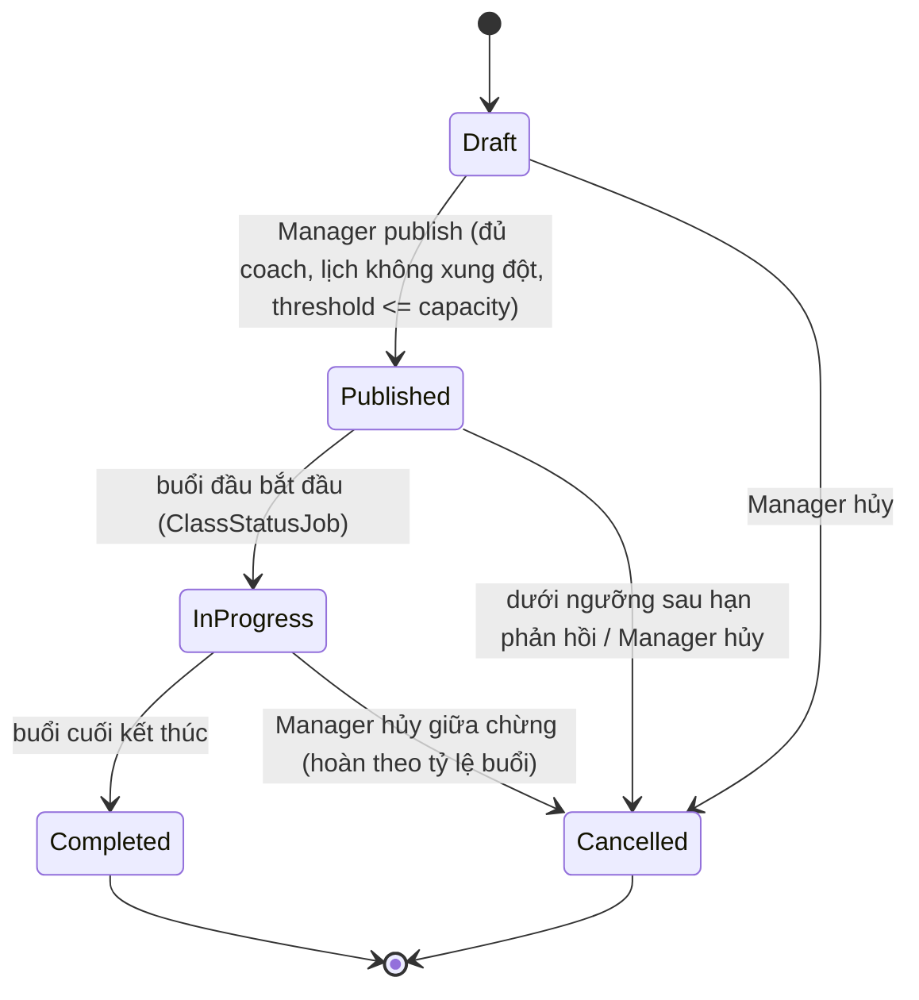
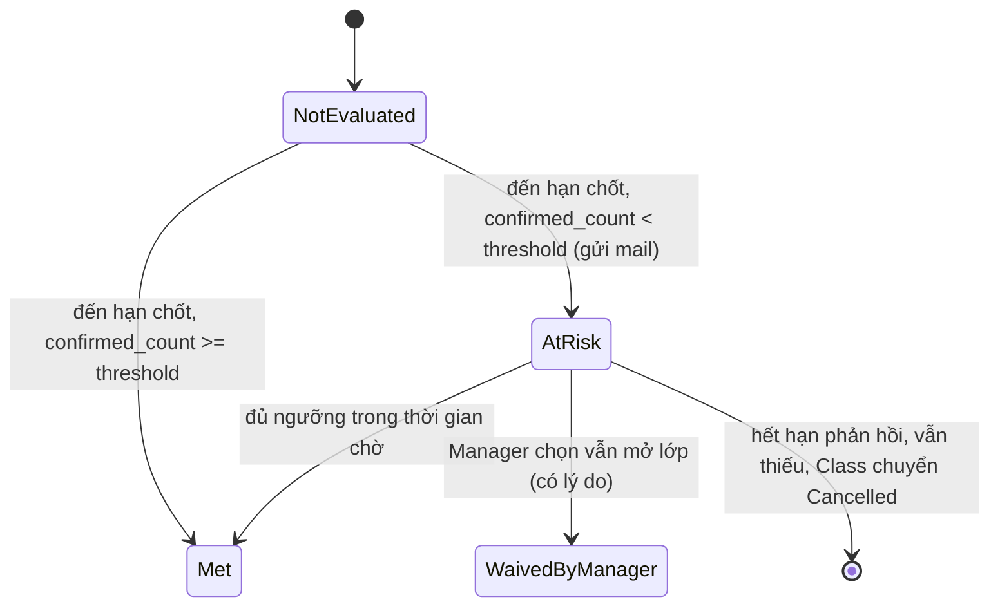
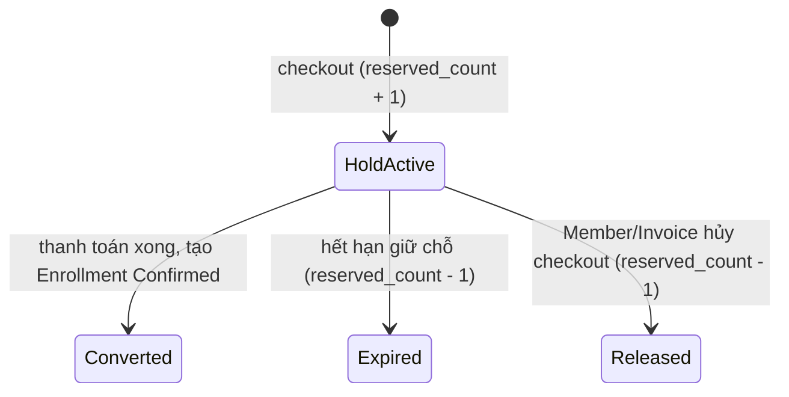
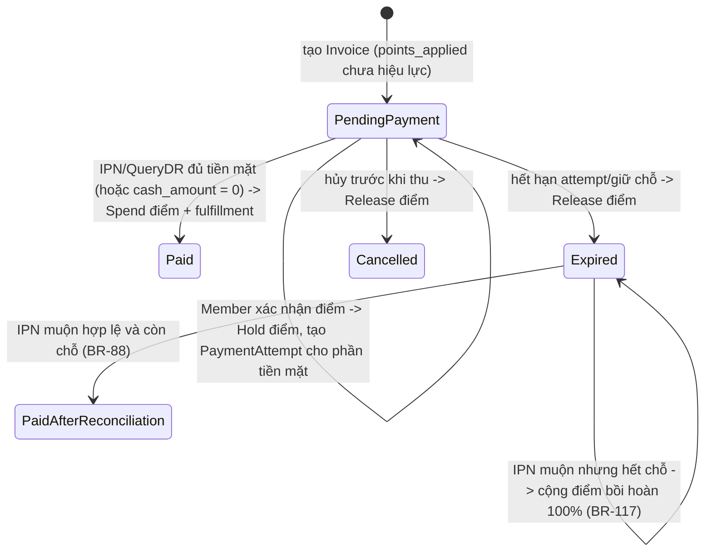
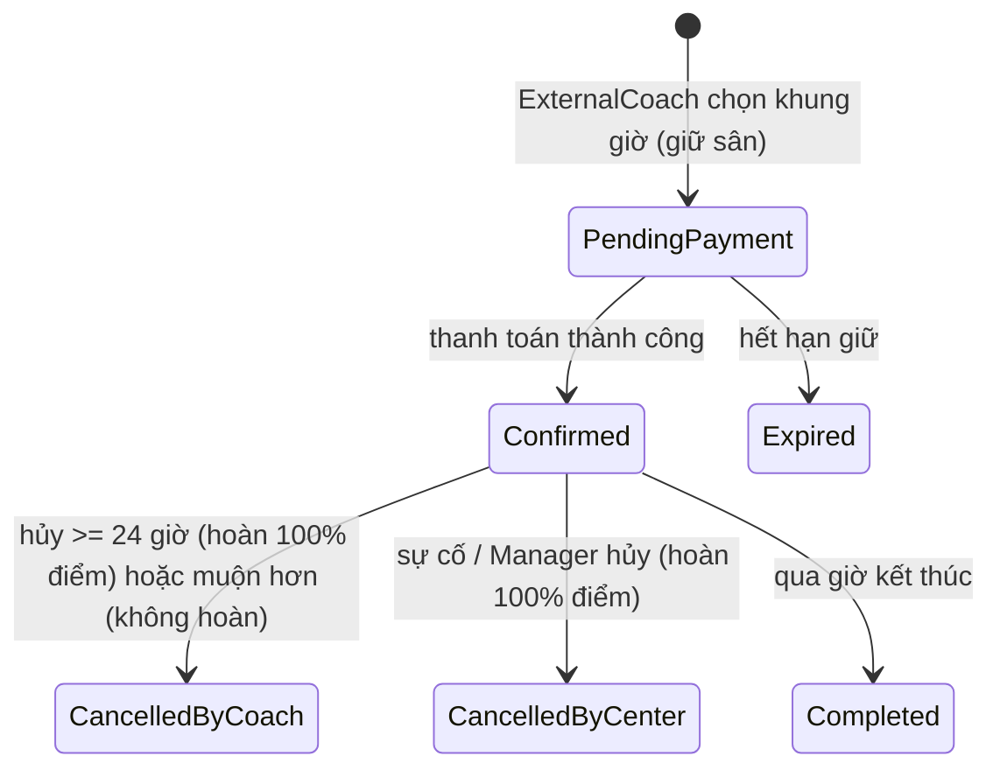
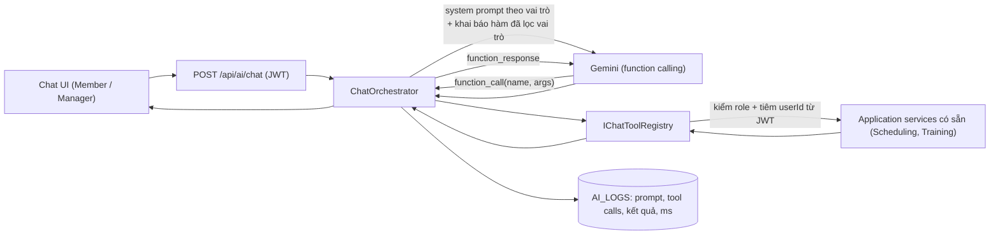
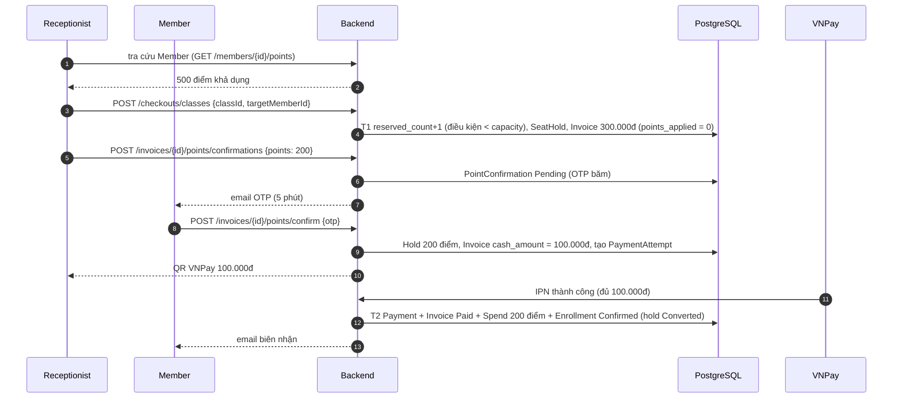
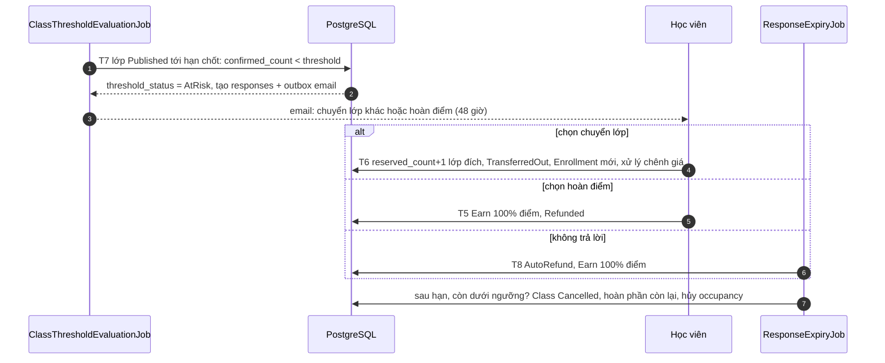

# SportHub — Design v3: Nhà văn hóa thể thao đa môn

> **Trạng thái:** bản thiết kế mục tiêu, soạn và **chốt 30/09/2026** (các quyết định ở Mục 19.2 đã được người dùng xác nhận hoặc chọn theo best practice), thay thế `Center-Management-System-Design-v2.md`. Mục 20–23 (Phụ lục A–D) liệt kê **từng file Xóa / Giữ / Sửa / Thêm** để viết plan refactor.
> **Nguồn nghiệp vụ:** `SportManagement_BusinessRules_v2.0` (BR-1 → BR-139). Nếu tài liệu này và Business Rules v2.0 mâu thuẫn, Business Rules thắng; cập nhật lại tài liệu này rồi mới code.
> **Đổi phạm vi (feedback giảng viên):** hệ thống không còn là một phòng gym. Đây là một **nhà văn hóa thể thao**: nhiều môn, nhiều sân/phòng, khóa học theo lớp, huấn luyện viên của trung tâm và huấn luyện viên tự do thuê sân.

---

## 0. Tóm tắt thay đổi so với Design v2

| # | Thay đổi | Ảnh hưởng chính |
|---|---|---|
| 1 | Môn thể thao là dữ liệu cấu hình (`SPORTS`, CRUD bởi Manager); bỏ Yoga/Group X, thêm Cầu lông, Bóng rổ; giữ Gym và PT | Bỏ `Class.discipline` dạng chuỗi; thêm `Sport`, `RoomType` |
| 2 | Lớp Cầu lông/Bóng rổ là **khóa học cố định** (Cầu lông 01, 02…), ghi danh cả khóa, mua gói của đúng lớp đó | `Class` đổi nghĩa; `Enrollment` gắn `class_id` thay vì `session_id`; bỏ recurrence-per-session booking |
| 3 | Membership chỉ cho Gym (+ điều kiện mua PT), không liên quan lớp nhóm | Bỏ kiểm tra Membership khi ghi danh lớp |
| 4 | Giữ chỗ khi checkout + chống bán vượt sĩ số | `SEAT_HOLDS`, `classes.reserved_count`, job hết hạn giữ chỗ |
| 5 | Ngưỡng hoàn vốn: chốt trước khai giảng N ngày, mail cho học viên chọn chuyển lớp/hoàn điểm | `classes.cost_amount/break_even_threshold`, `CLASS_THRESHOLD_RESPONSES`, 2 job |
| 6 | Vai trò thứ 6 `ExternalCoach` + thuê sân theo giờ | `EXTERNAL_COACH_PROFILES`, `COURT_RENTALS`, `COURT_RATES`, `INCIDENT_NOTICES` |
| 7 | Coach phân loại theo môn (`CoachSpecialty`) thay cho `CoachCategory` | Bỏ `PersonalTrainer/ClassInstructor` |
| 8 | Ví điểm, hoàn trả bằng điểm, **không hoàn tiền mặt**, split payment (điểm + VNPay), Receptionist thanh toán thay có Member xác nhận | `POINT_WALLETS`, `POINT_LEDGER`, `POINT_CONFIRMATIONS`; `REFUNDS` đổi thành hoàn điểm; không có hoàn tiền qua cổng; VNPay-QR thu tiền là phần viết mới |
| 9 | Chống trùng sân/coach bằng ràng buộc DB duy nhất | `ROOM_OCCUPANCIES`, `COACH_OCCUPANCIES` với exclusion constraint |
| 10 | Điểm danh lớp nhóm do Receptionist; No-show chỉ còn cho PT; bỏ booking restriction | `ATTENDANCE` chỉ Present/Absent cho lớp; bỏ job tính restriction |
| 11 | Chatbot function calling (Member xem lịch hôm nay; Manager gợi ý xếp lịch) | Module AI thêm tool registry; `AI_LOGS` ghi tool call |
| 12 | Mật khẩu mạnh + quên mật khẩu không hỏi mật khẩu cũ | `EMAIL_OTPS.purpose`, `user_accounts.security_stamp` |

---

## 1. Phạm vi và các Flow

### 1.1 Bộ môn khởi tạo (seed, sau đó Manager tự thêm/sửa)

| Sport | `operation_type` | Cách vận hành | Thực thể chính |
|---|---|---|---|
| Gym | `WalkIn` | Ra vào tự do, Receptionist ghi check-in/out; cần Membership Active (BR-64) | `GYM_CHECKINS` |
| Personal Training | `OneOnOne` | 1 Coach : 1 Member, 90 phút, quota trong Membership (BR-70→77) | `PT_ENTITLEMENTS`, `PT_SESSIONS`, `WORKOUT_RESULTS` |
| Cầu lông | `GroupCourse` | Khóa học cố định, ví dụ Cầu lông 01/02/03, mua gói của lớp | `CLASSES`, `CLASS_SESSIONS`, `ENROLLMENTS` |
| Bóng rổ | `GroupCourse` | Như Cầu lông | như trên |

### 1.2 Flow đề bài và ánh xạ mới

| Flow | Loại | Nội dung sau khi đổi phạm vi |
|---|---|---|
| 1 — User & Membership | Bắt buộc | Tài khoản 6 vai trò, Coach + chuyên môn, ExternalCoach tự đăng ký/duyệt, Membership Gym, Gym check-in, mật khẩu/quên mật khẩu |
| 2 — Class booking & schedule | Bắt buộc | Môn/Phòng/Sân, lớp theo khóa, ghi danh + giữ chỗ, ngưỡng hoàn vốn, Court Schedule, thuê sân của ExternalCoach, điểm danh |
| 3 — Payment & report | Bắt buộc | Invoice nhiều loại item, VNPay-QR, ví điểm + split payment, hoàn điểm, báo cáo theo môn/nguồn |
| 4 — Training & attendance | Optional (nhóm làm) | PT: kế hoạch, kết quả, homework, điểm danh. Lớp 1:1 ghi kết quả; lớp nhóm chỉ điểm danh |
| 5 — AI workout recommendation | Optional (nhóm làm) | Giữ, chỉ Coach có chuyên môn PT |
| 6 — AI assistant | Nhóm làm | Chatbot function calling cơ bản (BR-123/124) |

### 1.3 Ngoài phạm vi (giữ và bổ sung)

Đa chi nhánh; payroll và hợp đồng nhân sự (BR-101, kể cả chia doanh thu với coach ngoài); hoàn tiền mặt/chuyển khoản và VNPay Refund API (BR-135); cổng thanh toán production; mobile app; gói dịch vụ bổ sung (thêm thời gian/ngày tập — hoãn); quản lý học viên riêng của ExternalCoach; Waitlist.

---

## 2. Bản đồ giữ / sửa / xóa

Đánh giá ở mức module và entity dựa trên cấu trúc mã hiện tại (`backend/SportHub.*`, 39 entity, migration đến `20260929010712_AddPtTrainingDomain`). Rà từng file sẽ làm khi vào từng giai đoạn triển khai.

### 2.1 Theo module

| Module | Quyết định | Chi tiết |
|---|---|---|
| `SportHub.BuildingBlocks` | **Giữ + thêm cổng** | Thêm các interface dùng chung giữa module để không tham chiếu chéo: `IPointWalletService` (Payment cung cấp, Scheduling gọi), `IOccupancyService`, `ISportCatalogReader`, `IClassEnrollmentFulfillment` (Payment gọi ngược Scheduling khi Invoice Paid), `IChatToolRegistry` port nếu cần; helper exclusion constraint |
| `SportHub.Identity` | **Sửa vừa** | Chứa luôn `ExternalCoachProfile` và `UserSportSpecialty` (không tạo module riêng). Thêm vai trò `ExternalCoach`, password policy (BR-102), forgot/reset/change password (BR-103/104), `security_stamp`, luồng đăng ký ExternalCoach + duyệt; Manager tạo Coach (BR-2) |
| `SportHub.Membership` | **Sửa nhẹ** | Giữ `MembershipPackage`, `MemberPackage`, renewal (BR-65), xóa mọi phụ thuộc lớp nhóm (Membership chỉ còn Gym + điều kiện mua PT). Không chứa catalog môn/phòng |
| `SportHub.Scheduling` | **Sửa nặng / viết lại lõi** | Chứa luôn **catalog Sport/RoomType/Room/giờ hoạt động/block/CourtRate** (thư mục `Catalog/` trong module, không tách project). Giữ `Room`, `GymCheckIn`, `Attendance` (sửa). Viết lại `Class`, `ClassSession`, `Enrollment`; xóa `ClassRecurrence` kiểu cũ, logic Morning/Afternoon, daily limit, booking restriction, cancel 30 phút. Thêm `SeatHold`, occupancy, threshold, rental |
| `SportHub.Training` | **Giữ + sửa nhẹ** | Toàn bộ PT/Workout/Homework giữ. Đổi kiểm tra `CoachCategory = PersonalTrainer` thành `CoachSpecialty` chứa môn `OneOnOne`. Thêm `room_id` tùy chọn cho `PtSession` |
| `SportHub.Payment` | **Sửa nặng / viết mới cổng thanh toán** | **Kiểm tra mã hiện tại: chưa có VNPay** (không có client, IPN, QueryDR, return URL; `PaymentAttempt` mới chỉ là entity, chưa có service dùng). Hiện thanh toán = Receptionist ghi nhận thủ công (`PaymentRecordingService`) + `PaymentAdjustment` (refund/correction/discount có duyệt) + `RefundCalculator`. Giữ Invoice/InvoiceItem/Payment/InvoiceMath/RevenueReport/InvoiceNumberGenerator. **Thêm mới**: `Wallet/` (ví điểm, ledger, xác nhận OTP — đặt trong Payment, không tách project), `VnPay/` (`IPaymentGateway` với `VnPayGateway` và `MockPaymentGateway` cho demo khi thiếu khóa sandbox; IPN, return, QueryDR, đối soát), item loại `ClassPackage`/`CourtRental`. Bỏ refund tiền mặt: `PaymentAdjustment.Refund` + `RefundPayoutEvidence` chuyển thành hoàn điểm |
| `SportHub.AI` | **Giữ + mở rộng** | Đã có `AiChatService`, `GeminiAiChatProvider`, `SportHubAiContextBuilder`, `WorkoutRecommendationService`, `RuleBasedAiRecommendationService`. Mở rộng `IAiChatProvider` sang function calling, thêm `ChatToolRegistry` + tools; giữ rule-based làm fallback khi thiếu khóa Gemini |
| `SportHub.Notification` | **Giữ + mở rộng** | Outbox đã có; `SmtpEmailSender` và `LoggingEmailSender` (fallback log) đã có ở Identity/BuildingBlocks. Thêm loại sự kiện mới (Mục 14) |
| `SportHub.Audit` | **Giữ** | Thêm action code mới |
| `SportHub.Administration` | **Giữ + thêm nhẹ** | Giữ `UsersController`, `SystemSettings`, `AuditLogs`, `ReportExports`. Thêm màn duyệt ExternalCoach nếu không đặt ở Identity; thêm khóa `system_settings` mới. **Không** chứa catalog Sport/Room |
| `SportHub.API` (host, Jobs) | **Sửa** | `AttendanceFinalizerJob` chỉ còn PT; thêm 5 job mới (Mục 8); giữ `MemberPackageExpiryJob` |
| `frontend` (Next.js) | **Sửa nặng** | Landing page đa môn, trang lớp/khóa học, Court Schedule, thuê sân, ví điểm, dashboard theo vai trò (Mục 12) |

### 2.2 Theo entity

| Entity hiện có | Quyết định | Ghi chú |
|---|---|---|
| `Role`, `UserAccount`, `UserCredential`, `UserProfile`, `UserExternalLogin`, `GoogleOnboardingTicket` | **Giữ**; `Role` seed thêm `ExternalCoach`; `UserAccount` thêm `security_stamp` | |
| `EmailOtp` | **Sửa** | Thêm cột `purpose` (Register, ResetPassword, ExternalCoachRegister) |
| `CoachProfile` | **Sửa** | Bỏ `coach_category`; thêm `bio` |
| `CoachMemberRelationship` | **Giữ** | Điều kiện tạo: Coach có specialty PT |
| `MemberTrainingProfile` | **Giữ** | |
| `MembershipPackage`, `MemberPackage` | **Giữ** | |
| `Room` | **Sửa** | Thêm `room_type_id`, `is_active` |
| `Class` | **Viết lại** | Xem Mục 4 |
| `ClassRecurrence` | **Sửa hoặc thay** | Thay bằng `class_schedule_rules` (thứ trong tuần + giờ bắt đầu) |
| `ClassSession` | **Sửa nặng** | Bỏ `capacity`, `baseline_capacity`, `confirmed_count` (chuyển lên `Class`) |
| `Enrollment` | **Viết lại** | Gắn `class_id`; bỏ `session_id`, `member_package_id` |
| `Attendance` | **Sửa** | Khóa duy nhất `(enrollment_id, session_id)`; lớp nhóm chỉ Present/Absent |
| `GymCheckIn` | **Giữ**, thêm `check_out_time` nếu chưa có (BR-64) | |
| `PtEntitlement`, `PtSession`, `PtSessionChangeRequest`, `PtCoachChangeRequest`, `WorkoutPlan`, `WorkoutPlanItem`, `WorkoutResult`, `HomeworkAssignment`, `HomeworkAssignmentItem` | **Giữ** | `PtSession` thêm `room_id` nullable |
| `Invoice`, `InvoiceItem`, `PaymentAttempt`, `Payment` | **Sửa nhẹ** | Xem Mục 4.5 |
| `PaymentAdjustment` | **Sửa** | Giữ workflow Request→Approve→Complete/Reject; `Refund` trả bằng điểm (Complete = ghi `PointLedger.Earn`); bỏ trường/logic chi trả tiền mặt (`RefundPayoutEvidence`); `Discount`, `Correction` giữ nếu còn dùng, nếu không thì xóa enum tương ứng |
| `Refund` (bảng refunds, nếu tách khỏi `PaymentAdjustment`) | **Sửa nặng** | Đổi thành hoàn điểm; nếu mã hiện tại chỉ dùng `PaymentAdjustment` thì gộp vào đó, không tạo bảng mới |
| `Notification`, `AuditLog`, `AiLog`, `SystemSetting`, `ReportExport` | **Giữ**, mở rộng enum/khóa | |

**Xóa hoàn toàn:** enum `CoachCategory`; enum giá trị Yoga/GroupX trong mọi seed/test; cột `Class.Discipline` (chuỗi); mọi mã kiểm tra daily booking, Morning/Afternoon slot, cancel 30 phút, booking restriction 7 ngày; logic chi trả tiền mặt của `PaymentAdjustment` và cột `RefundPayoutEvidence` (thêm ở migration `AddRefundPayoutEvidence`; xóa bằng migration mới, không sửa migration cũ). VNPay Refund client **không tồn tại** nên không có gì để xóa.

**Thêm mới:** `Sport`, `RoomType`, `SportRoomType`, `RoomOpeningHour`, `RoomBlock`, `IncidentNotice`, `CourtRate`, `UserSportSpecialty`, `ExternalCoachProfile`, `SeatHold`, `ClassThresholdResponse`, `CourtRental`, `RoomOccupancy`, `CoachOccupancy`, `PointWallet`, `PointLedgerEntry`, `PointConfirmation`.

### 2.3 Chiến lược migration

Dự án đang ở giai đoạn phát triển, dữ liệu là dữ liệu demo. Đề xuất một migration lớn `RefactorToMultiSport` (không sửa migration cũ), làm theo thứ tự:

1. Tạo bảng mới và extension `btree_gist`.
2. Xóa bảng và cột thuộc mô hình lớp cũ (`classes`, `class_sessions`, `enrollments`, `attendance` cho lớp, `class_recurrence`), tạo lại theo Mục 4.
3. Đổi `refunds` sang mô hình điểm; thêm cột điểm vào `invoices`.
4. Seed: 6 role, 4 sport, room type, room mẫu, giờ hoạt động, giá thuê sân, `system_settings` mới.
5. Ghi chú: dữ liệu Payment/Invoice demo (ghi nhận tay) được giữ; chỉ dữ liệu lớp/đăng ký cũ bị bỏ. VNPay là phần **viết mới hoàn toàn**.

Nếu nhóm cần giữ dữ liệu cũ thì thêm bước script chuyển đổi, nhưng không khuyến nghị vì mô hình ghi danh khác bản chất (theo buổi → theo khóa).

---

## 3. Kiến trúc

Giữ modular monolith ASP.NET Core + PostgreSQL + Next.js (3 service `docker-compose`), không thêm Redis/RabbitMQ (BR-34). Các thay đổi:

| Thành phần | Thay đổi |
|---|---|
| PostgreSQL | Bật extension `btree_gist` để dùng exclusion constraint chống trùng lịch |
| Background jobs | Thêm `SeatHoldExpiryJob`, `ClassThresholdEvaluationJob`, `ClassThresholdResponseExpiryJob`, `ClassStatusJob`, `RentalStatusJob`. Chạy bằng cơ chế `PeriodicJob` sẵn có, mỗi job idempotent và dùng khóa cấp hàng khi cập nhật |
| Email | Outbox `notifications` (channel Email) đã có; thêm template cho các sự kiện mới |
| AI | `SportHub.AI` mở rộng `AiChatService` với tool registry (Mục 11) |
| Module hóa (đã chốt) | **Không thêm project mới.** Ví điểm nằm trong `SportHub.Payment/Wallet`; catalog môn/phòng/giá sân nằm trong `SportHub.Scheduling/Catalog`; `ExternalCoachProfile` nằm trong `SportHub.Identity`. Module chỉ gọi nhau qua interface đặt ở `BuildingBlocks` |
| Cổng thanh toán | `IPaymentGateway`: `VnPayGateway` (sandbox, đọc `VnPay__TmnCode/HashSecret`) và `MockPaymentGateway` (mặc định khi thiếu khóa: tạo QR giả, endpoint dev `POST /api/dev/payments/{attemptId}/succeed` để demo IPN) |
| Email | `SmtpEmailSender` nếu có `Email__*`, nếu thiếu dùng `LoggingEmailSender` (ghi nội dung email vào log, đủ để demo OTP) — cả hai đã có trong mã |
| LLM | `GeminiAiChatProvider` nếu có `Gemini__ApiKey`; thiếu khóa thì `MockChatProvider`/rule-based trả lời theo kịch bản cố định để demo 2 use case của chatbot |
| Nguyên tắc | Mọi thao tác ghi lịch (buổi lớp, buổi PT, lượt thuê, khóa sân) đi qua `IOccupancyService` để ghi `room_occupancies` và `coach_occupancies` trong cùng transaction nghiệp vụ |

---

## 4. ERD v3

Quy ước: tên cột DB `snake_case`, property C# `PascalCase` (SSOT §5.4); tiền là `decimal` VND; thời điểm lưu UTC `timestamptz`; điểm là `int`. Mục này chỉ liệt kê đầy đủ field cho **thực thể mới hoặc đổi**; thực thể giữ nguyên xem `entity-field-purpose.md` và ERD v2.

### 4.1 Sơ đồ quan hệ (rút gọn)

```mermaid
erDiagram
    ROLES ||--o{ USER_ACCOUNTS : has
    USER_ACCOUNTS ||--o| COACH_PROFILES : "Coach"
    USER_ACCOUNTS ||--o| EXTERNAL_COACH_PROFILES : "ExternalCoach"
    USER_ACCOUNTS ||--o{ USER_SPORT_SPECIALTIES : "coach/external"
    SPORTS ||--o{ USER_SPORT_SPECIALTIES : "taught by"
    SPORTS ||--o{ SPORT_ROOM_TYPES : "played in"
    ROOM_TYPES ||--o{ SPORT_ROOM_TYPES : ""
    ROOM_TYPES ||--o{ ROOMS : "typed"
    ROOM_TYPES ||--o{ COURT_RATES : "priced"
    ROOMS ||--o{ ROOM_OPENING_HOURS : "opens"
    ROOMS ||--o{ ROOM_BLOCKS : "blocked"
    INCIDENT_NOTICES ||--o{ ROOM_BLOCKS : "causes"

    SPORTS ||--o{ CLASSES : "offered as"
    ROOMS ||--o{ CLASSES : "default room"
    USER_ACCOUNTS ||--o{ CLASSES : "coach"
    CLASSES ||--o{ CLASS_SCHEDULE_RULES : "weekly pattern"
    CLASSES ||--o{ CLASS_SESSIONS : "sessions"
    CLASSES ||--o{ ENROLLMENTS : "enrolled"
    CLASSES ||--o{ SEAT_HOLDS : "held"
    CLASSES ||--o{ CLASS_THRESHOLD_RESPONSES : "at risk"
    ENROLLMENTS ||--o{ ATTENDANCE : "per session"
    CLASS_SESSIONS ||--o{ ATTENDANCE : "per enrollment"
    ENROLLMENTS ||--o| CLASS_THRESHOLD_RESPONSES : "member choice"

    USER_ACCOUNTS ||--o{ COURT_RENTALS : "external coach rents"
    ROOMS ||--o{ COURT_RENTALS : "rented"
    CLASS_SESSIONS ||--|| ROOM_OCCUPANCIES : "occupies (source)"
    PT_SESSIONS ||--o| ROOM_OCCUPANCIES : "occupies (optional)"
    COURT_RENTALS ||--|| ROOM_OCCUPANCIES : "occupies"
    ROOM_BLOCKS ||--|| ROOM_OCCUPANCIES : "occupies"
    CLASS_SESSIONS ||--|| COACH_OCCUPANCIES : "coach busy"
    PT_SESSIONS ||--|| COACH_OCCUPANCIES : "coach busy"

    INVOICES ||--o{ INVOICE_ITEMS : "items"
    INVOICES ||--o{ PAYMENT_ATTEMPTS : "cash retries"
    INVOICES ||--o{ PAYMENTS : "cash success"
    INVOICES ||--o{ POINT_CONFIRMATIONS : "points confirm"
    INVOICE_ITEMS ||--o{ REFUNDS : "points refund"
    USER_ACCOUNTS ||--|| POINT_WALLETS : "owns"
    POINT_WALLETS ||--o{ POINT_LEDGER : "entries"
    INVOICES ||--o{ POINT_LEDGER : "hold/spend"
    REFUNDS ||--o{ POINT_LEDGER : "earn"
```

### 4.2 Danh mục và cơ sở vật chất

**`SPORTS`** (BR-106, BR-107)

| Cột | Kiểu | Ghi chú |
|---|---|---|
| `sport_id` | int PK | |
| `name` | text, UK trên `LOWER(name)` | |
| `operation_type` | enum `SportOperationType` | `WalkIn`, `OneOnOne`, `GroupCourse` |
| `default_session_minutes` | int null | bắt buộc khi `GroupCourse` (Cầu lông 90, Bóng rổ 120 là gợi ý seed) |
| `default_max_capacity` | int null | bắt buộc khi `GroupCourse` |
| `description`, `image_url` | text null | hiển thị landing page |
| `sort_order` | int | |
| `is_active` | bool | ngừng hoạt động thay cho xóa cứng |

**`ROOM_TYPES`** (`room_type_id`, `name` UK) và **`SPORT_ROOM_TYPES`** (`sport_id`, `room_type_id`, PK ghép) cho biết môn nào chơi được ở loại sân/phòng nào (BR-108). Seed: Phòng Gym, Phòng PT, Sân cầu lông, Sân bóng rổ.

**`ROOMS`** giữ `room_id`, `name` (UK, BR-57), `capacity`; thêm `room_type_id` FK, `is_active`.

**`ROOM_OPENING_HOURS`** (`room_id`, `day_of_week` 0–6, `open_time_local`, `close_time_local`; PK ghép) — BR-109. Múi giờ cố định `Asia/Ho_Chi_Minh`.

**`ROOM_BLOCKS`** (`block_id`, `room_id`, `start_at_utc`, `end_at_utc`, `reason`, `incident_id` null, `created_by_user_id`) — khung giờ khóa vì bảo trì, sự kiện hoặc sự cố. Mỗi block có một dòng `room_occupancies`.

**`INCIDENT_NOTICES`** (`incident_id`, `scope_type` `Room|Center`, `room_id` null, `start_at_utc`, `end_at_utc`, `reason`, `created_by_user_id`, `created_at`) — BR-130.

**`COURT_RATES`** (`rate_id`, `room_type_id`, `days_of_week` string `MON,TUE…`, `start_time_local`, `end_time_local`, `price_per_hour` decimal bội số 1.000, `is_active`) — giá thuê sân theo loại sân và khung giờ (BR-127). Khung giờ không được chồng nhau trong cùng `room_type_id` và ngày (kiểm tra ở service).

### 4.3 Người dùng và coach

**`USER_ACCOUNTS`** giữ nguyên, thêm `security_stamp` (uuid, đổi khi reset/đổi mật khẩu hoặc đổi vai trò). JWT mang claim `sst`; middleware so với DB nên phiên cũ bị vô hiệu ngay (BR-103/104).

**`EMAIL_OTPS`** thêm `purpose` enum `EmailOtpPurpose` (`Register`, `ResetPassword`, `ExternalCoachRegister`). Chính sách OTP như BR-78; reset dùng OTP 6 số (khuyến nghị) hoặc token tương đương đều lưu băm.

**`COACH_PROFILES`** (`user_id` PK/FK, `bio` null). Bỏ `coach_category`.

**`EXTERNAL_COACH_PROFILES`** (BR-105)

| Cột | Ghi chú |
|---|---|
| `user_id` PK/FK | 1–1 với `USER_ACCOUNTS` role ExternalCoach |
| `bio` | mô tả |
| `approval_status` | enum `ExternalCoachApprovalStatus`: `PendingApproval`, `Approved`, `Rejected`, `Suspended` |
| `reviewed_by_user_id`, `reviewed_at`, `review_note` | Manager duyệt/từ chối/đình chỉ; `review_note` bắt buộc khi Rejected/Suspended |

**`USER_SPORT_SPECIALTIES`** (`user_id`, `sport_id`; PK ghép, UK `(user_id, sport_id)`) — chuyên môn của Coach và môn giảng dạy khai báo của ExternalCoach (BR-96, BR-105). Hàm `CoachCanTeach(userId, sportId)` là điều kiện phân công lớp và chọn Coach PT.

### 4.4 Lịch, lớp, ghi danh

**`CLASSES`** (viết lại — BR-12, 111, 113, 116, 118, 119)

| Cột | Kiểu | Ghi chú |
|---|---|---|
| `class_id` | int PK | |
| `code` | text UK | ví dụ `CAULONG-01`; hiển thị tên "Cầu lông 01" ở `name` |
| `name` | text | |
| `sport_id` | int FK | `operation_type = GroupCourse` (kiểm tra ở service) |
| `coach_id` | uuid FK null | bắt buộc trước khi publish; phải có specialty khớp |
| `default_room_id` | int FK | |
| `start_date` | date | ngày buổi đầu |
| `num_sessions` | int | |
| `capacity` | int | `0 < capacity ≤ sports.default_max_capacity` (BR-51) |
| `price` | decimal | bội số 1.000 (BR-113) — giá gói lớp (`ClassPackage` = chính lớp) |
| `cost_amount` | decimal | Manager nhập tay (BR-118) |
| `break_even_threshold` | int null | `ceil(cost/price)`, snapshot khi publish |
| `threshold_status` | enum | `NotEvaluated`, `Met`, `AtRisk`, `WaivedByManager` |
| `threshold_deadline_utc` | timestamptz | `start_at của buổi đầu − N ngày` |
| `threshold_response_deadline_utc` | timestamptz null | đặt khi chuyển `AtRisk` |
| `status` | enum `ClassStatus` | `Draft`, `Published`, `InProgress`, `Completed`, `Cancelled` |
| `confirmed_count` | int | ghi danh `Confirmed` |
| `reserved_count` | int | `confirmed_count` + số `SEAT_HOLDS` đang `Active`; **chốt chặn overbooking** |
| `created_by_ai` | bool | lớp Draft do chatbot đề xuất (BR-123) |
| `version` | int | xử lý đồng thời |

**`CLASS_SCHEDULE_RULES`** (`rule_id`, `class_id`, `day_of_week`, `start_time_local`) — lịch lặp theo tuần; thời lượng lấy từ `sports.default_session_minutes` (BR-13). Sinh `CLASS_SESSIONS` khi publish.

**`CLASS_SESSIONS`** (sửa)

| Cột | Ghi chú |
|---|---|
| `session_id` uuid PK | |
| `class_id` FK, `session_no` int | UK `(class_id, session_no)` |
| `room_id`, `coach_id` | có thể khác mặc định khi Manager dời/đổi (BR-54) |
| `start_at_utc`, `end_at_utc` | |
| `status` | enum `ClassSessionStatus`: `Scheduled`, `Completed`, `Cancelled` |
| `rescheduled_from_session_id` | self FK null |
| `is_makeup` | bool — buổi bù thêm ở cuối lịch |

Bỏ `capacity`, `baseline_capacity`, `confirmed_count` khỏi session vì sĩ số thuộc lớp.

**`ENROLLMENTS`** (viết lại — BR-16, 110, 114)

| Cột | Ghi chú |
|---|---|
| `enrollment_id` uuid PK | |
| `class_id` FK, `member_id` FK | UK một phần `(class_id, member_id) WHERE status='Confirmed'` |
| `invoice_item_id` FK | InvoiceItem loại `ClassPackage` đã thanh toán |
| `status` | enum `EnrollmentStatus`: `Confirmed`, `TransferredOut`, `Refunded`, `CancelledByCenter` |
| `enrolled_at`, `ended_at` | |
| `source_enrollment_id` | self FK null — ghi danh này là kết quả chuyển lớp (BR-120) |

**`SEAT_HOLDS`** (BR-115)

| Cột | Ghi chú |
|---|---|
| `hold_id` uuid PK | |
| `class_id`, `member_id`, `invoice_id` | |
| `expires_at` | = hạn `PaymentAttempt`, tối đa `seat_hold_minutes` |
| `status` | `Active`, `Converted`, `Expired`, `Released` |

UK một phần `(class_id, member_id) WHERE status='Active'`.

**`CLASS_THRESHOLD_RESPONSES`** (BR-119→121)

| Cột | Ghi chú |
|---|---|
| `response_id` PK, `class_id`, `enrollment_id` (UK), `member_id` | |
| `token_hash` | liên kết bảo mật trong email |
| `deadline_utc` | hạn phản hồi (mặc định 48 giờ) |
| `choice` | enum `ThresholdChoice`: `Pending`, `Transfer`, `RefundPoints`, `AutoRefund` |
| `target_class_id` null, `transfer_invoice_id` null | khi chuyển lớp có chênh lệch giá |
| `resolved_at` null | |

**`ATTENDANCE`** (sửa): `attendance_id`, `enrollment_id`, `session_id`, `status` (`Present`, `Absent` cho lớp; PT có bảng riêng), `recorded_by_user_id`, `recorded_at`, `last_modified_at`. UK `(enrollment_id, session_id)` (BR-21). Sửa sau buổi ≤ 24 giờ, ghi Audit (BR-98).

**`GYM_CHECKINS`**: giữ; đảm bảo có `check_in_time`, `check_out_time` null, `checked_in_by_user_id` (BR-64).

**`PT_SESSIONS`**: thêm `room_id` int null (nếu có thì phát sinh `room_occupancies`). Trạng thái, quota và `WORKOUT_RESULTS` giữ nguyên.

### 4.5 Chống trùng lịch (BR-108, 112, 133)

Hai bảng "chiếm dụng" là nơi duy nhất database kiểm tra chồng chéo, vì PostgreSQL không cho exclusion constraint chạy chéo nhiều bảng.

**`ROOM_OCCUPANCIES`**: `occupancy_id`, `room_id`, `period tstzrange`, `source_type` (`ClassSession`, `PtSession`, `CourtRental`, `RoomBlock`), `source_id` text, `is_active` bool.
`EXCLUDE USING gist (room_id WITH =, period WITH &&) WHERE (is_active)`.

**`COACH_OCCUPANCIES`**: `occupancy_id`, `coach_id` uuid (Coach hoặc ExternalCoach), `period tstzrange`, `source_type` (`ClassSession`, `PtSession`, `CourtRental`), `source_id`, `is_active`.
`EXCLUDE USING gist (coach_id WITH =, period WITH &&) WHERE (is_active)`.

Quy tắc dùng: tạo/dời/hủy buổi hoặc lượt thuê phải ghi hoặc vô hiệu hóa (`is_active=false`) dòng tương ứng cùng transaction; vi phạm exclusion trả `23P01` và service ánh xạ thành `409 conflict` kèm mô tả xung đột (BR-112).

### 4.6 Thuê sân

**`COURT_RENTALS`** (BR-126→133)

| Cột | Ghi chú |
|---|---|
| `rental_id` uuid PK | |
| `external_coach_id` FK, `room_id` FK | |
| `start_at_utc`, `end_at_utc` | bội số 60 phút, tối đa `rental_max_hours`, trong giờ hoạt động |
| `hourly_rate_snapshot`, `total_amount` | snapshot từ `COURT_RATES` |
| `status` | enum `CourtRentalStatus`: `PendingPayment`, `Confirmed`, `Expired`, `CancelledByCoach`, `CancelledByCenter`, `Completed` |
| `hold_expires_at` | khi `PendingPayment` |
| `invoice_id` FK | InvoiceItem `CourtRental` |
| `expected_attendees` int null | Coach khai báo (BR-131) |
| `cancelled_at`, `cancel_reason` | |

`PendingPayment` và `Confirmed` giữ dòng `room_occupancies` và `coach_occupancies`; `Expired`/hủy vô hiệu hóa chúng.

### 4.7 Thanh toán, điểm, hoàn trả

**`INVOICES`** (sửa)

| Cột mới/đổi | Ghi chú |
|---|---|
| `beneficiary_user_id` (đổi tên từ `beneficiary_member_id`) | Member hoặc ExternalCoach |
| `points_applied` int default 0 | điểm dùng thanh toán (BR-136) |
| `cash_amount` decimal | `total_amount − points_applied × 1000` |
| `paid_via` | enum `InvoicePaidVia`: `Vnpay`, `Points`, `Mixed` (null khi chưa Paid) |
| `hold_expires_at` | hạn giữ chỗ/điểm của checkout |

Trạng thái `InvoiceStatus` giữ nguyên (Mục 5). Khi `cash_amount = 0` thì không tạo `PAYMENT_ATTEMPTS`; Invoice chuyển `Paid` ngay trong transaction fulfillment (BR-85).

**`INVOICE_ITEMS`**: `item_type` mở rộng `Membership`, `PT`, `ClassPackage`, `CourtRental`; `related_entity_id` trỏ `class_id` hoặc `rental_id`.

**`PAYMENT_ATTEMPTS`, `PAYMENTS`**: giữ; `amount` = phần tiền mặt của Invoice.

**`POINT_WALLETS`** (BR-134): `wallet_id`, `owner_user_id` UK, `available_points` int ≥ 0, `held_points` int ≥ 0, `version`. Tạo tự động khi tạo tài khoản Member/ExternalCoach.

**`POINT_LEDGER`** (Point Transaction, chỉ ghi thêm)

| Cột | Ghi chú |
|---|---|
| `entry_id` PK, `wallet_id` FK | |
| `entry_type` | enum `PointEntryType`: `Earn`, `Hold`, `Release`, `Spend`, `Adjustment` |
| `points` | số dương; chiều tăng/giảm suy ra từ `entry_type` |
| `available_after`, `held_after` | số dư sau giao dịch |
| `reference_type`, `reference_id` | `RefundRequest`, `SystemEvent`, `Invoice`, `ManagerAdjustment` |
| `invoice_id` null, `created_by_user_id`, `reason` | |

UK `(reference_id, entry_type)` để idempotent (BR-94). Không UPDATE/DELETE (chặn bằng trigger hoặc quyền DB).

**`POINT_CONFIRMATIONS`** (BR-139): `confirmation_id`, `invoice_id`, `member_id`, `requested_by_user_id` (Receptionist), `points`, `otp_hash`, `expires_at` (5 phút), `failed_attempts` (tối đa 5), `status` (`Pending`, `Confirmed`, `Expired`, `Failed`, `Cancelled`), `confirmed_at`, `confirmed_via` (`Otp` cho quầy; `MemberSession` khi Member tự checkout đã đăng nhập — không cần tạo hàng OTP).

**`REFUNDS`** (đổi sang hoàn điểm — BR-90→94, 122): `refund_id`, `invoice_item_id`, `requested_by_user_id`, `approved_by_user_id` null, `reason`, `center_fault` bool, `system_calculated_points`, `approved_points`, `status` (`Requested`, `Approved`, `Rejected`, `Completed`), `point_ledger_entry_id` null, `requested_at`, `completed_at`. Bỏ `vnp_request_id`, `payment_id`. Hoàn do hệ thống (hủy lớp, dưới ngưỡng, hủy sân) không tạo `REFUNDS` mà ghi thẳng `POINT_LEDGER` với `reference_type = SystemEvent`.

### 4.8 Cấu hình `SYSTEM_SETTINGS` mới

| Khóa | Mặc định | BR |
|---|---|---|
| `class.threshold_days_before_start` | 3 | 119 |
| `class.threshold_response_hours` | 48 | 120 |
| `hold.minutes` | 15 | 115 |
| `points.vnd_per_point` | 1000 | 134 |
| `points.confirm_otp_minutes` | 5 | 139 |
| `rental.slot_minutes` | 60 | 126 |
| `rental.max_hours` | 4 | 128 |
| `rental.advance_days` | 30 | 128 |
| `rental.cancel_free_hours` | 24 | 129 |
| `membership.expiry_notice_days` | 7 | 33 |

---

## 5. Enum v3 (bổ sung/đổi so với SSOT §3)

| Enum | Giá trị |
|---|---|
| `UserRole` | `SystemAdministrator`, `CenterManager`, `Coach`, `ExternalCoach`, `Member`, `Receptionist` |
| `SportOperationType` | `WalkIn`, `OneOnOne`, `GroupCourse` |
| `ExternalCoachApprovalStatus` | `PendingApproval`, `Approved`, `Rejected`, `Suspended` |
| `EmailOtpPurpose` | `Register`, `ResetPassword`, `ExternalCoachRegister` |
| `ClassStatus` | `Draft`, `Published`, `InProgress`, `Completed`, `Cancelled` |
| `ThresholdStatus` | `NotEvaluated`, `Met`, `AtRisk`, `WaivedByManager` |
| `ClassSessionStatus` | `Scheduled`, `Completed`, `Cancelled` |
| `EnrollmentStatus` | `Confirmed`, `TransferredOut`, `Refunded`, `CancelledByCenter` |
| `SeatHoldStatus` | `Active`, `Converted`, `Expired`, `Released` |
| `ThresholdChoice` | `Pending`, `Transfer`, `RefundPoints`, `AutoRefund` |
| `AttendanceStatus` (lớp nhóm) | `Present`, `Absent` (PT có `PtSessionStatus` riêng, giữ `NoShow`) |
| `CourtRentalStatus` | `PendingPayment`, `Confirmed`, `Expired`, `CancelledByCoach`, `CancelledByCenter`, `Completed` |
| `OccupancySourceType` | `ClassSession`, `PtSession`, `CourtRental`, `RoomBlock` |
| `InvoiceItemType` | `Membership`, `PT`, `ClassPackage`, `CourtRental` |
| `InvoicePaidVia` | `Vnpay`, `Points`, `Mixed` |
| `PointEntryType` | `Earn`, `Hold`, `Release`, `Spend`, `Adjustment` |
| `PointConfirmationStatus` | `Pending`, `Confirmed`, `Expired`, `Failed`, `Cancelled` |
| `RefundStatus` | `Requested`, `Approved`, `Rejected`, `Completed` |
| `NotificationSourceEventType` | thêm: `ClassThresholdAtRisk`, `ClassTransferResult`, `ClassCancelledByCenter`, `PointsCredited`, `RentalConfirmed`, `RentalCancelled`, `IncidentNotice`, `ExternalCoachDecision`, `PasswordChanged`, `PointConfirmationOtp`, `PasswordResetOtp` |
| Xóa | `CoachCategory` |

---

## 6. State machine

### 6.1 Class và ngưỡng hoàn vốn

### 6.2 Ghi danh và giữ chỗ

`Enrollment`: `Confirmed → TransferredOut` (chuyển lớp, BR-120) `| Refunded` (hoàn điểm, BR-122) `| CancelledByCenter` (lớp bị hủy, BR-121). Trạng thái cuối là bất biến.

### 6.3 Invoice có điểm (split payment)

### 6.4 Lượt thuê sân

### 6.5 Hoàn trả bằng điểm

`REFUNDS`: `Requested → Approved → Completed` hoặc `Requested → Rejected`. Approved và Completed xảy ra trong cùng một transaction: cộng điểm, hủy quyền lợi, giải phóng chỗ/quota (BR-93). Không còn Processing/Failed/ReconciliationRequired của refund.

### 6.6 ExternalCoach

`PendingApproval → Approved | Rejected`; `Approved ↔ Suspended`. Chỉ `Approved` tạo được `COURT_RENTALS`.

### 6.7 Giữ nguyên

`MemberPackage`, `PtEntitlement`, `PtSession`, change request, `HomeworkAssignment`, `PaymentAttempt`: như Design v2 §2.4–2.5 và SSOT §4.

---

## 7. Ràng buộc và transaction bắt buộc ở tầng DB

Các literal trạng thái là ký hiệu nghiệp vụ; migration dùng biểu diễn enum thực tế của EF Core (SSOT §3). Ký hiệu **[đổi]** = khác Design v2, **[mới]** = thêm mới, **[bỏ]** = ràng buộc cũ không còn.

### 7.1 Danh sách ràng buộc

| # | Ràng buộc | Cơ chế |
|---|---|---|
| 1 [đổi] | Không ghi danh trùng cùng một lớp | `UNIQUE (class_id, member_id) WHERE status = 'Confirmed'` trên `enrollments` |
| 2 [đổi] | **Không bán vượt sĩ số** (BR-116) | `UPDATE classes SET reserved_count = reserved_count + 1 WHERE class_id = :id AND status = 'Published' AND reserved_count < capacity` — 0 hàng bị ảnh hưởng ⇒ `409 class_full`. Kèm `CHECK (reserved_count <= capacity AND confirmed_count <= reserved_count)` |
| 3 [mới] | Một Member một hold Active cho mỗi lớp | `UNIQUE (class_id, member_id) WHERE status = 'Active'` trên `seat_holds` |
| 4 [mới] | Sức chứa hợp lệ theo môn (BR-51) | Service so với `sports.default_max_capacity`; `CHECK (capacity > 0)` |
| 5 [mới] | Không trùng phòng/sân (BR-108) | `EXCLUDE USING gist (room_id WITH =, period WITH &&) WHERE (is_active)` trên `room_occupancies` |
| 6 [mới] | Không trùng coach (BR-112, BR-133) | `EXCLUDE USING gist (coach_id WITH =, period WITH &&) WHERE (is_active)` trên `coach_occupancies` |
| 7 [mới] | Member không ghi danh hai lớp có buổi giao nhau (BR-114) | Trong transaction ghi danh: truy vấn `class_sessions` của các lớp `Confirmed`/hold của Member, so `tstzrange` `&&` với lịch lớp mới; khóa `SELECT ... FOR UPDATE` trên hàng `user_accounts` của Member để tuần tự hóa |
| 8 [mới] | Mã lớp, tên môn duy nhất | `UNIQUE (code)` trên `classes`; `UNIQUE (LOWER(name))` trên `sports` |
| 9 [mới] | Chuyên môn không trùng | `UNIQUE (user_id, sport_id)` trên `user_sport_specialties` |
| 10 [mới] | Mỗi chủ thể một ví | `UNIQUE (owner_user_id)` trên `point_wallets`; `CHECK (available_points >= 0 AND held_points >= 0)` |
| 11 [mới] | Sổ điểm idempotent, chỉ ghi thêm | `UNIQUE (reference_id, entry_type)`; trigger chặn `UPDATE/DELETE` trên `point_ledger` |
| 12 [mới] | Giá là bội số 1.000 và dương (BR-113) | `CHECK (price > 0 AND price % 1000 = 0)` trên `classes`, `membership_packages`, `court_rates`; PT theo bảng giá PT |
| 13 [đổi] | Mỗi Invoice tối đa một Payment thành công | giữ: `UNIQUE (invoice_id) WHERE status = 'Success'`; Invoice trả 100% bằng điểm không có Payment |
| 14 [mới] | Invoice: cash + điểm khớp tổng | `CHECK (points_applied >= 0 AND cash_amount >= 0 AND cash_amount + points_applied * 1000 = total_amount)` |
| 15 [giữ] | `invoice_number`, `vnp_txn_ref`, `vnp_transaction_no` (khi có giá trị) duy nhất | như v2 |
| 16 [mới] | Điểm danh không trùng | `UNIQUE (enrollment_id, session_id)` trên `attendance` |
| 17 [mới] | Một hàng phản hồi ngưỡng cho mỗi ghi danh | `UNIQUE (enrollment_id)` trên `class_threshold_responses` |
| 18 [đổi] | Role duy nhất, 6 dòng seed | `UNIQUE (role_name)` (BR-63) |
| 19 [giữ] | Email không phân biệt hoa/thường, phone duy nhất khi có giá trị, tên gói, tên phòng, quan hệ Coach–Member Active, `(provider, provider_user_id)` | như v2 |
| 20 [bỏ] | Không còn: `remaining_sessions`, giới hạn 1 Yoga + 1 Group X/ngày, restriction 7 ngày, capacity ≤ 20 cứng, cancel 30 phút | — |

### 7.2 Transaction bắt buộc

**T1 — Checkout gói lớp** (BR-115, 116, 136): một transaction gồm (a) khóa và tăng `reserved_count` theo #2; (b) tạo `SEAT_HOLDS` Active với `expires_at`; (c) tạo `INVOICES` + `INVOICE_ITEMS` loại `ClassPackage` (snapshot giá); (d) nếu có điểm đã được Member xác nhận: `POINT_LEDGER(Hold)` và chuyển `available → held`; (e) tạo `PAYMENT_ATTEMPTS` nếu `cash_amount > 0`.

**T2 — Fulfillment thanh toán** (BR-85): một transaction gồm `PAYMENTS` (nếu có tiền mặt) + Invoice `Paid` + `POINT_LEDGER(Spend)` (`held → 0`) + tạo/kích hoạt quyền lợi theo loại item:
- `Membership`: tạo `MEMBER_PACKAGES`.
- `PT`: kích hoạt `PT_ENTITLEMENTS`.
- `ClassPackage`: `SEAT_HOLDS → Converted`, tạo `ENROLLMENTS Confirmed`, `confirmed_count + 1` (không đổi `reserved_count`).
- `CourtRental`: `court_rentals → Confirmed`.
Thất bại nội bộ ⇒ lưu `ReconciliationRequired`, không để lại Payment thiếu quyền lợi.

**T3 — Hết hạn giữ chỗ** (`SeatHoldExpiryJob`): với mỗi hold `Active` quá hạn: `status = Expired`, `reserved_count − 1`; Invoice `Expired`; `POINT_LEDGER(Release)` trả điểm đã giữ. Idempotent nhờ điều kiện `WHERE status = 'Active'`.

**T4 — IPN muộn sau khi hết giữ chỗ** (BR-117): kiểm tra `reserved_count < capacity` và lớp còn `Published`. Nếu được: coi như T2 với việc tạo lại hold. Nếu không: ghi `POINT_LEDGER(Earn)` bằng `floor(cash / 1000)` điểm, `reference_type = SystemEvent`, Invoice `PaidAfterReconciliation` nhưng không tạo ghi danh.

**T5 — Hoàn điểm** (BR-90→94, 122): một transaction gồm `REFUNDS → Completed`, `POINT_LEDGER(Earn)`, `available_points + n`, quyền lợi `Cancelled`, `confirmed_count/reserved_count − 1` (lớp) hoặc giải phóng quota (PT), hủy `coach_occupancies/room_occupancies` của buổi tương lai nếu là gói PT/thuê sân.

**T6 — Chuyển lớp** (BR-120): (a) `reserved_count + 1` ở lớp đích (điều kiện #2) — hết chỗ thì trả lỗi và học viên giữ nguyên lựa chọn khác; (b) `ENROLLMENTS` cũ `TransferredOut`, mới `Confirmed` với `source_enrollment_id`; (c) chênh giá: lớp đích rẻ hơn ⇒ `Earn` phần chênh; đắt hơn ⇒ tạo Invoice chênh lệch qua T1; (d) `confirmed_count` lớp cũ − 1, lớp mới + 1.

**T7 — Chốt ngưỡng** (`ClassThresholdEvaluationJob`): với lớp `Published`, `threshold_status = NotEvaluated`, `now >= threshold_deadline_utc` (khóa hàng): đủ ⇒ `Met`; thiếu ⇒ `AtRisk`, đặt `threshold_response_deadline_utc`, tạo `CLASS_THRESHOLD_RESPONSES` cho từng ghi danh và các dòng outbox email.

**T8 — Hết hạn phản hồi** (`ClassThresholdResponseExpiryJob`): với phản hồi `Pending` quá hạn ⇒ `AutoRefund` và hoàn 100% điểm theo T5. Sau đó nếu lớp còn `AtRisk` và `confirmed_count < threshold` ⇒ `Class Cancelled`, hoàn 100% các ghi danh còn lại, hủy `room_occupancies`/`coach_occupancies` của các buổi, email thông báo.

**T9 — Thuê sân**: giữ sân bằng cách chèn `room_occupancies` + `coach_occupancies` (vi phạm exclusion ⇒ 409 "khung giờ không còn trống"), tạo `COURT_RENTALS PendingPayment`, Invoice, Hold điểm (nếu có). `RentalStatusJob` hết hạn giữ ⇒ vô hiệu hóa các dòng occupancy.

**T10 — Sự cố** (BR-130): tạo `INCIDENT_NOTICES` + `ROOM_BLOCKS` (nếu khung giờ đang có lượt thuê thì trước hết chuyển các lượt đó `CancelledByCenter`, hoàn 100% điểm, vô hiệu hóa occupancy; buổi lớp bị ảnh hưởng đi theo BR-54 do Manager xử lý) rồi chèn `room_occupancies` cho block; ghi outbox email cho người bị ảnh hưởng.

**T11 — Xác nhận điểm do Receptionist khởi tạo** (BR-139): tạo `POINT_CONFIRMATIONS Pending` với OTP băm, gửi OTP qua outbox. Khi Member nhập OTP hoặc bấm xác nhận trong tài khoản: kiểm tra hạn, số lần sai, `available_points ≥ points`, rồi chạy bước (d) của T1. Chưa xác nhận thì Invoice giữ `points_applied = 0`.

### 7.3 Ràng buộc nghiệp vụ tầng service

| Ràng buộc | Nội dung | BR |
|---|---|---|
| Publish lớp | Có coach hợp lệ (specialty khớp), lịch sinh đủ `num_sessions`, tất cả buổi qua #5/#6, nằm trong giờ hoạt động và không trùng block, `break_even_threshold ≤ capacity`, `cost_amount` đã nhập | 14, 111, 112, 118 |
| Đóng ghi danh | Chỉ khi `status = Published` và chưa tới `start_at` của buổi 1 | 16, 67 |
| Membership không là điều kiện lớp nhóm | Không gọi `MemberPackage` khi checkout `ClassPackage` | 10, 16 |
| Receptionist và điểm | Receptionist chỉ đọc số dư/lịch sử; chỉ tạo `POINT_CONFIRMATIONS`; không có endpoint cộng/trừ điểm | 139 |
| ExternalCoach tách dữ liệu | Query của ExternalCoach lọc theo `external_coach_id` = JWT; không join sang `enrollments`, `member` | 125 |
| Điểm danh lớp nhóm | Chỉ Receptionist; chỉ cho ghi danh `Confirmed` của lớp `InProgress`; sửa ≤ 24 giờ kể từ khi buổi kết thúc | 98 |
| Kết quả tập luyện | Chỉ PT 1:1 (`pt_sessions`); không có bảng/endpoint kết quả cho lớp nhóm | 24 |
| Mật khẩu | Kiểm tra BR-102 ở backend; đặt lại đúng OTP; sau đó tăng `security_stamp` | 102–104 |
| Chatbot | Danh tính từ JWT; công cụ theo vai trò; ghi thay đổi luôn qua endpoint nghiệp vụ có kiểm tra quyền, không truy cập DB trực tiếp | 123, 124 |

---

## 8. Job nền

| Job | Chu kỳ gợi ý | Việc | Ghi chú |
|---|---|---|---|
| `SeatHoldExpiryJob` | 1 phút | Hết hạn `SEAT_HOLDS`, Invoice, thả điểm giữ (T3) | Thay thế thời gian giữ chỗ cho cả lớp |
| `RentalStatusJob` | 1 phút | Hết hạn `PendingPayment`; chuyển `Confirmed → Completed` sau giờ kết thúc | |
| `ClassThresholdEvaluationJob` | 15 phút | T7 | Idempotent theo `threshold_status` |
| `ClassThresholdResponseExpiryJob` | 15 phút | T8 | |
| `ClassStatusJob` | 5 phút | `Published → InProgress`, `InProgress → Completed`, cập nhật `class_sessions.status` | |
| `AttendanceFinalizerJob` | giữ | **Chỉ PT**: tạo `NoShow` cho buổi PT đã kết thúc mà Coach chưa ghi (BR-20) | Bỏ phần lớp nhóm và tính restriction |
| `MemberPackageExpiryJob` | giữ | Membership hết hạn, nhắc hết hạn | |
| `NotificationDispatchJob` | giữ | Gửi outbox (in-app, email) | thêm template mới |

---

## 9. API

Quy ước (giữ từ v2): route kebab-case, JSON camelCase, enum nghiệp vụ `UPPER_SNAKE_CASE`, không trả entity trực tiếp. **Hành động "của chính mình" không nhận `memberId`/`coachId`/`externalCoachId` từ client**; backend lấy từ `ClaimTypes.NameIdentifier`. Endpoint "thay mặt" nhận `targetMemberId` rõ ràng và luôn ghi Audit Log. Route là đề xuất, actor/state/transaction mới là phần bắt buộc.

### 9.1 Flow 1 — Tài khoản, Coach, Membership, Gym

| Method | Endpoint | Actor | Ghi chú |
|---|---|---|---|
| POST | `/api/auth/register/otp` · `/api/auth/register` | Public | Member, OTP theo BR-78, mật khẩu theo BR-102 |
| POST | `/api/auth/login` · `/api/auth/google` · `/api/auth/google/link` | Public / đã đăng nhập | giữ như v2; mật khẩu tạo lần đầu qua Google theo BR-102 |
| POST | `/api/auth/password/forgot` | Public | luôn phản hồi trung tính (BR-103); gửi OTP `ResetPassword` |
| POST | `/api/auth/password/reset` | Public | body: `email`, `otp`, `newPassword`, `confirmPassword`; **không** có `currentPassword`; tăng `security_stamp` |
| POST | `/api/users/me/password` | Đã đăng nhập | body có `currentPassword` (BR-104) |
| GET/PUT | `/api/users/me` | Mọi vai trò | hồ sơ cá nhân |
| POST | `/api/users/staff` | **System Admin** | tạo System Admin, Center Manager, Receptionist |
| POST | `/api/manager/coaches` · PUT `/api/manager/coaches/{id}` | **Manager** | tạo/sửa Coach + `sportIds` (specialty); bắt buộc ≥ 1 môn (BR-96) |
| PUT | `/api/users/{userId}/status` | **System Admin** | khóa/mở khóa + lý do |
| POST | `/api/external-coaches/register/otp` · `/api/external-coaches/register` | Public (landing page) | tạo tài khoản `PendingApproval` (BR-105) |
| GET | `/api/manager/external-coaches?status=` | **Manager** | hàng đợi duyệt |
| POST | `/api/manager/external-coaches/{id}/approve` · `/reject` · `/suspend` · `/reactivate` | **Manager** | `reason` bắt buộc với reject/suspend |
| GET | `/api/members` · POST `/api/members` | Receptionist/Manager · Receptionist | tìm/đăng ký tại quầy |
| GET | `/api/membership-packages` · POST/PUT | Public · **Manager** | catalog Membership (Gym) |
| GET | `/api/members/me/packages` | Member | |
| POST | `/api/checkouts/memberships` · `/api/checkouts/pt` | Member (self) / Receptionist (thay) | PT chỉ khi Membership Active |
| POST | `/api/gym-checkins` · PATCH `/api/gym-checkins/{id}/check-out` | **Receptionist** | Member có Membership Active (BR-64) |
| GET | `/api/members/me/gym-checkins` · `/api/members/{id}/gym-checkins` | Member · Receptionist/Manager | |

### 9.2 Danh mục môn, phòng/sân, giá (Manager)

| Method | Endpoint | Ghi chú |
|---|---|---|
| GET | `/api/sports` | Public — danh sách môn đang hoạt động cho landing page và bộ lọc |
| POST/PUT | `/api/manager/sports` · `/api/manager/sports/{id}` | CRUD môn (BR-106); DELETE = ngừng hoạt động (`isActive=false`), 409 nếu cố xóa cứng môn đã tham chiếu |
| GET/POST/PUT | `/api/manager/room-types`, `/api/manager/rooms`, `/api/manager/rooms/{id}/opening-hours` | BR-108, 109, 57 |
| POST/DELETE | `/api/manager/rooms/{id}/blocks` | khóa khung giờ bảo trì; nếu trùng lượt thuê/buổi thì trả danh sách xung đột |
| GET/POST/PUT | `/api/manager/court-rates` | giá thuê sân (BR-127) |
| GET/PUT | `/api/manager/settings` | các khóa ở Mục 4.8 |

### 9.3 Flow 2 — Lớp, ghi danh, lịch, thuê sân

| Method | Endpoint | Actor | Ghi chú |
|---|---|---|---|
| GET | `/api/classes?sportId=&status=&from=` | Public/mọi vai trò | lớp `Published`: mã, coach, lịch, giá, `availableSeats = capacity − reserved_count` |
| GET | `/api/classes/{id}` | Public | chi tiết + lịch buổi |
| POST/PUT | `/api/manager/classes` · `/{id}` | **Manager** | tạo/sửa lớp Draft: lịch lặp, room, coach, capacity, price, `costAmount` |
| GET | `/api/manager/classes/availability?sportId=&from=&to=` | **Manager** | phòng/coach còn trống theo khung giờ (dùng cho UI và chatbot) |
| POST | `/api/manager/classes/{id}/publish` · `/cancel` · `/waive-threshold` | **Manager** | publish kiểm tra Mục 7.3; cancel → T5 hoàn điểm; waive cần `reason` |
| PUT | `/api/manager/classes/{id}/coach` | **Manager** | kiểm tra specialty và xung đột |
| PUT | `/api/manager/class-sessions/{id}` · POST `/cancel` | **Manager** | dời/hủy buổi (BR-54) → bù buổi, email |
| POST | `/api/checkouts/classes` | Member (self) / Receptionist (thay) | body: `classId`, `pointsToUse?`; tạo hold + Invoice (T1). `409 class_full` khi hết chỗ |
| POST | `/api/invoices/{id}/points/confirmations` | **Receptionist** | tạo yêu cầu xác nhận điểm (T11) |
| POST | `/api/invoices/{id}/points/confirm` | **Member** | body: `otp` (bắt buộc khi Receptionist tạo checkout thay; Member tự checkout khi đã đăng nhập gọi `/points/apply` không cần OTP); áp dụng Hold điểm |
| GET | `/api/members/{id}/points` | **Receptionist**/Manager | chỉ đọc số dư và lịch sử (BR-139) |
| GET | `/api/members/me/enrollments` · `/api/members/me/schedule` | Member | lớp đang học, lịch tuần |
| GET | `/api/threshold-responses/{token}` · POST `/{token}/choose` | Member (liên kết email, kèm đăng nhập) | body: `choice: TRANSFER|REFUND_POINTS`, `targetClassId?` (T6) |
| GET | `/api/coaches/me/classes` · `/{id}/roster` | Coach | lớp mình + danh sách học viên (họ tên, điểm danh) |
| GET | `/api/manager/court-schedule?from=&to=&roomId=` | **Manager**, Receptionist | Court Schedule (BR-131): chủ thể sử dụng từng khung giờ |
| GET | `/api/manager/classes/{id}/enrollments` | Manager | ghi danh, hold, `thresholdStatus` |
| POST | `/api/class-sessions/{sessionId}/attendance` | **Receptionist** | body: `enrollmentId`, `status: PRESENT|ABSENT`; PUT sửa trong 24 giờ |
| GET | `/api/class-sessions/{sessionId}/attendance` | Receptionist/Manager/Coach (chỉ xem) | |
| GET | `/api/external-coaches/me/availability?date=&sportId=` | **ExternalCoach** (Approved) | khung giờ sân trống + giá |
| POST | `/api/checkouts/court-rentals` | **ExternalCoach** | body: `roomId`, `startAt`, `hours`, `pointsToUse?`, `expectedAttendees?`; giữ sân (T9) |
| GET | `/api/external-coaches/me/rentals` · POST `/{id}/cancel` | **ExternalCoach** | hủy ≥ 24 giờ → hoàn 100% điểm (BR-129) |
| POST | `/api/manager/incidents` | **Manager** | T10, gửi mail |
| POST | `/api/manager/notices` | **Manager** | thông báo thủ công (BR-138) |

### 9.4 Flow 4 — PT và Training (giữ)

Giữ nguyên toàn bộ route `4.2-bis` của Design v2 (`/api/manager/pt-sessions`, `/api/coaches/me/pt-sessions`, `/api/workout-results/{ptSessionId}`, homework, change request…). Thay bộ lọc `RequireCategoryAsync(PersonalTrainer)` bằng `RequireSpecialtyAsync(OneOnOne)`. Lớp nhóm **không** có route workout-result/homework (BR-24).

### 9.5 Flow 3 — Thanh toán, điểm, hoàn trả, báo cáo

| Method | Endpoint | Actor | Ghi chú |
|---|---|---|---|
| POST | `/api/invoices/{id}/payment-attempts` | chủ Invoice; Receptionist (thay) | chỉ khi `cash_amount > 0`; số tiền = phần tiền mặt |
| GET | `/api/payments/vnpay/return` · GET/POST `/api/payments/vnpay/ipn` · POST `/api/invoices/{id}/reconcile` | như v2 | IPN idempotent → T2/T4 |
| GET | `/api/members/me/points` · `/points/ledger` | Member, ExternalCoach (của mình) | số dư khả dụng, đang giữ, lịch sử |
| POST | `/api/refunds` | Member (self) / Receptionist (thay, có lý do) | yêu cầu hoàn điểm theo InvoiceItem |
| POST | `/api/refunds/{id}/approve` · `/reject` | **Manager** | approve = T5, `approvedPoints ≤ systemCalculatedPoints` |
| POST | `/api/manager/points/adjustments` | **Manager** | điều chỉnh có `reason`, Audit Log |
| GET | `/api/reports/revenue` | Manager | `CashCollected`, `PointsRedeemed`, `PointsIssued`, `OutstandingPoints`, chia theo môn và nguồn (BR-95) |
| GET | `/api/reports/membership-summary` · `/class-enrollment` · `/court-rental-revenue` | Manager | `class-enrollment` thay `class-utilization`: capacity, confirmed, hold, `thresholdStatus`, tỷ lệ lấp |
| POST | `/api/reports/export` · GET `/api/reports/exports` | Manager (BR-44→48) | giữ |
| GET | `/api/audit-logs` | Manager | lọc theo hành động/đối tượng |

### 9.6 AI và thông báo

| Method | Endpoint | Actor | Ghi chú |
|---|---|---|---|
| POST | `/api/ai/workout-suggestions` | Coach có specialty PT + quan hệ Active | Flow 5 |
| POST | `/api/ai/chat` | Member, Manager | chatbot function calling (Mục 11); phản hồi ≤ 3 giây với hàm tra cứu |
| POST | `/api/ai/chat/actions/{actionId}/confirm` | **Manager** | xác nhận hành động chatbot đề xuất (tạo lớp Draft) |
| GET | `/api/notifications/me` · PUT `/{id}/read` | Chủ sở hữu | |

---

## 10. RBAC

| Nhóm chức năng | Sys Admin | Manager | Coach | ExternalCoach | Member | Receptionist | Guest |
|---|:---:|:---:|:---:|:---:|:---:|:---:|:---:|
| Tạo System Admin/Manager/Receptionist, đổi vai trò, khóa tài khoản | ✅ | ❌ | ❌ | ❌ | ❌ | ❌ | ❌ |
| Tạo/sửa Coach + chuyên môn | ❌ | ✅ | ❌ | ❌ | ❌ | ❌ | ❌ |
| Đăng ký ExternalCoach / duyệt, đình chỉ | ❌ | ✅ duyệt | ❌ | ✅ tự đăng ký | ❌ | ❌ | ✅ đăng ký |
| CRUD môn thể thao | ❌ | ✅ | ❌ | ❌ | ❌ | ❌ | 👁 |
| CRUD Room/RoomType/giờ hoạt động/khóa sân/giá thuê | ❌ | ✅ | ❌ | ❌ | ❌ | 👁 | ❌ |
| CRUD Membership Package | ❌ | ✅ | ❌ | ❌ | 👁 | 👁 | 👁 |
| Tạo/sửa/publish/hủy lớp, xếp lịch, phân công Coach | ❌ | ✅ | ❌ | ❌ | ❌ | ❌ | ❌ |
| Xem lớp mình dạy + danh sách học viên | ❌ | ✅ | ✅ (của mình) | ❌ | ❌ | 👁 | ❌ |
| Xem danh sách lớp/lịch công khai | 👁 | ✅ | 👁 | ❌ | ✅ | ✅ | 👁 |
| Ghi danh (checkout gói lớp) | ❌ | 👁 | ❌ | ❌ | ✅ (self) | ✅ (thay) | ❌ |
| Chọn chuyển lớp / hoàn điểm khi lớp dưới ngưỡng | ❌ | 👁 | ❌ | ❌ | ✅ | ❌ | ❌ |
| Miễn ngưỡng ("vẫn mở lớp") | ❌ | ✅ | ❌ | ❌ | ❌ | ❌ | ❌ |
| Điểm danh lớp nhóm | ❌ | 👁 | 👁 | ❌ | 👁 (của mình) | ✅ | ❌ |
| Gym check-in/out | ❌ | 👁 | ❌ | ❌ | 👁 (của mình) | ✅ | ❌ |
| PT: tạo/hủy/dời buổi, duyệt yêu cầu | ❌ | ✅ | ❌ | ❌ | ❌ | ❌ | ❌ |
| PT: complete/no-show, workout plan, kết quả, homework, AI gợi ý | ❌ | 👁 | ✅ (specialty PT, quan hệ Active) | ❌ | 👁 (của mình) | ❌ | ❌ |
| Thuê sân: xem trống, đặt, hủy | ❌ | 👁 | ❌ | ✅ (Approved) | ❌ | ❌ | ❌ |
| Xem Court Schedule | ❌ | ✅ | 👁 (lớp mình) | ❌ | ❌ | ✅ | ❌ |
| Tạo sự cố / gửi thông báo thủ công | ❌ | ✅ | ❌ | ❌ | ❌ | ❌ | ❌ |
| Checkout Membership/PT/lớp/thuê sân | ❌ | 👁 | ❌ | ✅ (thuê sân) | ✅ | ✅ (thay Member) | ❌ |
| Xem số dư/lịch sử điểm | ❌ | ✅ | ❌ | ✅ (của mình) | ✅ (của mình) | ✅ (tra cứu Member) | ❌ |
| Dùng điểm khi thanh toán | ❌ | ❌ | ❌ | ✅ (của mình) | ✅ | ✅ tạo thanh toán, **Member xác nhận** | ❌ |
| Cộng/trừ/điều chỉnh điểm thủ công | ❌ | ✅ (điều chỉnh, có lý do) | ❌ | ❌ | ❌ | ❌ | ❌ |
| Tạo yêu cầu hoàn điểm | ❌ | 👁 | ❌ | ❌ | ✅ | ✅ (thay, có lý do) | ❌ |
| Approve/Reject hoàn điểm | ❌ | ✅ | ❌ | ❌ | ❌ | ❌ | ❌ |
| Đối soát VNPay | ❌ | ✅ | ❌ | ❌ | ❌ | ✅ (yêu cầu backend) | ❌ |
| Xem báo cáo doanh thu, báo cáo đăng ký lớp, Audit Log | ❌ | ✅ | ❌ | ❌ | ❌ | ❌ | ❌ |
| Dùng chatbot | ❌ | ✅ (công cụ Manager) | ❌ | ❌ | ✅ (công cụ Member) | ❌ | ❌ |

*(✅ có quyền hành động; 👁 chỉ xem; ❌ không có.)*

---

## 11. Chatbot cơ bản (function calling)

Mục tiêu (BR-123, 124): trợ lý dùng ngôn ngữ tự nhiên nhưng **chỉ hành động thông qua một danh sách hàm cố định**. Mô hình không có quyền truy cập cơ sở dữ liệu và không tự quyết định danh tính.

### 11.1 Kiến trúc

> **Xây trên mã có sẵn**: `AiChatService` đóng vai `ChatOrchestrator`; `GeminiAiChatProvider` (implement `IAiChatProvider`) được mở rộng nhận khai báo hàm và trả `function_call`; `SportHubAiContextBuilder` giữ vai trò dựng system prompt; `AiLog` ghi thêm tool call. Chỉ thêm `ChatToolRegistry` và các tool. Thiếu `Gemini__ApiKey` thì dùng provider mô phỏng (rule-based) trả lời 2 kịch bản để demo.

Quy tắc: (1) danh sách hàm gửi cho mô hình được lọc theo vai trò của JWT; (2) mỗi hàm tự kiểm tra role ở backend, không tin lựa chọn của mô hình; (3) tham số không bao giờ chứa `userId`/`memberId`; (4) tối đa 2 vòng gọi hàm mỗi lượt để giữ ≤ 3 giây; (5) hàm ghi chỉ tạo **đề xuất** chờ Manager xác nhận trên UI; (6) toàn bộ lượt gọi ghi `AI_LOGS` (thêm cột `tool_calls jsonb`, `conversation_id`).

### 11.2 Danh sách hàm

| Hàm | Vai trò | Tham số | Kết quả | Ghi chú |
|---|---|---|---|---|
| `get_my_today_schedule` | Member | không có | danh sách hôm nay (giờ Asia/Ho_Chi_Minh): buổi lớp (mã lớp, phòng, giờ), buổi PT (coach, giờ), trạng thái | Dữ liệu của chính Member; Gym là walk-in nên không có lịch |
| `get_room_and_coach_availability` | Manager | `sportId`, `fromDate`, `toDate`, `durationMinutes?` | khung giờ phòng/sân trống trong giờ hoạt động và coach có specialty khớp rảnh | Chỉ đọc; dùng cùng truy vấn với `/api/manager/classes/availability` |
| `suggest_class_schedule` | Manager | `sportId`, `numSessions`, `capacity`, `preferredDays[]`, `preferredTimeRange`, `price?`, `costAmount?` | tối đa 3 phương án không xung đột (room, coach, lịch từng buổi, `breakEvenThreshold` nếu có giá/chi phí) kèm `proposalId` | Chưa ghi dữ liệu |
| `create_draft_class` | Manager | `proposalId` | `actionId` chờ xác nhận | Khi Manager bấm xác nhận (`/chat/actions/{id}/confirm`) mới tạo lớp `Draft` với `created_by_ai = true`; publish vẫn do Manager |

Nằm ngoài chatbot: thanh toán, hoàn điểm, đổi dữ liệu tài khoản, publish/hủy lớp, câu hỏi y tế/pháp lý/tài chính (BR-124, BR-29). Câu hỏi ngoài phạm vi ⇒ từ chối lịch sự và gợi ý chức năng phù hợp.

### 11.3 Phần AI còn lại

`POST /api/ai/workout-suggestions` giữ nguyên (Flow 5): Coach có specialty PT, quan hệ Active, đủ 3 đầu vào (BR-26). Chatbot và gợi ý bài tập dùng chung `AiLog`.

---

## 12. Bản đồ giao diện (Next.js)

| Khu vực | Trang chính | Ghi chú |
|---|---|---|
| Landing page (Guest) | Trang chủ đa môn (lưới môn: Gym, PT, Cầu lông, Bóng rổ…), danh sách lớp đang mở (giá, lịch, chỗ còn), lịch sân trống tổng quát, đăng ký Member, **đăng ký Coach ngoài**, đăng nhập | Hình ảnh và nội dung lấy từ `SPORTS`, không hard-code |
| Member | Lớp của tôi, lịch hôm nay/tuần, duyệt lớp và checkout (chọn số điểm dùng), ví điểm + lịch sử, PT (quota, lịch, yêu cầu đổi), Gym check-in history, thông báo, chatbot | Trang phản hồi ngưỡng mở từ liên kết email |
| Receptionist | Tìm Member, đăng ký tại quầy, Gym check-in/out, checkout thay Member (kèm bước tra cứu điểm và xác nhận OTP của Member), điểm danh lớp nhóm, Court Schedule | |
| Coach | Lịch dạy, roster lớp mình, PT (session, kết quả, homework, AI gợi ý) | Không có màn điểm danh lớp nhóm |
| ExternalCoach | Hồ sơ, xem sân trống + giá, đặt/hủy thuê sân, thanh toán, ví điểm, lịch sử thuê | Khóa tài khoản `PendingApproval` bằng màn thông báo chờ duyệt |
| Manager | Dashboard (doanh thu, lấp lớp, lớp AtRisk), CRUD môn, phòng/sân, giá thuê sân, Membership; tạo lớp + xếp lịch (kèm chatbot gợi ý), phân công coach theo specialty, hàng đợi duyệt Coach ngoài, PT, hoàn điểm, sự cố/thông báo, báo cáo, Audit Log | |
| System Admin | Quản lý tài khoản nhân sự, vai trò, khóa/mở khóa | |
| Chung | Đăng nhập, quên mật khẩu, đổi mật khẩu (hiển thị checklist yêu cầu mật khẩu) | |

---

## 13. Luồng chính

### 13.1 Ghi danh lớp với split payment và Receptionist thanh toán thay

Nếu Member tự checkout trên web, bước 4–7 thay bằng: Member chọn số điểm trên màn hình checkout (không cần OTP vì đang đăng nhập; bấm xác nhận số điểm trên màn hình). Nếu Member chọn dùng 300 điểm thì `cash_amount = 0`, không tạo PaymentAttempt và Invoice `Paid` ngay trong T2.

### 13.2 Lớp dưới ngưỡng hoàn vốn

### 13.3 ExternalCoach thuê sân

1. Coach ngoài đăng ký ở landing page, xác thực OTP email, tài khoản `PendingApproval`.
2. Manager duyệt trong hàng đợi; email kết quả.
3. Coach đăng nhập, xem khung giờ trống (`ROOM_OCCUPANCIES` + giờ hoạt động + block) và giá từ `COURT_RATES`.
4. Chọn khung giờ ⇒ T9 giữ sân (exclusion constraint chống hai người đặt cùng lúc) ⇒ Invoice ⇒ thanh toán VNPay/điểm ⇒ T2 chuyển `Confirmed`.
5. Hủy ≥ 24 giờ: hoàn 100% điểm; muộn hơn không hoàn. Sự cố do trung tâm: T10 hoàn 100% và gửi mail.

### 13.4 Chatbot xếp lịch cho Manager

Manager hỏi "mở thêm lớp Cầu lông tối thứ 3-5 hàng tuần" ⇒ hàm `get_room_and_coach_availability` ⇒ `suggest_class_schedule` trả 3 phương án ⇒ Manager chọn ⇒ `create_draft_class` sinh `actionId` ⇒ Manager bấm xác nhận ⇒ lớp `Draft` (`created_by_ai`) ⇒ Manager bổ sung giá/chi phí rồi publish.

---

## 14. Danh mục thông báo (outbox)

| Sự kiện (`NotificationSourceEventType`) | Người nhận | Kênh | Kích hoạt | BR |
|---|---|---|---|---|
| `PasswordResetOtp` | người yêu cầu | Email | quên mật khẩu | 103 |
| `PasswordChanged` | chủ tài khoản | Email | đổi/đặt lại mật khẩu | 103, 104 |
| `PointConfirmationOtp` | Member | Email + In-app | Receptionist tạo yêu cầu dùng điểm | 139 |
| `InvoiceCreated`, `PaymentReceived` | người thụ hưởng | Email + In-app | checkout, thanh toán xong | 89 |
| `ClassThresholdAtRisk` | từng học viên đã ghi danh; Manager | Email + In-app | T7 | 119, 120 |
| `ClassTransferResult`, `PointsCredited` | học viên | Email + In-app | T5, T6, T8 | 120, 122 |
| `ClassCancelledByCenter` | học viên, Coach của lớp | Email + In-app | lớp bị hủy | 121, 122 |
| `ScheduleChanged` | học viên, Coach | Email + In-app | dời/hủy buổi | 33, 54 |
| `RentalConfirmed`, `RentalCancelled` | ExternalCoach | Email | thuê/hủy sân | 128, 129 |
| `IncidentNotice` | Coach, ExternalCoach bị ảnh hưởng, học viên lớp bị ảnh hưởng | Email + In-app | sự cố, thông báo thủ công | 130, 138 |
| `ExternalCoachDecision` | ExternalCoach | Email | duyệt/từ chối/đình chỉ | 105 |
| `PackageExpiring` | Member | Email + In-app | nhắc hạn Membership | 33 |

Mọi thông báo gửi qua outbox `notifications` do `NotificationDispatchJob` gửi, có `retry_count`; lỗi gửi không rollback nghiệp vụ (BR-34).

---

## 15. Dữ liệu seed đề xuất

| Nhóm | Nội dung |
|---|---|
| Vai trò | 6 role (Mục 5) |
| Môn | Gym (`WalkIn`), Personal Training (`OneOnOne`), Cầu lông (`GroupCourse`, 90 phút, tối đa 12), Bóng rổ (`GroupCourse`, 120 phút, tối đa 20) |
| Loại phòng/sân và phòng | Phòng Gym ×1, Phòng PT ×1, Sân cầu lông A/B/C, Sân bóng rổ ×1 (giờ hoạt động 06:00–22:00) |
| Giá thuê sân | Sân cầu lông 100.000đ/giờ thường, 150.000đ/giờ 17:00–21:00; sân bóng rổ 200.000đ/giờ thường, 300.000đ/giờ cao điểm |
| Membership | 1/3/6/12 tháng (giữ seed hiện có) |
| Lớp demo | Cầu lông 01 (giá 600.000đ, chi phí 3.600.000đ ⇒ ngưỡng 6/12), Cầu lông 02, Cầu lông 03, Bóng rổ 01 — dùng để trình diễn ngưỡng hoàn vốn và giữ chỗ |
| Tài khoản demo | Admin, Manager, 2 Coach (chuyên môn Cầu lông; Bóng rổ + PT), 1 ExternalCoach Approved, 1 ExternalCoach PendingApproval, 3 Member (một người có 500 điểm), Receptionist |
| Cấu hình | Các khóa ở Mục 4.8 |

---

## 16. Thứ tự triển khai

Ưu tiên theo phụ thuộc và theo flow bắt buộc. Kích cỡ: S (< 1 ngày), M (1–2 ngày), L (3+ ngày) cho một người quen codebase.

| Giai đoạn | Nội dung | Phụ thuộc | Cỡ | Mức |
|---|---|---|---|---|
| G0 | Đồng bộ tài liệu (Mục 19); nhóm chốt các giả định ở Business Rules Mục P | — | S | Bắt buộc |
| G1 | Migration `RefactorToMultiSport` + seed; xóa `CoachCategory`, mã Yoga/Group X; cập nhật test hiện có để build xanh | G0 | L | Bắt buộc |
| G2 | Identity: role `ExternalCoach`, password policy, forgot/reset/change password, `security_stamp`, Manager tạo Coach + specialty | G1 | M | Flow 1 |
| G3 | Catalog (trong `Scheduling/Catalog`): Sport CRUD, Room/RoomType/giờ hoạt động/block, `CourtRate`; landing page lấy dữ liệu từ đây | G1 | M | Flow 1–2 |
| G4 | Occupancy service + exclusion constraint; tạo/publish lớp, sinh buổi, Court Schedule | G3 | L | Flow 2 |
| G5a | `IPaymentGateway` + `VnPayGateway`/`MockPaymentGateway`, PaymentAttempt, return/IPN/QueryDR, đối soát (viết mới) | G1 | L | Flow 3 |
| G5b | Ví điểm (`Payment/Wallet`) + Invoice `points_applied`, OTP xác nhận tại quầy, hoàn điểm; bỏ chi trả tiền mặt trong `PaymentAdjustment` | G5a | L | Flow 3 |
| G6 | Ghi danh: `SeatHold`, T1/T2/T3/T4, checkout lớp, jobs hết hạn; kiểm thử đồng thời | G4, G5b | L | Flow 2–3 |
| G7 | Ngưỡng hoàn vốn: T5–T8, email, trang phản hồi, `ClassStatusJob` | G6 | L | Flow 2 |
| G8 | Điểm danh lớp nhóm (Receptionist), Gym check-out; `AttendanceFinalizerJob` chỉ PT; PT dùng specialty | G4 | M | Flow 2, 4 |
| G9 | ExternalCoach: đăng ký/duyệt, thuê sân, hủy, sự cố, thông báo thủ công (không điểm danh học viên coach ngoài) | G4, G5b | L | Flow 1–2 |
| G10 | Báo cáo mới (`class-enrollment`, `court-rental-revenue`, doanh thu theo môn/nguồn, điểm) | G6, G9 | M | Flow 3 |
| G11 | Chatbot function calling trên `AiChatService` có sẵn + xác nhận hành động + fallback khi thiếu khóa Gemini | G4 | M | Flow 6 |
| G12 | Frontend theo vai trò (đi song song từ G3), kiểm thử tích hợp, tài liệu demo | mọi giai đoạn | L | — |

Gợi ý chia việc theo module để giảm xung đột (theo `git-workflow`): Identity (G2), Scheduling gồm Catalog (G3, G4, G8), Payment gồm Wallet (G5a, G5b, G6, G10), Ngưỡng + Rental + Notification (G7, G9), AI (G11), Frontend (G12).

Nếu thiếu thời gian, cắt theo thứ tự: chatbot (G11) → báo cáo mới ngoài doanh thu (G10) → sự cố và thông báo thủ công (một phần G9) → chuyển lớp có chênh giá (chỉ giữ hoàn điểm trong T6). Không cắt: giữ chỗ và chống bán vượt sĩ số, ngưỡng hoàn vốn cơ bản, ví điểm, chống trùng lịch.

---

## 17. Kiểm thử nghiệm thu

| # | Kịch bản | Kết quả mong đợi |
|---|---|---|
| 1 | 30 request ghi danh đồng thời vào lớp còn 10 chỗ | Đúng 10 hold/ghi danh thành công, 20 nhận `409 class_full`; `reserved_count ≤ capacity` |
| 2 | Hold hết hạn chưa thanh toán | Chỗ được trả, điểm giữ được thả, Invoice `Expired` |
| 3 | IPN đến sau hạn giữ chỗ khi còn chỗ / khi đã đầy | Tạo ghi danh / cộng 100% điểm, không tạo ghi danh (BR-117) |
| 4 | Split payment: hóa đơn 300.000đ, ví 500 điểm, dùng 200 điểm | Điểm giữ 200; VNPay 100.000đ; sau IPN: `Spend` 200, ví còn 300 |
| 5 | Receptionist tạo thanh toán dùng điểm, Member chưa xác nhận / nhập sai OTP 5 lần / quá 5 phút | Không có điểm nào bị giữ hay trừ; xác nhận đúng thì áp dụng |
| 6 | Receptionist gọi API cộng/trừ điểm | Không tồn tại endpoint / 403 |
| 7 | Tới hạn chốt, lớp 4/6 học viên | `AtRisk`, đủ email; chọn chuyển lớp, chọn hoàn điểm, không trả lời — cả ba nhánh |
| 8 | Sau hạn phản hồi vẫn < ngưỡng | Lớp `Cancelled`, hoàn 100%, occupancy được giải phóng |
| 9 | Manager `waive-threshold` | Lớp không bị hủy; có Audit Log lý do |
| 10 | Hai ExternalCoach đặt cùng sân cùng giờ đồng thời | Một thành công, một `409` (exclusion constraint) |
| 11 | Xếp một Coach vào hai lớp trùng giờ; xếp lớp vào sân có lượt thuê | Từ chối, nêu rõ xung đột |
| 12 | Coach không có specialty Bóng rổ được gán lớp Bóng rổ | Từ chối |
| 13 | Hủy lượt thuê trước 24 giờ / sau 24 giờ | Hoàn 100% điểm / không hoàn |
| 14 | Sự cố mất điện khung 18–20h | Lượt thuê hủy + hoàn điểm, block sân, email tới Coach, ExternalCoach, học viên |
| 15 | Quên mật khẩu: email không tồn tại / tồn tại; OTP đúng, sai 5 lần, hết hạn; reset không nhập mật khẩu cũ | Phản hồi trung tính; token cũ bị vô hiệu sau reset |
| 16 | Mật khẩu thiếu chữ hoa/thường/số/ký tự đặc biệt | 400 với thông báo yêu cầu |
| 17 | ExternalCoach `PendingApproval` / `Suspended` đặt sân | Từ chối |
| 18 | Xóa môn đã có lớp | Chỉ ngừng hoạt động (`isActive=false`), lớp cũ giữ nguyên |
| 19 | Chatbot: Member hỏi "hôm nay tôi tập gì" / hỏi cách điều trị chấn thương / thử truyền `memberId` của người khác | Trả lịch của chính mình / từ chối / tham số bị bỏ qua |
| 20 | Chatbot Manager tạo lớp | Chỉ có lớp `Draft` sau khi bấm xác nhận; publish chưa xảy ra |
| 21 | Refund Membership (50%), PT chưa dùng, gói lớp trước khai giảng (100%) | Đúng số điểm, làm tròn xuống theo điểm, không gọi VNPay |
| 22 | Báo cáo doanh thu sau các kịch bản trên | `CashCollected` = tiền VNPay; `PointsRedeemed`, `PointsIssued`, `OutstandingPoints` khớp sổ điểm |

---

## 18. Truy vết Business Rules → thiết kế

| Nhóm BR | Nơi thể hiện |
|---|---|
| BR-2, 3, 63, 96, 125 (vai trò, coach) | §4.3, §9.1, §10 |
| BR-102–104 (mật khẩu) | §4.3, §7.3, §9.1, kịch bản 15–16 |
| BR-105, 125–133 (ExternalCoach, thuê sân) | §4.2, §4.3, §4.6, §6.4, §7.2 (T9, T10), §9.3, §13.3 |
| BR-106–109 (môn, phòng/sân, giờ) | §4.2, §9.2 |
| BR-10, 79, 110, 113 (Membership vs gói lớp, giá) | §4.4, §7.1 (#12), §9.1 |
| BR-12–14, 51, 54, 67, 97, 111, 112 (lớp, lịch, coach) | §4.4, §4.5, §6.1, §7.1 (#5–6), §7.3 |
| BR-16, 114–117 (ghi danh, giữ chỗ) | §4.4, §6.2, §7.1 (#1–3, #7), §7.2 (T1–T4) |
| BR-118–122 (ngưỡng, chuyển lớp, hoàn) | §4.4, §6.1, §7.2 (T5–T8), §13.2 |
| BR-20, 21, 98, 24 (điểm danh, kết quả) | §4.4, §7.3, §9.3, §9.4 |
| BR-80–95, 134–136, 139 (thanh toán, điểm, hoàn) | §4.7, §6.3, §6.5, §7.1 (#10–14), §7.2, §9.5, §13.1 |
| BR-123, 124, 26–29, 100 (AI, chatbot) | §11 |
| BR-33, 34, 130, 138 (thông báo) | §14 |
| BR-44–48, 95, 137 (báo cáo) | §9.5 |
| BR-7 (audit) | mọi endpoint ghi; `AUDIT_LOGS` giữ nguyên |

---

## 19. Đồng bộ tài liệu và câu hỏi còn mở

### 19.1 Tài liệu cần cập nhật khi nhóm chốt

| Tài liệu | Việc cần làm |
|---|---|
| `00-Source-of-Truth.md` | §1 (scope, bộ môn, out-of-scope), §2 (entity mới/đổi), §3 (enum Mục 5), §4 (state machine), §5.7 (quyết định hiện hành), §8 (changelog); thứ tự ưu tiên trỏ tới BR v2.0 và Design v3 |
| `Center-Management-System-Design-v2.md` | Ghi đầu file "đã bị thay bởi Design v3" + bảng ánh xạ v2→v3; không sửa nội dung cũ |
| `entity-field-purpose.md` | Viết lại các mục Class, ClassSession, Enrollment, Attendance, Refund, Invoice; thêm mục cho entity mới |
| `README.md`, `Requirements.md` | Đổi mô tả từ "Gym, PT, Yoga, Group X" sang trung tâm thể thao đa môn |
| `SportManagement_BusinessRules_v2.0.docx` | Thay file `.docx` cũ; ghi nhận các giả định đã chốt ở Mục P |
| `SWP391_Report_SRS.docx` | Cập nhật actor (thêm ExternalCoach), use case, luồng |
| `claude/ui-design-prompt.md` (Project doc) | Cập nhật màn hình theo Mục 12 |
| Swagger/OpenAPI | Sinh lại sau khi đổi route |

### 19.2 Quyết định đã chốt (30/09/2026)

Giảng viên không yêu cầu cách làm cụ thể nên các mục dưới đây theo best practice; người dùng đã xác nhận. Không còn câu hỏi mở.

| # | Vấn đề | Quyết định | Ảnh hưởng thiết kế |
|---|---|---|---|
| 1 | Hạch toán điểm | Doanh thu tiền = phần thu qua VNPay/quầy. Điểm dùng thanh toán ghi riêng `PointsRedeemed`, không tính là tiền thu mới; điểm cấp ra `PointsIssued`, còn lại `OutstandingPoints` (nghĩa vụ chưa dùng) | Mục 9.5 báo cáo, BR-95/137 |
| 2 | Học viên riêng của ExternalCoach | **Không điểm danh, không quản lý.** Chỉ lưu `expected_attendees` do coach tự khai; Receptionist/Coach không điểm danh cho lượt thuê sân | BR-131; `COURT_RENTALS` không có bảng attendance |
| 3 | Quy đổi điểm | 1 điểm = 1.000 VND, **không hết hạn**, không rút tiền mặt. Không có cột `expires_at`, không có job hết hạn điểm | BR-94, BR-134; `POINT_LEDGER` chỉ có Earn/Hold/Release/Spend/Adjustment |
| 4 | Xác nhận dùng điểm tại quầy | Bắt buộc OTP 6 chữ số gửi email Member, hiệu lực 5 phút, tối đa 5 lần sai; không có cách xác nhận khác tại quầy. Member tự checkout khi đã đăng nhập thì bấm xác nhận số điểm, không cần OTP | BR-139; `POINT_CONFIRMATIONS` |
| 5 | Module hóa | Không thêm project. Ví điểm ∈ `Payment/Wallet`, catalog ∈ `Scheduling/Catalog`, `ExternalCoachProfile` ∈ `Identity`. Giao tiếp qua interface ở `BuildingBlocks` | Mục 2.1, 3 |
| 6 | Gói dịch vụ bổ sung | Hoãn, không thiết kế | Ngoài phạm vi (1.3) |
| 7 | Email và LLM cho demo | Email: `SmtpEmailSender` khi có cấu hình, nếu thiếu dùng `LoggingEmailSender` (đã có). LLM: Gemini API khi có khóa, nếu thiếu dùng provider mô phỏng/rule-based trả lời 2 kịch bản chatbot | Mục 3, 11 |
| 8 | Cổng thanh toán | VNPay-QR sandbox; thiếu khóa thì `MockPaymentGateway` cho demo. Không hoàn tiền qua cổng | Mục 3, G5a |

---

## 20. Phụ lục A — Backend: từng file Xóa / Giữ / Sửa / Thêm

Chú thích: **G** giữ nguyên · **S** sửa · **X** xóa · **T** thêm · **V** viết lại (xóa nội dung, giữ tên file/lớp nếu tiện). Đường dẫn tương đối `backend/`. Đối chiếu kết quả rà mã ngày 30/09/2026.

### A.1 `SportHub.BuildingBlocks`

| File / thư mục | QĐ | Việc cần làm |
|---|---|---|
| `Api/SportHubRoleNames.cs`, `Api/SportHubPolicies.cs` | S | Thêm `ExternalCoach`; policy `ExternalCoachOnly`, `ManagerOrReceptionist`, `CatalogManage` (Manager) |
| `Api/ClaimsPrincipalExtensions.cs`, `Infrastructure/Authentication/*` | G | Thêm claim `security_stamp` vào JWT nếu dùng để vô hiệu token sau reset mật khẩu (BR-103) |
| `Abstractions/Persistence/ISportHubDbContext.cs` | S | Thêm `DbSet` mới (mục A.9) |
| `Abstractions/Email/IEmailSender.cs`, `Audit/IAuditWriter.cs`, `Notifications/INotificationWriter.cs`, `Configuration/ISystemSettingProvider.cs` | G | |
| `Abstractions/Training/ICoachRelationshipRegistrar.cs`, `SharedKernel/*` | G | |
| `Abstractions/Wallet/IPointWalletService.cs` | T | `Hold/Release/Spend/Earn(refType, refId, points)`; Payment implement, Scheduling gọi |
| `Abstractions/Scheduling/IOccupancyService.cs`, `ISportCatalogReader.cs` | T | Ghi/kiểm `room_occupancies`, `coach_occupancies`; đọc Sport/Room cho module khác |
| `Abstractions/Scheduling/IClassEnrollmentFulfillment.cs` | T | Payment gọi khi Invoice `Paid` để tạo Enrollment (thay `IPackageActivationService` cho lớp) |
| `Abstractions/Payment/ICheckoutService.cs` | T | Scheduling gọi để tạo Invoice cho ghi danh/thuê sân |

### A.2 `SportHub.Identity`

| File | QĐ | Việc cần làm |
|---|---|---|
| `Domain/Enums/CoachCategory.cs` | **X** | Thay bằng `UserSportSpecialty` (bảng) |
| `Domain/Enums/UserRole.cs`, `Domain/Entities/Role.cs` | S | Thêm `ExternalCoach` (seed) |
| `Domain/Entities/CoachProfile.cs`, `Infrastructure/Persistence/Configurations/CoachProfileConfiguration.cs` | S | Bỏ `CoachCategory`; thêm `Bio`, quan hệ specialty |
| `Domain/Entities/UserAccount.cs` (+Config) | S | Thêm `SecurityStamp`, `MustChangePassword` (khi Manager tạo Coach) |
| `Domain/Entities/EmailOtp.cs` (+Config) | S | Thêm `Purpose` (Register, ResetPassword, ExternalCoachRegister) |
| `Domain/Entities/ExternalCoachProfile.cs`, `UserSportSpecialty.cs`, `ExternalCoachStatus` enum + Configurations | T | BR-105 (Pending/Approved/Rejected/Suspended) |
| `Application/Commands/RegisterRequest.cs`, `Services/AuthService.cs`, `PasswordHasher.cs` | S | Password policy BR-102 dùng chung một `PasswordPolicy` validator |
| `Application/Commands/ForgotPasswordRequest.cs`, `ResetPasswordRequest.cs`, `ChangePasswordRequest.cs`, `RegisterExternalCoachRequest.cs` | T | BR-103/104/105 |
| `Application/Services/AccountService.cs` | S | Đổi mật khẩu (cần mật khẩu cũ), reset (không cần), tăng `SecurityStamp` |
| `Application/Services/ExternalCoachService.cs`, `CoachAdminService.cs` | T | Duyệt/từ chối, Manager tạo Coach (BR-2) |
| `Api/AuthController.cs` | S | Thêm `POST /auth/forgot-password`, `/auth/reset-password`, `/auth/register-external-coach` |
| `Api/AccountController.cs` | S | Thêm `POST /account/change-password` |
| `Api/ExternalCoachesController.cs`, `Api/CoachesController.cs` (Manager) | T | Duyệt, tạo, gán specialty |
| `Api/GoogleAuthController.cs`, `Services/GoogleAuthService.cs`, `Security/GoogleOnboardingTokenService.cs`, `GoogleOnboarding*`, `UserExternalLogin*` | G | Google login vẫn chỉ tạo Member |
| `Infrastructure/Email/SmtpEmailSender.cs`, `LoggingEmailSender.cs`, `EmailOptions.cs` | G | Chọn implementation theo cấu hình (đã có fallback log); thêm template OTP reset |
| `Application/Services/CoachProfileReader.cs`, `Interfaces/ICoachProfileReader.cs` | S | Trả specialty thay category |
| `Domain/Exceptions/*` | G | |

### A.3 `SportHub.Membership`

| File | QĐ | Việc cần làm |
|---|---|---|
| `Domain/Entities/MembershipPackage.cs`, `MemberPackage.cs`, `Enums/MemberPackageStatus.cs`, `Rules/MemberPackageRules.cs`, Configurations | G | Chỉ dùng cho Gym + điều kiện PT (BR-3, 65) |
| `Application/Services/MemberPackageService.cs`, `MembershipPackageService.cs`, `MembershipReportService.cs` | S | Xóa mọi tham chiếu đến lớp nhóm (`ClassBookable`/loại gói cho Yoga, Group X nếu có); báo cáo Membership chỉ Gym |
| `Domain/Entities/MemberTrainingProfile.cs`, `Api/TrainingProfilesController.cs`, service | G | Dùng làm đầu vào AI/PT |
| `Api/MemberPackagesController.cs`, `MembershipPackagesController.cs`, `MembershipReportsController.cs` | G | |

### A.4 `SportHub.Scheduling` (thay đổi lớn nhất)

| File | QĐ | Việc cần làm |
|---|---|---|
| `Domain/Constants/Disciplines.cs`, `Domain/Exceptions/InvalidDisciplineException.cs` | **X** | Thay bằng bảng `Sport` |
| `Domain/Entities/Class.cs` | **V** | Thêm `SportId`, `CoachId`, `RoomId`, `Capacity`, `ReservedCount`, `Price`, `CostAmount`, `BreakEvenThreshold`, `StartDate`, `Status` mới, `CreatedByAi`; bỏ `Discipline`, `Level` chuỗi cũ nếu có |
| `Domain/Entities/ClassRecurrence.cs` | **X/V** | Thay `ClassScheduleRule` (thứ + giờ) |
| `Domain/Entities/ClassSession.cs` | S | Bỏ `Capacity/BaselineCapacity/ConfirmedCount`; thêm `RoomId`, `CoachId` để ghi occupancy |
| `Domain/Entities/Enrollment.cs` | **V** | Gắn `ClassId`; bỏ `SessionId`, `MemberPackageId`; thêm `InvoiceId`, `Status` mới |
| `Domain/Entities/Attendance.cs` | S | UK `(enrollment_id, session_id)`; chỉ Present/Absent cho lớp; `MarkedBy` = Receptionist |
| `Domain/Entities/GymCheckIn.cs` (+Config, Repository, Service, Controllers, Policies) | G | Bổ sung `CheckOutTime` nếu thiếu (BR-64) |
| `Domain/Entities/Room.cs`, `RoomConfiguration.cs`, `Application/Services/RoomService.cs`, `Api/RoomsController.cs`, `SaveRoomRequest.cs`, `RoomResponse.cs` | S | Thêm `RoomTypeId`, `IsActive`; CRUD thuộc Manager |
| `Domain/Enums/ClassStatus.cs`, `EnrollmentStatus.cs`, `ClassSessionStatus.cs`, `AttendanceStatus.cs` | S | Giá trị mới theo Mục 5/6 |
| `Domain/Rules/ClassRules.cs`, `SessionRules.cs` | **V** | Xóa Morning/Afternoon, daily limit, cancel 30 phút, capacity 5–100 cũ; thêm quy tắc mới (BR-108→121) |
| `Domain/Exceptions/NoActiveMemberPackageException.cs`, `InvalidClassCapacityException.cs` | X / S | Xóa (không cần Membership để ghi danh); giữ capacity nếu còn ý nghĩa |
| `Application/Services/ClassService.cs`, `ClassSessionService.cs`, `EnrollmentService.cs` | **V** | Theo Mục 7, T1–T9 |
| `Application/Services/AttendanceService.cs`, `Api/AttendanceController.cs` | S | Receptionist điểm danh lớp; Coach xem |
| `Application/Services/ClassUtilizationReportService.cs`, `Api/ClassUtilizationReportsController.cs` | S | Đổi thành báo cáo tình trạng đăng ký/ngưỡng theo môn |
| `Application/Commands/Class/SaveRecurrenceRequest.cs`, `Session/GenerateSessionsRequest.cs`, `CreateAdHocSessionRequest.cs` | X | Lớp là khóa cố định, buổi sinh khi publish |
| `Application/Commands/Class/SaveClassRequest.cs`, `Enrollment/CreateEnrollmentRequest.cs`, `Session/*` còn lại | S | Theo model mới |
| `Api/ClassesController.cs`, `ClassSessionsController.cs`, `EnrollmentsController.cs` | S | Route mới (Mục 9.3) |
| `Catalog/*` (Sport, RoomType, SportRoomType, RoomOpeningHour, RoomBlock, CourtRate + services + controllers `SportsController`, `RoomTypesController`, `CourtRatesController`) | T | BR-106→109, 113 |
| `Occupancy/*` (`RoomOccupancy`, `CoachOccupancy`, `OccupancyService`) | T | Exclusion constraint |
| `Enrollment/SeatHold*`, `Threshold/*` (`ClassThresholdResponse`, service) | T | BR-115→121 |
| `Rental/*` (`CourtRental`, `CourtRentalService`, `CourtRentalsController`, `CourtScheduleController`, `IncidentNotice*`) | T | BR-125→133 |
| Configurations của các entity mới | T | |

### A.5 `SportHub.Training`

| File | QĐ | Việc cần làm |
|---|---|---|
| Toàn bộ Domain/Application/Api (PtEntitlement, PtSession, ChangeRequests, Relationship, Workout, Homework) | G | |
| `Application/Services/CoachMemberRelationshipService.cs`, `PtSessionService.cs`, `PtCoachChangeRequestService.cs`, `Domain/Rules/PtSessionRules.cs` | S | Thay kiểm tra `CoachCategory.PersonalTrainer` bằng specialty của môn `OneOnOne` |
| `Domain/Entities/PtSession.cs` (+Config) | S | Thêm `RoomId` nullable; ghi occupancy cho phòng và coach |
| `Application/Services/PtEntitlementLifecycleService.cs` | G | Tự tạo entitlement khi Invoice PT Paid (đã có) |
| Hủy/hoàn PT | S | Hoàn bằng điểm (BR-90→94) qua `IPointWalletService` |

### A.6 `SportHub.Payment`

| File | QĐ | Việc cần làm |
|---|---|---|
| `Domain/Entities/Invoice.cs`, `InvoiceItem.cs` (+Config) | S | Thêm `PointsApplied`, `CashAmount`, `PaidVia`, `HoldExpiresAt`, `BeneficiaryUserId`; item `ClassPackage`, `CourtRental` |
| `Domain/Enums/InvoiceItemType.cs` | S | `Membership, PT, ClassPackage, CourtRental` |
| `Domain/Enums/PaymentMethod.cs` | S | Thêm `Vnpay`, `Points`; giữ `Cash` cho quầy nếu còn thu tiền mặt tại quầy (nếu bỏ thì xóa `Card/Transfer/EWallet`) |
| `Domain/Entities/PaymentAttempt.cs`, `Enums/PaymentAttemptStatus.cs` | S | Đã có entity nhưng chưa có service; hoàn thiện cho VNPay-QR (TxnRef, QR, hạn, kết quả IPN) |
| `Domain/Entities/Payment.cs`, `Enums/PaymentStatus.cs`, `Rules/InvoiceMath.cs`, `Infrastructure/InvoiceNumberGenerator.cs` | G / S | `InvoiceMath` xử lý `PointsApplied` |
| `Domain/Rules/RefundCalculator.cs` | S | Giữ quy tắc 50% Membership, PT chưa dùng, gói lớp trước khai giảng 100%; kết quả là **điểm** làm tròn xuống |
| `Domain/Entities/PaymentAdjustment.cs`, Enums, Services, Controller, Commands | S | Refund → hoàn điểm; bỏ chứng từ chi trả tiền mặt |
| `Application/Services/PaymentRecordingService.cs`, `RecordPaymentRequest.cs` | S | Chỉ còn ghi nhận thu tại quầy/VNPay/điểm hợp lệ; không hoàn tiền |
| `Application/Services/PackagePurchaseService.cs`, `PackageActivationService.cs` | S | Tách phần checkout dùng chung (`CheckoutService`) cho Membership/PT/Class/Rental |
| `Application/Services/InvoiceQueryService.cs`, `RevenueReportService.cs` + DTO | S | Thêm cột `CashCollected`, `PointsRedeemed`, `PointsIssued`, `OutstandingPoints`, theo môn/nguồn |
| `Api/InvoicesController.cs`, `PaymentAdjustmentsController.cs`, `RevenueReportsController.cs` | S | Thêm `/points/apply`, `/points/confirm`, báo cáo mới |
| `VnPay/*` (`IPaymentGateway`, `VnPayGateway`, `MockPaymentGateway`, `VnPayOptions`, `VnPaySigner`, `PaymentsController`: return/IPN/reconcile, `PaymentReconciliationJob`) | T | **Viết mới** (không có mã cũ) |
| `Wallet/*` (`PointWallet`, `PointLedgerEntry`, `PointConfirmation`, `PointWalletService`, `PointConfirmationService`, `WalletsController`, Configurations) | T | BR-134→139 |
| `Api/DevPaymentsController.cs` | T | Chỉ Development: mô phỏng IPN thành công/thất bại |

### A.7 `SportHub.AI`

| File | QĐ | Việc cần làm |
|---|---|---|
| `Application/Services/AiChatService.cs`, `Interfaces/IAiChatService.cs`, `IAiChatProvider.cs`, DTO `AiChat*`, `AiProviderResponse.cs` | S | Vòng function calling tối đa 2 lượt; thêm `ToolCalls` vào response provider |
| `Infrastructure/Gemini/GeminiAiChatProvider.cs`, `GeminiOptions.cs` | S | Thêm `tools` (function declarations) và parse `functionCall` |
| `Infrastructure/MockAiChatProvider.cs` | T | Dùng khi thiếu khóa Gemini |
| `Application/Services/SportHubAiContextBuilder.cs`, `Prompts/SportHubAssistantSystemPrompt.cs` | S | System prompt theo vai trò Member/Manager, bỏ nội dung Yoga/Group X |
| `Application/Tools/ChatToolRegistry.cs`, `IChatTool.cs`, `GetMyTodayScheduleTool.cs`, `GetRoomAndCoachAvailabilityTool.cs`, `SuggestClassScheduleTool.cs`, `CreateDraftClassTool.cs` | T | Mục 11.2 |
| `Application/Services/WorkoutRecommendationService.cs`, `RuleBasedAiRecommendationService.cs`, `IWorkoutRecommendationService.cs`, `IAiRecommendationService.cs` | G / S | Kiểm tra specialty thay category |
| `Domain/Entities/AiLog.cs`, `Constants/AiQueryTypes.cs`, `Api/AiController.cs` | S | Thêm `ToolCalls` (jsonb), query type `Chat`; endpoint `/api/ai/chat/actions/{id}/confirm` |

### A.8 `SportHub.Notification`, `Audit`, `Administration`, `API` host

| File | QĐ | Việc cần làm |
|---|---|---|
| `Notification/Domain/Enums/NotificationSourceEventType.cs` | S | Thêm sự kiện Mục 14 (SeatHold hết hạn, ThresholdWarning, ThresholdResult, PointsRefunded, RentalConfirmed/Cancelled, IncidentNotice, ExternalCoachApproved/Rejected, PointOtp…) |
| `Notification/*` còn lại | G | |
| `Audit/*`, `Administration/*` | G | Thêm action code; `SystemSettingService` thêm khóa Mục 4.8; `ReportExportService` thêm loại báo cáo mới |
| `API/Jobs/AttendanceFinalizerJob.cs` | S | Chỉ còn PT no-show |
| `API/Jobs/MemberPackageExpiryJob.cs`, `NotificationDispatchJob.cs`, `PeriodicJob.cs` | G | |
| `API/Jobs/SeatHoldExpiryJob.cs`, `ClassThresholdEvaluationJob.cs`, `ClassThresholdResponseExpiryJob.cs`, `ClassStatusJob.cs`, `RentalStatusJob.cs`, `PaymentReconciliationJob.cs` | T | Mục 8; đăng ký trong `Program.cs` |
| `API/Program.cs` | S | Đăng ký DI mới (gateway, wallet, occupancy, tools), job, options `VnPay`, `Email`, `Gemini` |
| `API/Persistence/SportHubDbContext.cs` | S | DbSet mới, `HasPostgresExtension("btree_gist")`, exclusion constraint |
| `API/Persistence/DemoDataSeeder.cs` | **V** | Seed theo Mục 15 (xóa Yoga/Group X) |
| `API/Migrations/*` (10 migration hiện có) | G | Không sửa; thêm migration `RefactorToMultiSport` (+ có thể tách 2–3 migration nhỏ) |
| `API/Extensions/*`, `Middleware/*`, `RateLimiting/*`, `Controllers/HealthController.cs` | G | Thêm rate limit cho forgot-password, OTP điểm |

### A.9 Bảng DB (tổng hợp)

- **Thêm**: `sports`, `room_types`, `sport_room_types`, `room_opening_hours`, `room_blocks`, `court_rates`, `incident_notices`, `user_sport_specialties`, `external_coach_profiles`, `class_schedule_rules`, `seat_holds`, `class_threshold_responses`, `court_rentals`, `room_occupancies`, `coach_occupancies`, `point_wallets`, `point_ledger`, `point_confirmations`.
- **Sửa cột**: `classes`, `class_sessions`, `enrollments`, `attendance`, `rooms`, `user_accounts`, `email_otps`, `coach_profiles`, `invoices`, `invoice_items`, `payment_attempts`, `pt_sessions`, `payment_adjustments`, `system_settings`, `ai_logs`, `notifications` (enum).
- **Xóa**: `class_recurrences` (thay bằng `class_schedule_rules`), cột `coach_category`, `classes.discipline`, `enrollments.session_id/member_package_id`, cột chứng từ chi trả refund.
- **Giữ**: mọi bảng Training, `member_packages`, `membership_packages`, `gym_check_ins`, `notifications`, `audit_logs`, `report_exports`, `user_*`.

---

## 21. Phụ lục B — Frontend: từng trang / thành phần

Đường dẫn tương đối `frontend/src/`.

| Đường dẫn | QĐ | Việc cần làm |
|---|---|---|
| `app/page.tsx`, `public-header.tsx`, `membership-pricing.tsx`, `community-events.tsx`, `features/news/*` | S | Landing đa môn: danh sách môn từ API, khóa học sắp khai giảng, lịch thuê sân; bỏ nội dung Yoga/Group X |
| `app/login`, `register`, `account`, `forgot-password` | S | Password policy (BR-102), quên mật khẩu bằng OTP không hỏi mật khẩu cũ, đổi mật khẩu; `forgot-password` hiện có giao diện nhưng kiểm tra lại luồng |
| `app/register-external-coach/page.tsx` | T | Form đăng ký ExternalCoach + chờ duyệt |
| `components/GoogleSignInButton.tsx`, `CameraQrScanner.tsx`, `NotificationBell.tsx`, `AppShell.tsx`, `MemberShell.tsx`, `form.tsx`, `ui.tsx` | G / S | `AppShell` thêm menu ExternalCoach |
| `app/member/class-schedule`, `my-registrations`, `invoices`, `my-plans`, `training`, `profile`, `page.tsx` | S | Lớp là khóa học; checkout có giữ chỗ và chọn điểm (split); `my-plans` chỉ Gym/PT |
| `app/member/wallet/page.tsx`, `member/chat/page.tsx` | T | Ví điểm + lịch sử; chatbot |
| `app/receptionist/registrations`, `attendance`, `invoices`, `sell-plans`, `gym-checkin`, `page.tsx` | S | `registrations` ghi danh lớp thay Member + OTP điểm; `attendance` điểm danh lớp; `gym-checkin` thêm check-out |
| `app/receptionist/court-schedule/page.tsx`, `member-points` (tra cứu điểm) | T | BR-131, 139 |
| `app/manager/classes`, `class-schedule`, `training-rooms`, `membership-plans`, `reports`, `settings`, `payment-adjustments`, `coaching-relationships`, `audit-log`, `page.tsx` | S | `classes` tạo khóa với sport/coach/room/price/cost; `training-rooms` thành quản lý phòng/sân + giờ hoạt động + block; `reports` thêm báo cáo mới; `payment-adjustments` chỉ hoàn điểm |
| `app/manager/sports`, `court-rates`, `coaches`, `external-coaches`, `court-schedule`, `incidents`, `notices`, `chat` | T | CRUD môn, giá thuê, tạo Coach, duyệt ExternalCoach, lịch sân, sự cố, thông báo thủ công, chatbot |
| `app/coach/schedule`, `members`, `attendance`, `training-plans`, `ai-suggestions`, `page.tsx` | S | Lịch gồm lớp + PT; `attendance` chỉ xem/PT; `members` danh sách học viên lớp mình |
| `app/external-coach/*` (dashboard, rentals, book, wallet, invoices) | T | Thuê sân, ví, hóa đơn |
| `app/admin/*` | G | Thêm menu duyệt nếu đặt duyệt ExternalCoach ở admin |
| `components/InvoiceWorkbench.tsx`, `MemberPicker.tsx`, `AttendanceBoard.tsx` | S | Split payment, OTP điểm, điểm danh theo lớp |
| `features/scheduling/*`, `features/coaches/*`, `features/membership/*`, `features/identity/*`, `features/training/*`, `features/check-in/*`, `features/notifications/*` | S | Model/type theo API mới; thêm `features/wallet`, `features/catalog`, `features/rental`, `features/chat` |
| `application/member/*`, `infrastructure/demo/*` | S | Demo/seed: xóa Yoga/Group X, thêm Cầu lông/Bóng rổ |
| `lib/types.ts`, `apiClient.ts`, `auth.tsx`, `useApi.ts`, `format.ts` | S | Kiểu mới, vai trò ExternalCoach, format điểm |
| `locales/vi.ts`, `en.ts`, `scripts/check-i18n.mjs` | S | Thêm chuỗi mới; giữ script kiểm tra |
| `tests/*.spec.ts`, `playwright.config.ts` | S | Xem Phụ lục C |

---

## 22. Phụ lục C — Kiểm thử, hạ tầng, script

| File | QĐ | Việc cần làm |
|---|---|---|
| `SportHub.Scheduling.Tests/Integration/ClassDisciplineConstraintTests.cs` | **X** | Chủ đề bị xóa (Discipline) |
| `.../ClassCancellationPolicyContractTests.cs`, `Unit/SessionRulesCancellationTests.cs`, `Unit/ClassRulesTests.cs` | **X / V** | Quy tắc cũ (30 phút, capacity) → viết lại theo BR-116/121 |
| `.../GymCheckIn*Tests.cs` (4 file), `ManagerReportingApiTests.cs` | G / S | Gym giữ; report cập nhật |
| `.../SchedulingApiFactory.cs` | S | Bật `btree_gist` cho test DB |
| `SportHub.Scheduling.Tests` mới | T | Seat hold đồng thời (100 request/1 chỗ), exclusion constraint phòng/coach, ngưỡng hoàn vốn, thuê sân |
| `SportHub.Payment.Tests/Integration/RefundWorkflowTests.cs`, `FullPaymentAndActivationTests.cs`, `RevenueReportPeriodTests.cs`, `Unit/InvoiceBalanceTests.cs` | S | Refund → điểm; thanh toán qua `MockPaymentGateway`; báo cáo cột mới |
| `SportHub.Payment.Tests` mới | T | Split payment, OTP điểm (sai 5 lần, hết hạn), idempotent ledger, IPN muộn, ví không âm |
| `SportHub.Security.Tests/*` | G / S | Thêm test password policy, forgot/reset, đổi mật khẩu, vô hiệu token sau reset, ExternalCoach RBAC |
| `SportHub.Training.Tests/*` | G / S | Cập nhật fixture specialty thay category |
| `SportHub.Administration.Tests/Unit/ReportPdfRendererTests.cs` | G | |
| `SportHub.AI` tests | T | Tool registry: lọc theo vai trò, không nhận userId từ model, tối đa 2 vòng |
| `frontend/tests/member.spec.ts`, `receptionist.spec.ts`, `public-auth.spec.ts` | S | Kịch bản mới: đăng ký lớp + split, OTP quầy, đăng ký/đăng nhập password mạnh |
| `scripts/e2e-business-rules.sh` | S | Cập nhật theo BR v2.0 và route mới |
| `docker-compose.yml` | S | Thêm biến `VnPay__*`, `Email__*`; giữ `Gemini__*`; image postgres đã đủ `btree_gist` (contrib có sẵn) |
| `.env.example` (nếu có) | S | Bổ sung biến mới, ghi rõ thiếu thì chạy chế độ mock/log |
| `ai/README.md` | S | Mô tả chatbot function calling, chế độ mock |

---

## 23. Phụ lục D — Tài liệu

| Tài liệu | QĐ | Việc cần làm |
|---|---|---|
| `docs/Requirements.md`, `docs/SWP391_Report_SRS.docx` | **Không đụng** (theo yêu cầu) | Cập nhật sau khi refactor xong |
| `docs/SportManagement_BusinessRules_v2.0_updated.docx` | T | Nguồn nghiệp vụ mới; đổi tên thành `SportManagement_BusinessRules_v2.0.docx` khi Word không còn khóa file |
| `docs/Center-Management-System-Design-v3.md` | T | Tài liệu này |
| `docs/00-Source-of-Truth.md` | S | Cập nhật đầy đủ + bảng Refactor delta (đã làm) |
| `docs/Center-Management-System-Design-v2.md` | S | Banner "đã bị thay thế" + bảng ánh xạ v2→v3 |
| `docs/entity-field-purpose.md` | S | Cập nhật entity + delta |
| `docs/RUNBOOK.md`, `README.md`, `PRODUCT.md`, `DESIGN.md`, `docs/GIT_WORKFLOW.md` | S | Xem bảng delta trong từng file |
