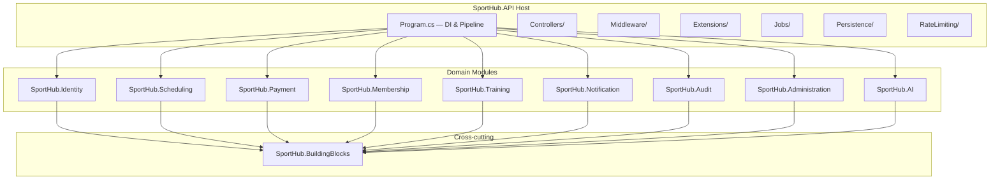

# Phân Tích Kiến Trúc Hệ Thống SportHub

SportHub là **hệ thống quản lý trung tâm thể thao với ba môn Gym (bao gồm PT), cầu lông và bóng rổ; có thể mở rộng thêm môn trong tương lai**. PT là dịch vụ thuộc Gym, không phải môn thứ tư.

## Tổng Quan

SportHub là hệ thống quản lý trung tâm thể thao gồm 3 thành phần chính:

| Thành phần | Công nghệ | Cổng | Mô tả |
|---|---|---|---|
| **Backend** | ASP.NET Core (.NET) + EF Core | `:5000` | REST API, modular monolith |
| **Frontend** | Next.js (React + TypeScript) | `:3000` | SPA client-side rendering |
| **Database** | PostgreSQL 16 | `:5432` | Single shared database |

Triển khai qua **Docker Compose** với 3 containers: `postgres`, `backend`, `frontend`.

---

## PHẦN 1: BACKEND — Kiến Trúc Modular Monolith

Backend theo mô hình **Modular Monolith** — một ứng dụng duy nhất chia thành 9 module nghiệp vụ, mỗi module tuân theo **Clean Architecture** 4 lớp.



Cấu trúc chuẩn cho mỗi module:

```
SportHub.<Module>/
├── Api/                    # Controllers — nhận HTTP request, trả response
├── Application/
│   ├── Commands/           # Command DTOs (input cho thao tác ghi)
│   ├── Queries/            # Query DTOs (input cho thao tác đọc)
│   ├── DTOs/               # Output DTOs (response models)
│   ├── Interfaces/         # Service contracts (interface)
│   └── Services/           # Service implementations
├── Domain/
│   ├── Entities/           # Entity classes (map DB table)
│   ├── Enums/              # Enum types
│   ├── Exceptions/         # Domain-specific exceptions
│   ├── Rules/              # Business rules (validation)
│   └── ValueObjects/       # Value objects
├── Infrastructure/
│   ├── Persistence/
│   │   └── Configurations/ # EF Core Fluent API configurations
│   ├── Repositories/       # Repository implementations
│   └── ...                 # Email, Security, etc.
├── GlobalUsings.cs
├── <Module>ModuleMarker.cs # Marker class để host scan assembly
└── SportHub.<Module>.csproj
```

---

## 1. SportHub.API/ — Host Project (Điểm khởi chạy)

Project chạy được duy nhất, chịu trách nhiệm **lắp ráp tất cả module** và cấu hình HTTP pipeline.

### Program.cs (~370 dòng)

Entry point — đăng ký DI cho toàn bộ hệ thống:

- Cấu hình **DbContext** (PostgreSQL + snake_case naming)
- Cấu hình **CORS**, **JWT Bearer Authentication**, **Authorization Policies**
- Đăng ký **Rate Limiting** (5 policies: auth-register, auth-register-otp, auth-password-reset, point-confirmation, login)
- Đăng ký **tất cả services** của 9 module (Identity, Scheduling, Payment, Membership, Training, Notification, Audit, Administration, AI)
- Cấu hình **Email** (SMTP / Logging / Unavailable fallback)
- Cấu hình **Gemini AI** (HttpClient + options)
- Đăng ký **6 Background Jobs** (HostedService)
- Load controllers từ tất cả module assemblies via `AddApplicationPart`
- Pipeline: ExceptionHandling → Swagger → HTTPS → Routing → CORS → RateLimiter → Authentication → Authorization → Controllers

### Controllers/

| File | Chức năng |
|---|---|
| `HealthController.cs` (338B) | Endpoint `/health` — kiểm tra API sống |

### Middleware/

| File | Chức năng |
|---|---|
| `ExceptionHandlingMiddleware.cs` (6.7KB) | Bắt tất cả exception → trả JSON `{error, message}` với status code phù hợp. Map domain exception → 400/404/409, unhandled → 500 |

### Extensions/

| File | Chức năng |
|---|---|
| `AccountStatusJwtExtensions.cs` (5.2KB) | Chặn token của tài khoản bị khoá/xoá ngay tại bước xác thực (BR-6). PostConfigure thêm `OnTokenValidated` event |
| `AuthorizationPolicyExtensions.cs` (5.6KB) | Định nghĩa authorization policies: RequireAdmin, RequireManager, RequireCoach, RequireMember, RequireReceptionist, RequireStaff |
| `CorsExtensions.cs` (1.5KB) | Cấu hình CORS cho frontend origin |
| `SwaggerExtensions.cs` (1.3KB) | Cấu hình Swagger/OpenAPI với JWT bearer scheme |

### RateLimiting/

| File | Chức năng |
|---|---|
| `LoginRateLimitPolicy.cs` (3.6KB) | Rate limit riêng cho login: 10 req/phút theo IP, response 429 độc lập |

### Jobs/ (Background Services)

| File | Size | Chức năng | Nghiệp vụ |
|---|---|---|---|
| `MemberPackageExpiryJob.cs` | 4.2KB | Quét gói thành viên hết hạn → đánh dấu Expired | BR-11, BR-33 |
| `ClassStatusJob.cs` | 2.6KB | Cập nhật trạng thái lớp học (mở/đóng tự động) | Lifecycle lớp học |
| `AttendanceFinalizerJob.cs` | 1.7KB | Chốt điểm danh buổi học đã kết thúc → đánh dấu No-show | BR-20, BR-53 |
| `SeatHoldExpiryJob.cs` | 1.1KB | Giải phóng giữ chỗ (SeatHold) quá hạn | Tránh block capacity |
| `PointHoldExpiryJob.cs` | 1.0KB | Giải phóng điểm bị hold quá hạn | Wallet system |
| `NotificationDispatchJob.cs` | 2.0KB | Gửi batch thông báo chưa dispatch | BR-34 |
| `PeriodicJob.cs` | 2.2KB | Base class cho periodic background job | Shared infra |

### Persistence/

| File | Size | Chức năng |
|---|---|---|
| `SportHubDbContext.cs` | 6.5KB | **DbContext duy nhất** — khai báo ~40 DbSet từ tất cả module. `OnModelCreating` gọi `ApplyConfigurationsFromAssembly` cho 9 module, tạo extension `citext` + `btree_gist`, sequence cho invoice number |
| `CrossModuleRelationships.cs` | 3.7KB | **Nơi duy nhất** khai báo FK xuyên module (ví dụ: Invoice.MemberId → UserAccount, Enrollment.MemberPackageId → MemberPackage) |
| `DemoDataSeeder.cs` | 24.9KB | Seed dữ liệu demo khi Development: tạo roles, users (admin/manager/coach/receptionist/member), rooms, classes, packages, invoices, enrollments… |
| `Migrations/` | (folder) | EF Core auto-generated migrations |

### Modules/

6 subfolder placeholder (AI, Identity, Membership, Payment, Scheduling, Training) — hiện chỉ chứa `.gitkeep`.

---

## 2. SportHub.BuildingBlocks/ — Shared Kernel & Abstractions

Thư viện dùng chung — **KHÔNG chứa logic nghiệp vụ**, chỉ interface, base class, utility. Mọi module đều reference project này.

### Abstractions/ — Interface cắt vòng phụ thuộc giữa modules

| Folder | File | Size | Chức năng |
|---|---|---|---|
| `Audit/` | `IAuditWriter.cs` | 1.8KB | Interface ghi audit log — module khác gọi mà không cần reference SportHub.Audit |
| `Notifications/` | `INotificationWriter.cs` | 1.8KB | Interface ghi notification — module khác tạo thông báo mà không cần reference SportHub.Notification |
| `Persistence/` | `ISportHubDbContext.cs` | 1.2KB | Interface DbContext — module không phụ thuộc implementation cụ thể |
| `Identity/` | `IUserAccessReader.cs` | 763B | Đọc thông tin user (tên, email, role, status) xuyên module |
| `Identity/` | `ICoachSpecialtyReader.cs` | 1.3KB | Đọc chuyên môn thể thao của coach |
| `Scheduling/` | `IOccupancyService.cs` | 1.9KB | Kiểm tra + đặt lịch trống phòng/coach (exclusion constraint) |
| `Scheduling/` | `IClassEnrollmentFulfillment.cs` | 2.4KB | Fulfill đăng ký lớp học (tạo enrollment khi thanh toán xong) |
| `Scheduling/` | `ICourtRentalFulfillment.cs` | 1.7KB | Fulfill thuê sân |
| `Scheduling/` | `ISportCatalogReader.cs` | 1.3KB | Đọc danh mục thể thao |
| `Scheduling/` | `OccupancyConflictException.cs` | 698B | Exception khi đặt lịch trùng |
| `Training/` | `ICoachRelationshipRegistrar.cs` | 840B | Tạo quan hệ coach-member từ module khác |
| `Training/` | `IPtPurchaseFulfillment.cs` | 1.4KB | Fulfill mua gói PT |
| `Payment/` | `ICheckoutService.cs` | 2.0KB | Thanh toán/checkout |
| `Payment/` | `IInvoiceDraftWriter.cs` | 1.3KB | Tạo hoá đơn nháp |
| `Payment/` | `IRefundCreditService.cs` | 1.1KB | Hoàn tiền/credit |
| `Wallet/` | `IPointWalletService.cs` | 3.0KB | Quản lý ví điểm: hold, confirm, release, debit |
| `Configuration/` | (folder) | — | `ISystemSettingProvider` — đọc cấu hình hệ thống |
| `Email/` | (folder) | — | `IEmailSender` — gửi email |
| `Membership/` | (folder) | — | Interface đọc thông tin membership xuyên module |

### Api/ — Shared API Helpers

| File | Size | Chức năng |
|---|---|---|
| `ClaimsPrincipalExtensions.cs` | 1.4KB | Extension methods đọc `userId`, `email`, `role` từ JWT ClaimsPrincipal |
| `SportHubPolicies.cs` | 3.7KB | Hằng số tên policy: `RequireAdmin`, `RequireManager`, `RequireCoach`, `RequireMember`, `RequireReceptionist`, `RequireStaff` |
| `SportHubRoleNames.cs` | 1.0KB | Hằng số tên role: `"SystemAdministrator"`, `"CenterManager"`, `"Coach"`, `"Member"`, `"Receptionist"` |

### SharedKernel/

| Folder | Chức năng |
|---|---|
| `Errors/` | Error code constants (snake_case) |
| `Exceptions/` | Base exception classes cho domain errors |
| `Pagination/` | `PagedResult<T>` — generic paged response model |
| `Time/` | `IClock` interface + `SystemClock` implementation — abstraction thời gian, dùng trong test |

### Infrastructure/

| Folder | Chức năng |
|---|---|
| `Authentication/` | Cấu hình JWT Bearer authentication scheme |

---

## 3. SportHub.Identity/ — Xác thực & Quản lý tài khoản

### Api/ (5 Controllers)

| File | Size | Chức năng |
|---|---|---|
| `AuthController.cs` | 2.7KB | `POST /api/auth/login` — đăng nhập, `POST /api/auth/register` — đăng ký, `POST /api/auth/register/otp` — gửi OTP |
| `GoogleAuthController.cs` | 1.9KB | `POST /api/auth/google` — đăng nhập Google OAuth, `POST /api/auth/google/onboarding` — hoàn tất onboarding |
| `AccountController.cs` | 1.3KB | `GET /api/users/me` — lấy profile, `PUT /api/users/me` — cập nhật profile, `PUT /api/users/me/password` — đổi mật khẩu |
| `CoachesController.cs` | 1.6KB | `GET /api/coaches` — danh sách coach, `GET/PUT /api/coaches/{id}/specialties` — chuyên môn thể thao |

### Application/Commands/ (11 files — input DTOs cho thao tác ghi)

| File | Size | Chức năng |
|---|---|---|
| `LoginRequest.cs` | 315B | DTO đăng nhập: email + password |
| `RegisterRequest.cs` | 2.9KB | DTO đăng ký: email, otpCode, password, fullName, phone + validation |
| `RequestRegisterOtpRequest.cs` | 232B | DTO yêu cầu gửi OTP: email |
| `GoogleTokenRequest.cs` | 220B | DTO login Google: idToken |
| `CompleteGoogleOnboardingRequest.cs` | 621B | DTO hoàn tất onboarding Google |
| `ChangePasswordRequest.cs` | 767B | DTO đổi mật khẩu: currentPassword, newPassword |
| `ForgotPasswordRequest.cs` | 235B | DTO quên mật khẩu: email |
| `ResetPasswordRequest.cs` | 718B | DTO đặt lại mật khẩu: token + newPassword |
| `SaveCoachRequest.cs` | 1.2KB | DTO lưu thông tin coach |

### Application/DTOs/ (5 files — output response)

| File | Size | Chức năng |
|---|---|---|
| `AuthResponse.cs` | 379B | Response đăng nhập/đăng ký: `{accessToken, user}` |
| `UserSummaryResponse.cs` | 679B | Thông tin user: userId, email, fullName, role, coachCategory |
| `GoogleLoginResult.cs` | 266B | Kết quả login Google |
| `GoogleOnboardingPendingResponse.cs` | 402B | Response pending onboarding |

### Application/Interfaces/ (8 files)

| File | Size | Chức năng |
|---|---|---|
| `IAuthService.cs` | 578B | Login, Register, RequestOtp |
| `IAccountService.cs` | 796B | GetProfile, UpdateProfile, ChangePassword |
| `IPasswordResetService.cs` | 459B | ForgotPassword, ResetPassword |
| `IGoogleAuthService.cs` | 576B | LoginWithGoogle, CompleteOnboarding |
| `IGoogleTokenVerifier.cs` | 916B | Verify Google ID token |
| `IPasswordHasher.cs` | 988B | Hash, Verify password |
| `IUserAccountRepository.cs` | 1.2KB | CRUD UserAccount + lookup |

### Application/Services/ (12 files)

| File | Size | Chức năng |
|---|---|---|
| `AuthService.cs` | 11.1KB | **Core auth logic**: login (validate credentials, generate JWT), register (verify OTP, create account, assign role), request OTP |
| `AccountService.cs` | 6.7KB | Get/update profile, change password |
| `PasswordResetService.cs` | 4.0KB | Forgot password (generate token, send email), reset password (validate token, update) |
| `GoogleAuthService.cs` | 14.1KB | Google OAuth flow: verify token → find/create account → handle onboarding |
| `EmailOtpFlow.cs` | 5.0KB | Generate OTP, send via email, verify OTP code |
| `OtpCodes.cs` | 943B | Generate random 6-digit OTP |
| `PasswordPolicyGuard.cs` | 965B | Validate password strength |
| `CoachSpecialtyService.cs` | 3.1KB | Quản lý chuyên môn thể thao cho coach |
| `CoachAdminService.cs` | 7.5KB | Admin quản lý coach: tạo, cập nhật, gán sport specialties |
| `IdentityPortReaders.cs` | 4.9KB | Implement `IUserAccessReader`, `ICoachSpecialtyReader` cho BuildingBlocks |
| `UserSummaryFactory.cs` | 1.8KB | Factory tạo UserSummary response |

### Domain/Entities/ (10 files)

| File | Size | Chức năng |
|---|---|---|
| `UserAccount.cs` | 1.2KB | Tài khoản: Id (Guid), Email, RoleId, Status, CreatedAt |
| `UserCredential.cs` | 337B | Mật khẩu hash: UserId, PasswordHash |
| `UserProfile.cs` | 360B | Hồ sơ: UserId, FullName, Phone |
| `UserExternalLogin.cs` | 611B | Liên kết OAuth: UserId, Provider, ProviderKey |
| `Role.cs` | 304B | Role: Id, Name |
| `EmailOtp.cs` | 1.2KB | OTP email: Email, Code, Purpose, ExpiresAt, Verified |
| `GoogleOnboardingTicket.cs` | 1.0KB | Ticket onboarding Google: Email, GoogleSubject, ExpiresAt |
| `CoachProfile.cs` | 596B | Profile coach: UserId, Category (PersonalTrainer/ClassInstructor) |
| `UserSportSpecialty.cs` | 507B | Chuyên môn thể thao: UserId, SportId |

### Domain/Enums/ (5 files)

| File | Chức năng |
|---|---|
| `UserRole.cs` | SystemAdministrator, CenterManager, Coach, Member, Receptionist |
| `UserStatus.cs` | Active, Locked, Deleted |
| `EmailOtpPurpose.cs` | Registration, PasswordReset |
| `ExternalAuthProvider.cs` | Google |

### Domain/Exceptions/ (4 files)

| File | Chức năng |
|---|---|
| `AccountBlockedException.cs` | Tài khoản bị khoá |
| `EmailAlreadyExistsException.cs` | Email đã tồn tại |
| `InvalidCredentialsException.cs` | Sai email/password |
| `PhoneAlreadyExistsException.cs` | SĐT đã tồn tại |

### Domain/Rules/

| File | Chức năng |
|---|---|
| `PasswordPolicy.cs` (3.0KB) | Quy tắc mật khẩu: độ dài tối thiểu, chữ hoa, chữ thường, số, ký tự đặc biệt |

### Infrastructure/Email/ (4 files)

| File | Size | Chức năng |
|---|---|---|
| `EmailOptions.cs` | 711B | Options class: Host, Port, Username, Password, FromEmail |
| `SmtpEmailSender.cs` | 1.4KB | Gửi email thật qua SMTP |
| `LoggingEmailSender.cs` | 988B | Chỉ log email ra console (Development) |
| `UnavailableEmailSender.cs` | 481B | Throw exception khi email chưa cấu hình |

### Infrastructure/Security/ (2 files)

| File | Size | Chức năng |
|---|---|---|
| `PasswordHasher.cs` | 1.9KB | Hash + verify password dùng BCrypt |
| `GoogleOnboardingTokenService.cs` | 791B | Tạo/verify onboarding token |

### Infrastructure/Repositories/

| File | Chức năng |
|---|---|
| `UserAccountRepository.cs` (3.6KB) | Implement `IUserAccountRepository` — CRUD UserAccount via EF Core |

### Infrastructure/Persistence/Configurations/ (10 files)

Mỗi file 1 `IEntityTypeConfiguration<T>` — cấu hình Fluent API cho 1 entity:
`UserAccountConfiguration`, `UserCredentialConfiguration`, `UserProfileConfiguration`, `UserExternalLoginConfiguration`, `RoleConfiguration`, `EmailOtpConfiguration`, `GoogleOnboardingTicketConfiguration`, `CoachProfileConfiguration`, `UserSportSpecialtyConfiguration`, `CoachServiceQualificationConfiguration`

---

## 4. SportHub.Scheduling/ — Lịch & Lớp học

Module **lớn nhất**, chia thành core + 3 sub-module (Catalog, Occupancy, Threshold).

### Api/ (9 Controllers)

| File | Size | Chức năng |
|---|---|---|
| `ClassesController.cs` | 4.0KB | CRUD lớp học: tạo, sửa, xoá, danh sách, chi tiết |
| `ClassSessionsController.cs` | 2.6KB | Tạo/quản lý buổi học: generate sessions, reschedule, cancel |
| `EnrollmentsController.cs` | 1.8KB | Đăng ký/hủy tham gia lớp |
| `GymCheckInsController.cs` | 1.4KB | Receptionist check-in member vào gym |
| `MemberGymCheckInsController.cs` | 1.8KB | Member xem lịch sử check-in |
| `RoomsController.cs` | 1.7KB | CRUD phòng tập |
| `ClassEnrollmentReportsController.cs` | 2.1KB | Báo cáo đăng ký/điểm danh lớp |
| `ClaimsPrincipalExtensions.cs` | 801B | Extension đọc claims cho Scheduling |
| `GymCheckInPolicies.cs` | 1.3KB | Authorization policies riêng cho check-in |

### Application/Commands/ (5 subfolders)

| Subfolder | Chức năng |
|---|---|
| `Attendance/` | Commands điểm danh |
| `Class/` | Commands tạo/sửa/xoá lớp học |
| `GymCheckIn/` | Commands check-in gym |
| `Room/` | Commands tạo/sửa phòng |
| `Session/` | Commands tạo/reschedule/cancel buổi học |

### Application/DTOs/ (7 subfolders)

| Subfolder | Chức năng |
|---|---|
| `Attendance/` | DTO điểm danh |
| `Class/` | DTO lớp học + recurrence |
| `Enrollment/` | DTO đăng ký + roster |
| `GymCheckIn/` | DTO check-in |
| `Reports/` | DTO báo cáo |
| `Room/` | DTO phòng tập |
| `Session/` | DTO buổi học |

### Application/Interfaces/ (8 files)

| File | Chức năng |
|---|---|
| `IClassService.cs` (1.6KB) | CRUD lớp: Create, Update, Delete, GetById, List, ToggleStatus |
| `IClassSessionService.cs` (1.4KB) | Generate sessions, Reschedule, Cancel, GetById, ListByDateRange |
| `IEnrollmentService.cs` (574B) | Enroll, Cancel, ListMyEnrollments |
| `IAttendanceService.cs` (619B) | MarkAttendance, GetSessionRoster |
| `IGymCheckInService.cs` (731B) | CheckIn, GetHistory, GetTodayCheckIns |
| `IGymCheckInRepository.cs` (1.0KB) | Repository interface cho GymCheckIn |
| `IRoomService.cs` (799B) | CRUD phòng |
| `IClassEnrollmentReportService.cs` (291B) | Báo cáo đăng ký lớp |

### Application/Services/ (11 files)

| File | Size | Chức năng |
|---|---|---|
| `ClassService.cs` | 23.8KB | **Logic lớp học**: tạo lớp + schedule rules, validate room/coach availability qua OccupancyService, toggle status |
| `ClassSessionService.cs` | 18.8KB | **Logic buổi học**: generate sessions từ recurrence rules, reschedule (kiểm occupancy mới), cancel, capacity management |
| `ClassEnrollmentFulfillment.cs` | 15.2KB | Implement `IClassEnrollmentFulfillment` — fulfill đăng ký khi thanh toán: tạo Enrollment, trừ session quota, tạo SeatHold |
| `EnrollmentService.cs` | 1.7KB | Orchestrate enrollment: gọi SeatHoldService → PackagePurchaseService |
| `AttendanceService.cs` | 5.7KB | Điểm danh: mark Present/Absent, tính No-show |
| `RoomService.cs` | 7.4KB | CRUD phòng tập + validate không xoá phòng đang có lớp |
| `GymCheckInService.cs` | 2.8KB | Check-in gym: validate membership active, ghi GymCheckIn |
| `ClassEnrollmentReportService.cs` | 3.1KB | Báo cáo: tổng hợp enrollment/attendance theo lớp/ngày |
| `CourseValidator.cs` | 3.3KB | Validate thông tin lớp học (tên, capacity, schedule rules) |
| `SeatHoldService.cs` | 2.8KB | Quản lý giữ chỗ: tạo hold, release, kiểm tra hết hạn |
| `CourseScheduleLock.cs` | 882B | Lock mechanism tránh race condition khi tạo session đồng thời |

### Domain/Entities/ (8 files)

| File | Size | Chức năng |
|---|---|---|
| `Class.cs` | 2.9KB | Lớp học: Name, Discipline, DefaultRoomId, DefaultCoachId, Capacity, Status |
| `ClassScheduleRule.cs` | 760B | Quy tắc lịch: DaysOfWeek, StartTime, EndTime, EffectiveFrom/To |
| `ClassSession.cs` | 1.2KB | Buổi học cụ thể: ClassId, RoomId, CoachId, StartAtUtc, EndAtUtc, Capacity, Status |
| `Enrollment.cs` | 1.1KB | Đăng ký: SessionId, MemberId, MemberPackageId, Status, RegisteredAt |
| `Attendance.cs` | 836B | Điểm danh: EnrollmentId, Status, CheckInTime |
| `GymCheckIn.cs` | 1.4KB | Check-in gym: MemberId, CheckedInByUserId, CheckInTime |
| `Room.cs` | 467B | Phòng tập: Name, Capacity |
| `SeatHold.cs` | 857B | Giữ chỗ: SessionId, MemberId, Status, ExpiresAt |

### Domain/Enums/ (5 files)

| File | Values |
|---|---|
| `ClassStatus.cs` | Draft, Active, Suspended, Archived |
| `ClassSessionStatus.cs` | Scheduled, InProgress, Completed, Cancelled |
| `EnrollmentStatus.cs` | Confirmed, Cancelled, NoShow |
| `AttendanceStatus.cs` | Present, Absent, NoShow |
| `SeatHoldStatus.cs` | Active, Released, Expired |

### Domain/Exceptions/

| File | Chức năng |
|---|---|
| `MemberNotFoundException.cs` | Member không tìm thấy |
| `NoActiveMemberPackageException.cs` | Member không có gói active |

### Domain/Rules/

| File | Chức năng |
|---|---|
| `CourseRules.cs` (5.8KB) | Quy tắc nghiệp vụ: capacity min/max, schedule overlap check, cancellation deadline |

### Infrastructure/

| File | Chức năng |
|---|---|
| `Repositories/GymCheckInRepository.cs` (5.5KB) | Implement `IGymCheckInRepository` — query GymCheckIn với join UserAccount |
| `Persistence/Configurations/` (8 files) | EF Core configs: Class, ClassScheduleRule, ClassSession, Enrollment, Attendance, GymCheckIn, Room, SeatHold |

### Catalog/ (Sub-module — Danh mục thể thao)

| Layer | Files | Chức năng |
|---|---|---|
| **Api/** | `SportsController.cs` (2.2KB), `RoomTypesController.cs` (2.0KB), `RoomOpeningHoursController.cs` (965B), `RoomBlocksController.cs` (1.5KB), `CourtRatesController.cs` (2.0KB) | CRUD danh mục: sports, room types, opening hours, blocks, court rates |
| **Application/** | `SportCatalogService.cs` (7.0KB), `RoomTypeService.cs` (6.2KB), `RoomOpeningHourService.cs` (5.3KB), `RoomBlockService.cs` (5.2KB), `CourtRateService.cs` (7.5KB), `SportCatalogReader.cs` (2.7KB), `CatalogContracts.cs` (3.8KB) | Business logic + DTO contracts cho catalog |
| **Domain/** | `Sport.cs`, `RoomType.cs`, `SportRoomType.cs`, `RoomOpeningHour.cs`, `RoomBlock.cs`, `CourtRate.cs`, `SportServiceOffering.cs`, `ServiceRoomType.cs` (8 files) | Entities: Sport (mã, tên), SportServiceOffering (dịch vụ của môn), ServiceRoomType, RoomType, liên kết Sport-RoomType, giờ mở/đóng, block phòng, giá sân |
| **Persistence/** | 6 EF configuration files | Fluent API configs cho Catalog entities |

### Occupancy/ (Sub-module — Quản lý lịch trống)

| Layer | Files | Chức năng |
|---|---|---|
| **Api/** | `AvailabilityController.cs` (1.7KB) | API kiểm tra availability phòng/coach |
| **Application/** | `OccupancyService.cs` (8.3KB), `AvailabilityService.cs` (6.9KB) | Reserve/release phòng + coach, kiểm tra xung đột lịch, query available slots |
| **Domain/** | `RoomOccupancy.cs` (846B), `CoachOccupancy.cs` (673B), `OccupancySourceType.cs` (231B) | Entities: đánh dấu slot phòng/coach đã occupied, source type (Class, PtSession, CourtRental) |
| **Persistence/** | `RoomOccupancyConfiguration.cs`, `CoachOccupancyConfiguration.cs` | EF configs với exclusion constraint `btree_gist` chống trùng lịch |

### Threshold/ (Sub-module — Ngưỡng)

| Layer | Files | Chức năng |
|---|---|---|
| **Domain/** | `ThresholdStatus.cs` (290B) | Enum: Normal, Warning, Critical — dùng cho capacity warnings |

---

## 5. SportHub.Payment/ — Thanh toán & Hoá đơn

### Api/ (3 Controllers)

| File | Size | Chức năng |
|---|---|---|
| `InvoicesController.cs` | 3.2KB | GET danh sách/chi tiết hoá đơn, POST ghi nhận thanh toán |
| `PaymentAdjustmentsController.cs` | 2.6KB | Yêu cầu hoàn tiền/discount, duyệt/từ chối, hoàn tất |
| `RevenueReportsController.cs` | 1.4KB | GET báo cáo doanh thu theo khoảng ngày |

### Application/Commands/ (3 subfolders)

| Subfolder | Chức năng |
|---|---|
| `Packages/` | Commands mua gói thành viên |
| `Payments/` | Commands ghi nhận thanh toán |
| `Adjustments/` | Commands yêu cầu/duyệt/hoàn tất hoàn tiền |

### Application/DTOs/ (4 subfolders)

| Subfolder | Chức năng |
|---|---|
| `Invoices/` | DTO hoá đơn summary + detail |
| `Payments/` | DTO thanh toán |
| `Adjustments/` | DTO adjustment |
| `Reports/` | DTO báo cáo doanh thu |

### Application/Interfaces/ (6 files)

| File | Chức năng |
|---|---|
| `IPackagePurchaseService.cs` | Mua gói: tạo invoice + items |
| `IPaymentRecordingService.cs` | Ghi nhận thanh toán: cash/transfer/card |
| `IPackageActivationService.cs` | Kích hoạt gói sau thanh toán đủ |
| `IInvoiceQueryService.cs` | Query hoá đơn: list, detail, by member |
| `IPaymentAdjustmentService.cs` | Workflow hoàn tiền: request → approve → complete |
| `IRevenueReportService.cs` | Tổng hợp doanh thu theo ngày |

### Application/Services/ (6 files)

| File | Size | Chức năng |
|---|---|---|
| `PackagePurchaseService.cs` | 6.8KB | Tạo Invoice + InvoiceItems, kiểm tra stacking rules, gọi SeatHoldService |
| `PaymentRecordingService.cs` | 4.9KB | Ghi Payment, cập nhật Invoice status, trigger activation nếu paid full |
| `PackageActivationService.cs` | 5.0KB | Kích hoạt MemberPackage: set startDate/endDate, gọi ClassEnrollmentFulfillment |
| `PaymentAdjustmentService.cs` | 21.8KB | **Logic phức tạp nhất**: request refund/discount → manager approve → receptionist complete (ghi refund payment), tính suggested refund amount |
| `InvoiceQueryService.cs` | 9.0KB | Query: list invoices (paged, filtered), detail with items + payments + adjustments |
| `RevenueReportService.cs` | 5.2KB | Tổng hợp: collected, refunded, obligationReduction, netRevenue by day |

### Domain/Entities/ (5 files)

| File | Size | Chức năng |
|---|---|---|
| `Invoice.cs` | 1.4KB | Hoá đơn: MemberId, TotalAmount, Status, InvoiceNumber, IssuedAt |
| `InvoiceItem.cs` | 545B | Dòng hoá đơn: ItemType, Description, UnitPrice, Quantity |
| `Payment.cs` | 945B | Thanh toán: InvoiceId, Amount, Method, Status, ReceivedByUserId |
| `PaymentAdjustment.cs` | 4.5KB | Hoàn tiền/discount: Type, Amount, Status, workflow fields (requested/approved/completed by) |
| `PaymentAttempt.cs` | 516B | Lần thử thanh toán (tracking) |

### Domain/Enums/ (7 files)

| File | Values |
|---|---|
| `InvoiceStatus.cs` | Draft, Issued, Paid, PartiallyPaid, Cancelled, Refunded |
| `InvoiceItemType.cs` | MembershipPackage, ClassEnrollment, CourtRental, PtPackage |
| `PaymentMethod.cs` | Cash, BankTransfer, Card, Point |
| `PaymentStatus.cs` | Pending, Completed, Failed, Refunded |
| `PaymentAdjustmentType.cs` | Refund, Discount, ObligationReduction |
| `PaymentAdjustmentStatus.cs` | Pending, Approved, Rejected, Completed, Cancelled |
| `PaymentAttemptStatus.cs` | Pending, Success, Failed |

### Domain/Rules/

| File | Chức năng |
|---|---|
| `InvoiceMath.cs` (1.1KB) | Tính toán: grossCollected, netCollected, outstanding, refundDue |
| `RefundCalculator.cs` (2.2KB) | Tính suggested refund amount dựa trên sessions used/remaining |

### Infrastructure/

| File | Chức năng |
|---|---|
| `InvoiceNumberGenerator.cs` (1.6KB) | Generate invoice number từ PostgreSQL sequence |
| `Persistence/Configurations/` | EF configs cho Invoice, InvoiceItem, Payment, PaymentAdjustment, PaymentAttempt |

### Wallet/ (Sub-module — Ví điểm thưởng)

| Layer | Files | Chức năng |
|---|---|---|
| **Api/** | `WalletsController.cs` (1.6KB), `PointAdjustmentsController.cs` (716B), `PointConfirmationsController.cs` (2.1KB) | Xem ví + lịch sử, điều chỉnh điểm (admin), xác nhận thanh toán bằng điểm |
| **Application/** | `PointWalletService.cs` (7.4KB), `WalletQueryService.cs` (2.6KB), `PointAdjustmentService.cs` (1.6KB), `PointConfirmationService.cs` (17.9KB), `WalletContracts.cs` (1.8KB) | Hold/confirm/release/debit điểm, query balance + ledger, adjust (manager), confirmation flow |
| **Domain/** | `PointWallet.cs` (302B), `PointLedgerEntry.cs` (779B), `PointConfirmation.cs` (739B), `PointEntryType.cs` (163B) | Entities: ví, bút toán, xác nhận, loại giao dịch |
| **Persistence/** | 3 EF configuration files | Fluent API configs |

---

## 6. SportHub.Membership/ — Gói thành viên

### Api/ (4 Controllers)

| File | Size | Chức năng |
|---|---|---|
| `MembershipPackagesController.cs` | 2.3KB | CRUD gói thành viên (tạo, sửa, toggle active) |
| `MemberPackagesController.cs` | 2.5KB | Gói của member: list, approve stacking |
| `TrainingProfilesController.cs` | 1.9KB | GET/PUT hồ sơ tập luyện của member |
| `MembershipReportsController.cs` | 1.1KB | Báo cáo membership |

### Application/Commands/ (2 subfolders)

`Packages/` — tạo/sửa gói, `TrainingProfiles/` — cập nhật hồ sơ tập.

### Application/DTOs/ (3 subfolders)

`Packages/` — DTO gói, `Reports/` — DTO báo cáo, `TrainingProfiles/` — DTO hồ sơ tập.

### Application/Interfaces/ (4 files)

| File | Chức năng |
|---|---|
| `IMembershipPackageService.cs` | CRUD gói: Create, Update, ToggleActive, List |
| `IMemberPackageService.cs` | Gói member: List (by member/all), ApproveStacking |
| `IMemberTrainingProfileService.cs` | Get/Upsert hồ sơ tập luyện |
| `IMembershipReportService.cs` | Báo cáo membership |

### Application/Services/ (4 files)

| File | Size | Chức năng |
|---|---|---|
| `MembershipPackageService.cs` | 6.2KB | CRUD gói + validate (tên unique, price > 0, duration > 0) |
| `MemberPackageService.cs` | 7.4KB | List gói member, approve stacking (cho phép member có nhiều gói active), kiểm tra isUsable |
| `MemberTrainingProfileService.cs` | 2.7KB | Upsert training profile: goal, experienceLevel, notes |
| `MembershipReportService.cs` | 2.4KB | Tổng hợp: active members, packages sold, revenue |

### Domain/Entities/ (3 files)

| File | Size | Chức năng |
|---|---|---|
| `MembershipPackage.cs` | 1.0KB | Định nghĩa gói: Name, Price, DurationDays, SessionLimit, IsActive |
| `MemberPackage.cs` | 1.4KB | Gói member sở hữu: MemberId, PackageId, StartDate, EndDate, RemainingSessions, Status |
| `MemberTrainingProfile.cs` | 674B | Hồ sơ tập: MemberId, Goal, ExperienceLevel, Notes |

### Domain/Enums/

| File | Values |
|---|---|
| `MemberPackageStatus.cs` | Active, Expired, Cancelled |
| `ExperienceLevel.cs` | Beginner, Intermediate, Advanced |

### Infrastructure/

`Persistence/Configurations/` + `Repositories/` — EF configs + repository implementations.

---

## 7. SportHub.Training/ — Huấn luyện cá nhân (PT)

### Api/ (7 Controllers)

| File | Size | Chức năng |
|---|---|---|
| `WorkoutController.cs` | 9.3KB | CRUD workout plans + ghi workout results |
| `PtSessionsController.cs` | 6.1KB | CRUD buổi PT: tạo, cancel, reschedule, complete |
| `PtEntitlementsController.cs` | 2.0KB | Quản lý quyền lợi PT (quota buổi tập) |
| `PtSessionChangeRequestsController.cs` | 2.9KB | Yêu cầu đổi lịch PT: tạo, duyệt/từ chối |
| `PtCoachChangeRequestsController.cs` | 3.0KB | Yêu cầu đổi coach: tạo, duyệt/từ chối |
| `CoachMemberRelationshipsController.cs` | 3.1KB | Quản lý quan hệ coach-member |

### Application/Commands/ (8 subfolders)

`WorkoutPlans/`, `WorkoutResults/`, `PtSessions/`, `PtEntitlements/`, `PtSessionChangeRequests/`, `PtCoachChangeRequests/`, `Relationships/`

### Application/DTOs/ (8 subfolders) — tương ứng với Commands.

### Application/Interfaces/ (8 files)

| File | Chức năng |
|---|---|
| `IWorkoutService.cs` (1.4KB) | CRUD workout plans, record results |
| `IPtSessionService.cs` (1.3KB) | CRUD PT sessions: schedule, cancel, reschedule, complete |
| `IPtEntitlementLifecycle.cs` (1.6KB) | Activate/suspend/expire PT entitlements |
| `IPtEntitlementQueryService.cs` (334B) | Query PT entitlements |
| `IPtSessionChangeRequestService.cs` (863B) | Request + approve/reject reschedule/cancel |
| `IPtCoachChangeRequestService.cs` (960B) | Request + approve/reject coach change |
| `ICoachMemberRelationshipService.cs` (1.3KB) | CRUD relationships, list by coach/member |

### Application/Services/ (10 files)

| File | Size | Chức năng |
|---|---|---|
| `PtSessionService.cs` | 29.8KB | **Logic phức tạp nhất module**: schedule PT session (validate coach availability, room availability, member entitlement quota), cancel (release occupancy + restore quota), reschedule, complete (mark attendance) |
| `PtCoachChangeRequestService.cs` | 19.8KB | Workflow đổi coach: member request → manager approve → migrate sessions + relationships |
| `CoachMemberRelationshipService.cs` | 10.7KB | Manage relationships: create (Manual/ClassBased), end, list. Implement `ICoachRelationshipRegistrar` |
| `PtSessionChangeRequestService.cs` | 10.6KB | Workflow đổi lịch PT: request → approve (reuse PtSessionService logic) |
| `PtEntitlementLifecycleService.cs` | 10.0KB | PT entitlement lifecycle: activate, suspend, expire, check quota |
| `WorkoutService.cs` | 17.9KB | CRUD workout plans + items, record workout results with coach comments |
| `PtEntitlementQueryService.cs` | 2.5KB | Query entitlements by member |
| `PtRoomValidator.cs` | 1.8KB | Validate phòng phù hợp cho PT session |
| `PersonalTrainerGuard.cs` | 1.1KB | Check coach có phải PersonalTrainer category |

### Domain/Entities/ (10 files)

| File | Size | Chức năng |
|---|---|---|
| `CoachMemberRelationship.cs` | 1.1KB | Quan hệ: CoachId, MemberId, SourceType, ClassId, Status |
| `WorkoutPlan.cs` | 1.4KB | Kế hoạch tập: MemberId, CoachId, RelationshipId, Goal, Level |
| `WorkoutPlanItem.cs` | 445B | Bài tập: Exercise, Sets, Reps, Notes |
| `WorkoutResult.cs` | 913B | Kết quả tập: EnrollmentId, ProgressNote, CoachComment |
| `PtEntitlement.cs` | 2.4KB | Quyền lợi PT: MemberId, CoachId, TotalSessions, UsedSessions, Status |
| `PtSession.cs` | 2.1KB | Buổi PT: EntitlementId, RoomId, StartAtUtc, EndAtUtc, Status |
| `PtSessionChangeRequest.cs` | 1.4KB | Yêu cầu đổi lịch: SessionId, Type (Cancel/Reschedule), NewStart/End |
| `PtCoachChangeRequest.cs` | 1.3KB | Yêu cầu đổi coach: EntitlementId, FromCoachId, ToCoachId, Status |

### Domain/Enums/ (11 files)

`RelationshipStatus`, `RelationshipSourceType`, `WorkoutPlanStatus`, `PtEntitlementStatus`, `PtSessionStatus`, `PtSessionQuotaState`, `PtSessionTimingClassification`, `PtSessionChangeRequestStatus`, `PtSessionChangeRequestType`, `PtCoachChangeRequestStatus`

### Domain/Rules/

| File | Chức năng |
|---|---|
| `PtEntitlementRules.cs` (1.6KB) | Quy tắc quota PT: max sessions, expiry rules |
| `PtSessionRules.cs` (1.4KB) | Quy tắc buổi PT: cancellation deadline, scheduling constraints |

---

## 8. SportHub.Notification/ — Thông báo

### Api/

| File | Chức năng |
|---|---|
| `NotificationsController.cs` (1.5KB) | `GET /api/notifications` — danh sách (paged), `PUT /api/notifications/{id}/read` — đánh dấu đã đọc |

### Application/

| File | Chức năng |
|---|---|
| `Interfaces/INotificationService.cs` (528B) | ListByUser, MarkAsRead, CountUnread |
| `Services/NotificationService.cs` (3.4KB) | Query + update notification |

### Domain/

| File | Chức năng |
|---|---|
| `Entities/Notification.cs` (947B) | Entity: UserId, Title, Message, IsRead, CreatedAt |

### Infrastructure/

| File | Chức năng |
|---|---|
| `NotificationWriter.cs` (1.9KB) | Implement `INotificationWriter` — tạo Notification entity từ module khác |
| `Persistence/` + `Repositories/` | EF configs |

---

## 9. SportHub.Audit/ — Nhật ký kiểm toán

### Domain/

| File | Chức năng |
|---|---|
| `Entities/AuditLog.cs` (1.2KB) | Entity: UserId, ActorEmail, Action, TargetEntity, TargetId, OldValue, NewValue, IpAddress, Timestamp |

### Application/

`Commands/`, `DTOs/`, `Interfaces/`, `Queries/` — structure sẵn cho query audit logs.

### Infrastructure/

| File | Chức năng |
|---|---|
| `AuditWriter.cs` (2.1KB) | Implement `IAuditWriter` — ghi AuditLog entity, lấy IP từ `IHttpContextAccessor` |
| `Persistence/` + `Repositories/` | EF configs |

### Api/

Audit module **không có controller riêng** — query audit được xử lý bởi `SportHub.Administration.Api.AuditLogsController`.

---

## 10. SportHub.Administration/ — Quản trị hệ thống

### Api/ (4 Controllers)

| File | Size | Chức năng |
|---|---|---|
| `UsersController.cs` | 4.1KB | Quản lý users: list (paged), create, lock/unlock, change role, reset password |
| `SystemSettingsController.cs` | 1.1KB | GET/PUT cài đặt hệ thống (key-value) |
| `AuditLogsController.cs` | 1.4KB | GET audit logs (paged, filtered by actor/action/target) |
| `ReportExportsController.cs` | 2.5KB | POST tạo report export, GET danh sách, GET download file |

### Application/Commands/

`UserAdmin/` — commands cho quản lý user (create, lock, unlock, changeRole, resetPassword).

### Application/DTOs/

`UserAdmin/` — DTOs cho user admin responses.

### Application/Interfaces/ (4 files)

| File | Chức năng |
|---|---|
| `IUserAdminService.cs` (1.3KB) | CRUD users: List, Create, Lock, Unlock, ChangeRole, ResetPassword |
| `ISystemSettingService.cs` (732B) | Get/Update system settings |
| `IAuditQueryService.cs` (601B) | Query audit logs (paged, filtered) |
| `IReportExportService.cs` (1.6KB) | Request export, list exports, get download stream |

### Application/Services/ (4 files)

| File | Size | Chức năng |
|---|---|---|
| `UserAdminService.cs` | 15.8KB | **Logic quản lý user**: tạo account + credential + profile, lock/unlock (BR-6 — invalidate JWT), change role (validate constraints), reset password, audit trail |
| `ReportExportService.cs` | 20.1KB | **Logic export báo cáo**: generate CSV/PDF cho revenue, membership, enrollment reports. Background processing, file storage, expiry cleanup |
| `SystemSettingService.cs` | 3.2KB | CRUD system settings: cancellation deadline hours, late check-in minutes, etc. |
| `AuditQueryService.cs` | 2.7KB | Query audit logs với filter + pagination |

### Domain/Entities/

| File | Size | Chức năng |
|---|---|---|
| `SystemSetting.cs` | 1.2KB | Cài đặt: Key, Value, Description, UpdatedAt |
| `ReportExport.cs` | 2.5KB | Export: ReportType, Status, RowCount, SizeBytes, FilePath, ExpiresAt |
| `ReportColumnLabels.cs` | 2.0KB | Nhãn cột cho báo cáo (i18n) |

### Domain/Enums/

| File | Values |
|---|---|
| `ReportExportStatus.cs` | Pending, Processing, Completed, Failed, Expired |

### Infrastructure/

| File | Size | Chức năng |
|---|---|---|
| `SystemSettingProvider.cs` | 1.3KB | Implement `ISystemSettingProvider` — đọc settings từ DB |
| `ReportPdfRenderer.cs` | 5.6KB | Render báo cáo ra PDF |
| `FileSystemReportStorage.cs` | 3.0KB | Lưu/đọc file report trên filesystem |
| `Persistence/` | EF configs | Cấu hình SystemSetting, ReportExport |

---

## 11. SportHub.AI/ — Gợi ý AI

### Api/

| File | Chức năng |
|---|---|
| `AiController.cs` (4.0KB) | 2 endpoints: `POST /api/ai/suggest` — gợi ý bài tập cho member (rule-based), `POST /api/ai/chat` — chat với AI assistant (Gemini) |

### Application/Interfaces/ (5 files)

| File | Chức năng |
|---|---|
| `IAiRecommendationService.cs` (731B) | Gợi ý bài tập theo profile + lịch sử |
| `IWorkoutRecommendationService.cs` (721B) | Gợi ý workout exercises |
| `IAiChatService.cs` (318B) | Chat với AI: send message, get response |
| `IAiChatProvider.cs` (356B) | Provider abstraction cho LLM (Gemini) |
| `IAiContextBuilder.cs` (224B) | Build context cho AI từ dữ liệu hệ thống |

### Application/Services/ (3 files)

| File | Size | Chức năng |
|---|---|---|
| `WorkoutRecommendationService.cs` | 7.2KB | Gợi ý exercises dựa trên: goal, level, disciplines, attendance history, coach notes |
| `AiChatService.cs` | 5.6KB | Orchestrate chat: build context → call provider → log response |
| `SportHubAiContextBuilder.cs` | 4.6KB | Build context string từ member profile, active packages, recent sessions, gym check-ins |

### Application/DTOs/

`Chat/` — DTOs cho chat request/response.

### Domain/

| Folder | Files | Chức năng |
|---|---|---|
| `Entities/` | `AiLog.cs` (688B) | Log AI interactions: UserId, Prompt, Response, Provider, ResponseTimeMs |
| `Constants/` | — | AI-related constants |
| `Exceptions/` | — | AI-specific exceptions |
| `ValueObjects/` | — | (placeholder) |

### Infrastructure/

| File | Size | Chức năng |
|---|---|---|
| `RuleBasedAiRecommendationService.cs` | 6.8KB | Implement `IAiRecommendationService` — gợi ý bằng luật cục bộ (không gọi LLM), phân tích attendance pattern, discipline preference |
| `Gemini/GeminiAiChatProvider.cs` | 7.2KB | Implement `IAiChatProvider` — gọi Google Gemini API via HttpClient, parse response |
| `Gemini/GeminiOptions.cs` | 414B | Options: ApiKey, Model, BaseUrl, TimeoutSeconds |
| `Persistence/` + `Repositories/` | EF configs | Cấu hình AiLog |

### Prompts/

| File | Chức năng |
|---|---|
| `SportHubAssistantSystemPrompt.cs` (2.1KB) | System prompt cho Gemini: vai trò, context, constraints, response format |

---

## PHẦN 2: FRONTEND — Tóm tắt

(Xem phần Frontend chi tiết trong tài liệu trước)

### Cấu trúc chính

```
frontend/src/
├── app/           # Pages (file-based routing): /, /login, /register, /member/*, /coach/*, /manager/*, /receptionist/*, /admin/*
├── components/    # Shared: AppShell, MemberShell, AttendanceBoard, NotificationBell, GoogleSignInButton, AuditLogView, ui.tsx
├── features/      # Feature modules (8): identity, scheduling, membership, training, coaches, notifications, check-in, news
├── lib/           # Core: apiClient.ts, auth.tsx, useApi.ts, types.ts, format.ts, language.tsx
├── shared/        # Design system: ui primitives, role-shell, clock/date utils
├── locales/       # i18n: en.ts, vi.ts
├── application/   # App-level hooks (member)
└── infrastructure/# External config (demo)
```

### 5 Role Dashboards

| Role | Pages | Chức năng |
|---|---|---|
| Member | 7 | Dashboard, lịch lớp, đăng ký, hoá đơn, gói, profile, training |
| Receptionist | 5 | Check-in, điểm danh, đăng ký hộ, bán gói, hoá đơn |
| Coach | 5 | Lịch dạy, điểm danh, training plans, AI suggestions |
| Manager | 9 | CRUD lớp/phòng/gói, báo cáo, hoàn tiền, settings, audit |
| Admin | 2 | Quản lý users, audit log |
